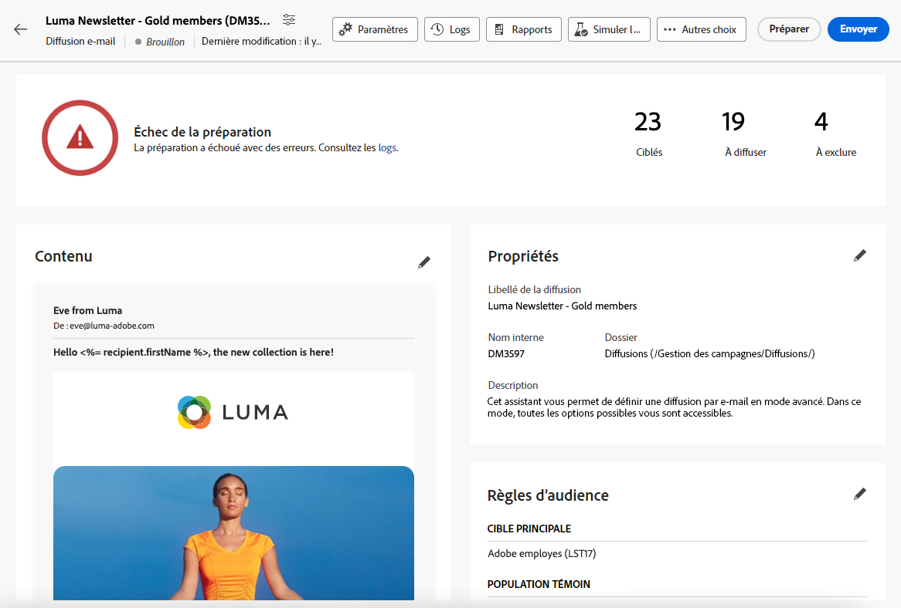
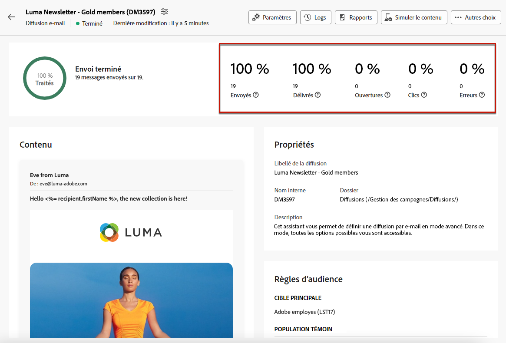

# Préparer et envoyer votre e-mail {#prepare-send}

## Préparer l’envoi {#prepare}

Lorsque vous avez défini le [contenu](../email/edit-content.md), l’[audience](../audience/add-audience.md) et le planning, vous pouvez préparer la [diffusion](../msg/gs-messages.md#schedule-the-delivery-sending-gs-schedule) de votre e-mail.

Pendant la préparation de la diffusion, la population cible est calculée et le contenu du message est généré pour chaque profil inclus dans la cible. Lorsque la préparation est terminée, les messages sont prêts à être envoyés immédiatement ou à la date et à l’heure planifiées.

Les règles de validation utilisées pendant la préparation de la diffusion sont décrites dans la [documentation de Campaign v8 (console cliente)](https://experienceleague.adobe.com/docs/campaign/campaign-v8/campaigns/send/validate/delivery-analysis.html?lang=fr){target="_blank"}.

Les étapes principales de l’envoi d’une diffusion sont répertoriées ci-dessous.

1. Dans le tableau de bord de la diffusion, cliquez sur **[!UICONTROL Vérifier et envoyer]**.

   

1. Cliquez sur le bouton **[!UICONTROL Préparer]** dans le coin supérieur droit et confirmez.

   

   >[!NOTE]
   >
   >Si vous avez planifié votre diffusion et désactivé l’option **[!UICONTROL Activer la confirmation avant l’envoi]**, les étapes de préparation et d’envoi sont regroupées sous le bouton **[!UICONTROL Préparer et envoyer]**. [En savoir plus sur la planification](../msg/gs-messages.md#gs-schedule)

1. La progression de la préparation s’affiche. La durée de cette opération varie en fonction de la taille de la population ciblée.

   Vous pouvez arrêter la préparation à tout moment à l’aide du bouton **[!UICONTROL Arrêter la préparation]**.

   

   >[!NOTE]
   >Pendant la phase de préparation, aucun message n&#39;est envoyé. Vous pouvez donc lancer ou annuler cette opération sans aucun risque.

1. Une fois la préparation terminée, vérifiez les KPI. Si le nombre de messages à envoyer ne correspond pas à vos attentes, modifiez l’audience et relancez la préparation.

   

   Voici les KPI qui s’affichent :

   * **[!UICONTROL Ciblés]** : le nombre de destinataires ciblés.
   * **[!UICONTROL À diffuser]** : le nombre de messages qui seront envoyés.
   * **[!UICONTROL À exclure]** : le nombre de messages exclus par une [règle de typologie](../advanced-settings/delivery-settings.md#typology).

1. Cliquez sur le bouton **[!UICONTROL Logs]** et vérifiez qu’il n’y a aucune erreur. Le dernier message de logs affiche les erreurs éventuelles et leur nombre. [En savoir plus](delivery-logs.md).

   

1. Si la préparation détecte une erreur critique qui empêche l’envoi de la diffusion, le statut de préparation apparaît comme ayant échoué dans le tableau de bord de la diffusion.

   

1. Si vous modifiez la diffusion après la préparation, vous devez relancer la préparation pour que ces modifications soient prises en compte.

Une fois la préparation terminée sans erreur, le message est prêt à être envoyé.

## Envoyer le message {#send}

Une fois la [préparation](#prepare) terminée, vous pouvez envoyer l’e-mail.

Si le message est planifié, il sera envoyé à la date et à l’heure définies. [En savoir plus](../msg/gs-messages.md#gs-schedule).

### Envoyer immédiatement {#send-immediately}

Pour envoyer immédiatement un e-mail, procédez comme suit.

1. Dans le tableau de bord de la diffusion, cliquez sur le bouton **[!UICONTROL Envoyer]** dans le coin supérieur droit.

   

1. Confirmez cette action pour envoyer immédiatement le message à la cible principale.

1. La progression de l’envoi s’affiche.

### Planifier l’envoi {#schedule-the-send}

Si vous avez planifié l’envoi de votre e-mail à une date et une heure ultérieures, procédez comme suit.

1. Avant de cliquer sur le bouton **[!UICONTROL Vérifier et envoyer]**, assurez-vous de définir un planning pour votre e-mail. [En savoir plus](../msg/gs-messages.md#gs-schedule).

1. Dans le tableau de bord de la diffusion, cliquez sur le bouton **[!UICONTROL Envoyer comme prévu]** dans le coin supérieur droit.

   

1. Cliquez sur **[!UICONTROL Confirmer l’envoi]**. La diffusion sera envoyée à la cible principale, à la date planifiée.

   >[!NOTE]
   >
   >Si vous avez désactivé l’option **[!UICONTROL Activer la confirmation avant l’envoi]**, les étapes de préparation et d’envoi sont regroupées sous le bouton **[!UICONTROL Préparer et envoyer]**. [En savoir plus sur la planification](../msg/gs-messages.md#gs-schedule).

## Suspendre ou arrêter l’envoi {#pause-stop-sending}

Deux actions peuvent être effectuées à tout moment pendant le processus d’envoi, que votre diffusion soit planifiée ou non<!--TBC--> :

* Cliquez sur **[!UICONTROL Suspendre l’envoi]** pour interrompre l’envoi des messages. Vous pouvez reprendre l’envoi à tout moment.

* Cliquez sur **[!UICONTROL Arrêter l’envoi]** pour interrompre immédiatement l’envoi. Une fois arrêtés, la préparation et l’envoi ne peuvent pas être repris.

## Vérifier les KPI {#check-kpis}

>[!CONTEXTUALHELP]
>id="acw_deliveries_email_metrics_delivered"
>title="Diffusés"
>abstract="Le nombre de messages envoyés avec succès. Cet indicateur est mis à jour toutes les 5 minutes. Le pourcentage affiché est basé sur le nombre total de messages envoyés."
>additional-url="https://experienceleague.adobe.com/docs/campaign-web/v8/reports/kpis.html?lang=fr" text="Comprendre les KPI"

>[!CONTEXTUALHELP]
>id="acw_deliveries_email_metrics_opens"
>title="Ouvertures"
>abstract="Le nombre de messages ouverts. Cet indicateur est mis à jour toutes les 5 minutes. Le pourcentage affiché est le ratio du nombre d’ouvertures distinctes par rapport au nombre de messages diffusés."
>additional-url="https://experienceleague.adobe.com/docs/campaign-web/v8/reports/kpis.html?lang=fr" text="Comprendre les KPI"

>[!CONTEXTUALHELP]
>id="acw_deliveries_email_metrics_clicks"
>title="Clics"
>abstract="Le nombre de destinataires ayant cliqué au moins une fois dans l’e-mail. Cet indicateur est mis à jour toutes les 5 minutes. Le pourcentage affiché est le ratio du nombre de clics distincts par rapport au nombre de messages diffusés."
>additional-url="https://experienceleague.adobe.com/docs/campaign-web/v8/reports/kpis.html?lang=fr" text="Comprendre les KPI"

>[!CONTEXTUALHELP]
>id="acw_deliveries_email_metrics_sent"
>title="Mesures envoyées"
>abstract="Nombre total de messages traités lors de l’analyse de la diffusion."
>additional-url="https://experienceleague.adobe.com/docs/campaign-web/v8/reports/kpis.html?lang=fr" text="Comprendre les KPI"

>[!CONTEXTUALHELP]
>id="acw_deliveries_email_metrics_errors"
>title="Mesures des erreurs"
>abstract="Nombre total d’erreurs cumulées lors des diffusions et du traitement automatique des retours par rapport au nombre total de messages envoyés."
>additional-url="https://experienceleague.adobe.com/docs/campaign-web/v8/reports/kpis.html?lang=fr" text="Comprendre les KPI"

Une fois l’envoi terminé, vous pouvez vérifier les KPI affichés :

* **[!UICONTROL Envoyé]** : le nombre de messages diffusés. Le pourcentage affiché est basé sur le nombre total de messages à diffuser.

* **[!UICONTROL Diffusés]** : le nombre de messages envoyés avec succès. Le pourcentage affiché est basé sur le nombre total de messages envoyés.

* **[!UICONTROL Ouvertures]** : le nombre de messages ouverts. Le pourcentage affiché correspond au nombre d’ouvertures distinctes par rapport au nombre de messages diffusés.

* **[!UICONTROL Clics]** : le nombre de destinataires ayant cliqué au moins une fois dans l’e-mail. Le pourcentage affiché correspond au nombre de clics distincts par rapport au nombre de messages diffusés.

* **[!UICONTROL Erreurs]** : le nombre d’e-mails présentant un statut d’erreur. Le pourcentage affiché est basé sur le nombre total de messages envoyés.

>[!NOTE]
>
>Les indicateurs sont mis à jour toutes les 5 minutes après le début de la diffusion. Les indicateurs de préparation de diffusion sont exprimés en temps réel.

Pour en savoir plus sur les KPI, consultez [cette page](../reporting/kpis.md).

Vous pouvez également consulter les journaux. [En savoir plus](delivery-logs.md).