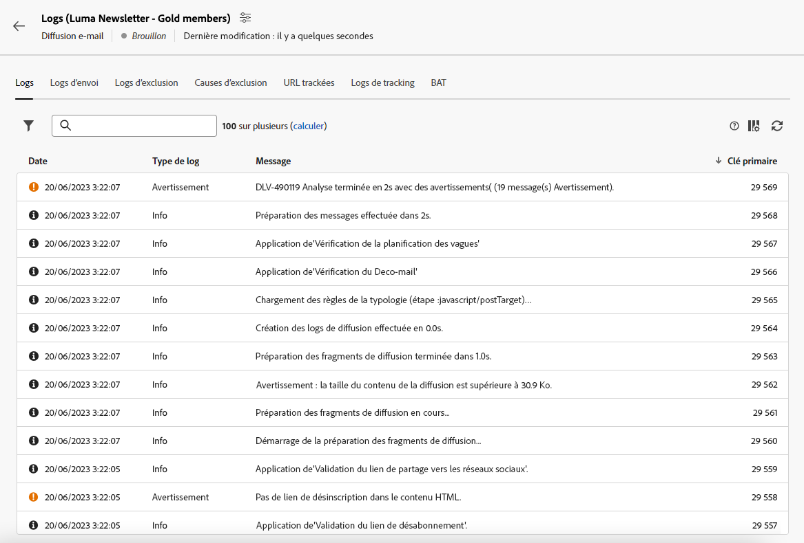
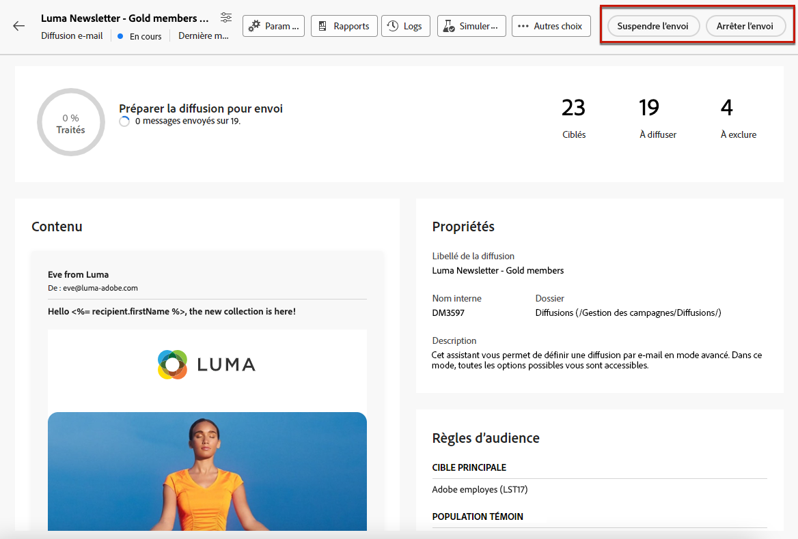

# Préparer et envoyer votre e-mail {#prepare-send}

## Préparer l’envoi {#prepare}

Lorsque vous avez défini votre [content](../content/edit-content.md), [audience](../audience/add-audience.md) et planifiez, vous êtes prêt à préparer votre diffusion email.

Pendant la préparation, la population cible est calculée et le contenu du message est généré pour chaque profil inclus dans la cible. Lorsque la préparation est terminée, les messages sont prêts à être envoyés immédiatement ou à la date et à l’heure planifiées.

Les règles de validation utilisées pendant la préparation de la diffusion sont décrites dans la [documentation de Campaign v8 (console)](https://experienceleague.adobe.com/docs/campaign/campaign-v8/campaigns/send/validate/delivery-analysis.html?lang=fr){target="_blank"}.

Les principales étapes de préparation de l&#39;envoi sont répertoriées ci-dessous.

1. Dans le tableau de bord de la diffusion, cliquez sur **[!UICONTROL Vérifier et envoyer]**.

   

1. Cliquez sur le bouton **[!UICONTROL Préparer]** dans le coin supérieur droit et confirmez.

   

   >[!NOTE]
   >
   >Si vous avez planifié votre diffusion et désactivé la variable **[!UICONTROL Activer la confirmation avant envoi]** , les étapes de préparation et d&#39;envoi sont regroupées sous l&#39;option **[!UICONTROL Préparer et envoyer]** bouton . [En savoir plus sur la planification](../email/create-email.md#schedule)

1. La progression de la préparation s’affiche. La durée de cette opération varie en fonction de la taille de la population ciblée.

   Vous pouvez arrêter la préparation à tout moment à l’aide du bouton **[!UICONTROL Arrêter la préparation]**.

   

   >[!NOTE]
   >Pendant la phase de préparation, aucun message n&#39;est envoyé. Vous pouvez donc lancer ou annuler cette opération sans aucun risque.

1. Une fois la préparation terminée, vérifiez les KPI. Si le nombre de messages à envoyer ne correspond pas à vos attentes, modifiez l’audience et relancez la préparation.

   

   Voici les KPI qui s’affichent :

   * **[!UICONTROL Ciblés]** : le nombre de destinataires ciblés..
   * **[!UICONTROL A envoyer]**: le nombre de messages qui seront envoyés.
   * **[!UICONTROL Pour exclure]**: le nombre de messages exclus par un [règle de typologie](../advanced-settings/delivery-settings.md#typology).

1. Cliquez sur le bouton **[!UICONTROL Logs]** et vérifiez qu’il n’y a aucune erreur. Le dernier message de logs affiche les erreurs éventuelles et leur nombre. [En savoir plus](delivery-logs.md).

   

1. Si la préparation détecte une erreur critique qui empêche l’envoi de la diffusion, le statut de préparation apparaît comme ayant échoué dans le tableau de bord de la diffusion.

   

1. Si vous apportez des modifications à votre diffusion après la préparation, vous devez relancer la préparation pour que ces modifications soient prises en compte.

Une fois la préparation terminée sans erreur, le message est prêt à être envoyé.

## Envoyer le message {#send}

>[!CONTEXTUALHELP]
>id="acw_deliveries_email_metrics_delivered"
>title="Diffusés"
>abstract="Le nombre de messages envoyés avec succès. Cet indicateur est mis à jour toutes les 5 minutes. Le pourcentage affiché est basé sur le nombre total de messages envoyés."

>[!CONTEXTUALHELP]
>id="acw_deliveries_email_metrics_opens"
>title="Ouvertures"
>abstract="Le nombre de messages ouverts. Cet indicateur est mis à jour toutes les 5 minutes. Le pourcentage affiché est le ratio du nombre d’ouvertures distinctes par rapport au nombre de messages diffusés."

>[!CONTEXTUALHELP]
>id="acw_deliveries_email_metrics_clicks"
>title="Clics"
>abstract="Le nombre de destinataires ayant cliqué au moins une fois dans l’e-mail. Cet indicateur est mis à jour toutes les 5 minutes. Le pourcentage affiché est le ratio du nombre de clics distincts par rapport au nombre de messages diffusés."

Une fois que la variable [préparation](#prepare) est terminée, vous pouvez désormais envoyer votre email.

Si le message est planifié, il sera envoyé à la date et à l’heure définies. [En savoir plus](#schedule-the-send).

### Envoyer immédiatement {#send-immediately}

Pour envoyer immédiatement un email, procédez comme suit.

1. Dans le tableau de bord de la diffusion, cliquez sur le bouton **[!UICONTROL Envoyer]** dans le coin supérieur droit.

   

1. Confirmez cette action pour envoyer immédiatement le message à la cible principale.

1. La progression de l’envoi s’affiche.

### Planifiez l&#39;envoi {#schedule-the-send}

Si vous avez planifié l&#39;envoi de votre email à une date et une heure ultérieures, procédez comme suit.

1. Avant d’accéder à la variable **[!UICONTROL Vérifier et envoyer]** , veillez à définir un planning pour votre email. [En savoir plus](../email/create-email.md#schedule).

1. Dans le tableau de bord de la diffusion, cliquez sur le bouton **[!UICONTROL Bouton Envoyer comme planifié]** dans le coin supérieur droit.

   

1. Cliquez sur **[!UICONTROL Confirmer l&#39;envoi]**. La diffusion sera envoyée à la date planifiée à la cible principale.

   >[!NOTE]
   >
   >Si vous avez désactivé la variable **[!UICONTROL Activer la confirmation avant envoi]** , les étapes de préparation et d&#39;envoi sont regroupées sous l&#39;option **[!UICONTROL Préparer et envoyer]** bouton . [En savoir plus sur la planification](../email/create-email.md#schedule)

## Suspendre ou arrêter l&#39;envoi {#pause-stop-sending}

Que votre diffusion soit planifiée ou non, deux actions peuvent être effectuées à tout moment pendant le processus d&#39;envoi :

* Cliquez sur **[!UICONTROL Pause de l&#39;envoi]** pour interrompre l&#39;envoi des messages. Vous pouvez reprendre l’envoi à tout moment.

* Cliquez sur **[!UICONTROL Arrêter l’envoi]** pour interrompre immédiatement l’envoi. Ni la préparation ni l&#39;envoi ne peuvent être repris une fois arrêtés.

## Vérification des indicateurs clés de performance {#check-kpis}

Une fois l&#39;envoi terminé, vous pouvez vérifier les KPI affichés :

* **[!UICONTROL Envoyé]**: le nombre de messages délivrés. Le pourcentage affiché est basé sur le nombre total de messages à diffuser.

* **[!UICONTROL Diffusés]** : le nombre de messages envoyés avec succès. Le pourcentage qui affiché est basé sur le nombre total de messages envoyés.

* **[!UICONTROL Ouvertures]** : le nombre de messages ouverts. Le pourcentage affiché est le nombre d&#39;ouvertures distinctes par rapport au nombre de messages délivrés.

* **[!UICONTROL Clics]**: le nombre de destinataires ayant cliqué au moins une fois dans l&#39;email. Le pourcentage affiché est le nombre de clics distincts par rapport au nombre de messages délivrés.

* **[!UICONTROL Erreurs]**: le nombre d&#39;emails avec le statut d&#39;erreur. Le pourcentage affiché est basé sur le nombre total de messages envoyés.

>[!NOTE]
>
>Les indicateurs sont mis à jour toutes les 5 minutes après le début de la diffusion. Les indicateurs de préparation des diffusions sont en temps réel.

Vous pouvez également consulter les logs. [En savoir plus](delivery-logs.md).