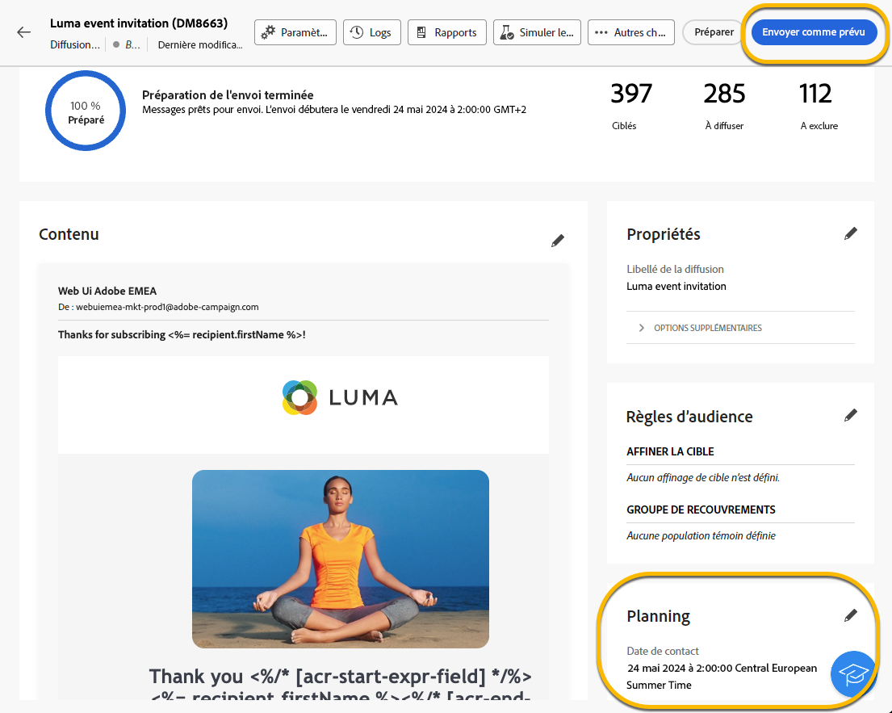
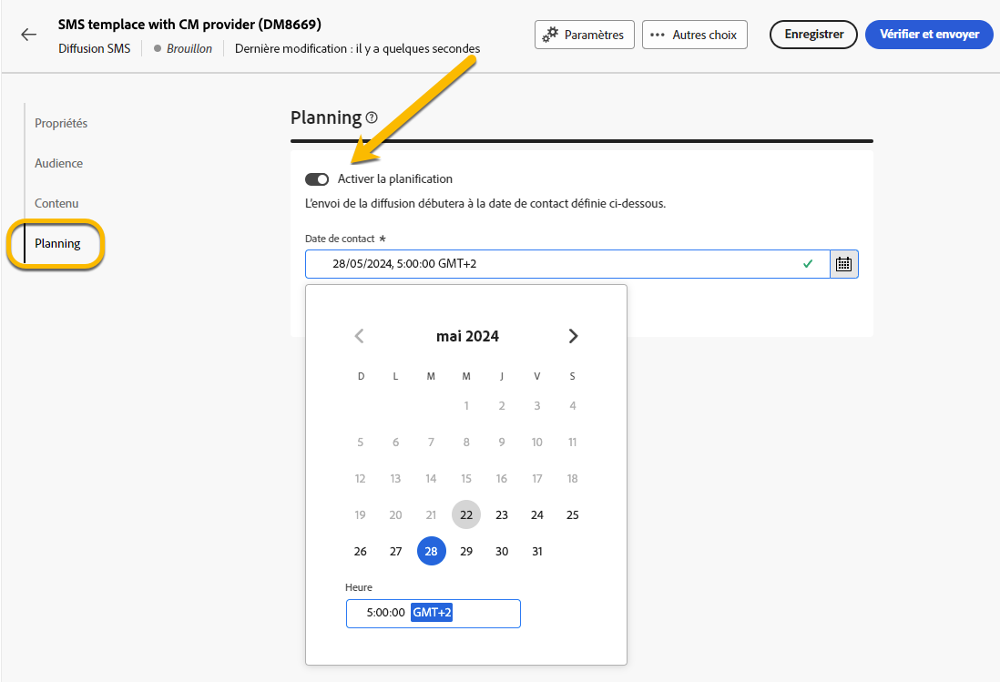
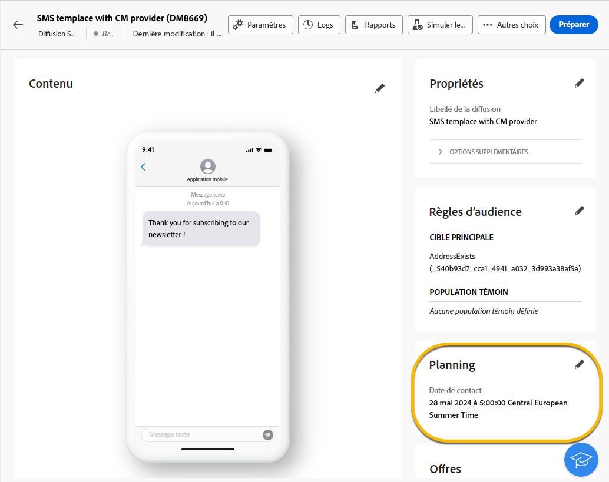
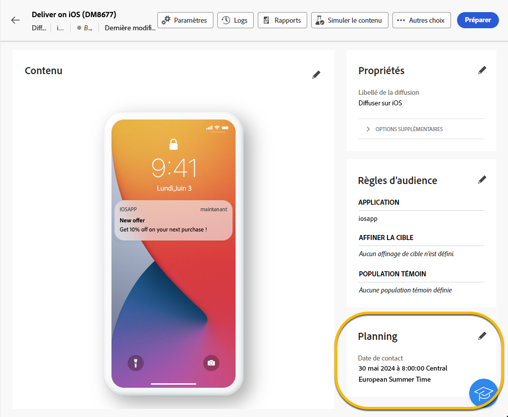
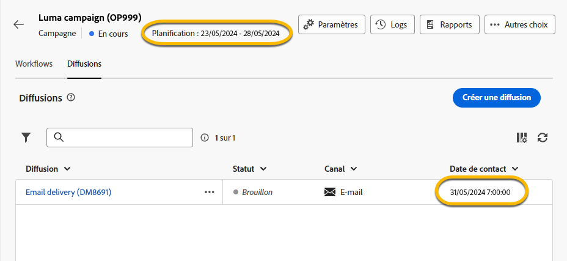

# Planifier l’envoi d’une diffusion {#schedule-sending}

Vous pouvez planifier l’envoi d’une diffusion. Les étapes dépendent du fait qu’il s’agisse d’une diffusion autonome (ponctuelle) ou si vous travaillez dans le contexte d’un workflow de campagne.

## Diffusion autonome

Pour les diffusions autonomes, planifiez la date et l’heure directement dans la diffusion. Consultez les exemples ci-dessous pour chaque type de diffusion : e-mail, SMS et notification push.

### E-mail {#schedule-email-standalone}

Pour planifier l’envoi d’une diffusion e-mail, procédez comme suit :

1. Dans la section **[!UICONTROL Planifier]** des propriétés de votre diffusion, activez le bouton (bascule) **[!UICONTROL Activer la planification]**.

1. Définissez la date et l’heure d’envoi souhaitées, puis cliquez sur le bouton **[!UICONTROL Vérifier et envoyer]**.

   {zoomable="yes"}

>[!NOTE]
>
>Par défaut, l’option **[!UICONTROL Activer la confirmation avant l’envoi]** est activée. Cette option nécessite de confirmer l’envoi avant que la diffusion ne soit envoyée à la date et à l’heure planifiées. Si vous devez envoyer automatiquement la diffusion à la date et à l’heure planifiées, désactivez cette option.
>

1. Vérifiez que le planning est correct, puis cliquez sur le bouton **[!UICONTROL Préparer]**.

{zoomable="yes"}

1. Une fois la préparation terminée, les messages sont prêts à être envoyés. Les mesures clés de la diffusion s’affichent, notamment la population cible totale, le nombre de messages à diffuser et le nombre de destinataires exclus. Cliquez sur le bouton **[!UICONTROL Envoyer comme prévu]** pour confirmer que la diffusion sera envoyée à la cible principale à la date et à l’heure planifiées.

{zoomable="yes"}

### SMS

Pour planifier votre diffusion par SMS à une date et une heure spécifiques, procédez de la même manière que pour les diffusions par e-mail. [Voir ci-dessus](#schedule-email-standalone).

{zoomable="yes"}

Vous pouvez également vérifier que le planning est appliqué :

{zoomable="yes"}

### Notification push

Pour planifier une diffusion push autonome à une date et une heure spécifiques, procédez de la même manière que pour les diffusions par e-mail. [Voir ci-dessus](#schedule-email-standalone).

{zoomable="yes"}

Vous pouvez également vérifier que le planning est appliqué :

{zoomable="yes"}

### Diffusion autonome dans une campagne

Vous pouvez créer une diffusion autonome dans une campagne sans utiliser de workflow. Configurez la date et l’heure de cette diffusion comme expliqué ci-dessus. La campagne peut avoir son propre planning, avec une date de début et une date de fin. Ce planning n’interfère pas avec votre planning de diffusion.

{zoomable="yes"}

## Planifier une diffusion dans un workflow de campagne

Dans le cadre d&#39;un workflow de campagne, il est recommandé d&#39;utiliser l&#39;activité **[!UICONTROL Planificateur]** afin d&#39;appliquer une date et une heure de lancement du workflow, ce qui implique l&#39;envoi de la diffusion. [En savoir plus sur le planificateur](../workflows/activities/scheduler.md).

{zoomable="yes"}

Configurez la date et l’heure dans l’activité **[!UICONTROL Planificateur]**.

{zoomable="yes"}

>[!NOTE]
>
>Lorsque vous utilisez l’activité **[!UICONTROL Planificateur]** pour planifier l’envoi de votre diffusion dans un workflow, n’activez pas le bouton (bascule) **[!UICONTROL Activer la planification]** dans les paramètres de l’activité **[!UICONTROL Diffusion]**. Votre diffusion sera envoyée automatiquement.
>

Si vous activez le bouton (bascule) **[!UICONTROL Activer la planification]** dans les paramètres de l’activité **[!UICONTROL Diffusion]** et y configurez une date et une heure, la diffusion attend d’être envoyée à cette date et à cette heure. Cela signifie que s’il existe un délai entre la date de lancement du workflow et la date d’envoi, l’audience peut ne pas être à jour.