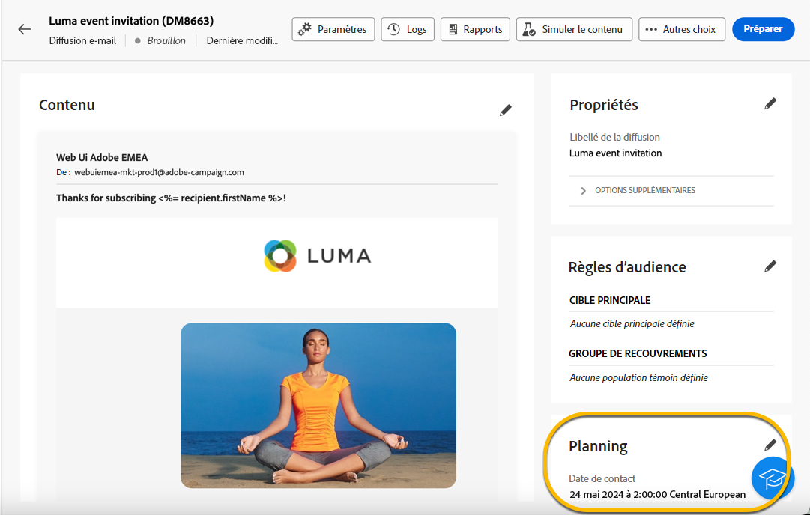
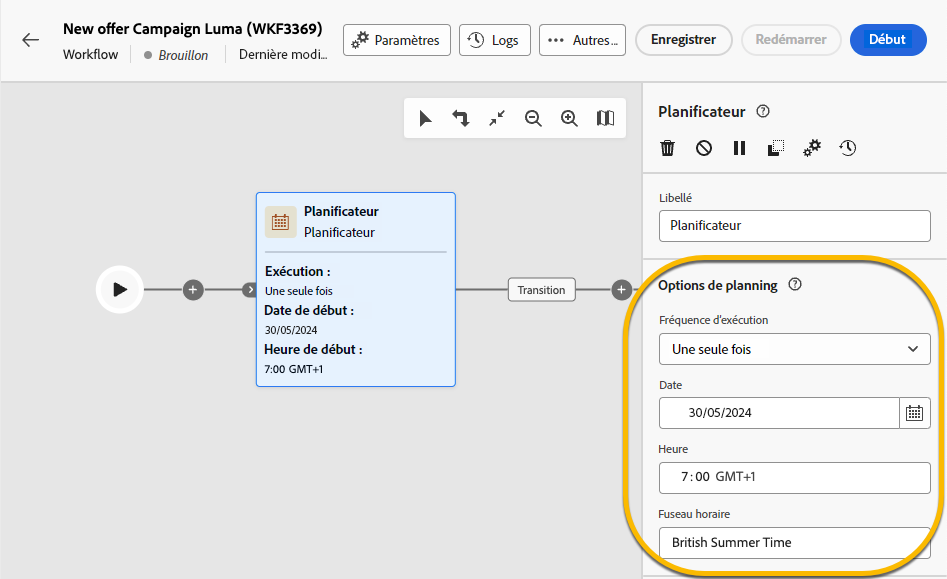

# Planifier l&#39;envoi d&#39;une diffusion {#schedule-sending}

Vous pouvez planifier l’envoi d’une diffusion. Les étapes pour cela dépendent s&#39;il s&#39;agit d&#39;une diffusion autonome (ponctuelle) ou si vous travaillez dans le cadre d&#39;un workflow de campagne.

## Diffusion autonome

Pour les diffusions autonomes, vous pouvez planifier directement la date et l’heure de la diffusion.
Voir ci-dessous des exemples pour chaque type de diffusion : email, sms, notification push.

### E-mail {#schedule-email-standalone}

Pour planifier l’envoi d’une diffusion email, procédez comme suit :

1. Dans le **[!UICONTROL Planification]** de vos propriétés de diffusion, activez la fonction **[!UICONTROL Activation de la planification]** basculer

1. Définissez la date et l’heure d’envoi souhaitées, puis cliquez sur **[!UICONTROL Vérifier et envoyer]** bouton .

   {zoomable="yes"}

>[!NOTE]
>
>Par défaut, l’option **[!UICONTROL Activer la confirmation avant l’envoi]** est activée. Cette option nécessite de confirmer l’envoi avant que la diffusion ne soit envoyée à la date et à l’heure planifiées. Si vous devez **envoyer automatiquement la diffusion ;** à la date et à l’heure planifiées, vous devez désactiver cette option.
>

1. Vérifiez que le planning est correct, puis cliquez sur **[!UICONTROL Préparer]** bouton .

{zoomable="yes"}

1. Une fois la préparation terminée, les messages sont prêts à être envoyés. Les mesures clés de la diffusion s&#39;affichent : population cible totale, nombre de messages à diffuser, nombre de destinataires exclus. Cliquez sur le bouton **[!UICONTROL Envoyer comme prévu]** pour confirmer que vous autorisez l&#39;envoi de la diffusion à la date et à l&#39;heure planifiées à la cible principale.

{zoomable="yes"}

### SMS

Pour planifier la diffusion de votre SMS à une date et une heure spécifiques, les étapes sont les mêmes que pour les diffusions email, [voir ci-dessus](#schedule-email-standalone).

{zoomable="yes"}

Vous pouvez également vérifier que le planning est pris en compte :

{zoomable="yes"}

### Notification Push

Pour planifier une diffusion push autonome à une date et une heure spécifiques, les étapes sont les mêmes que pour les diffusions email, [voir ci-dessus](#schedule-email-standalone).

{zoomable="yes"}

Vous pouvez également vérifier que le planning est pris en compte :

{zoomable="yes"}

### Diffusion autonome dans une campagne

Vous pouvez créer une diffusion autonome dans une campagne sans utiliser de workflow. Vous pouvez configurer la date et l’heure pour cette diffusion, comme expliqué ci-dessus.
La planification de l&#39;opération peut être associée à une date de début et une date de fin. Ce planning n&#39;interférera pas avec votre planning de diffusion.

{zoomable="yes"}

## Planification d’une diffusion dans un workflow de campagne

Dans le cadre d&#39;un workflow de campagne, la variable **bonne pratique** est d’utiliser la variable **[!UICONTROL Planificateur]** pour appliquer une date et une heure de lancement du workflow, impliquant l&#39;envoi de la diffusion. [En savoir plus sur le planificateur](../workflows/activities/scheduler.md)

{zoomable="yes"}

Vous devez configurer la date et l’heure dans la variable **[!UICONTROL Planificateur]** activité.

{zoomable="yes"}

>[!NOTE]
>
>Lorsque vous utilisez la variable **[!UICONTROL Planificateur]** activité pour planifier l&#39;envoi de votre diffusion dans un workflow, **ne pas activer** la valeur **[!UICONTROL Activation de la planification]** bascule dans le **[!UICONTROL Diffusion]** paramètres d’activité. Votre diffusion sera envoyée automatiquement.
>

Si vous activez la variable **[!UICONTROL Activation de la planification]** bascule dans le **[!UICONTROL Diffusion]** paramètres d’activité et y configurer une date et une heure, la diffusion attend d’être envoyée à cette date et heure. En conséquence, en cas de délai entre la date de lancement du workflow et la date d&#39;envoi, l&#39;audience peut ne pas être à jour.

