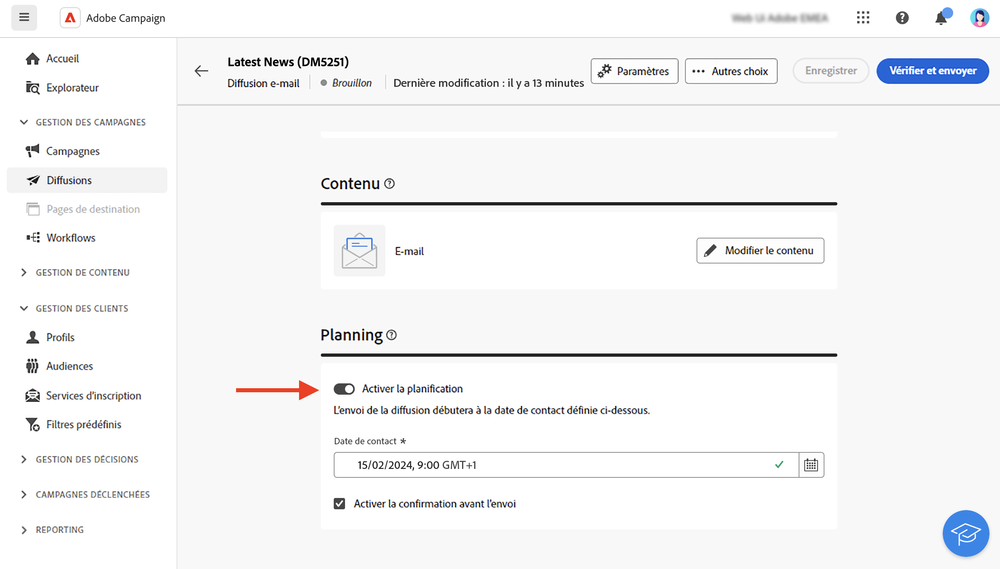

# Créer une diffusion {#create-delivery}

<!-- /NEO-92684 / DOCAC-13767-->

>[!CONTEXTUALHELP]
>id="acw_deliveries_profile_enrichment_settings"
>title="Activer l’enrichissement de profil"
>abstract="Sélectionnez les champs pour l’enrichissement de profil."

Vous pouvez créer des diffusions autonomes à partir du menu de gauche **[!UICONTROL Diffusions]**, ou créer des diffusions dans le cadre d’un workflow, incluses ou non dans une campagne.

Parcourez les onglets ci-dessous pour découvrir comment créer une diffusion :

>[!BEGINTABS]

>[!TAB Créer une diffusion autonome]

Pour créer une diffusion autonome, procédez comme suit :

1. Accédez au menu **[!UICONTROL Diffusions]** dans le volet de navigation de gauche, puis cliquez sur le bouton **[!UICONTROL Créer une diffusion]**.

   {zoomable="yes"}

1. Sélectionnez un canal de diffusion.
1. Définissez l’audience de la diffusion, pour la cible principale et la population témoin. [En savoir plus sur les audiences](../audience/about-recipients.md).

   {zoomable="yes"}{width="70%" align="left"}

1. Définissez le contenu du message. Découvrez les canaux de diffusion et comment définir un contenu de diffusion dans les sections suivantes :

   * [Canal e-mail](../email/create-email.md)
   * [Canal des notifications push](../push/gs-push.md)
   * [Canal SMS](../sms/create-sms.md)

1. (Facultatif) Définissez le [planning](#gs-schedule) de diffusion. Si aucun planning n’est défini, les messages sont envoyés immédiatement après avoir cliqué sur le bouton **[!UICONTROL Envoyer]**.
1. Cliquez sur le bouton **[!UICONTROL Vérifier et envoyer]** pour vérifier vos paramètres.
1. Utilisez le bouton **[!UICONTROL Simuler le contenu]** pour tester votre diffusion et vos paramètres de personnalisation. Pour en savoir plus sur la simulation des messages, consultez [cette section](../preview-test/preview-test.md).
1. Cliquez sur le bouton **[!UICONTROL Préparer]** pour calculer la population cible et générer les messages. L’étape de préparation peut prendre quelques minutes. Une fois la préparation terminée, les messages sont prêts à être envoyés. En cas d’erreur, accédez aux **Logs** pour vérifier les alertes et les avertissements.
1. Vérifiez les résultats, puis cliquez sur le bouton **[!UICONTROL Envoyer]** pour commencer à envoyer des messages.
1. Une fois les messages envoyés, rendez-vous dans la section **Rapports** pour accéder aux mesures clés. Pour en savoir plus sur les rapports de diffusion, consultez [cette section](../reporting/delivery-reports.md).

>[!TAB Créer une diffusion dans un workflow]

Pour créer une diffusion dans un workflow, procédez comme suit :

1. Créez un workflow ou ouvrez un workflow existant. [En savoir plus sur les workflows](../workflows/gs-workflow-creation.md#gs-workflow-steps)
1. Ajoutez et configurez une activité [**[!UICONTROL Créer une audience]**](../workflows/activities/build-audience.md).
1. Cliquez sur l’icône `+` et sélectionnez une activité de diffusion : **[!UICONTROL E-mail]**, **[!UICONTROL SMS]**, **[!UICONTROL Notification push (Android)]** ou **[!UICONTROL Notification push (iOS)]**. Découvrez les activités de canal de diffusion dans un workflow et comment définir un contenu de diffusion dans [cette section](../workflows/activities/channels.md).

   {zoomable="yes"}

1. Démarrez le workflow et vérifiez les logs.

Vous pouvez également ajouter des diffusions dans une campagne sans créer de workflow. Pour ce faire, accédez à l’onglet **[!UICONTROL Diffusions]** de votre campagne, puis cliquez sur le bouton **[!UICONTROL Créer une diffusion]**.

{zoomable="yes"}

Les étapes de configuration sont similaires à celles des diffusions autonomes.

Pour plus d’informations sur la configuration d’une campagne et la gestion des diffusions appartenant à une campagne, reportez-vous à [cette section](../campaigns/gs-campaigns.md).

>[!ENDTABS]

## Ajouter de la personnalisation {#personalization}

Les messages diffusés par Adobe Campaign peuvent être personnalisés de différentes façons. [En savoir plus sur les fonctionnalités de personnalisation](../personalization/gs-personalization.md).

Utilisez Campaign pour créer du contenu dynamique et envoyer des messages personnalisés. Vous pouvez cumuler les fonctionnalités de personnalisation afin d’améliorer vos messages et créer une expérience utilisateur personnalisée.

Vous pouvez personnaliser le contenu du message en procédant comme suit :

* Insérer des **champs de personnalisation** dynamiques.

  Les champs de personnalisation sont utilisés pour la personnalisation de premier niveau de vos messages. Vous pouvez sélectionner n’importe quel champ disponible dans la base de données de l’éditeur de personnalisation. Pour une diffusion, vous pouvez sélectionner n’importe quel champ associé aux destinataires, au message ou à la diffusion. Ces attributs de personnalisation peuvent être insérés dans l’objet ou dans le corps de vos messages. [En savoir plus](../personalization/personalize.md)

* Insérer des **fragments d’expression** prédéfinis

  Campaign est fourni avec un ensemble de fragments d’expression qui contiennent des rendus spécifiques que vous pouvez insérer dans vos diffusions. Vous pouvez par exemple ajouter un logo, un message de salutation ou un lien vers la page miroir du message. Les fragments d’expression sont disponibles à partir d’une entrée dédiée dans l’éditeur de personnalisation. Vous pouvez également créer vos propres fragments d’expression en fonction de vos besoins. [Découvrez comment utiliser les fragments d’expression.](../content/use-expression-fragments.md)

* Créer du **contenu conditionnel**

  Configurez du contenu conditionnel pour ajouter une personnalisation dynamique basée notamment sur le profil de la personne destinataire. Lorsqu’une condition est rencontrée, des blocs de texte et/ou des images sont alors insérés. [En savoir plus](../personalization/conditions.md)

* Ajouter des **offres personnalisées**

  Insérez des offres personnalisées dans le contenu de votre message, en fonction de l’emplacement des destinataires, de la météo actuelle ou du dernier bon de commande. [En savoir plus](../msg/offers.md)

## Prévisualiser et tester vos diffusions

Une fois le contenu de votre message défini, vous pouvez le prévisualiser afin de contrôler le rendu de vos messages, et vérifier les paramètres de personnalisation avec des profils de test. [En savoir plus](../preview-test/preview-test.md)

## Planification de lʼenvoi de la diffusion {#gs-schedule}

>[!CONTEXTUALHELP]
>id="acw_deliveries_email_schedule"
>title="Définition de la date et de l’heure de contact"
>abstract="Définissez la date et l’heure exactes de votre diffusion. En choisissant l’heure la plus appropriée pour votre message marketing, vous pouvez maximiser les taux d’ouverture."

Vous pouvez définir la date et l’heure d’envoi exactes de vos messages. En choisissant l’heure la plus appropriée pour votre message marketing, vous pouvez maximiser les taux d’ouverture.

Pour planifier l’envoi d’une diffusion, ouvrez-la et accédez à la section **[!UICONTROL Planning]**. Utilisez le bouton (bascule) **[!UICONTROL Activer le planning]** pour l’activer et définir la date et l’heure d’envoi. Une fois la diffusion envoyée, l’envoi effectif démarre à la date de contact que vous avez définie.

{zoomable="yes"}

Par défaut, l’option **[!UICONTROL Activer la confirmation avant l’envoi]** est activée. Cette option nécessite de confirmer l’envoi avant que la diffusion ne soit envoyée à la date et à l’heure planifiées. Si vous souhaitez envoyer automatiquement la diffusion à la date et l’heure planifiées, vous pouvez désactiver cette option.

Découvrez les étapes à suivre pour envoyer une diffusion planifiée dans [cette section](../monitor/prepare-send.md#schedule-the-send).

## Surveillance et logs de tracking {#gs-tracking-logs}

La surveillance de vos diffusions après leur envoi est une étape clé pour vous assurer que vos campagnes marketing sont efficaces et atteignent vos clientèle.

Vous pouvez ainsi surveiller une diffusion après son envoi et comprendre la gestion des diffusions en échec et des quarantaines.

En savoir plus sur les fonctionnalités de surveillance et de tracking dans [cette section](../reporting/gs-reports.md).