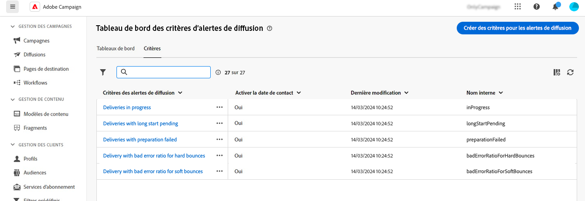
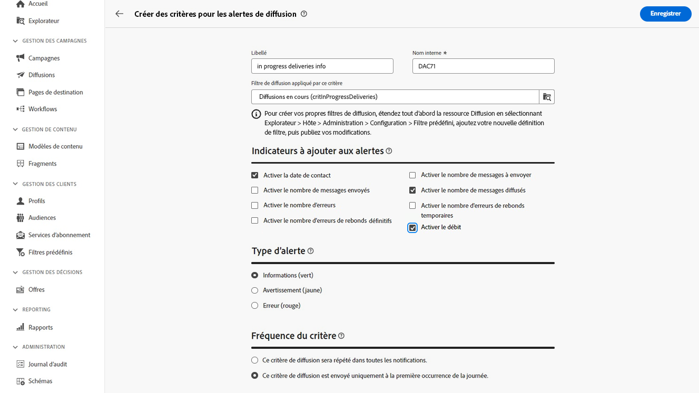

# Critères des alertes de diffusion {#delivery-alerting-criteria}

>[!CONTEXTUALHELP]
>id="acw_delivery_alerting_criteria"
>title="Tableau de bord des critères des alertes de diffusion"
>abstract="L’interface d’utilisation de Campaign Web fournit des critères des alertes prédéfinis (diffusions avec faible débit, diffusions dont la préparation a échoué...) que vous pouvez ajouter à votre tableau de bord. Vous pouvez également créer vos propres critères en fonction de vos besoins."

L’interface d’utilisation de Campaign Web fournit des critères des alertes prédéfinis, tels que des diffusions avec faible débit ou des diffusions dont la préparation a échoué, que vous pouvez ajouter à votre tableau de bord. Vous pouvez également créer vos propres critères en fonction de vos besoins.

Les critères des alertes sont accessibles à partir du menu **Alertes de diffusion** dans le volet de navigation de gauche, sous l’onglet **Critères**.

>[!AVAILABILITY]
>
>Cette fonctionnalité est en disponibilité limitée. Celle-ci est limitée aux clientes et aux clients effectuant la migration **d’Adobe Campaign Standard vers Adobe Campaign v8** et ne peut pas être déployée dans un autre environnement.

## Critères des alertes prédéfinis {#ootb-criteria}

Les critères des alertes prédéfinis sont disponibles dans l’interface d’utilisation de Campaign Web. Ces critères couvrent toute une gamme de scénarios, répertoriés ci-dessous :

* **Diffusions en échec** : toute diffusion planifiée sur une période définie, ayant un statut en erreur.
* **Diffusions avec préparation en échec** : toute diffusion modifiée pendant une période définie pour laquelle l’étape de préparation (calcul de la cible et génération du contenu) n’a pas réussi.
* **Diffusion avec taux d’erreurs de rebonds temporaires incorrect** : toute diffusion planifiée sur une période définie, ayant au moins le statut « En cours » et dont le taux de rebonds temporaires est supérieur à un pourcentage défini.
* **Diffusion avec taux d’erreurs de rebonds définitifs incorrect** : toute diffusion planifiée sur une période définie, ayant au moins le statut « En cours » et dont le taux de rebonds définitifs est supérieur à un pourcentage défini.
* **Diffusions avec un long démarrage en attente** : toute diffusion planifiée sur une période définie, ayant le statut « Démarrage en attente » pendant une durée supérieure à celle spécifiée. Le statut « Démarrage en attente » signifie que les messages n’ont pas encore été pris en compte par le système.
* **Diffusions avec faible débit** : toute diffusion ayant démarré depuis plus longtemps qu’une durée définie, avec un pourcentage de messages traités inférieur à un pourcentage défini et un débit inférieur à une valeur définie.
* **Diffusions en cours** :toute diffusion planifiée sur une période définie, ayant le statut « En cours ».

>[!NOTE]
>
>Les valeurs par défaut sont appliquées à tous les paramètres des critères ci-dessus. Ces valeurs peuvent être personnalisées dans la section **Paramètres des critères** des tableaux de bord des alertes de diffusion dans lesquels elles sont utilisées. [Découvrir comment utiliser les tableaux de bord](../msg/delivery-alerting-dashboards.md)

## Créer un critère d’alerte {#criteria}

>[!CONTEXTUALHELP]
>id="acw_delivery_alerting_criteria_create"
>title="Créer des critères d’alerte de diffusion"
>abstract="Outre les critères des alertes prédéfinis fournis par Adobe Campaign, vous pouvez créer vos propres critères en fonction de vos besoins."

>[!CONTEXTUALHELP]
>id="acw_delivery_alerting_criteria_create_indicators"
>title="Indicateurs à ajouter aux alertes"
>abstract="Sélectionnez les indicateurs à afficher dans des colonnes dans la section « Détails » des alertes par e-mail."

>[!CONTEXTUALHELP]
>id="acw_delivery_alerting_criteria_create_alert"
>title="Type d’alerte"
>abstract="Spécifiez le **Type d’alerte** pour le critère, c’est-à-dire le libellé et la couleur à afficher en regard du critère de diffusion dans la section « Résumé » des alertes."

>[!CONTEXTUALHELP]
>id="acw_delivery_alerting_criteria_create_frequency"
>title="Fréquence du critère"
>abstract="Contrôlez la fréquence des alertes par jour pour chaque diffusion répondant au critère."

Pour créer un critère, procédez comme suit :

1. Accédez au menu **Alertes de diffusion** dans le volet de navigation de gauche, puis sélectionnez l’onglet **Critères**.
1. Cliquez sur le bouton **Créer des critères des alertes de diffusion**.
1. Saisissez le libellé du critère. Le nom interne est automatiquement renseigné et en lecture seule.
1. Utilisez le **Filtre de diffusion appliqué par ce critère** pour affiner la portée du critère en lui appliquant un filtre prédéfini.

   Dans l’exemple ci-dessous, le filtre **Diffusions en cours (critInProgressDeliveries)** a été sélectionné, ce qui signifie que le critère ne prend en compte que les diffusions ayant le statut « En cours ».

   

   >[!NOTE]
   >
   >Si aucun des filtres prédéfinis ne répond à vos besoins, vous pouvez créer les vôtres à partir du menu **Gestion des clientes et clients** > **Filtres prédéfinis**. [En savoir plus](../get-started/predefined-filters.md)
   >
   >Cette opération doit être effectuée par un utilisateur expert ou une utilisatrice experte uniquement.

1. Dans la section **Indicateurs à ajouter aux alertes**, choisissez les indicateurs à afficher dans des colonnes dans la section « Détails » des alertes par e-mail.

1. Spécifiez le **Type d’alerte** du critère, c’est-à-dire le libellé et la couleur à afficher en regard du critère de diffusion dans la section « Résumé » des alertes.

1. Utilisez la section **Fréquence des critères** pour contrôler la fréquence des alertes par jour pour chaque diffusion répondant au critère :

   * **Ce critère de diffusion sera répété dans toutes les notifications** : affiche une diffusion répondant au critère dans chaque alerte par e-mail du jour.
   * **Ce critère de diffusion est envoyé uniquement à la première occurrence de la journée** : affiche une diffusion répondant au critère dans le premier rapport du jour uniquement, sans la répéter dans les alertes par e-mail suivantes.