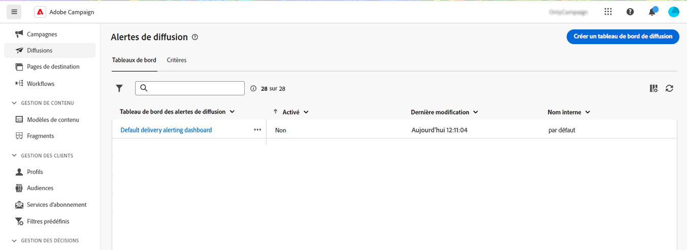

# Tableaux de bord des alertes de diffusion {#delivery-alerting-dashboards}

>[!CONTEXTUALHELP]
>id="acw_delivery_alerting_dashboards"
>title="Tableaux de bord des alertes de diffusion"
>abstract="Les alertes de diffusion sont un système de gestion des alertes qui permet à des groupes d’utilisateurs de recevoir automatiquement des notifications par e-mail contenant des informations sur leurs exécutions de diffusion. Les tableaux de bord des alertes de diffusion vous permettent de spécifier qui recevra des alertes par email, de choisir et de configurer les critères des alertes à utiliser pour envoyer ces alertes et d’accéder à l’historique de toutes les notifications envoyées."

Les tableaux de bord des alertes de diffusion vous permettent de spécifier qui recevra des alertes par email, de choisir et de configurer les critères des alertes à utiliser pour envoyer ces alertes et d’accéder à l’historique de toutes les notifications envoyées. Elles sont accessibles à partir du **Alertes de diffusion** dans le volet de navigation de gauche, sous **Tableaux de bord** .

## Créer un tableau de bord de diffusion {#dashboards}

>[!CONTEXTUALHELP]
>id="acw_delery_alerting_dashboard_create"
>title="Créer un tableau de bord des alertes de diffusion"
>abstract="La création d&#39;un tableau de bord des alertes de diffusion permet de définir qui recevra les alertes par email, de choisir et de configurer les critères des alertes à utiliser pour envoyer ces alertes et d&#39;accéder à l&#39;historique de toutes les notifications envoyées."

>[!CONTEXTUALHELP]
>id="acw_delivery_alerting_create_general"
>title="Paramètres généraux des alertes de diffusion"
>abstract="Définissez les propriétés générales du tableau de bord des alertes de diffusion. La variable **Sélectionner un groupe d’alertes** vous permet de spécifier la variable **groupe d&#39;opérateurs** pour recevoir les alertes envoyées par ce tableau de bord."

>[!CONTEXTUALHELP]
>id="acw_delivery_alerting_create_criteria_add"
>title="Critères des alertes de diffusion"
>abstract="Dans cette section, ajoutez les critères à utiliser pour envoyer des alertes à partir de ce tableau de bord. Faites votre choix parmi des critères prédéfinis ou créez vos propres critères pour vous aligner sur des besoins spécifiques."

>[!CONTEXTUALHELP]
>id="acw_delivery_alerting_create_criteria_parameters"
>title="Paramètres des critères"
>abstract="Les critères comportent des valeurs de paramètres par défaut qui définissent la manière dont ils doivent être appliqués. Vous pouvez modifier ces valeurs en fonction de vos besoins dans cette section."

Pour créer un tableau de bord de diffusion, procédez comme suit :

1. Accédez au **Alertes de diffusion** dans le volet de navigation de gauche, puis cliquez sur **Créer un tableau de bord de diffusion**.

   

1. Nommez votre tableau de bord dans la variable **Libellé** champ . La variable **Nom interne** est renseigné automatiquement et en lecture seule.

1. Dans le **Sélectionner un groupe d’alertes** , indiquez le champ **groupe d&#39;opérateurs** pour recevoir les alertes envoyées par ce tableau de bord. Tous les membres du groupe d&#39;opérateurs sélectionné recevront les alertes.

   En savoir plus sur les permissions et les groupes d’opérateurs dans la section [Documentation d’Adobe Campaign v8 (console)](https://experienceleague.adobe.com/en/docs/campaign/campaign-v8/admin/permissions/gs-permissions){target="_blank"}

1. Dans le **Critères des alertes de diffusion** , ajoutez les critères à utiliser pour envoyer des alertes. Faites votre choix parmi des critères prédéfinis ou créez vos propres critères pour vous aligner sur des besoins spécifiques. [Découvrez comment utiliser les critères](../msg/delivery-alerting-criteria.md)

1. Les critères comportent des valeurs de paramètres par défaut qui définissent la manière dont ils doivent être appliqués. Vous pouvez modifier ces valeurs en fonction de vos besoins à partir du **Paramètres des critères** .

   

   Par exemple, la variable **Taille minimale de la cible de diffusion** Le paramètre critères est défini sur 50, ce qui signifie qu’une diffusion sera incluse dans l’alerte envoyée par ce tableau de bord uniquement si elle cible au moins 50 profils. Vous pouvez modifier ce paramètre si vous souhaitez inclure des diffusions ciblant moins de 50 profils.

   Développez la section ci-dessous pour plus d’informations sur chaque paramètre de critère :

   +++Paramètres de critères disponibles

   * **Taille minimale de la cible de la diffusion** : si vous saisissez par exemple la valeur 100 dans ce champ, une notification est envoyée uniquement pour les diffusions dont la cible est supérieure ou égale à 100 destinataires. Ce paramètre s&#39;applique à tous les critères.
   * **Période de contrôle avant et après la date de contact (en heures)** : nombre d&#39;heures avant et après l&#39;heure actuelle. Seules les diffusions dont la date de contact est comprise dans cette plage sont prises en compte. Ce paramètre s&#39;applique à tous les critères. Par défaut, la valeur de ce champ est définie sur 24 heures.
   * **Taux maximal de rebonds temporaires** : une notification est envoyée pour toutes les diffusions dont le taux de rebonds temporaires est supérieur à la valeur spécifiée. Par défaut, la valeur de ce champ est définie sur 0,05 (5 %).
   * **Taux maximal de rebonds définitifs** : une notification est envoyée pour toutes les diffusions dont le taux de rebonds définitifs est supérieur à la valeur spécifiée. Par défaut, la valeur de ce champ est définie sur 0,05 (5 %).
   * **Seuil minimum de temps pour une diffusion dans le statut &quot;Démarrage en attente&quot; (en minutes)**: une notification est envoyée pour toutes les diffusions ayant le statut Démarrage en attente pendant une durée supérieure à celle spécifiée dans ce champ. Le statut Démarrage en attente signifie que les messages n&#39;ont pas encore été pris en compte par le système.
   * **Durée minimale requise pour le calcul du débit (en minutes)**: seules les diffusions ayant démarré (avec le statut En cours ) depuis plus longtemps que la durée spécifiée sont prises en compte pour le critère Diffusions avec faible débit .
   * **Pourcentage maximal de messages traités pour le calcul du débit**: seules les diffusions dont le pourcentage de messages traités est inférieur au pourcentage spécifié sont prises en compte pour le critère Diffusions avec faible débit .
   * **Débit minimal attendu (dans les messages envoyés par heure)**: seules les diffusions dont le débit est inférieur à la valeur spécifiée sont prises en compte pour le critère Diffusions avec faible débit .
   * **Taux de traitement minimal requis pour le critère &quot;Diffusions en cours&quot;**: seules les diffusions dont le pourcentage de messages traités est supérieur au pourcentage spécifié sont prises en compte.

+++

1. Par défaut, les tableaux de bord des alertes sont désactivés, ce qui signifie que les alertes par email liées à ce tableau de bord ne sont pas envoyées. Pour activer immédiatement le tableau de bord, faites basculer le **Activé** dans le **Général** en regard du champ de sélection du groupe d’alertes.

   Vous pouvez également enregistrer le tableau de bord et l’activer ultérieurement.

   

1. Pour enregistrer le tableau de bord des alertes, cliquez sur le bouton **Enregistrer** bouton .

Le tableau de bord des alertes s’ouvre avec des données vides. Lorsque vous êtes prêt à l’activer et à envoyer des notifications, cliquez sur le bouton **Paramètres** et activer/désactiver le bouton **Activé** si vous ne l’avez pas fait auparavant.

Désormais, chaque fois qu&#39;une diffusion répond aux critères définis dans ce tableau de bord, une notification d&#39;alerte est envoyée au groupe d&#39;opérateurs spécifié.

## Gestion des tableaux de bord des alertes

>[!CONTEXTUALHELP]
>id="acw_delivery_alerting_dashboard_alerts"
>title="Alertes de diffusion envoyées"
>abstract="Cette section vous permet de visualiser des informations relatives aux dernières alertes envoyées."

>[!CONTEXTUALHELP]
>id="acw_delivery_alerting_dashboard_history"
>title="Historique des alertes de diffusion"
>abstract="La variable **Histoire** contient toutes les alertes envoyées à partir de ce tableau de bord. Cliquez sur un élément pour accéder aux alertes correspondantes envoyées à ce moment précis."

Tous les tableaux de bord des alertes créés sont accessibles à partir du **Alertes de diffusion** , dans le **Tableaux de bord** .

Vous pouvez dupliquer ou supprimer un tableau de bord à l’aide de la fonction **Autres actions** située en regard de son nom.

Pour accéder à une vue détaillée d&#39;un tableau de bord, cliquez sur son nom dans la liste. Dans cet écran, vous pouvez visualiser la dernière alerte envoyée. Toutes les alertes envoyées sont répertoriées dans le volet de gauche. Cliquez sur un élément pour accéder aux alertes correspondantes envoyées à ce moment précis.

Pour modifier le tableau de bord, cliquez sur le bouton **Paramètres** dans le coin supérieur droit et apportez les modifications souhaitées.
