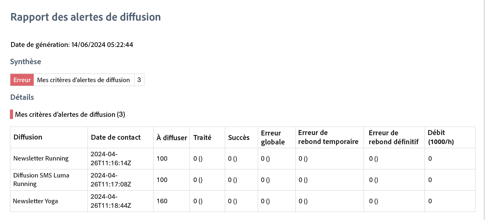

# Commencer avec les alertes de diffusion {#gs-delivery-alerting}

Les alertes de diffusion sont un système de gestion des alertes qui permet à des groupes d’utilisateurs et utilisatrices de recevoir automatiquement des notifications par e-mail contenant des informations sur leurs exécutions de diffusion. Les personnes destinataires surveillent les diffusions en cours traitées par Adobe Campaign et prennent les mesures appropriées en cas de problème.

Les notifications sont personnalisées en fonction de critères d’alertes spécifiques définis via l’interface d’utilisation web d’Adobe Campaign.

Pour plus d’informations sur la gestion des échecs de diffusions, reportez-vous à la [documentation d’Adobe Campaign v8 (console)](https://experienceleague.adobe.com/fr/docs/campaign/campaign-v8/send/failures/delivery-failures#send){target="_blank"}.

>[!AVAILABILITY]
>
>Cette fonctionnalité est en disponibilité limitée. Celle-ci est limitée aux clientes et aux clients effectuant la migration **d’Adobe Campaign Standard vers Adobe Campaign v8** et ne peut pas être déployée dans un autre environnement.

## Table des matières des notifications par e-mail {#content}

Les notifications par e-mail comprennent les sections suivantes :

* **Résumé** : affiche le nombre de diffusions répondant aux critères que vous avez définis, avec des libellés et des couleurs pour chaque critère.
* **Détails** : répertorie tous les critères de diffusion définis pour le tableau de bord et les diffusions correspondantes pour chaque critère.

## Configurer des alertes de diffusion {#set-up}

Pour configurer ces alertes, l’interface d’utilisation web de Campaign vous permet de créer et de gérer les éléments suivants :

* **Tableaux de bord des alertes de diffusion** : indiquez les personnes destinataires, définissez les critères des alertes à inclure dans le tableau de bord et accédez à un historique des alertes envoyées. [Découvrez comment utiliser les tableaux de bord](../msg/delivery-alerting-dashboards.md).
* **Critères des alertes de diffusion** : l’interface d’utilisation web de Campaign fournit des critères d’alerte prédéfinis, tels que les diffusions à faible débit ou celles dont la préparation a échoué. Vous pouvez ajouter ces critères à votre tableau de bord ou créer vos propres critères en fonction de vos besoins. [Découvrez comment utiliser les critères](../msg/delivery-alerting-criteria.md).

Supposons que vous souhaitiez informer les utilisateurs et utilisatrices disposant de droits d’administration uniquement des échecs de diffusions et les utilisateurs et utilisatrices marketing des diffusions présentant un taux d’erreurs de rebonds temporaires élevé. Pour ce faire, créez deux tableaux de bord distincts avec les critères appropriés pour chaque groupe de personnes destinataires.

>[!NOTE]
>
>Pour accéder aux tableaux de bord ainsi qu’aux critères des alertes et les configurer, vous devez disposer de **droits d’administration** ou figurer dans le groupe de sécurité **Superviseurs et superviseuses de diffusion**. Les utilisateurs et utilisatrices standard ne peuvent pas accéder aux tableaux de bord dans l’interface Adobe Campaign, mais ils peuvent recevoir des notifications d’alertes. [En savoir plus sur l’accès et les autorisations](../get-started/permissions.md).