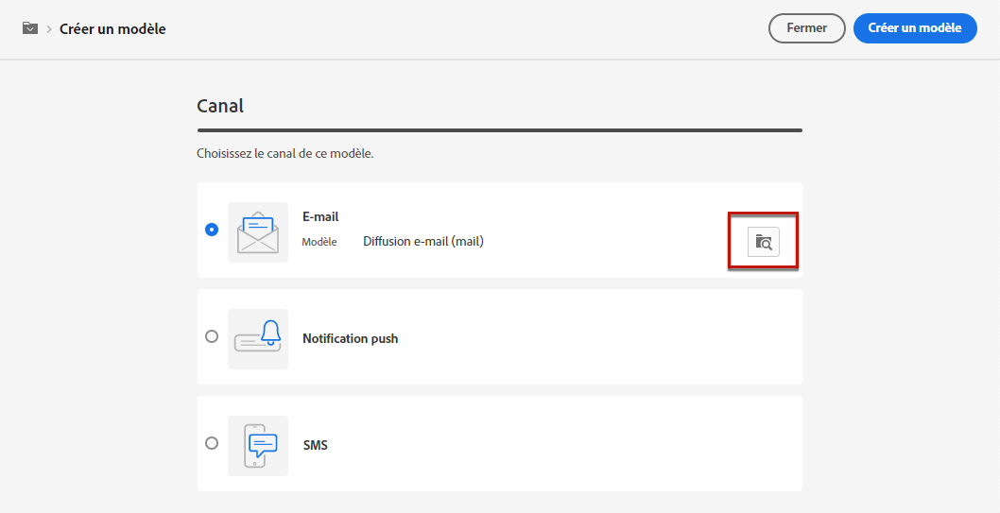
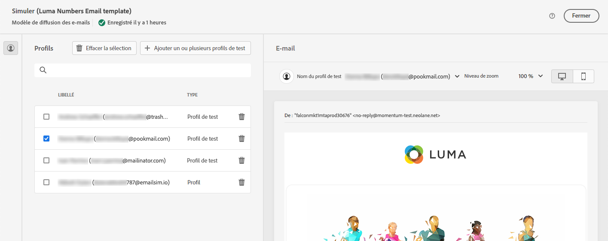

# Utiliser des modèles de diffusion {#work-with-delivery-templates}

Pour un processus de conception accéléré et amélioré, vous pouvez créer des modèles de diffusion pour réutiliser facilement le contenu personnalisé dans vos campagnes. Cette fonctionnalité vous permet de normaliser l’aspect créatif afin d’être plus rapide dans l’exécution et le lancement des campagnes.

Un modèle peut inclure les éléments suivants :

* [Typologies](../advanced-settings/delivery-settings.md#typology)
* L’adresse de l’expéditeur ou expéditrice
* Une [audience](../audience/about-audiences.md), y compris des [populations témoins](../audience/control-group.md)
* Du [contenu](../content/edit-content.md) personnalisé
* Des [champs personnalisés](../personalization/personalize.md) et du [contenu conditionnel](../personalization/conditions.md)
* Des liens vers la [page miroir](../content/mirror-page.md) et des [liens](../content/message-tracking.md) de désinscription
* Autres propriétés de diffusion, telles que la validité des ressources et les paramètres de reprise ou de mise en quarantaine.

## Accéder aux modèles et les gérer {#access-manage-templates}

>[!CONTEXTUALHELP]
>id="acw_delivery_templates"
>title="Utiliser des modèles de diffusion"
>abstract="Utilisez des modèles de diffusion pour créer et enregistrer facilement vos diffusions existantes pour une utilisation future."
>additional-url="https://experienceleague.adobe.com/docs/campaign-web/v8/msg/delivery-template.html?lang=fr#copy-an-existing-template" text="Dupliquer un modèle existant"
>additional-url="https://experienceleague.adobe.com/docs/campaign-web/v8/msg/delivery-template.html?lang=fr#convert-an-existing-delivery" text="Convertir une diffusion en modèle"

Pour accéder à la liste des modèles de contenu, sélectionnez **[!UICONTROL Gestion des campagnes]** > **[!UICONTROL Diffusions]** dans le menu de gauche, puis accédez à l’onglet **Modèles**.

Tous les modèles qui ont été [créés](#create-a-delivery-template) sur l’environnement actuel sont affichés.

Vous pouvez filtrer les modèles de contenu sur les canaux et les dossiers. Vous pouvez également définir des filtres avancés en créant une règle à l’aide d’attributs de diffusion. [En savoir plus sur le créateur de règles](../audience/segment-builder.md)

Pour modifier un modèle, cliquez sur l’élément souhaité dans la liste. De là :

* Vous pouvez modifier son contenu, ses propriétés, son audience et toutes les offres qui y sont associées.
* Vous pouvez également tester votre modèle. [En savoir plus](#test-template)

Pour supprimer ou [dupliquer](#copy-an-existing-template) un modèle, sélectionnez l’action correspondante dans le menu **[!UICONTROL Plus d’actions]**, depuis la liste **[!UICONTROL Modèles]** ou depuis un écran d’édition de modèle.

>[!NOTE]
>
>Lorsqu’un modèle est modifié ou supprimé, les diffusions créées à l’aide de ce modèle ne sont pas affectées.

## Créer un modèle {#create-a-delivery-template}

Pour créer un modèle de diffusion, vous pouvez :
* Dupliquer un modèle existant - [En savoir plus](#copy-an-existing-template)
* Convertir une diffusion existante en modèle - [En savoir plus](#convert-an-existing-delivery)
* Créer entièrement un modèle de diffusion - [En savoir plus](#create-a-new-template)

### Dupliquer un modèle existant {#copy-an-existing-template}

Un ensemble de modèles intégrés pour chaque canal (e-mail, notification push, SMS) est inclus dans Campaign. Le moyen le plus simple de créer un modèle de diffusion consiste à dupliquer et à personnaliser un modèle intégré.

>[!NOTE]
>
>Vous pouvez également dupliquer n’importe quel modèle personnalisé.

Pour dupliquer un modèle de diffusion, procédez comme suit :

1. Accédez à l’onglet **Modèles** depuis le menu de gauche **Diffusions**. [En savoir plus](#access-manage-templates)
1. Cliquez sur le bouton **[!UICONTROL Plus d’actions]** à droite du nom du modèle souhaité, puis sélectionnez **[!UICONTROL Dupliquer]**.

   Vous pouvez également sélectionner un modèle dans la liste et sélectionner cette option dans l’écran d’édition du modèle.

1. Confirmez la duplication.

   

1. Le nouveau tableau de bord de modèle s’ouvre dans l’écran central. Modifiez les paramètres du modèle selon vos besoins.

   

1. Cliquez sur le bouton **[!UICONTROL Vérifier]** pour enregistrer et vérifier votre modèle. Vous pouvez toujours modifier tous ses paramètres, le supprimer et le dupliquer.

   

1. Testez le rendu du modèle si nécessaire. [En savoir plus](#test-template)

Le nouveau modèle est ajouté à la liste des [**modèles**](#access-manage-templates). Vous pouvez maintenant le sélectionner lors de la création d’une diffusion.

### Convertir une diffusion en modèle {#convert-an-existing-delivery}

Une diffusion peut être convertie en modèle pour de futures actions de diffusion répétées.

Pour enregistrer une diffusion comme modèle, procédez comme suit :

1. Accédez au menu **[!UICONTROL Gestion de campagne]** > **[!UICONTROL Diffusions]**.
1. Dans l’onglet **[!UICONTROL Parcourir]**, cliquez sur le bouton **[!UICONTROL Plus d’actions]** à droite du nom de la diffusion souhaitée, puis sélectionnez **[!UICONTROL Copier comme modèle]**.

   

1. Confirmez la duplication.

1. Le nouveau tableau de bord du modèle s’ouvre dans l’écran central. Modifiez les paramètres du modèle selon vos besoins.

1. Cliquez sur le bouton **[!UICONTROL Vérifier]** pour enregistrer et vérifier votre modèle. Vous pouvez toujours modifier tous ses paramètres, le supprimer et le dupliquer.

1. Testez le rendu du modèle si nécessaire. [En savoir plus](#test-template)

Le nouveau modèle est ajouté à la liste des [**modèles**](#access-manage-templates). Vous pouvez désormais le sélectionner lors de la création d’une diffusion.

### Création d’un modèle {#create-a-new-template}

>[!NOTE]
>
>Afin d’éviter toute erreur de configuration, Adobe recommande de [dupliquer un modèle intégré](#copy-an-existing-template) et de personnaliser ses propriétés plutôt que de créer un modèle.

Pour configurer un modèle de diffusion à partir de zéro, procédez comme suit :

1. Accédez à l’onglet **Modèles** depuis le menu de gauche **Diffusions**. [En savoir plus](#access-manage-templates)
1. Cliquez sur le bouton **[!UICONTROL Créer un modèle]**.

   

1. Sélectionnez le canal à utiliser pour votre modèle.
1. Le modèle de diffusion intégré pour ce canal est utilisé par défaut pour vous aider à créer votre propre modèle. Cliquez sur le bouton dédié situé à droite du canal sélectionné pour sélectionner un autre modèle si nécessaire.

   

1. Cliquez de nouveau sur le bouton **[!UICONTROL Créer un modèle]**.

1. Définissez les propriétés du modèle, l’[audience](../audience/add-audience.md) et le contenu selon le canal sélectionné.

   >[!NOTE]
   >
   >En savoir plus sur les canaux de diffusion et sur la conception de contenus respectifs dans les sections ci-dessous :
   >
   > * [Canal e-mail](../email/create-email.md)
   > * [Canal des notifications push](../push/gs-push.md)
   > * [Canal SMS](../sms/create-sms.md)

1. Cliquez sur le bouton **[!UICONTROL Vérifier]** pour enregistrer et vérifier votre modèle. Vous pouvez toujours modifier tous ses paramètres, le supprimer et le dupliquer.

1. Testez le rendu du modèle si nécessaire. [En savoir plus](#test-template)

Le nouveau modèle est ajouté à la liste des [**modèles**](#access-manage-templates). Vous pouvez désormais le sélectionner lors de la création d’une diffusion.

## Tester un modèle de diffusion {#test-template}

Vous pouvez tester le rendu de n’importe quel modèle de diffusion, qu’il soit créé à partir de zéro ou à partir d’un contenu existant. Procédez comme suit :

1. Accédez à l’onglet **Modèles** à l’aide du menu **[!UICONTROL Gestion de campagne]** > **[!UICONTROL Diffusions]** et sélectionnez n’importe quel modèle. [En savoir plus](#access-manage-templates)

1. Cliquez sur le bouton **[!UICONTROL Simuler du contenu]** en haut à droite de l’écran.

   

1. Sélectionnez un ou plusieurs profils de test pour vérifier le rendu de votre e-mail. Vous pouvez également sélectionner des profils réels dans votre base de données.

1. Basculez entre les différents profils pour obtenir une représentation personnalisée du message en fonction du profil sélectionné.

   <!--[Learn moreon test profiles](../preview-test/proofs.md#recipients)-->

   Vous pouvez également ajuster le niveau de zoom et choisir la vue pour ordinateur ou mobile.

   

1. Fermez la fenêtre pour revenir à l’écran de modification du modèle.

>[!NOTE]
>
>Vous ne pouvez pas utiliser le rendu des e-mails ni envoyer de BAT dans un modèle de diffusion.

* [En savoir plus sur la prévisualisation du contenu des e-mails.](../preview-test/preview-content.md)

* [En savoir plus sur la prévisualisation du contenu des SMS.](../sms/content-sms.md)

* [En savoir plus sur la prévisualisation du contenu des notifications push.](../push/gs-push.md)

