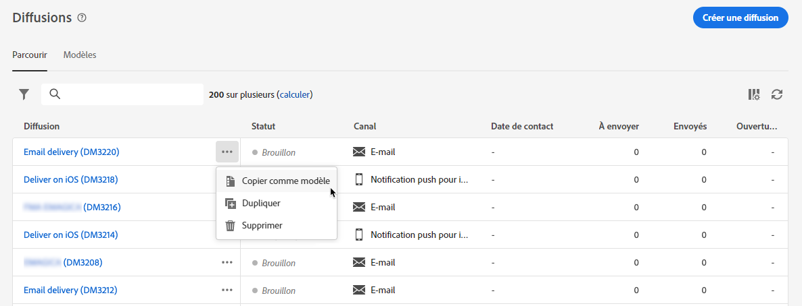

# Utiliser des modèles de diffusion {#work-with-delivery-templates}

>[!CONTEXTUALHELP]
>id="acw_delivery_template_for_campaign"
>title="Modèles de diffusion"
>abstract="Pour améliorer et accélérer le processus de conception, créez des modèles de diffusion pour réutiliser le contenu et les paramètres personnalisés dans vos campagnes. Cette fonctionnalité normalise l’aspect créatif, permettant une exécution et un lancement plus rapides des campagnes."

Pour améliorer et accélérer le processus de conception, créez des modèles de diffusion pour réutiliser le contenu et les paramètres personnalisés dans vos campagnes. Cette fonctionnalité normalise l’aspect créatif, permettant une exécution et un lancement plus rapides des campagnes.

Un modèle inclut les éléments suivants :

* Sélectionnez le **dossier** et le **dossier d’exécution** du modèle. Le dossier correspond à l’emplacement où le modèle de diffusion est enregistré. Le dossier d’exécution est le dossier dans lequel les diffusions créées à partir de ce modèle sont enregistrées.
* [Des typologies](../advanced-settings/delivery-settings.md#typology),
* L’adresse de la personne expéditrice,
* Une [audience](../audience/about-recipients.md), y compris des [populations témoins](../audience/control-group.md),
* Du [contenu](../email/edit-content.md) personnalisé,
* Des [champs personnalisés](../personalization/personalize.md) et du [contenu conditionnel](../personalization/conditions.md),
* Des liens vers la [page miroir](../email/mirror-page.md) et des [liens](../email/message-tracking.md) de désinscription,
* D’autres propriétés de diffusion, telles que la validité des ressources et les paramètres de reprise ou de mise en quarantaine.

>[!NOTE]
>
>Les modèles de diffusion diffèrent des [modèles de contenu](../email/create-email-templates.md), qui permettent de réutiliser uniquement le contenu de vos e-mails et de commencer à créer du contenu avec l’un des exemples de modèles d’e-mail prêts à l’emploi.

## Accéder aux modèles de diffusion et les gérer {#access-manage-templates}

>[!CONTEXTUALHELP]
>id="acw_delivery_templates"
>title="Utiliser des modèles de diffusion"
>abstract="Utilisez les modèles de diffusion pour créer et enregistrer des paramètres de diffusion en vue d’une utilisation ultérieure dans vos campagnes. Créez des modèles de diffusion à partir de zéro, dupliquez un modèle existant ou convertissez une diffusion en modèle."

Pour accéder à la liste des modèles de contenu, sélectionnez **[!UICONTROL Gestion des campagnes]** > **[!UICONTROL Diffusions]** dans le menu de gauche, puis accédez à l’onglet **Modèles**.

{zoomable="yes"}

Tous les modèles créés dans l’environnement actuel s’affichent.

Vous pouvez filtrer les modèles de contenu par canal et par dossier. Vous pouvez également définir des filtres avancés en créant une règle à l’aide d’attributs de diffusion. [En savoir plus sur le concepteur de requête](../audience/../query/query-modeler-overview.md)

{zoomable="yes"}

Pour modifier un modèle, cliquez sur l’élément souhaité dans la liste. De là :

* Modifiez son contenu, ses propriétés, son audience et toutes les offres qui y sont associées.
* Testez votre modèle. [En savoir plus](#test-template)

{zoomable="yes"}

Pour supprimer ou [dupliquer](#copy-an-existing-template) un modèle, sélectionnez l’action correspondante dans le menu **[!UICONTROL Plus d’actions]**, depuis la liste **[!UICONTROL Modèles]** ou depuis un écran de modification de modèle.

{zoomable="yes"}

>[!NOTE]
>
>Lorsqu’un modèle est modifié ou supprimé, les diffusions créées à l’aide de ce modèle ne sont pas affectées.

## Créer un modèle de diffusion {#create-a-delivery-template}

Pour créer un modèle de diffusion, vous pouvez :

* Dupliquer un modèle existant - [En savoir plus](#copy-an-existing-template)
* Convertir une diffusion existante en modèle - [En savoir plus](#convert-an-existing-delivery)
* Créer entièrement un modèle de diffusion - [En savoir plus](#create-a-new-template)

### Dupliquer un modèle de diffusion existant {#copy-an-existing-template}

Campaign inclut des modèles intégrés pour chaque canal : e-mail, notification push et SMS. Le moyen le plus simple de créer un modèle de diffusion consiste à dupliquer et à personnaliser un modèle intégré.

>[!NOTE]
>
>Vous pouvez également dupliquer n’importe quel modèle personnalisé.

Pour dupliquer un modèle de diffusion, procédez comme suit :

1. Accédez à l’onglet **Modèles** depuis le menu **Diffusions** à gauche. [En savoir plus](#access-manage-templates)
1. Cliquez sur le bouton **[!UICONTROL Autres actions]** à droite du nom du modèle souhaité, puis sélectionnez **[!UICONTROL Dupliquer]**.

   Vous pouvez également choisir un modèle dans la liste et sélectionner cette option sur l’écran de modification du modèle.

1. Confirmez la duplication.

   {zoomable="yes"}

1. Le nouveau tableau de bord de modèle s’ouvre dans l’écran central. Modifiez les paramètres du modèle selon vos besoins.

   {zoomable="yes"}

1. Cliquez sur le bouton **[!UICONTROL Vérifier]** pour enregistrer et vérifier votre modèle. Vous pouvez toujours modifier tous ses paramètres, le supprimer et le dupliquer.

   {zoomable="yes"}

1. Testez le rendu du modèle si nécessaire. [En savoir plus](#test-template)

Le nouveau modèle est ajouté à la liste des [**modèles**](#access-manage-templates). Vous pouvez maintenant le sélectionner lors de la création d’une diffusion.

### Convertir une diffusion en modèle {#convert-an-existing-delivery}

Une diffusion peut être convertie en modèle pour de futures actions de diffusion répétées.

Pour enregistrer une diffusion comme modèle, procédez comme suit :

1. Accédez au menu **[!UICONTROL Gestion de campagne]** > **[!UICONTROL Diffusions]**.
1. Dans l’onglet **[!UICONTROL Parcourir]**, cliquez sur le bouton **[!UICONTROL Plus d’actions]** à droite du nom de la diffusion souhaitée, puis sélectionnez **[!UICONTROL Copier comme modèle]**.

   {zoomable="yes"}

   Vous pouvez également choisir un modèle dans la liste et sélectionner cette option sur l’écran de modification du modèle.

1. Confirmez la duplication.

1. Le nouveau tableau de bord de modèle s’ouvre dans l’écran central. Modifiez les paramètres du modèle selon vos besoins.

1. Cliquez sur le bouton **[!UICONTROL Vérifier]** pour enregistrer et vérifier votre modèle. Vous pouvez toujours modifier tous ses paramètres, le supprimer et le dupliquer.

1. Testez le rendu du modèle si nécessaire. [En savoir plus](#test-template)

Le nouveau modèle est ajouté à la liste des [**modèles**](#access-manage-templates). Vous pouvez maintenant le sélectionner lors de la création d’une diffusion.

### Créer un modèle de diffusion {#create-a-new-template}

>[!NOTE]
>
>Afin d’éviter toute erreur de configuration, Adobe recommande de [dupliquer un modèle intégré](#copy-an-existing-template) et de personnaliser ses propriétés plutôt que de créer un modèle.

Pour créer un modèle de diffusion à partir de zéro, procédez comme suit :

1. Accédez à l’onglet **Modèles** depuis le menu **Diffusions** à gauche. [En savoir plus](#access-manage-templates)
1. Cliquez sur le bouton **[!UICONTROL Créer un modèle]**.

   {zoomable="yes"}

1. Sélectionnez le canal à utiliser pour votre modèle.
1. Le modèle de diffusion intégré pour ce canal est utilisé par défaut pour vous aider à créer votre propre modèle. Cliquez sur le bouton dédié situé à droite du canal sélectionné pour sélectionner un autre modèle si nécessaire.

   {zoomable="yes"}

1. Cliquez de nouveau sur le bouton **[!UICONTROL Créer un modèle]**.

1. Définissez les propriétés du modèle, l’[audience](../audience/add-audience.md) et le contenu en fonction du canal sélectionné.

   >[!NOTE]
   >
   >En savoir plus sur les canaux de diffusion et sur la conception de contenus respectifs dans les sections ci-dessous :
   >
   > * [Canal e-mail](../email/create-email.md)
   > * [Canal des notifications push](../push/gs-push.md)
   > * [Canal SMS](../sms/create-sms.md)

1. De plus, pour les modèles d’e-mails, des paramètres avancés, tels que les règles de typologie et les mappings de ciblage, sont accessibles via le bouton **[!UICONTROL Paramètres]** situé en haut à droite de l’écran. [En savoir plus](../advanced-settings/delivery-settings.md)

1. Cliquez sur le bouton **[!UICONTROL Vérifier]** pour enregistrer et vérifier votre modèle. Vous pouvez toujours modifier tous ses paramètres, le supprimer et le dupliquer.

1. Testez le rendu du modèle si nécessaire. [En savoir plus](#test-template)

Le nouveau modèle est ajouté à la liste des [**modèles**](#access-manage-templates). Vous pouvez maintenant le sélectionner lors de la création d’une diffusion.

## Tester un modèle de diffusion {#test-template}

Vous pouvez tester le rendu de n’importe quel modèle de diffusion, qu’il soit créé à partir de zéro ou à partir d’un contenu existant. Pour ce faire, procédez comme suit :

1. Accédez à l’onglet **Modèles** à l’aide du menu **[!UICONTROL Gestion de campagne]** > **[!UICONTROL Diffusions]** et sélectionnez n’importe quel modèle. [En savoir plus](#access-manage-templates)

1. Cliquez sur le bouton **[!UICONTROL Simuler le contenu]** en haut à droite de l’écran.

   {zoomable="yes"}

1. Sélectionnez un ou plusieurs profils de test pour vérifier le rendu de votre e-mail. Vous pouvez également sélectionner des profils réels dans votre base de données. [En savoir plus sur les profils de test](../audience/test-profiles.md)

1. Basculez entre les différents profils pour obtenir une représentation personnalisée du message selon le profil sélectionné. Vous pouvez également ajuster le niveau de zoom et choisir la vue pour ordinateur ou mobile.

[En savoir plus sur la prévisualisation de contenu](../preview-test/preview-content.md)

   {zoomable="yes"}

1. Fermez la fenêtre pour revenir à l’écran de modification du modèle.

>[!NOTE]
>
>Vous ne pouvez pas utiliser le rendu des e-mails ni envoyer de BAT dans un modèle de diffusion.