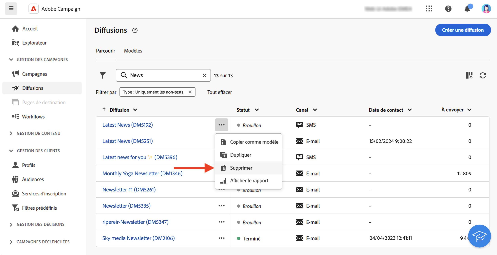
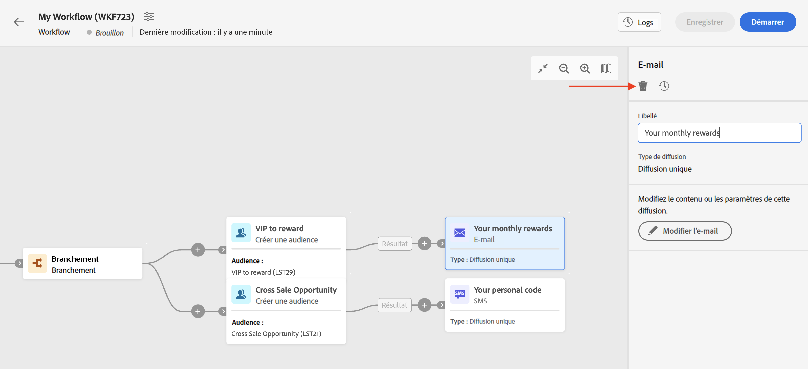

# Accéder aux diffusions {#work-with-deliveries}

>[!CONTEXTUALHELP]
>id="acw_deliveries_list"
>title="Diffusions"
>abstract="Une diffusion est une communication envoyée à une audience sur un canal spécifique : e-mail, SMS ou notification push. Dans cet écran, vous pouvez modifier, dupliquer et supprimer des diffusions existantes. Vous pouvez également afficher des rapports pour les diffusions terminées. Cliquez sur le bouton **Créer une diffusion** pour ajouter une nouvelle diffusion."

## Accéder aux diffusions {#access}

>[!CONTEXTUALHELP]
>id="acw_deliveries_additional_target"
>title="Cible supplémentaire"
>abstract="Ces règles ne peuvent être modifiées que dans la console cliente."

Les diffusions sont accessibles à partir du menu **[!UICONTROL Diffusions]** sur le volet de navigation de gauche. Toutes les diffusions créées à partir de la console cliente ou de l’interface d’utilisation web apparaissent dans cette liste. Dans cet écran, vous pouvez surveiller toutes les diffusions existantes, les dupliquer ou les supprimer, ou en créer de nouvelles.

Pour ouvrir une diffusion, cliquez sur son nom dans la liste. La diffusion s’ouvre, ce qui vous permet d’effectuer différentes actions, comme modifier ses paramètres, vérifier son exécution ou surveiller ses performances à l’aide de rapports dédiés.

>[!NOTE]
>
>Si vous ouvrez une diffusion créée dans la console cliente, la section **[!UICONTROL Cible supplémentaire]** peut être présentée à l’audience. Cela indique que plusieurs cibles ont été configurées pour cette diffusion. Ces paramètres ne peuvent être modifiés que dans la console.
>
>{zoomable="yes"}

## Dupliquer une diffusion {#delivery-duplicate}

Vous pouvez créer une copie d&#39;une diffusion existante, depuis la liste de diffusion ou depuis le tableau de bord de diffusion.

Pour dupliquer une diffusion à partir de la liste des diffusions, procédez comme suit :

1. Cliquez sur le bouton des trois points à droite, en regard du nom de la diffusion à dupliquer.
1. Sélectionnez **[!UICONTROL Dupliquer]**.
1. Confirmez la duplication. Le nouveau tableau de bord des diffusions s’ouvre dans l’écran central.

Pour dupliquer une diffusion depuis son tableau de bord, procédez comme suit :

1. Ouvrez la diffusion et cliquez sur le bouton **[!UICONTROL … Plus]** dans la section supérieure de l’écran.
1. Sélectionnez **[!UICONTROL Dupliquer]**.
1. Confirmez la duplication. La nouvelle diffusion remplace la diffusion actuelle dans l’écran central.

## Supprimer une diffusion {#delivery-delete}

Les diffusions sont supprimées de la liste des diffusions, soit de l’entrée de diffusion principale dans le rail gauche, soit de la liste des diffusions d’une campagne.

Pour supprimer une diffusion à partir de la liste des diffusions, procédez comme suit :

1. Cliquez sur le bouton des trois points à droite, en regard du nom de la diffusion à supprimer.
1. Sélectionnez **[!UICONTROL Supprimer]**.
1. Confirmez la suppression.

Toutes les diffusions sont disponibles dans ces listes, mais les diffusions créées dans un workflow ne peuvent pas être supprimées à cet endroit. Pour supprimer une diffusion créée dans le cadre d’un workflow, supprimez l’activité de diffusion du workflow.

Pour supprimer une diffusion d’un workflow, procédez comme suit :

1. Sélectionnez l’activité de diffusion.
1. Cliquez sur l’icône **[!UICONTROL Supprimer]** dans le panneau de droite.
1. Confirmez la suppression. Si la diffusion contient des nœuds enfants, choisissez de les supprimer ou de les conserver.

