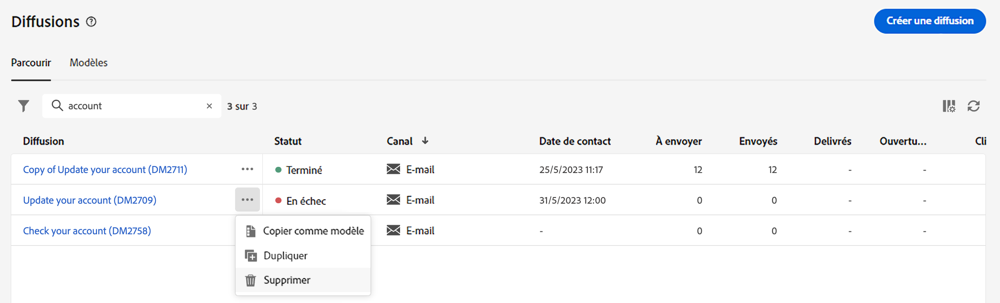
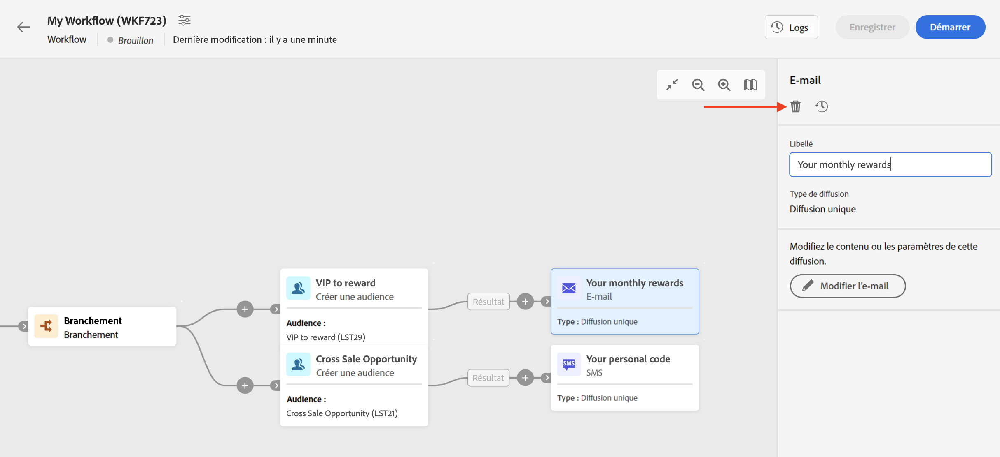

# Prise en main des messages{#gs-messages}

>[!CONTEXTUALHELP]
>id="acw_deliveries_list"
>title="Diffusions"
>abstract="Une diffusion est une communication marketing envoyée à une audience sur un canal spécifique : email, SMS ou notification push. Dans votre liste de diffusions, vous pouvez éditer les diffusions existantes et vérifier leur état, leurs dates de contact et de modification, leurs KPI. Cliquez sur le bouton « Créer une diffusion » pour ajouter une nouvelle diffusion. Sélectionnez une diffusion pour afficher son contenu, sa planification, son audience et ses détails."

Avec Adobe Campaign, vous pouvez réaliser des campagnes cross-canal, y compris sous forme d’e-mails, SMS, notifications push, et mesurer leur efficacité à l’aide de différents rapports dédiés.

Ces messages sont conçus et envoyés par le biais de diffusions, et peuvent être personnalisés pour chaque destinataire. Ces diffusions peuvent être autonomes ou incluses dans le cadre d’une campagne marketing.

Adobe Campaign v8 est fourni avec les canaux de diffusion suivants : e-mail, SMS et applications mobiles.

<table style="table-layout:fixed">
    <tr style="border: 0;">
    <td>
    
    
<a href="../email/create-email.md"><strong>Créer des e-mails</strong>
    

    

    </td>
    <td>
    
    

    <a href="../push/gs-push.md"><strong>Créer des notifications push</strong></a>
    

    

    </td>
    <td>
    
    

    <a href="../sms/create-sms.md"><strong>Créer des SMS</strong></a>
    

    

    </td>
    </tr>
    </table>

## Créer une diffusion {#create-delivery}

Vous pouvez créer des diffusions autonomes à partir du menu de gauche **[!UICONTROL Diffusions]**, ou créer des diffusions dans le cadre d’une campagne marketing, à partir du menu de gauche **[!UICONTROL Campagnes]**.

Parcourez les onglets ci-dessous pour découvrir comment créer une diffusion :

>[!BEGINTABS]

>[!TAB Créer une diffusion autonome]

Pour créer une diffusion autonome, procédez comme suit :

1. Accédez au menu **[!UICONTROL Diffusions]** dans le volet de navigation de gauche, puis cliquez sur le bouton **[!UICONTROL Créer une diffusion]**.

   

1. Sélectionnez un canal de diffusion. Découvrez les canaux de diffusion et comment définir un contenu de diffusion dans les sections suivantes :

   * [Canal e-mail](../email/create-email.md)
   * [Canal des notifications push](../push/gs-push.md)
   * [Canal SMS](../sms/create-sms.md)

1. Définissez l’audience de la diffusion, pour la cible principale et la population témoin. Pour en savoir plus sur les audiences, consultez [cette section](../audience/about-audiences.md).
1. Définissez le contenu du message.
1. (Facultatif) Définissez le planning de diffusion. Si aucun planning n’est défini, les messages sont envoyés immédiatement après avoir cliqué sur le bouton **[!UICONTROL Envoyer]**.
1. Cliquez sur le bouton **[!UICONTROL Vérifier et envoyer]** pour vérifier vos paramètres.
1. Utilisez le bouton  **[!UICONTROL Simuler du contenu]** pour tester votre diffusion et vos paramètres de personnalisation. Pour en savoir plus sur la simulation des messages, consultez [cette section](../preview-test/preview-test.md).
1. Cliquez sur le bouton **[!UICONTROL Préparer]** pour calculer la population cible et générer les messages. L’étape de préparation peut prendre quelques minutes. Une fois la préparation terminée, les messages sont prêts à être envoyés. En cas d’erreur, accédez aux **Journaux** pour vérifier les alertes et les avertissements.
1. Vérifiez les résultats, puis cliquez sur le bouton **[!UICONTROL Envoyer]** pour commencer à envoyer des messages.
1. Une fois les messages envoyés, rendez-vous dans la section **Rapports** pour accéder aux mesures clés. Pour en savoir plus sur les rapports de diffusion, consultez [cette section](../reporting/delivery-reports.md).

>[!TAB Créer une diffusion dans une campagne]

Pour créer une diffusion dans une campagne, procédez comme suit :

1. Créez une campagne ou ouvrez une campagne existante. Découvrez les [campagnes marketing](../campaigns/gs-campaigns.md).
1. Créez un workflow ou ouvrez un workflow existant.
1. Ajoutez et configurez une activité **[!UICONTROL Créer une audience]**, puis cliquez sur le bouton `+`.

   

   L’activité **[!UICONTROL Créer une audience]** est présentée dans [cette section](../workflows/activities/build-audience.md).

1. Sélectionnez une activité de diffusion : **[!UICONTROL e-mail]**, **[!UICONTROL SMS]**, **[!UICONTROL notification push (Android)]** ou **[!UICONTROL notification push (iOS)]**. Découvrez les activités de canal de diffusion dans un workflow et comment définir un contenu de diffusion dans cette [section](../workflows/activities/about-activities.md#channel).
1. Démarrez le workflow et vérifiez les logs.

Vous pouvez également ajouter des diffusions dans une campagne sans créer de workflow. Pour ce faire, accédez à l’onglet **[!UICONTROL Diffusions]** de votre campagne, puis cliquez sur le bouton **[!UICONTROL Créer une diffusion]**.

Les étapes de configuration sont similaires à celles des diffusions autonomes.

Pour plus d’informations sur la configuration d’une campagne et la gestion des diffusions appartenant à une campagne, reportez-vous à [cette section](../campaigns/gs-campaigns.md).

>[!ENDTABS]

## Ajouter de la personnalisation{#personalization}

Les messages diffusés par Adobe Campaign peuvent être personnalisés de différentes façons. [En savoir plus sur les fonctionnalités de personnalisation](../personalization/gs-personalization.md).

Utilisez Campaign pour créer du contenu dynamique et envoyer des messages personnalisés. Vous pouvez cumuler les fonctionnalités de personnalisation afin d’améliorer vos messages et créer une expérience utilisateur personnalisée.

Vous pouvez personnaliser le contenu du message en procédant comme suit :

* Insérer des **champs de personnalisation** dynamiques.

  Les champs de personnalisation sont utilisés pour la personnalisation de premier niveau de vos messages. Vous pouvez sélectionner n’importe quel champ disponible dans la base de données de l’éditeur de personnalisation. Pour une diffusion, vous pouvez sélectionner n’importe quel champ associé au ou à la destinataire, au message ou à la diffusion. Ces attributs de personnalisation peuvent être insérés dans l’objet ou dans le corps de vos messages. [En savoir plus](../personalization/personalize.md)

* Insérer des **blocs de contenu** prédéfinis

  Campaign est fourni avec un ensemble de blocs de personnalisation qui contiennent un rendu spécifique que vous pouvez insérer dans vos diffusions. Vous pouvez par exemple ajouter un logo, un message de salutation ou un lien vers la page miroir du message. Les blocs de contenu sont disponibles à partir d’une entrée dédiée dans l’éditeur de personnalisation. [En savoir plus](../personalization/personalize.md#ootb-content-blocks)

* Créer du **contenu conditionnel**

  Configurez du contenu conditionnel pour ajouter une personnalisation dynamique basée notamment sur le profil de la personne destinataire. Lorsqu’une condition est rencontrée, des blocs de texte et/ou des images sont alors insérés. [En savoir plus](../personalization/conditions.md)

* Ajouter des **offres personnalisées**

  Insérez des offres personnalisées dans le contenu de votre message, en fonction de l’emplacement des destinataires, de la météo actuelle ou de la dernière commande.

## Prévisualiser et tester vos diffusions

Une fois le contenu de votre message défini, vous pouvez le prévisualiser afin de contrôler le rendu de vos messages, et vérifier les paramètres de personnalisation avec des profils de test. [En savoir plus](../preview-test/preview-test.md)

## Surveillance et logs de tracking{#gs-tracking-logs}

La surveillance de vos diffusions après leur envoi est une étape clé pour vous assurer que vos campagnes marketing sont efficaces et atteignent votre clientèle.

Vous pouvez ainsi surveiller une diffusion après son envoi et comprendre la gestion des diffusions en échec et des quarantaines.

En savoir plus sur les fonctionnalités de surveillance et de tracking dans [cette section](../reporting/gs-reports.md).

## Dupliquer une diffusion {#delivery-duplicate}

Vous pouvez créer une copie d&#39;une diffusion existante, depuis la liste de diffusion ou depuis le tableau de bord de diffusion.

Pour dupliquer une diffusion à partir de la liste des diffusions, procédez comme suit :

1. Cliquez sur le bouton des trois points à droite, en regard du nom de la diffusion à dupliquer.
1. Sélectionnez **[!UICONTROL Dupliquer]**.
1. Confirmer la duplication : le nouveau tableau de bord des diffusions s’ouvre dans l’écran central.

Pour dupliquer une diffusion depuis son tableau de bord, procédez comme suit :

1. Ouvrez la diffusion et cliquez sur le bouton **[!UICONTROL … Plus]** dans la section supérieure de l’écran.
1. Sélectionnez **[!UICONTROL Dupliquer]**.
1. Confirmer la duplication : la nouvelle diffusion remplace la diffusion actuelle dans l’écran central.

## Supprimer une diffusion {#delivery-delete}

Les diffusions sont supprimées de la liste des diffusions, soit de l’entrée de diffusion principale dans le rail gauche, soit de la liste des diffusions d’une campagne.

Pour supprimer une diffusion à partir de la liste des diffusions, procédez comme suit :

1. Cliquez sur le bouton des trois points à droite, en regard du nom de la diffusion à dupliquer.
1. Sélectionnez **[!UICONTROL Supprimer]**.
1. Confirmez la suppression.

Toutes les diffusions sont disponibles dans ces listes, mais les diffusions créées dans un workflow ne peuvent pas être supprimées à cet endroit. Pour supprimer une diffusion créée dans le cadre d’un workflow, vous devez supprimer l’activité de diffusion du workflow.

Pour supprimer une diffusion d’un workflow, procédez comme suit :

1. Sélectionnez l’activité de diffusion.
1. Cliquez sur l’icône **[!UICONTROL Supprimer]** dans le panneau de droite.
1. Confirmez la suppression. Si la diffusion contient des nœuds enfants, vous pouvez choisir de les supprimer ou de les conserver.

