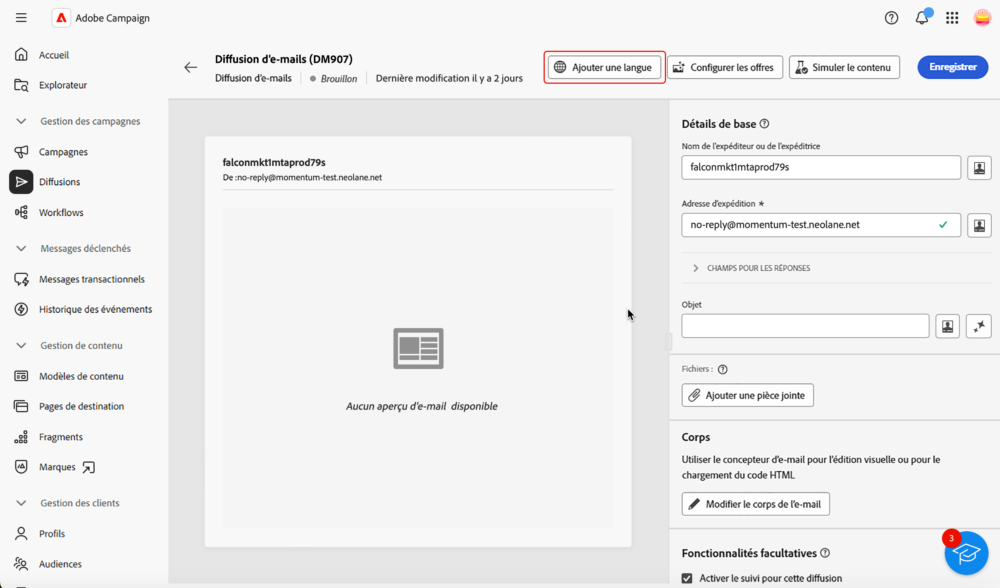
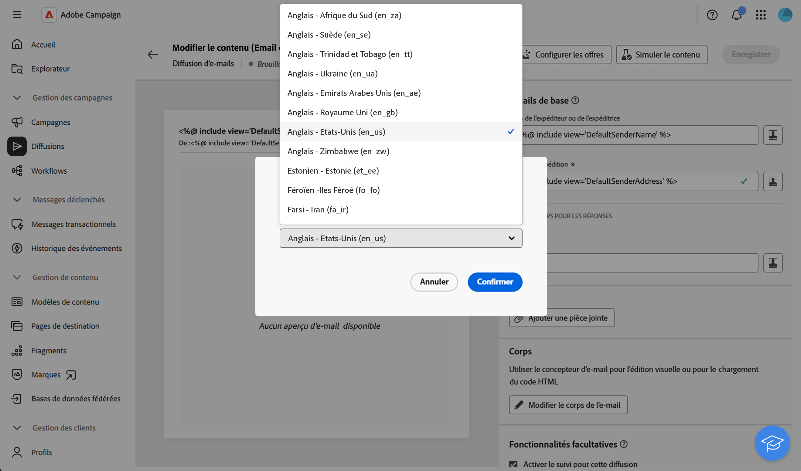
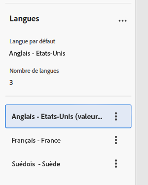
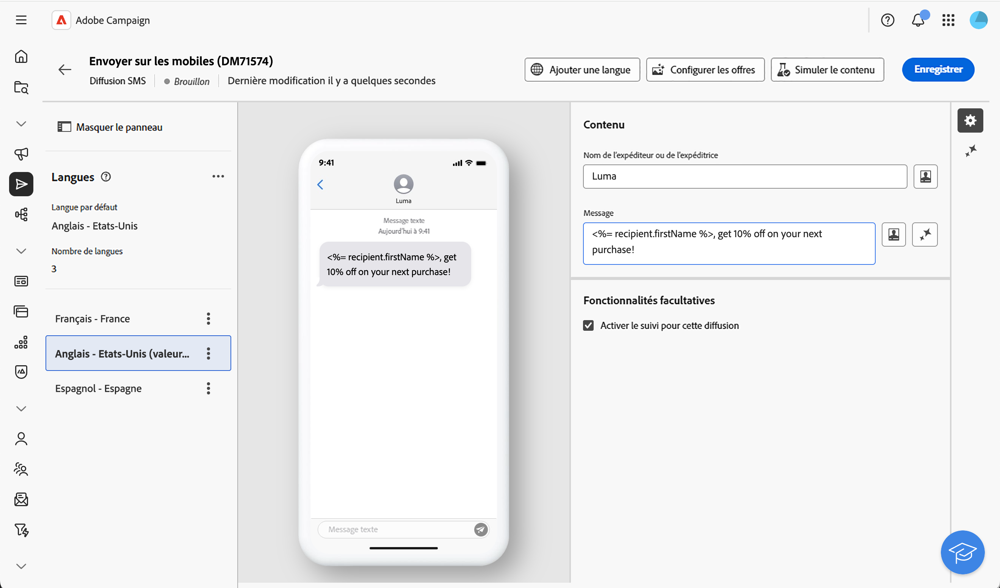
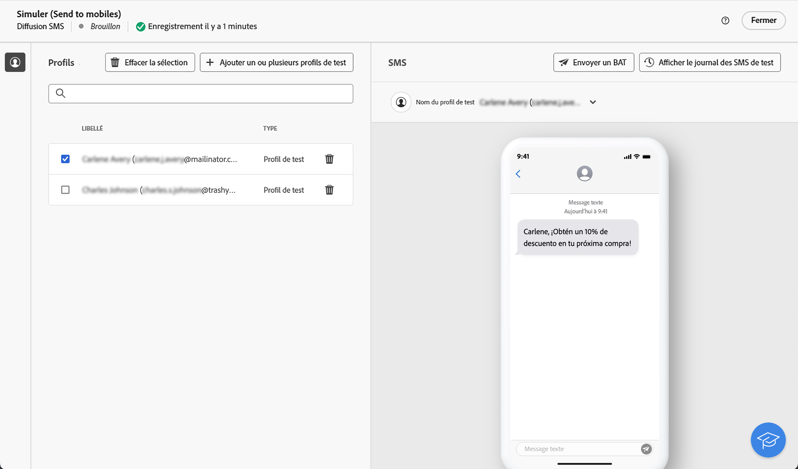
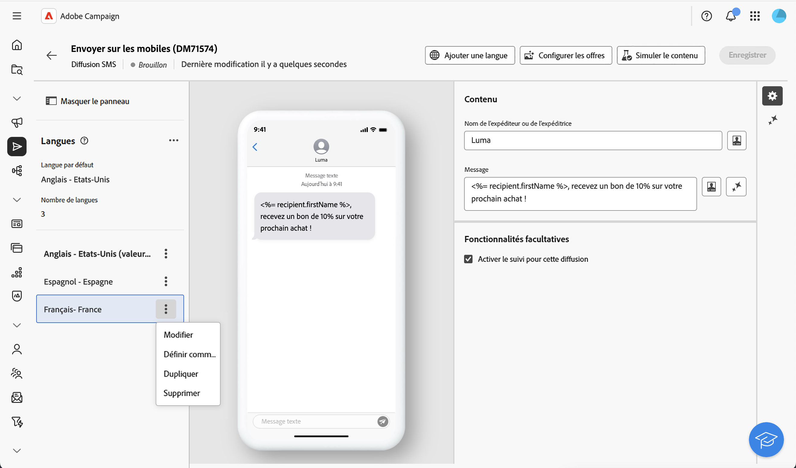

# Configurer une diffusion multilingue {#multilingual-delivery}

>[!CONTEXTUALHELP]
>id="acw_deliveries_email_multilingual"
>title="Ajouter des langues"
>abstract="Dans cet onglet, vous trouverez une liste des langues dans lesquelles la diffusion doit être envoyée. Vous pouvez ajouter d’autres langues en cliquant sur le bouton Ajouter une langue, ou en dupliquant une autre langue via cet onglet."

>[!CONTEXTUALHELP]
>id="acw_multilingual_file_upload"
>title="Importer les variantes linguistiques"
>abstract="Utilisez cette boîte de dialogue pour ajouter une variante linguistique en important un fichier CSV. Le fichier renseigne automatiquement tous les champs disponibles pour la langue sélectionnée. Vous pouvez faire glisser et déposer votre fichier ou le choisir sur votre ordinateur avant de confirmer."

Dans l’interface d’utilisation de Campaign Web, vous pouvez configurer vos diffusions en tant que diffusions multilingues, ce qui vous permet d’envoyer des messages en fonction de la langue préférée d’un profil. Lorsqu’aucune préférence n’est définie, le message est envoyé dans la langue par défaut.

Dans une diffusion multilingue, la gestion des langues repose sur des variantes. Chaque variante représente une langue unique. Lors de la création de la diffusion, vous pouvez ajouter plusieurs variantes linguistiques afin de correspondre au nombre de langues requises dans votre message. Vous pouvez également modifier la langue par défaut à tout moment après l’ajout de ces variantes.

La fonctionnalité multilingue est actuellement disponible pour les e-mails, les notifications push, les messages transactionnels et les SMS.

Pour configurer des diffusions multilingues, procédez comme suit :

1. Ajoutez une variante linguistique. [En savoir plus](#add-variant)
1. Définissez le contenu pour chaque variante. [En savoir plus](#define-content)
1. Gérez les variantes linguistiques. [En savoir plus](#manage-variant)

## Ajouter une variante linguistique{#add-variant}

Pour créer des variantes linguistiques, procédez comme suit :

1. À partir du tableau de bord de la diffusion, cliquez sur l’icône en forme de crayon pour accéder à l’écran d’édition du contenu de la diffusion, puis cliquez sur **[!UICONTROL Ajouter une langue]**.

   >[!IMPORTANT]
   >
   >Le bouton **[!UICONTROL Ajouter une langue]** n’est disponible que si la dimension cible contient le schéma **Langue**. Pour en savoir plus sur les schémas et les dimensions cibles, consultez la [documentation détaillée](../audience/targeting-dimensions.md).

   {zoomable="yes"}

1. Dans le menu déroulant **Ajouter une langue**, sélectionnez la langue à ajouter, puis confirmez. Pour les notifications push, vous pouvez également [charger un fichier CSV](#csv-upload) pour importer toutes les variantes de langue en même temps.

   La première langue que vous ajoutez est automatiquement définie comme langue par défaut et le contenu existant devient la version par défaut. Lorsque d’autres langues sont ajoutées, leur contenu est copié à partir de la langue par défaut.

   {zoomable="yes"}

   >[!NOTE]
   >
   >Les langues disponibles dans cette liste dépendent des valeurs définies par l’attribut **Langue** (telles que : système, utilisateur ou utilisatrice, dbEnum, etc.). En savoir plus sur la gestion des énumérations dans [cette section](../administration/enumerations.md).

1. Répétez ce processus pour ajouter d’autres langues. Le panneau **[!UICONTROL Langue]** situé à gauche affiche la liste des langues que vous avez choisies, le nombre de langues, ainsi que la langue par défaut.

   Par exemple, si vous avez choisi l’anglais, le français et le suédois, vous pouvez voir ces 3 langues comme illustré ci-dessous :

   {zoomable="yes"}

   Pour découvrir comment gérer les variantes linguistiques, consultez [cette section](#manage-variant).

## Définir le contenu pour chaque variante{#define-content}

Une fois les langues configurées, définissez le contenu de la diffusion pour chaque langue.

1. Dans l’écran d’édition du contenu de la diffusion, sélectionnez une langue dans le panneau **[!UICONTROL Langues]** situé à gauche.

   {zoomable="yes"}

1. Définissez le contenu de votre message pour cette langue. En savoir plus dans cette [section](../msg/create-deliveries.md).

1. Répétez ce processus pour chaque langue.

<!--
>[!BEGINTABS]

>[!TAB Email delivery]

1. From the delivery content edition screen, choose a language and click the **[!UICONTROL Edit email body]** button. You can also hover over the email preview and select **[!UICONTROL Open email designer]**.

    {zoomable="yes"}

1. Define the content of your email for this language. [Read more](../email/get-started-email-designer.md#start-authoring)

1. Repeat this operation for each language.

>[!TAB SMS delivery]

1. From the delivery content edition screen, choose a language.

1. Edit the content of the SMS message for this language. [Read more](../sms/create-sms.md)

    {zoomable="yes"}

1. Repeat this operation for each language.

>[!ENDTABS]

-->

Pour prévisualiser la diffusion, cliquez sur le bouton **[!UICONTROL Simuler le contenu]** et sélectionnez des profils. Vérifiez que le contenu approprié s’affiche pour chaque profil.

{zoomable="yes"}

## Gérer les variantes linguistiques{#manage-variant}

Dans le panneau de gauche, toutes les informations sur les variantes linguistiques s’affichent. Pour supprimer toutes les langues, cliquez sur le bouton Développer, puis sur **[!UICONTROL Supprimer toutes les variantes]**.

{zoomable="yes"}

Dans la liste des variantes linguistiques, vous pouvez effectuer les actions suivantes :

* **Modifier** : modifiez la langue tout en conservant le contenu associé.
* **Définir comme langue par défaut** : définissez la langue comme langue par défaut. Lorsqu’un profil ne possède aucune langue définie, le message est envoyé dans la langue par défaut.
* **Dupliquer** : dupliquez le contenu défini pour cette langue et choisissez une autre variante.
* **Supprimer** : supprimez la variante et son contenu associé.

{zoomable="yes"}

## Importer des variantes de langue à partir d’un fichier CSV (notifications push) {#csv-upload}

Pour les notifications push, vous pouvez rapidement remplir toutes les variantes de langue en chargeant un fichier CSV contenant votre contenu multilingue. Cette fonctionnalité simplifie la création de campagnes multilingues en vous permettant de préparer du contenu hors ligne et de l’importer en bloc.

* **Efficacité** : ajoutez plusieurs langues et leur contenu en une seule opération
* **Cohérence** : assurer une messagerie uniforme dans toutes les variantes linguistiques
* **Collaboration** : permettez aux équipes de contenu de préparer des traductions dans des outils de feuille de calcul familiers
* **Gestion en masse** : gérez et mettez facilement à jour un grand nombre de variantes linguistiques

### Conditions préalables {#csv-best-practices}

Suivez ces bonnes pratiques pour garantir la réussite de l’importation d’un fichier CSV :

* **Utiliser la structure exacte des colonnes** : les 14 colonnes doivent toutes être présentes dans votre fichier CSV, même si vous en laissez certaines vides. Les colonnes manquantes entraîneront l’échec de l’importation. Vous pouvez utiliser un ordre différent, mais toutes les colonnes doivent être présentes.
* **Faire correspondre exactement les noms des colonnes** : les noms des colonnes sont sensibles à la casse. Utiliser `title` non `Title`, `badge` non `Bbadge`, `locale` non `Locale`.
* **Utiliser des codes de paramètres régionaux en minuscules** : mettez en forme les codes de paramètres régionaux en tant que `en_us`, `fr_fr` ou `de_de` (en minuscules avec un trait de soulignement), et non en tant que `en_US` ou `en-us`.
* **Remplir les colonnes obligatoires** : les colonnes `locale` et `language` doivent contenir des valeurs pour chaque ligne. Les valeurs vides entraînent l’échec de l’importation.
* **Conserver les paramètres régionaux uniques** : chaque code de paramètre régional ne doit apparaître qu’une seule fois dans votre fichier CSV. Les paramètres régionaux en double seront rejetés.
* **Enregistrer au format UTF-8** : enregistrez toujours votre fichier CSV avec le codage UTF-8 pour prendre correctement en charge les caractères internationaux.
* **Contenu contenant des virgules entre guillemets** : si votre titre ou le corps de votre message contient des virgules, placez l’ensemble du champ entre guillemets doubles : `"Hello, welcome!"`.
* **Utiliser correctement les valeurs numériques** : pour les colonnes d’indicateur (isContentAvailable, isMutableContent, silentPush), utilisez `1` pour true, `0` pour false ou laissez vide pour la valeur par défaut.
* **Valider le format JSON** : si vous utilisez la colonne customFields, assurez-vous que votre fichier JSON est correctement formaté : `{"key":"value"}` avec les guillemets et les crochets corrects.
* **Tester d’abord avec un minimum de données** : commencez par un simple fichier CSV en 2 ou 3 langues pour vérifier votre format avant de créer des fichiers volumineux.

>[!NOTE]
>
>La structure des colonnes est présentée dans cette [section](#csv-columns).

### Importer le fichier CSV {#csv-steps}

Pour importer des variantes linguistiques à partir d’un fichier CSV, procédez comme suit :

1. Dans l’éditeur de contenu de diffusion, cliquez sur **[!UICONTROL Ajouter une langue]**.

   {zoomable="yes"}

1. Sélectionnez votre fichier CSV en le faisant glisser et en le déposant dans la zone de chargement, ou cliquez pour parcourir votre ordinateur.

   Le système valide le format et le contenu du fichier. Si la validation échoue, des messages d’erreur indiquent quelles colonnes ou données sont incorrectes. Corrigez les problèmes dans votre fichier CSV et effectuez un nouveau chargement. Consultez cette [section](#csv-troubleshooting).

   {zoomable="yes"}

1. Vérifiez le contenu importé dans le panneau des variantes de langue pour vous assurer que toutes les traductions ont été chargées correctement.

   {zoomable="yes"}

### Structure des colonnes {#csv-columns}

Voici la structure de colonne appropriée à utiliser :

>[!NOTE]
>
>Vous pouvez utiliser un ordre différent, mais toutes les colonnes doivent être présentes. Pour connaître les bonnes pratiques, consultez cette [section](#csv-best-practices).

1. **title** : titre de la notification (obligatoire).
1. **messageBody** : corps du message de notification (obligatoire)
1. **sound** : nom du fichier son (par exemple, `default`, `custom_sound.mp3`) - laissez vide par défaut
1. **badge** : numéro de badge à afficher sur l’icône de l’application (iOS) - utilisez uniquement des chiffres
1. **depplinkURI** : URL de lien profond à ouvrir lorsque l’utilisateur appuie sur la notification - laisser vide si ce champ n’est pas utilisé
1. **category** : identifiant de catégorie de notification pour les actions personnalisées (iOS). Laissez vide si vous ne l’utilisez pas.
1. **iosMediaAttachmentURL** : URL de la pièce jointe du média pour les notifications iOS. Laissez vide si vous ne l’utilisez pas.
1. **androidMediaAttachmentURL** : URL de la pièce jointe du média pour les notifications Android. Laissez vide si vous ne l’utilisez pas.
1. **isContentAvailable** : indicateur Contenu disponible (iOS) - utilisez `1` pour true, `0` pour false, laissez vide pour default (0)
1. **isMutableContent** : indicateur de contenu modifiable (iOS) : utilisez `1` pour true, `0` pour false, laissez vide pour default (0).
1. **customFields** : données personnalisées au format JSON (`{"key1":"value1","key2":"value2"}`, par exemple) ; laisser vide si ce champ n’est pas utilisé.
1. **locale** : code de langue (obligatoire) ; par exemple, `en_us`, `fr_fr`, `de_de` ; **obligatoire, doit être unique par ligne**
1. **language** : nom de la langue (obligatoire) - par exemple `English-United States`, `French-France` - **obligatoire**
1. **silentPush** : indicateur Notification push silencieuse - utilisez `1` pour une notification push silencieuse, `0` pour une notification standard, laissez vide pour la valeur par défaut (0)

### Exemple de fichier CSV {#csv-examples}

Voici un exemple de base avec les champs obligatoires :

```csv
title,messageBody,sound,badge,deeplinkURI,category,iosMediaAttachmentURL,androidMediaAttachmentURL,isContentAvailable,isMutableContent,customFields,locale,language,silentPush
Welcome!,Thank you for joining us,,,,,,,,,, en_us,English-United States,0
Bienvenue !,Merci de nous avoir rejoint,,,,,,,,,,fr_fr,French-France,0
Willkommen!,Vielen Dank für Ihre Anmeldung,,,,,,,,,, de_de,German-Germany,0
¡Bienvenido!,Gracias por unirte a nosotros,,,,,,,,,, es_es,Spanish-Spain,0
```

Voici un exemple avec des champs facultatifs :

```csv
title,messageBody,sound,badge,deeplinkURI,category,iosMediaAttachmentURL,androidMediaAttachmentURL,isContentAvailable,isMutableContent,customFields,locale,language,silentPush
Welcome!,Thank you for joining us,default,1,,,https://example.com/welcome-en.jpg,https://example.com/welcome-en.jpg,,,, en_us,English-United States,0
Bienvenue !,Merci de nous avoir rejoint,default,1,,,https://example.com/welcome-fr.jpg,https://example.com/welcome-fr.jpg,,,, fr_fr,French-France,0
Willkommen!,Vielen Dank für Ihre Anmeldung,default,1,,,https://example.com/welcome-de.jpg,https://example.com/welcome-de.jpg,,,, de_de,German-Germany,0
¡Bienvenido!,Gracias por unirte a nosotros,default,1,,,https://example.com/welcome-es.jpg,https://example.com/welcome-es.jpg,,,, es_es,Spanish-Spain,0
```

Voici un exemple avec des champs personnalisés

```csv
title,messageBody,sound,badge,deeplinkURI,category,iosMediaAttachmentURL,androidMediaAttachmentURL,isContentAvailable,isMutableContent,customFields,locale,language,silentPush
New Collection,Discover our latest products,default,1,,,,,,,"{"campaign":"summer2025","segment":"premium"}",en_us,English-United States,0
Nouvelle Collection,Découvrez nos derniers produits,default,1,,,,,,,"{"campaign":"summer2025","segment":"premium"}",fr_fr,French-France,0
```

>[!NOTE]
>
>Pour les notifications push enrichies avec des carrousels ou des boutons d’action, Campaign utilise une méthode de configuration différente de celle de l’importation CSV. Configurez le contenu push enrichi directement dans l’éditeur de diffusion après l’importation du contenu multilingue de base.

### Personalization dans les fichiers CSV {#csv-personalization}

Pour utiliser des champs de personnalisation dans votre contenu CSV, vous devez utiliser les balises `<span>` :

```csv
title,messageBody,sound,badge,deeplinkURI,category,iosMediaAttachmentURL,androidMediaAttachmentURL,isContentAvailable,isMutableContent,customFields,locale,language,silentPush
"Hello <span class=""nl-dce-field nl-dce-done"" data-nl-expr=""recipient.firstName"">recipient.firstName</span>","Your order has shipped!",,,,,,,,,,en_us,English-United States,0
"Bonjour <span class=""nl-dce-field nl-dce-done"" data-nl-expr=""recipient.firstName"">recipient.firstName</span>","Votre commande a été expédiée !",,,,,,,,,,fr_fr,French-France,0
```

Au cours de la diffusion, Campaign remplace ces espaces réservés par les données réelles des destinataires.

### Résolution des problèmes {#csv-troubleshooting}

| Erreur | Cause | Solution |
|-------|-------|----------|
| Colonnes obligatoires manquantes | Le fichier CSV ne contient pas les 14 colonnes | Assurez-vous que votre fichier CSV comporte les 14 colonnes dans l’ordre exact indiqué ci-dessus. Utiliser des valeurs vides pour les colonnes inutilisées. |
| Valeurs de langue/paramètres régionaux non valides | les colonnes des paramètres régionaux ou de langue sont vides | Les colonnes des paramètres régionaux et de langue doivent avoir des valeurs pour chaque ligne |
| Dupliquer les paramètres régionaux | Le même code de paramètre régional apparaît plusieurs fois | Chaque valeur de paramètre régional doit être unique. Supprimez les lignes en double. |
| Problèmes d’encodage du fichier | Le fichier CSV utilise un codage incompatible | Enregistrer votre fichier CSV avec le codage UTF-8 |
| Incompatibilité de colonne | Les lignes ont un nombre de colonnes différent de celui de l&#39;en-tête | Vérifiez que toutes les lignes comportent exactement 14 colonnes correspondant à l’en-tête |
| Valeurs numériques non valides | badge, isContentAvailable, isMutableContent ou silentPush contiennent des valeurs non numériques | Utilisez uniquement des nombres : 0 ou 1 pour les indicateurs, ou laissez vide pour la valeur par défaut. |
| JSON incorrect | La colonne customFields contient un fichier JSON non valide. | Assurez-vous que la syntaxe JSON est correcte : `{"key":"value"}` ou laissez vide |
| Incompatibilité de casse du nom de colonne | Les noms des colonnes ne correspondent pas exactement. | Les noms des colonnes sont sensibles à la casse. Utilisez les noms exacts indiqués ci-dessus (par exemple, `badge`, et non `Badge` ou `BADGE`). |

>Les bonnes pratiques sont répertoriées dans cette [section](#csv-best-practices). La structure des colonnes est présentée dans cette [section](#csv-columns).

