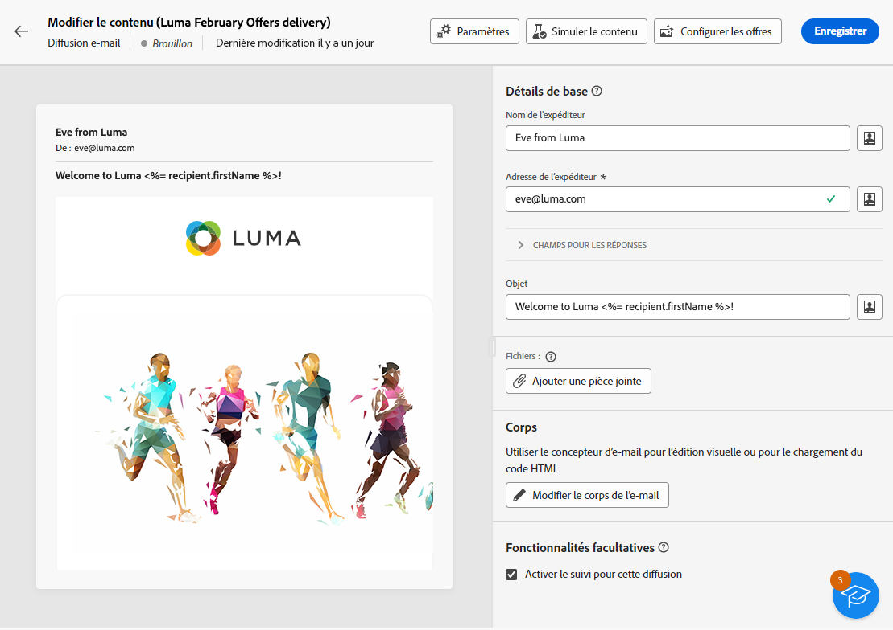
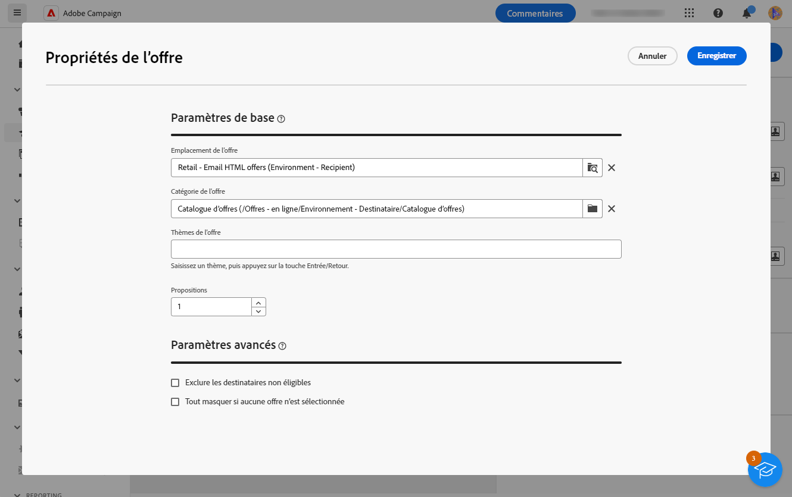
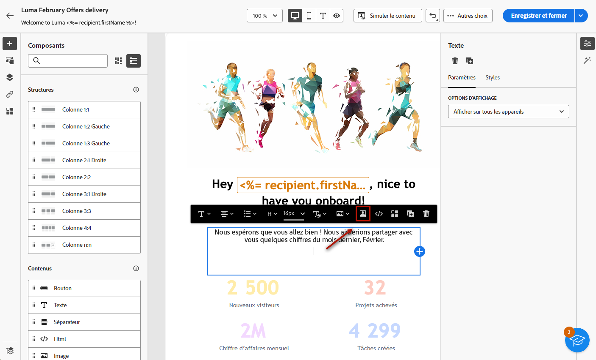
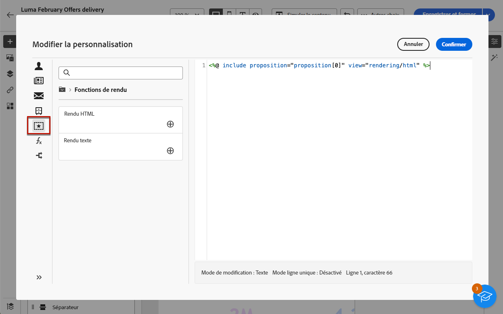

# Ajouter des offres à vos messages {#offers-content}

Vous pouvez ajouter des offres à vos diffusions dans l&#39;interface utilisateur Web d&#39;Adobe Campaign. Ces offres sont disponibles à partir du **Offres** menu de gauche qui permet d&#39;accéder à la liste des offres. Toutes ces offres sont en lecture seule et doivent avoir été créées dans la console cliente Campaign, à l&#39;aide de la fonction **[!UICONTROL Interaction]** module . Pour plus d’informations sur Interaction et sur la gestion d’un catalogue d’offres dans la console, consultez la [documentation de Campaign V8 (console cliente)](https://experienceleague.adobe.com/docs/campaign/campaign-v8/offers/interaction.html?lang=fr){target="_blank"}.

Pour envoyer des offres avec une diffusion, procédez comme suit :

1. [Configurer les offres à proposer](#configure)
1. [Insérer les offres dans la diffusion](#insert)

## Configurer les offres à proposer {#configure}

>[!CONTEXTUALHELP]
>id="acw_deliveries_email_offers_settings"
>title="Définir les paramètres d’offres"
>abstract="Configurez les offres qui doivent être proposées aux personnes destinataires en définissant un emplacement, éventuellement une catégorie et un thème, et indiquez le nombre d’offres à insérer dans la diffusion."

>[!CONTEXTUALHELP]
>id="acw_deliveries_email_offers_advanced_settings"
>title="Définir les paramètres avancés des offres"
>abstract="Vous pouvez activer l’exclusion des profils destinataires pour lesquels les offres éligibles ne sont pas suffisantes, puis choisir le mode de traitement du message au cas où l’une des propositions n’existerait pas."

Adobe Campaign vous permet de répondre en temps réel lors d’une interaction avec un contact donné en lui proposant une ou plusieurs offres adaptées. Il peut s’agir par exemple de messages de communication simples, d’offres spéciales sur un ou plusieurs produits ou d’un service.

Pour sélectionner les offres à ajouter à votre diffusion, procédez comme suit.

1. Cliquez sur le bouton **[!UICONTROL Configuration des offres]** à partir de l‘écran d’édition du contenu de la diffusion.

   {zoomable=&quot;yes&quot;}

1. Configurez les offres qui doivent être proposées aux destinataires.

   Sélectionnez d’abord l’**[!UICONTROL emplacement]** correspondant à votre environnement d’offres. Découvrez comment créer un emplacement dans la [Documentation de Campaign v8 (console cliente)](https://experienceleague.adobe.com/docs/campaign/campaign-v8/offers/interaction-settings/interaction-offer-spaces.html?lang=fr){target="_blank"}.

   {zoomable=&quot;yes&quot;}

1. Pour affiner le choix des offres du moteur, sélectionnez une **[!UICONTROL Catégorie d’offres]** spécifique dans laquelle les offres sont triées.

   Lors de la sélection d’un dossier, tous les sous-dossiers sont automatiquement inclus et ne peuvent pas être supprimés. Notez que l’interface de [!DNL Campaign] n’adopte pas ce comportement.

   >[!NOTE]
   >
   >Si vous ne sélectionnez aucune catégorie, toutes les offres contenues dans l’environnement sont prises en compte par le moteur d’offres, sauf si vous sélectionnez un **[!UICONTROL Thème d’offre]**.

1. (facultatif) Saisissez un thème pour filtrer les catégories. Les thèmes sont des mots-clés définis en amont dans les catégories. Ils servent de filtre et permettent ainsi d’affiner le nombre d’offres à présenter en les sélectionnant dans un ensemble de catégories.

1. Utilisez le champ **[!UICONTROL Propositions]** pour indiquer le nombre d’offres à insérer dans la diffusion.

1. Sélectionnez l’option **[!UICONTROL Exclure les personnes destinataires non éligibles]**, si nécessaire.

   Cette option permet d’activer ou de désactiver l’exclusion des personnes destinataires pour lesquelles il n’y a pas assez d’offres éligibles :

   * Si vous activez cette option, les destinataires qui n’ont pas suffisamment de propositions sont exclus de la diffusion.
   * Si vous désactivez cette option, ces destinataires ne sont pas exclus, mais ils ne peuvent pas avoir le nombre de propositions demandé.

1. Si nécessaire, sélectionnez l’option **[!UICONTROL Masquer tout si aucune offre n’est sélectionnée]**.

   Cette option vous permet de choisir le mode de traitement du message au cas où l’une des propositions n’existerait pas.

   * Si vous activez cette option, la représentation de la proposition manquante ne s’affiche pas et aucun contenu n’apparaît dans le message pour cette proposition.
   * Si vous désactivez cette option, le message est annulé lors de l’envoi et les destinataires ne peuvent plus recevoir de messages.

Une fois que vous avez configuré les offres à proposer dans la diffusion, vous pouvez les insérer dans le contenu de la diffusion.

## Insérer des offres dans la diffusion {#insert}

Vous pouvez ajouter des offres à la diffusion à l’aide de l’[Éditeur d’expression](../personalization/gs-personalization.md#access). Elles peuvent être insérées dans l’objet ou dans le corps de la diffusion.

>[!CAUTION]
>
>Avant d’insérer une offre dans une diffusion, assurez-vous d’avoir [configuré les offres proposées dans le cadre de cette diffusion](#configure).

Pour insérer une offre à l’aide de l’éditeur d’expression, procédez comme suit.

1. Accédez à l’objet ou au contenu d’une diffusion.

1. Placez le curseur de la souris à l’endroit où vous souhaitez insérer l’offre, puis ouvrez l’éditeur d’expression à l’aide de l’icône de personnalisation.

   {zoomable=&quot;yes&quot;}

1. Sélectionnez le menu **[!UICONTROL Propositions]**. Les propositions disponibles s’affichent dans la liste.

   >[!NOTE]
   >
   >Le nombre de propositions est défini lors de la [configuration des offres](#configure) de la diffusion en cours.

1. Définissez chaque proposition à l’aide des champs de personnalisation, des fonctions de rendu ou des attributs d’offres disponibles.

   {zoomable=&quot;yes&quot;}

   >[!NOTE]
   >
   >Le nombre de propositions disponibles dépend de la configuration de l’appel au moteur et leur ordre dépend de la priorité des offres. En savoir plus dans la [documentation de Campaign v8 (console cliente)](https://experienceleague.adobe.com/docs/campaign/campaign-v8/offers/interaction-best-practices.html?lang=fr){target="_blank"}.

1. Enregistrez vos modifications.

1. Finalisez le contenu, puis testez et envoyez votre diffusion. [En savoir plus](gs-messages.md)

Désormais, lorsqu’une personne destinataire reçoit la diffusion, l’offre pertinente s’affiche pour ce profil spécifique.
