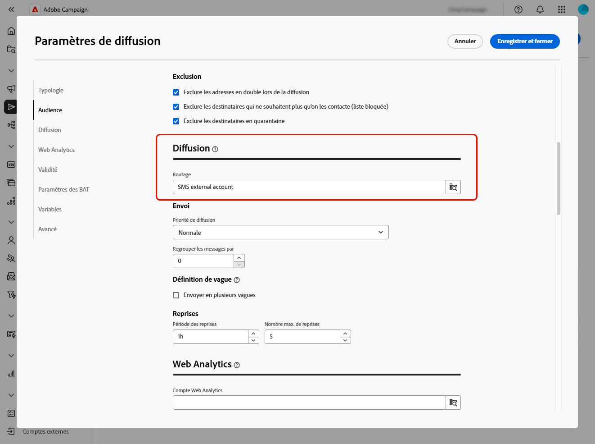
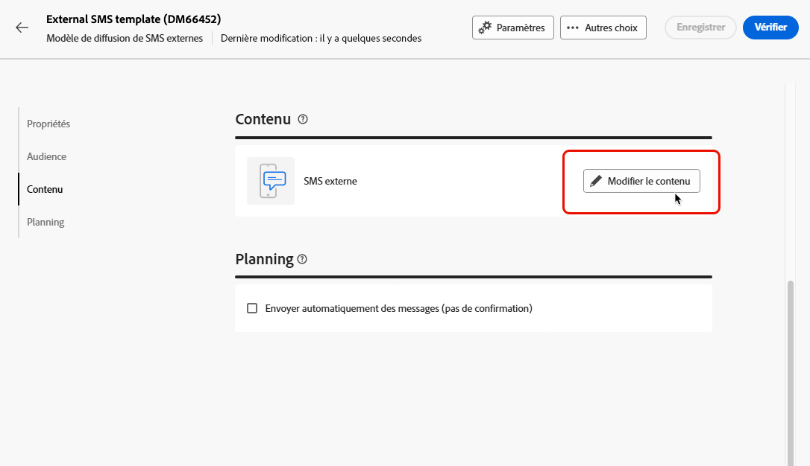
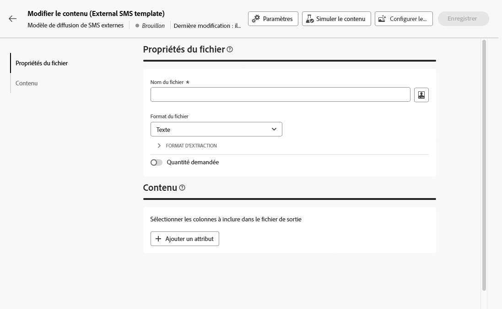
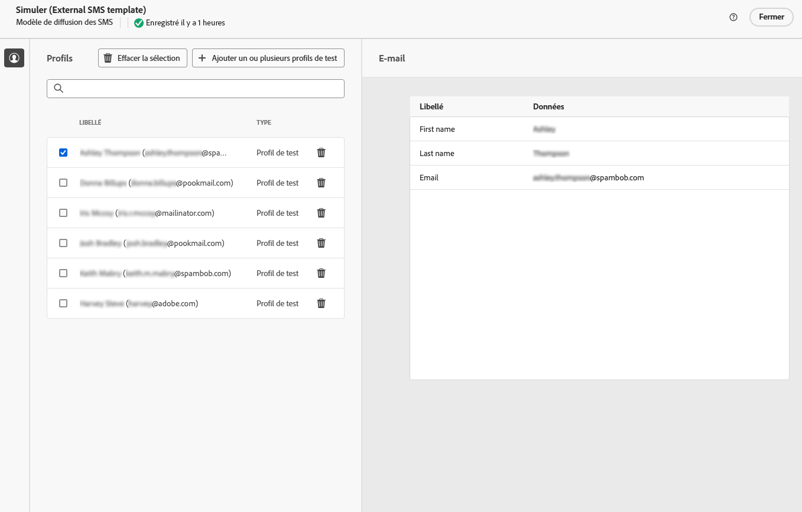

# Envoyer des diffusions externes {#gs-direct-mail}

Adobe Campaign vous permet de gérer des diffusions créées en dehors de Campaign afin de diffuser en masse des e-mails personnalisés, des SMS ou des notifications push (iOS et Android) via un système externe.

<!--The supported channels are Email, Mobile (SMS), and Push (iOs and Android).-->

Lors de la création d’une diffusion externe, Adobe Campaign génère automatiquement un fichier d’extraction contenant tous les profils ciblés et les données sélectionnées. Ce fichier est envoyé au serveur de votre choix, qui va gérer le processus d’envoi pour vous.

## Créer un compte externe dédié {#routing-external-account}

Vous devez d’abord configurer un compte externe spécifique qui sera utilisé dans vos diffusions externes. Il doit être de type **[!UICONTROL Routage]**.

>[!NOTE]
>
>Découvrez comment créer un compte externe de type Routage dans [cette section](../administration/external-account.md#routing).

Sélectionnez par exemple le canal **[!UICONTROL Mobile (SMS)]** pour le compte externe. **[!UICONTROL Externe]** est sélectionné par défaut comme **[!UICONTROL Mode de diffusion]**.

{zoomable="yes"}

## Créer et envoyer la diffusion externe {#create-external-delivery}

Une fois le compte externe spécifique configuré, créez la diffusion externe. Suivez les étapes ci-dessous.

1. Créez une diffusion. [Voici comment procéder](create-deliveries.md)

   Trois options s’offrent à vous :

   * **Dans un workflow** : ajoutez une activité de canal externe (e-mail, SMS ou notification push) à votre workflow. Pour obtenir des instructions détaillées sur la configuration d’un workflow, consultez [cette page](../workflows/gs-workflow-creation.md).
   * **Dans une campagne** : une fois que vous avez créé une campagne, vous pouvez créer une diffusion externe de canal e-mail, SMS ou notification push. Pour plus d’informations sur la configuration de votre campagne, consultez [cette page](../campaigns/gs-campaigns.md).
   * **Diffusion autonome** : interagissez directement et instantanément avec vos clientes et clients à l’aide d’une diffusion externe individuelle. [Apprendre à créer une diffusion](../msg/gs-deliveries.md)

1. Dans les [paramètres](../advanced-settings/delivery-settings.md) de la diffusion ou du modèle de diffusion, sélectionnez le compte externe que vous avez créé pour le canal de votre choix (dans cet exemple, le canal SMS) et enregistrez.

   {zoomable="yes"}

   >[!NOTE]
   >
   >Si vous créez une diffusion, assurez-vous d’avoir sélectionné un [modèle de diffusion](delivery-template.md) en utilisant un compte externe de type **[!UICONTROL Routage]**. Dans le cas contraire, vous ne pourrez pas sélectionner le compte dédié que vous avez créé [ci-dessus](#routing-external-account).

1. Dans la section **[!UICONTROL Contenu]** de la diffusion, cliquez sur **[!UICONTROL Modifier le contenu]**.

   {zoomable="yes"}

1. Contrairement à une diffusion standard, vous ne concevez pas le contenu du message lui-même. Vous devez plutôt définir les propriétés et les colonnes du fichier qui sera envoyé au système externe.

   {zoomable="yes"}

   Suivez les mêmes étapes que celles de la conception du contenu du fichier d’extraction généré par les [diffusions par courrier](../direct-mail/content-direct-mail.md) :

   * Définissez les propriétés du fichier d’extraction. [En savoir plus](../direct-mail/content-direct-mail.md#properties)
   * Sélectionnez les colonnes contenant les informations à exporter dans ce fichier. [En savoir plus](../direct-mail/content-direct-mail.md#content)

1. Vous pouvez prévisualiser le fichier et envoyer des BAT<!--not in UI right now - to check-->. [Voici comment procéder](../direct-mail/send-direct-mail.md#preview-dm)

   {zoomable="yes"}

1. Envoyez la diffusion pour générer le fichier d’extraction. [Voici comment procéder](../direct-mail/send-direct-mail.md#send-dm)

Une fois votre diffusion envoyée, le fichier d’extraction est automatiquement généré et exporté vers l’emplacement spécifié dans le [compte externe](../administration/external-account.md#create-ext-account) sélectionné dans les paramètres du modèle de diffusion.

Vous pouvez suivre vos KPI à partir de la page de la diffusion et vos données à partir du menu **[!UICONTROL Journaux]**.
