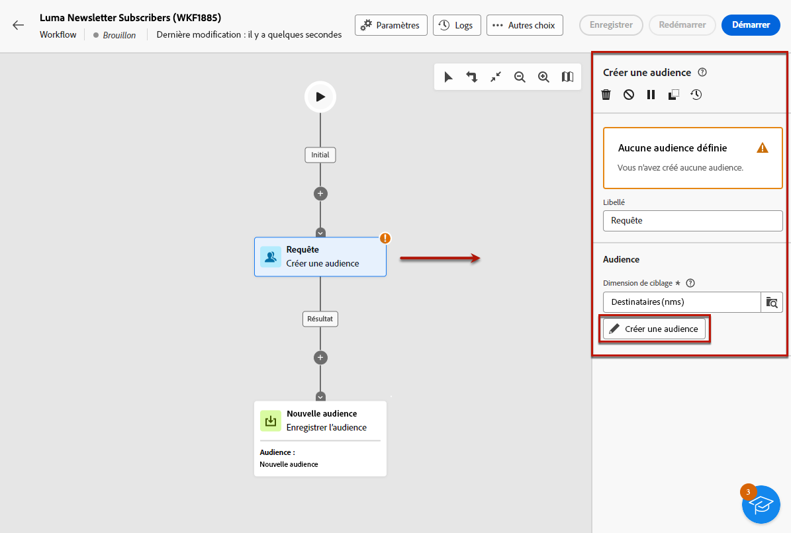

# Envoyer des messages aux personnes abonnées à un service {#send-to-subscribers}

Vous pouvez créer des services d’abonnements dans Adobe Campaign et envoyer des messages à vos personnes abonnées. Découvrez comment créer des services d’abonnements sur [cette page](../audience//manage-services.md#create-service).

Pour envoyer des messages à vos personnes abonnées, créez une audience spécifique pour identifier les personnes abonnées, puis créez la diffusion comme décrit ci-dessous.

1. Créez une audience. Un nouveau workflow est automatiquement créé. [En savoir plus sur les audiences](../audience/create-audience.md).

1. Pour une meilleure lisibilité, modifiez le nom du workflow dans le champ **Libellé** dans les paramètres du workflow. [Découvrir comment configurer les paramètres de workflow](../workflows/workflow-settings.md)

1. Ouvrez l’activité **[!UICONTROL Créer une audience]**, puis sélectionnez **[!UICONTROL Créer une audience]**. [Découvrir comment configurer une activité Créer une audience](../workflows/activities/build-audience.md)

   

1. Dans le flux de création d’audience, sélectionnez les conditions personnalisées suivantes : les **[!UICONTROL Abonnements]** existent de manière à ce que **[!UICONTROL Service]** est égal au service que vous avez défini. Dans cet exemple, sélectionnez votre **Newsletter Luma yoga**.

   

1. Sélectionnez **[!UICONTROL Confirmer]** et cliquez sur **[!UICONTROL Démarrer]** pour exécuter le workflow.

1. Créez une diffusion. Les étapes de création d’une diffusion sont détaillées sur [cette page](../msg/gs-messages.md#create-delivery).
1. Accédez aux paramètres de diffusion et définissez le mapping de ciblage par défaut sur **Abonnements (nms:subscriptions)**.

   

1. Dans la section cible principale de la diffusion, sélectionnez l’audience que vous avez créée ci-dessus.

   

1. Créez le contenu de votre message, puis testez et envoyez la diffusion, comme décrit dans [cette section](../preview-test/preview-test.md).

   

Votre diffusion n’est envoyée qu’aux personnes abonnées à ce service.
