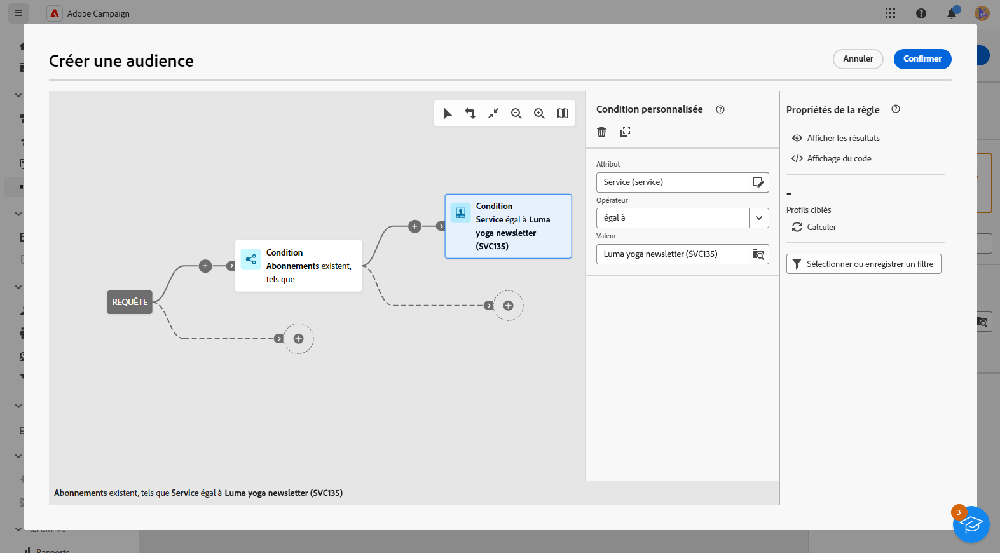
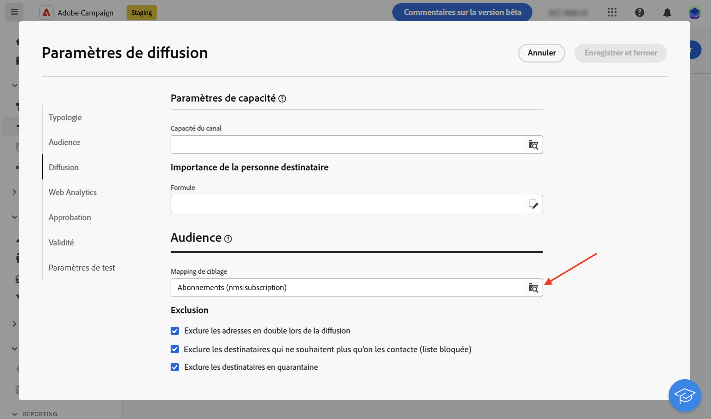
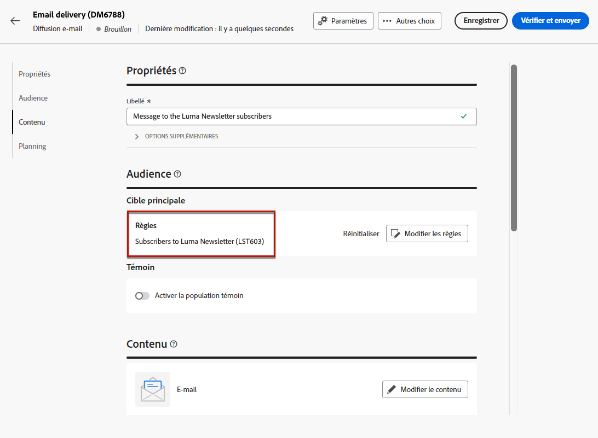
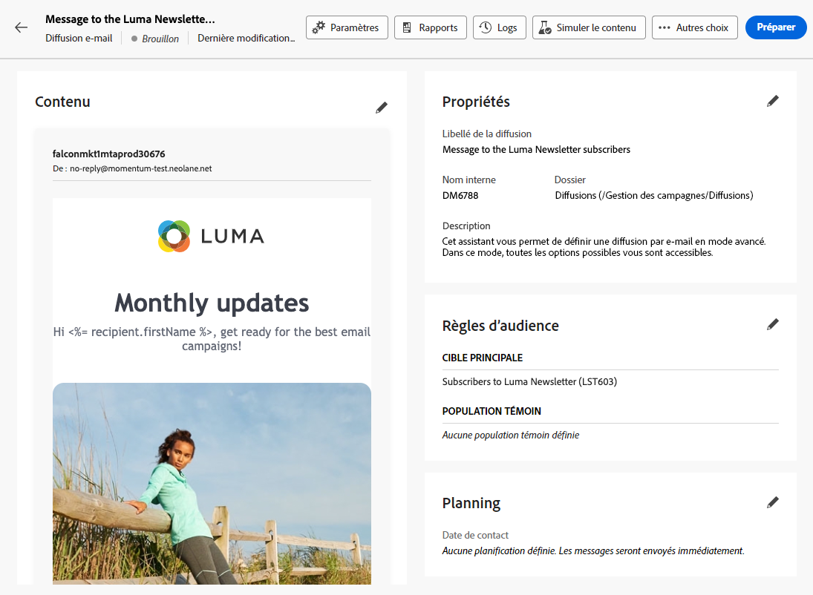

# Envoyer des messages aux personnes abonnées à un service

Vous pouvez créer des services d’abonnements dans Adobe Campaign et envoyer des messages à vos personnes abonnées. Découvrez comment créer des services d’abonnements sur [cette page](../audience//manage-services.md#create-service).

Pour envoyer des messages à vos personnes abonnées, créez une audience spécifique pour identifier les personnes abonnées, puis créez la diffusion comme décrit ci-dessous.

1. Créez une audience. Pour en savoir plus sur les audiences, consultez [cette page](../audience/create-audience.md).

1. Dans l’activité **[!UICONTROL Créer une audience]**, affichez les attributs avancés et sélectionnez **[!UICONTROL Destinataire]** > **[!UICONTROL Abonnements]** > **[!UICONTROL Service]**.

   Dans cet exemple, sélectionnez les personnes abonnées au service libellé **Newsletter Luma**.

   

1. Enregistrez l&#39;audience.
1. Créez une diffusion. Les étapes de création d’une diffusion sont détaillées sur [cette page](../msg/gs-messages.md#create-delivery).
1. Accédez aux paramètres de diffusion et définissez le mapping de ciblage par défaut sur **Abonnements (nms:subscriptions)**.

   

1. Dans la section cible principale de la diffusion, sélectionnez l’audience que vous avez créée ci-dessus.

   

1. Créez le contenu de votre message, puis testez et envoyez la diffusion, comme décrit dans [cette section](../preview-test/preview-test.md).

   

Votre diffusion n’est envoyée qu’aux personnes abonnées à ce service.
