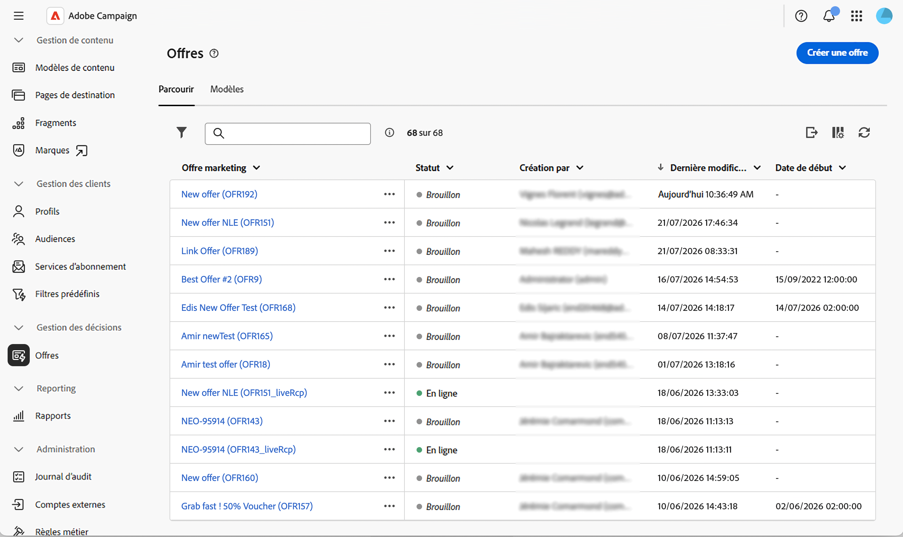
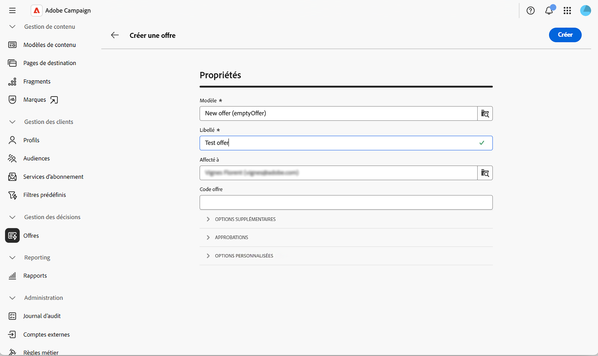
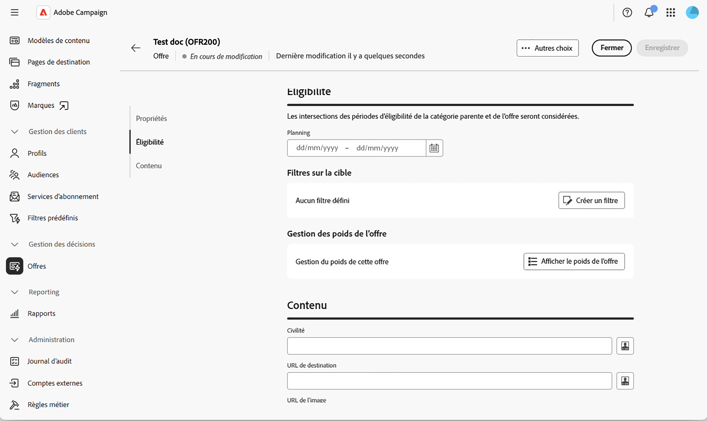
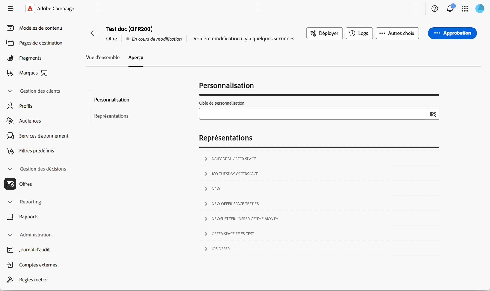
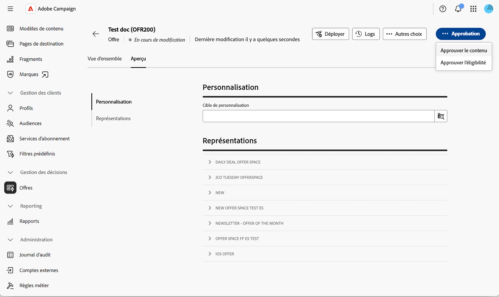
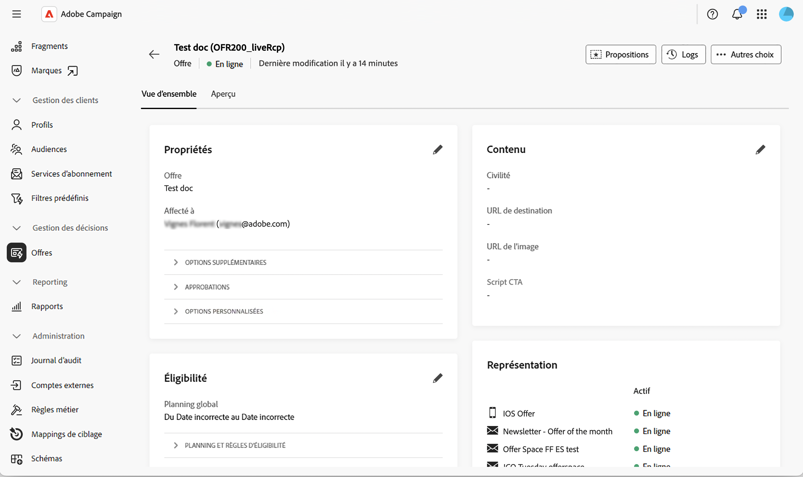

# Création et publication d’une offre {#create-offer}

Une **offre** est une proposition individuelle ayant sa propre période d&#39;éligibilité, son propre filtre cible, son propre poids et son propre contenu. Les offres sont organisées dans le catalogue d&#39;offres au travers de **catégories** et sont présentées aux destinataires par le biais d&#39;un **emplacement**.

Avant de créer une offre, assurez-vous que l&#39;environnement des offres est paramétré et qu&#39;au moins un emplacement est publié. Pour en savoir plus, consultez les sections [Configurer un environnement d&#39;offres](offer-environment.md) et [Créer et gérer des emplacements](offer-space.md).

## Accès au catalogue d&#39;offres {#access}

Pour parcourir et créer des offres, sélectionnez **[!UICONTROL Offres]** dans le rail de navigation de gauche. La liste affiche les offres existantes. Utilisez le champ de recherche, le sélecteur de dossiers ou le [moteur de requête](../query/query-modeler-overview.md) pour filtrer la liste.

{zoomable="yes"}

Cliquez sur le nom d’une offre pour l’ouvrir en vue de la modifier ou utilisez les trois points en regard pour la **[!UICONTROL Dupliquer]** ou **[!UICONTROL Supprimer]**.

## Création d’une offre {#create}

Pour créer une offre :

1. Dans la liste des offres, cliquez sur **[!UICONTROL Créer une offre]**.

1. Sélectionnez le **[!UICONTROL Modèle]** à partir duquel créer l&#39;offre (par exemple, une offre vierge ou un modèle d&#39;offre anonyme).

   {zoomable="yes"}

1. Saisissez un **[!UICONTROL Libellé]** et, éventuellement, affectez l’offre à un opérateur ou une opératrice à l’aide du **[!UICONTROL Affecté à]** et/ou saisissez un **[!UICONTROL Code d’offre]**.

1. Développez **[!UICONTROL Options supplémentaires]** pour modifier le **[!UICONTROL Nom interne]** généré automatiquement, sélectionnez la **[!UICONTROL Catégorie]** dans laquelle l&#39;offre est stockée ou ajoutez une description. Cette étape est facultative.

1. Développez **[!UICONTROL Validations]** pour affecter des approbateurs aux groupes **[!UICONTROL Validation de l&#39;éligibilité]** et **[!UICONTROL Validation du contenu]**. Cette étape est facultative.

1. Développez **[!UICONTROL Options personnalisées]** pour remplir les champs supplémentaires que votre organisation a ajoutés au schéma d’offre. Les champs affichés dans cette section varient d’une instance Campaign à l’autre. Cette étape est facultative.

1. Cliquez sur **[!UICONTROL Créer]**. L’écran de paramètres complet s’affiche.

   {zoomable="yes"}

### Définir l’éligibilité {#eligibility}

Cette section vous permet de contrôler quand et à qui l’offre peut être présentée. Les options disponibles sont les suivantes :

* **[!UICONTROL Planning]** — Définissez les dates de début et de fin entre lesquelles l&#39;offre peut être présentée.

  >[!NOTE]
  >
  >Les croisements des périodes d&#39;éligibilité avec la catégorie parent sont pris en compte : même si le planning propre à l&#39;offre est plus large, l&#39;offre n&#39;est présentée que lorsque sa catégorie parent est également éligible.

* **[!UICONTROL Filtres sur la cible]** — Cliquez sur **[!UICONTROL Créer un filtre]** pour ouvrir le créateur de règles et restreindre l’offre à une audience spécifique. Laissez le filtre vide pour rendre l’offre éligible à l’audience entière de l’environnement. Pour réutiliser un **filtre prédéfini** déclaré au niveau de la plateforme, reportez-vous à la documentation de [Campaign v8](https://experienceleague.adobe.com/docs/campaign/campaign-v8/offers/interaction-predefined-filters.html){target="_blank"}. Les filtres prédéfinis sont créés à partir de la console cliente.

* **[!UICONTROL Gestion du poids de l&#39;offre]** — Cliquez sur **[!UICONTROL Afficher le poids de l&#39;offre]**, puis **[!UICONTROL Ajouter un poids]** pour influencer la priorité de l&#39;offre lorsque plusieurs offres sont éligibles en même temps. Chaque poids comporte une date de début, une date de fin et un filtre facultatif.

>[!NOTE]
>
>Le moteur d’offres trie les offres éligibles par poids décroissant et renvoie d’abord les propositions pondérées les plus élevées. La logique de sélection, appelée **arbitrage**, prend également en compte les règles d’éligibilité et les poids configurés sur la catégorie parent et sur l’environnement. Pour en savoir plus sur le principe d’arbitrage, consultez la [documentation de Campaign v8](https://experienceleague.adobe.com/docs/campaign/campaign-v8/offers/interaction-best-practices.html?lang=fr){target="_blank"}.

### Définir le contenu {#content}

Depuis l&#39;offre, sélectionnez l&#39;onglet **[!UICONTROL Contenu]**. Cet onglet définit les valeurs qui seront exposées par la fonction de rendu.

1. Renseignez les attributs prêts à l&#39;emploi : **[!UICONTROL Titre]**, **[!UICONTROL URL de destination]**, **[!UICONTROL URL d&#39;image]** et tout attribut personnalisé déclaré dans le schéma d&#39;offre.

1. Utilisez l’[éditeur d’expression](../query/expression-editor.md) pour personnaliser les valeurs avec des données de profil, des attributs d’offre ou des champs de proposition.

1. Pour les payloads HTML et texte, cliquez sur **[!UICONTROL Modifier le contenu]** pour ouvrir l’éditeur de contenu. Vous pouvez concevoir le contenu à partir de zéro, coder votre propre HTML ou importer du contenu HTML existant, en partant éventuellement d’un modèle type.

>[!IMPORTANT]
>
>Les attributs disponibles dans la section **[!UICONTROL Contenu]** dépendent du schéma [!DNL nms:offer]. Pour exposer des attributs personnalisés, étendez le schéma et sélectionnez-les dans la section **[!UICONTROL Contenu de l’offre]**. En savoir plus dans [Utilisation de schémas](../administration/schemas.md).

## Prévisualiser l&#39;offre {#preview}

Vous pouvez prévisualiser l&#39;offre avant de l&#39;envoyer.

1. Dans l’offre, sélectionnez l’onglet **[!UICONTROL Aperçu]** en regard de **[!UICONTROL Aperçu]**.

   {zoomable="yes"}

1. Sélectionnez un profil cible et, le cas échéant, l&#39;emplacement sur lequel l&#39;aperçu doit être exécuté.

   La fonction de rendu définie au niveau de l&#39;emplacement est appliquée au contenu de l&#39;offre et la représentation résultante s&#39;affiche.

>[!NOTE]
>
>Si la prévisualisation renvoie une erreur ou aucun contenu, vérifiez la fonction de rendu de l&#39;emplacement, les règles d&#39;éligibilité de l&#39;offre et assurez-vous que tous les champs de contenu requis sont remplis.

## Valider et déployer l&#39;offre {#approve-deploy}

Les offres ne sont pas immédiatement disponibles dans les diffusions : elles passent par un cycle de validation et de déploiement.

1. Dans la présentation de l&#39;offre, cliquez sur **[!UICONTROL Validation]**.

   {zoomable="yes"}

1. Validez les **[!UICONTROL Éligibilité]** et **[!UICONTROL Contenu]**. Le contenu peut être validé par emplacement, vous pouvez donc le valider pour un emplacement tout en laissant d&#39;autres en attente.

1. Une fois les deux validations accordées, cliquez sur **[!UICONTROL Déployer]** pour publier l’offre dans l’environnement en ligne.

1. Actualisez la vue de l&#39;offre pour confirmer que la représentation **[!UICONTROL en direct]** est à jour.

<!--
>[!NOTE]
>
>Once deployed, the design offer's status resets to **[!UICONTROL Being edited]** — its normal draft status, not a sign that someone is actively editing it. This just means the design offer is ready to accept further changes, which would then need to go through a new approval and deployment cycle. The live representation itself remains untouched until that happens.
-->

>[!CAUTION]
>
>La validation de l&#39;éligibilité et du contenu d&#39;une offre est une opération à part. Une offre peut être partiellement validée (contenu uniquement, par exemple) et rester indisponible pour diffusion jusqu&#39;à ce que la validation de l&#39;éligibilité soit également accordée.

## Surveiller le tableau de bord des offres {#dashboard}

L’onglet **[!UICONTROL Présentation]** de l’offre résume le statut de l’offre dans les cartes **[!UICONTROL Propriétés]**, **[!UICONTROL Contenu]** et **[!UICONTROL Éligibilité]**, avec une icône en forme de crayon sur chacune d’elles pour revenir en édition. Une carte **[!UICONTROL Représentation]** répertorie chaque emplacement auquel l&#39;offre est liée, ainsi que son statut de conception actuel.

{zoomable="yes"}

Cliquez sur **[!UICONTROL Journaux]** pour accéder aux journaux de déploiement, ou sur le menu **··** (**[!UICONTROL Plus]**) pour **[!UICONTROL Dupliquer]** ou **[!UICONTROL Supprimer]** l’offre.

Une fois qu’une offre est active, la modification de n’importe quel paramètre ramène l’offre de conception à un statut modifiable. La représentation en direct reste inchangée jusqu’au prochain cycle d’approbation et de déploiement.

## Utiliser l&#39;offre dans une diffusion {#use-in-delivery}

Lorsque l&#39;offre est en ligne, elle peut être sélectionnée dans n&#39;importe quelle diffusion qui cible l&#39;emplacement correspondant. Découvrez comment configurer des offres dans une diffusion dans [Ajouter des offres à vos messages](../msg/offers.md).

Pour une intégration complète des diffusions sortantes, y compris sur la construction de l’appel au moteur et la manière dont le tracking est appliqué aux liens des offres, reportez-vous à la section [Offres de la documentation Campaign v8 dans les diffusions sortantes](https://experienceleague.adobe.com/docs/campaign/campaign-v8/offers/interaction-send-offers.html){target="_blank"}.

