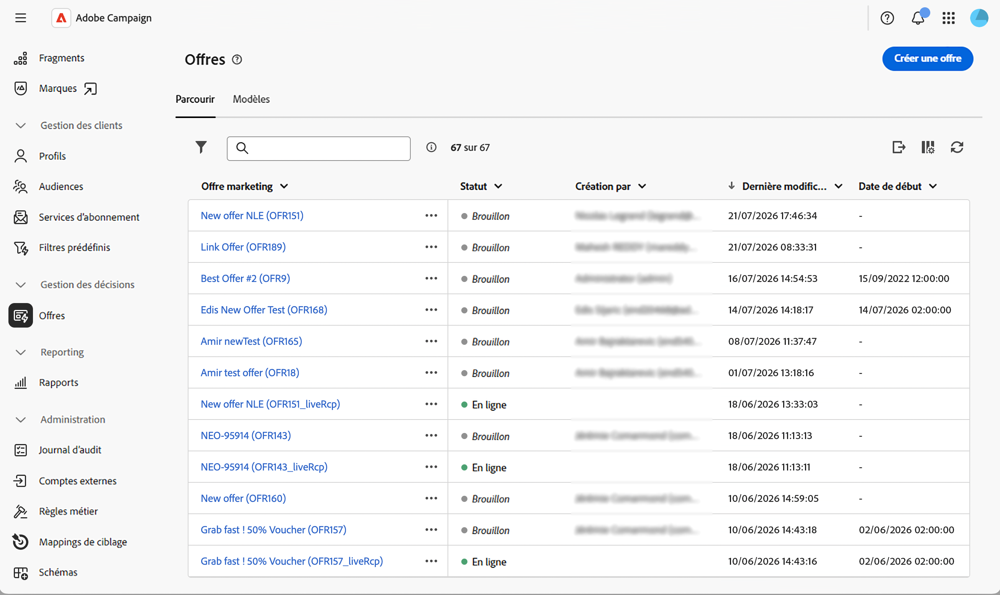

# Prise en main de la gestion des offres {#gs-offer-management}

Cette fonctionnalité vous permet d’ajouter des offres personnalisées à vos diffusions et de présenter la plus pertinente pour chaque profil dans un contexte donné. Les offres peuvent être un simple message de communication ou des promotions sur un ou plusieurs produits. En fonction des règles d&#39;éligibilité et des poids de priorité, le moteur d&#39;offres sélectionne la meilleure proposition à présenter.

L’interface utilisateur web de Campaign permet de gérer les offres de bout en bout. Vous pouvez créer et configurer des environnements d&#39;offres, concevoir des emplacements, créer votre catalogue d&#39;offres, définir des règles d&#39;éligibilité, modifier le contenu des offres et publier des offres.

Les offres sont ensuite présentées aux destinataires par le biais de diffusions en fonction de **règles d’éligibilité** et **poids de priorité**, de sorte que la meilleure offre soit sélectionnée pour chaque profil dans un contexte donné.

>[!NOTE]
>
>L’interface utilisateur web de Campaign se concentre sur l’utilisation la plus courante de la gestion des offres. Les configurations avancées restent disponibles dans la console cliente Campaign. Consultez la documentation de [Campaign v8](https://experienceleague.adobe.com/docs/campaign/campaign-v8/offers/interaction.html?lang=fr){target="_blank"}

<!--
and check the [Campaign Web and client console capability matrix](../get-started/capability-matrix.md#offer-capabilities) for the current scope.
-->

## Principaux concepts {#concepts}

Avant de commencer à utiliser les offres, familiarisez-vous avec les principaux objets impliqués.

* **Environnement d&#39;offres** — Conteneur contenant un catalogue d&#39;offres et les emplacements correspondants. Il existe deux types d’environnements, l’environnement **En édition**, où vous créez et configurez des offres, et l’environnement en lecture seule **[!UICONTROL En ligne]**, qui contient les objets approuvés et déployés disponibles pour la diffusion. [En savoir plus](offer-environment.md)

* **Emplacement** — Définit où et comment une offre est exposée (e-mail, publipostage direct, SMS, web entrant, etc.). L&#39;espace répertorie les champs de contenu qui peuvent être utilisés dans l&#39;offre, la fonction de rendu qui crée la représentation de l&#39;offre et les paramètres de stockage qui pilotent l&#39;état de la proposition. [En savoir plus](offer-space.md)

* **Catalogue d&#39;offres et catégories** — Les offres sont organisées dans un catalogue hiérarchique de **catégories** et sous-catégories. Chaque catégorie peut partager des règles d’éligibilité, des dates de validité et des **thèmes d’application**. Une catégorie par défaut est fournie dans l&#39;environnement en édition pour recevoir toutes les offres.

<!--
To configure categories in depth — including sub-categories, fallback categories, and theme management — refer to the [Campaign v8 (client console) documentation](https://experienceleague.adobe.com/docs/campaign/campaign-v8/offers/interaction-catalog/interaction-offer-catalog.html){target="_blank"}.
-->

* **Offre** — Offre individuelle ayant sa propre période d&#39;éligibilité, son propre filtre cible, son propre poids et son propre contenu. Les offres sont approuvées et déployées avant de pouvoir être présentées aux destinataires. [En savoir plus](create-offer.md)

* **Proposition d&#39;offre** — Résultat de la présentation d&#39;une offre à un contact dans un emplacement donné (une bannière sur un site web, un email, un SMS, etc.). Le nombre de propositions par diffusion est paramétré lors de la [configuration des offres dans une diffusion](../msg/offers.md).

* **Arbitrage** — Principe selon lequel le moteur d&#39;offres classe les offres éligibles par priorité pour sélectionner celles à présenter. L&#39;arbitrage utilise les critères définis sur les catégories, les offres et les offres contextuelles.

## Flux de gestion des offres {#workflow}

Le flux de bout en bout type dans l’interface utilisateur web de Campaign est le suivant :

1. **Vérifier les paramètres de l&#39;environnement d&#39;offres** — Vérifier les paramètres de conception/mapping dynamique, d&#39;éligibilité et de gestion du poids. [En savoir plus](offer-environment.md)

1. **Créer un emplacement** — Définissez les champs de contenu, la fonction de rendu et les paramètres avancés correspondant à votre canal. [En savoir plus](offer-space.md)

1. **Créer des offres dans le catalogue** — Définissez la période d&#39;éligibilité, le filtre cible, le poids et le contenu de chaque offre. [En savoir plus](create-offer.md)

1. **Valider et déployer** — Soumettez l&#39;offre à validation, validez son contenu et son éligibilité, puis laissez le processus de déploiement la publier dans l&#39;environnement en ligne. [En savoir plus](create-offer.md#approve-deploy)

1. **Ajouter l&#39;offre à une diffusion** — Référencez l&#39;emplacement et les propositions dans votre diffusion e-mail, SMS, push ou courrier. [En savoir plus](../msg/offers.md)

## Accès aux offres dans l’interface utilisateur web {#access}

Les offres sont disponibles à partir du menu de gauche **[!UICONTROL Offres]**. De là, vous pouvez parcourir le catalogue, ouvrir une offre pour la modifier et surveiller son statut de validation et de déploiement.

{zoomable="yes"}

Les environnements d&#39;offres et les emplacements sont accessibles via l&#39;**[!UICONTROL Explorateur]**, en accédant au dossier correspondant.

## Compléments réservés à la console {#console-complements}

Certaines fonctionnalités d’offre ne sont pas encore exposées dans l’interface utilisateur web et doivent toujours être configurées à partir de la console cliente :

* **Simulation d’offres** — Le module **Simulation** qui permet de tester la répartition des offres avant leur envoi. Voir [Simulation d’offres](https://experienceleague.adobe.com/docs/campaign/campaign-v8/offers/interaction-offer.html#offer-simulation){target="_blank"}.

* **Filtres prédéfinis** gestion : règles de filtrage réutilisables pouvant être référencées à partir de n’importe quelle offre. Voir [Gestion des filtres prédéfinis](https://experienceleague.adobe.com/docs/campaign/campaign-v8/offers/interaction-predefined-filters.html){target="_blank"}.

* **Tracking des offres** — Paramétrer le tracking des propositions d&#39;offres pour alimenter l&#39;historique des propositions. Voir [Suivi des propositions d’offre](https://experienceleague.adobe.com/docs/campaign/campaign-v8/offers/interaction-tracking.html){target="_blank"}.

* **Rôles Opérateur** — Attribution des droits Chargé d&#39;offres / Chargé de diffusion. Pour plus d&#39;informations, consultez la section [&#x200B; Opérateurs du module Interaction &#x200B;](https://experienceleague.adobe.com/docs/campaign/campaign-v8/offers/interaction-operators.html){target="_blank"}.

* **Bonnes pratiques d’interaction et règles d’arbitrage**. Voir [Bonnes pratiques relatives aux interactions de Campaign](https://experienceleague.adobe.com/docs/campaign/campaign-v8/offers/interaction-best-practices.html?lang=fr){target="_blank"}.

* **Reporting** — Les rapports dédiés sur les offres et les propositions ne sont pas encore disponibles dans l&#39;interface utilisateur Web.