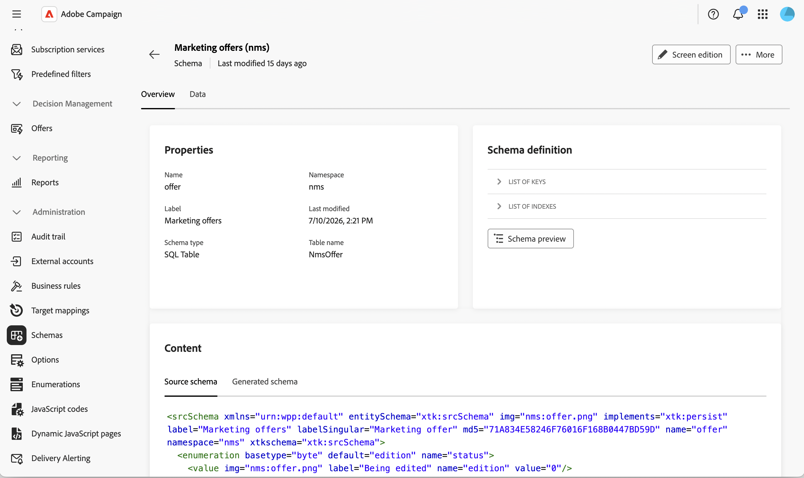
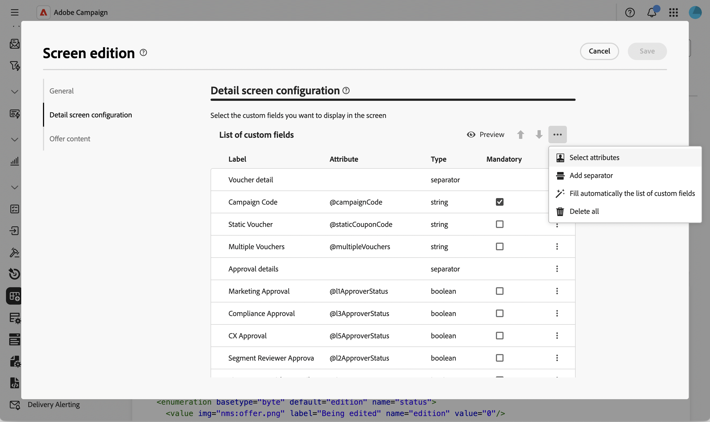
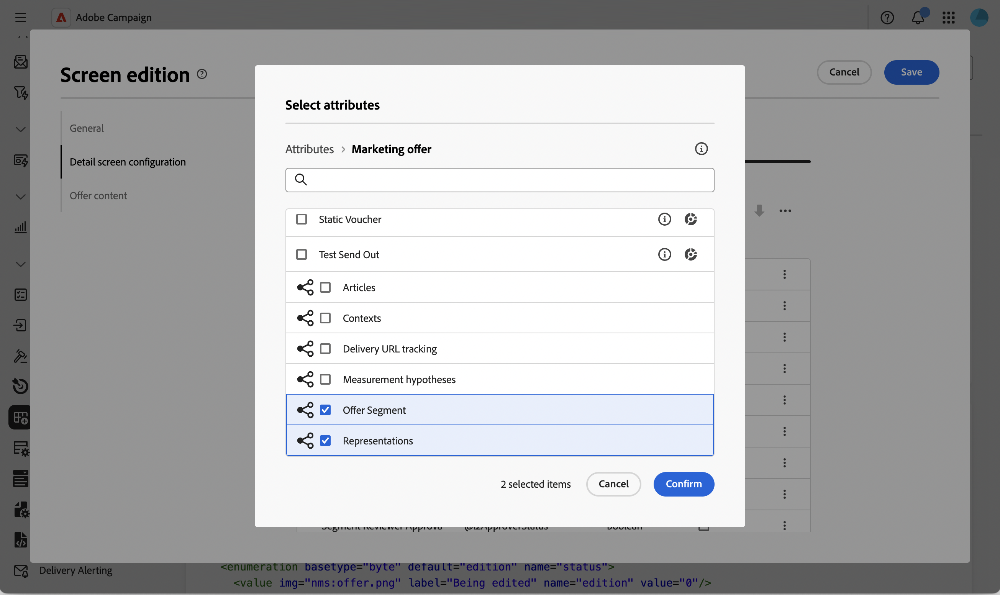
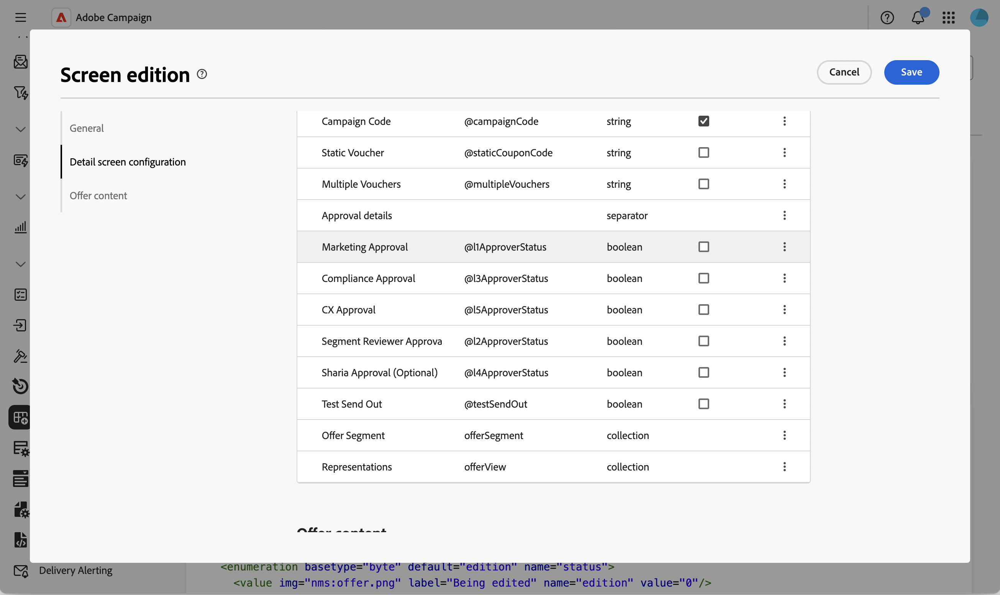
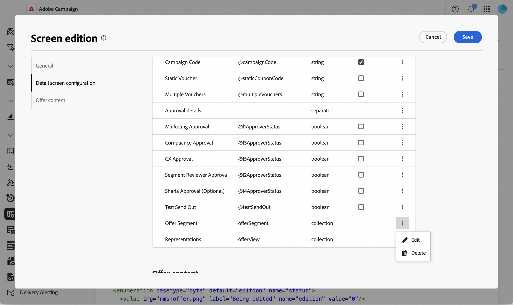
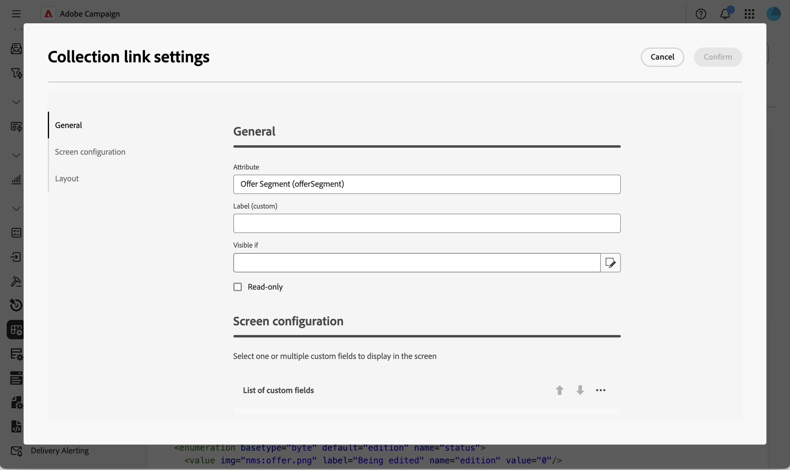
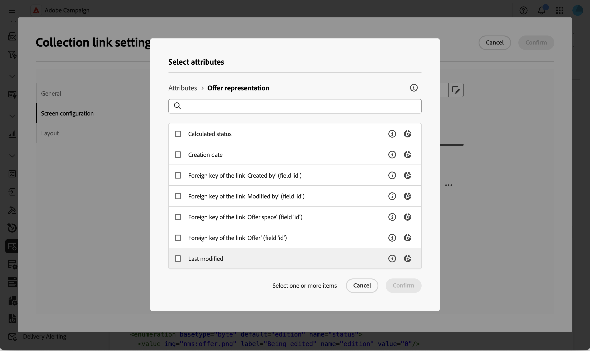
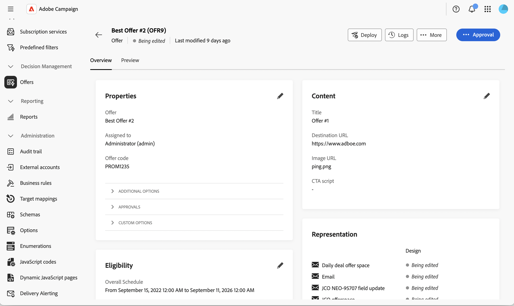
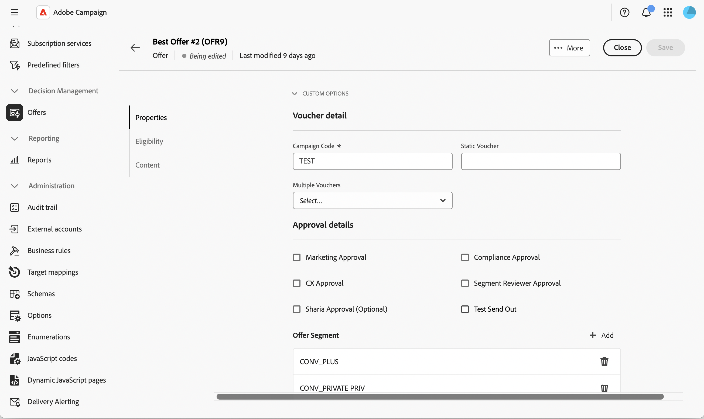

# Ajout d&#39;une liste modifiable au schéma d&#39;offre {#offer-editable-list}

Lorsque vous [étendez le [!DNL nms:offer] schéma](../administration/schemas.md) avec un lien de collection personnalisé, tel qu’un ensemble de segments liés à une offre, vous pouvez l’exposer en tant que liste modifiable directement dans la section **[!UICONTROL Options personnalisées]** de l’offre. Au lieu de gérer les enregistrements associés par le biais d’un écran distinct, la collection est générée sous la forme d’une liste dans les détails de l’offre et vous pouvez créer de nouveaux enregistrements associés en ligne via une boîte de dialogue dédiée.

>[!NOTE]
>
>Actuellement, cette fonctionnalité n’est disponible que pour le schéma d’offre.

## Ajout d’un champ de lien de collection {#add-field}

1. Étendez le schéma [!DNL nms:offer] avec votre collection personnalisée, puis accédez au menu **[!UICONTROL Schémas]**, ouvrez le schéma **[!UICONTROL Offres marketing]** et cliquez sur **[!UICONTROL Modification de l’écran]**. [En savoir plus](../administration/schemas-browse-access.md#screen-def).

   {zoomable="yes"}

1. Dans la section **[!UICONTROL Configuration de l’écran des détails]**, cliquez sur l’icône représentant des points de suspension au-dessus du tableau **[!UICONTROL Liste des champs personnalisés]** et choisissez **[!UICONTROL Sélectionner des attributs]**. [En savoir plus](../administration/schemas-custom-fields.md).

   {zoomable="yes"}

1. Parcourez les attributs et sélectionnez votre lien de collection personnalisé, identifié par son icône de collection.

   {zoomable="yes"}

   >[!NOTE]
   >
   >Les champs de lien de collection ne peuvent pas être rendus obligatoires et ne prennent pas en charge les sous-attributs. Par défaut, ils s’étendent sur deux colonnes du formulaire.

1. Confirmez votre sélection. Le lien de collection est ajouté au tableau **[!UICONTROL Liste des champs personnalisés]** avec pour type **[!UICONTROL collection]**.

   {zoomable="yes"}

## Configuration de la liste modifiable de la collection {#configure-list}

1. Cliquez sur l’icône représentant des points de suspension sur la ligne du champ de collection et choisissez **[!UICONTROL Modifier]** pour ouvrir la boîte de dialogue **[!UICONTROL Paramètres des liens de collection]**.

   {zoomable="yes"}

1. Dans l’onglet **[!UICONTROL Général]**, vous pouvez éventuellement définir une condition **[!UICONTROL Visible si]** ou activer **[!UICONTROL Lecture seule]**.

   {zoomable="yes"}

1. Dans l’onglet **[!UICONTROL Configuration de l’écran]**, cliquez sur **[!UICONTROL Sélectionner les attributs]** et sélectionnez les attributs à utiliser lors de l’ajout d’un nouvel élément à la liste, par exemple un nom de segment et un champ personnalisé.

   {zoomable="yes"}

1. Sous l’onglet **[!UICONTROL Disposition]**, conservez ou effacez **[!UICONTROL Span two columns]**.

1. Cliquez sur **[!UICONTROL Confirmer]**, puis sur **[!UICONTROL Enregistrer]** la définition d’écran.

## Utilisation de la liste modifiable dans une offre {#use-list}

1. Dans le menu de gauche, cliquez sur **Offres** et ouvrez une offre. [En savoir plus](create-offer.md#create)

   {zoomable="yes"}

1. Accédez aux propriétés de l&#39;offre. La collection est rendue sous forme de liste dans la section **Options personnalisées**.

   {zoomable="yes"}

1. Cliquez sur **[!UICONTROL Ajouter]** pour afficher les attributs que vous avez configurés, renseignez-les, puis cliquez sur **[!UICONTROL Confirmer]**. Le nouvel élément est ajouté à la liste.

   Vous pouvez ajouter plusieurs éléments à la même liste et le détail de l&#39;offre peut contenir plusieurs listes modifiables.

1. Cliquez sur **[!UICONTROL Enregistrer]**.

<!--
Each element added through the editable list creates a new related record. For instance, adding a segment to an offer generates the following payload:

```xml
<offer ...>
  <offerSegment segmentName="..." _operation="insert"/>
</offer>
```
-->