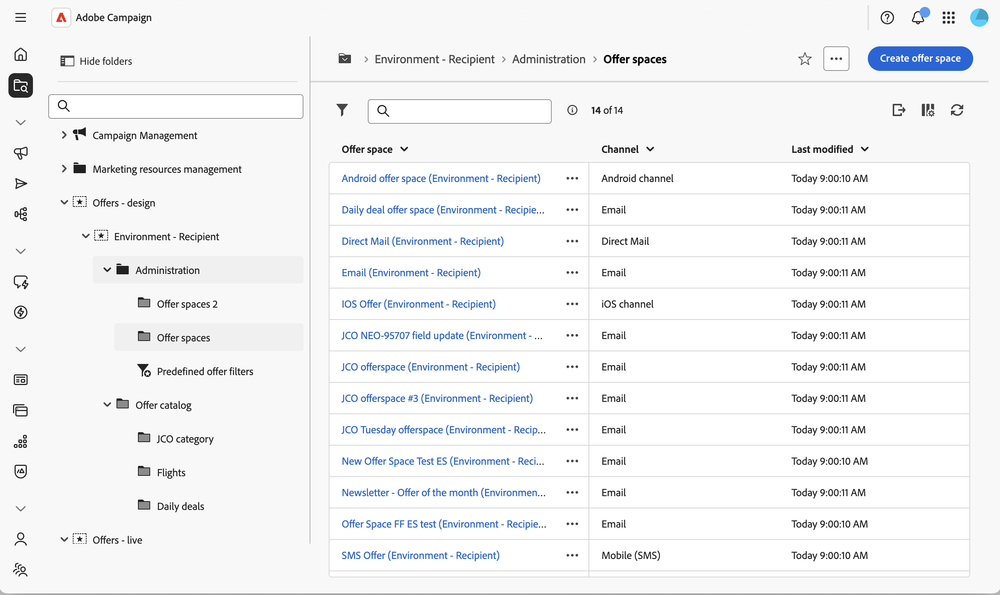
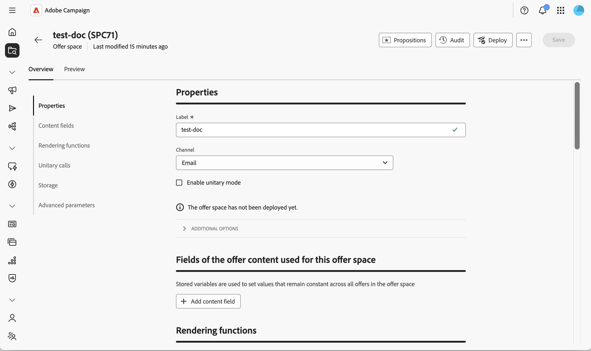
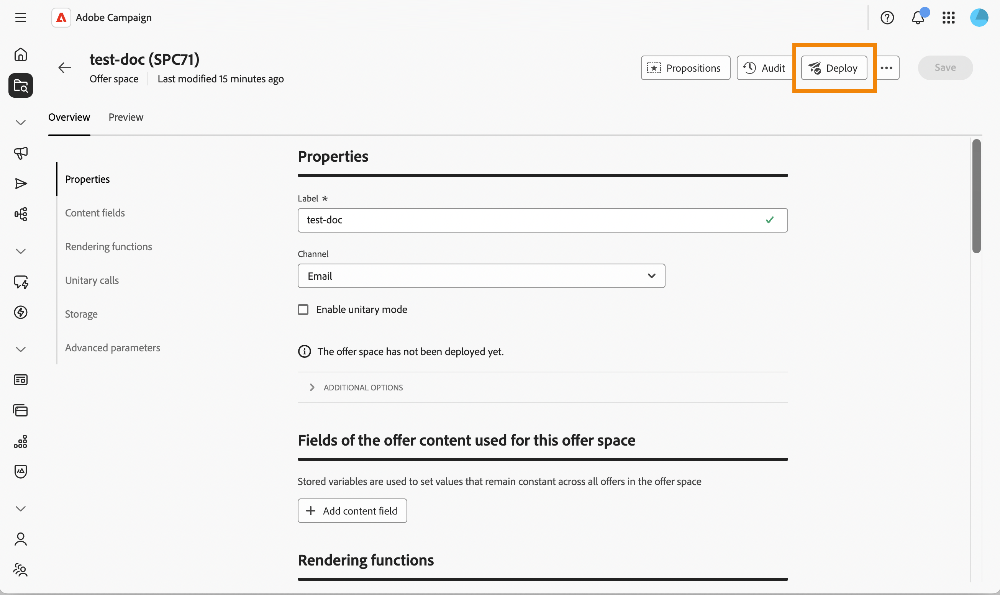
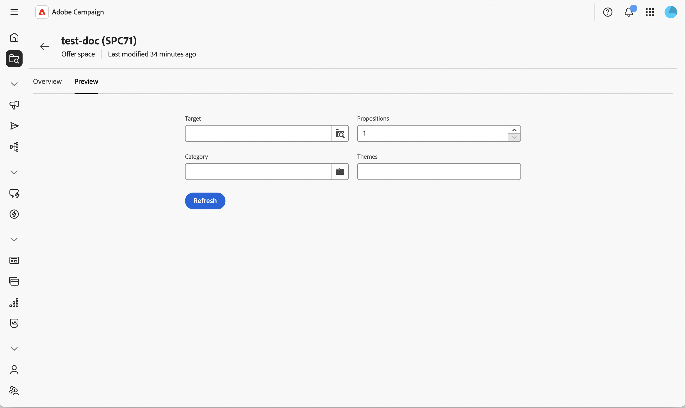

# Création et gestion des emplacements {#offer-space}

Un **emplacement** définit où et comment une offre est exposée à un contact : le canal qu&#39;elle utilise (e-mail, courrier, SMS, web entrant, etc.), les champs de contenu que l&#39;offre peut utiliser et la manière dont la représentation finale est créée. Un seul environnement peut contenir plusieurs emplacements, un pour chaque point d&#39;exposition.

Un emplacement n’est pas un canal en soi. Il représente un emplacement spécifique où l’offre est affichée sur un canal. Deux bannières sur la même page web correspondent généralement à deux emplacements différents. Pour obtenir le modèle conceptuel complet, consultez la [documentation de Campaign v8](https://experienceleague.adobe.com/docs/campaign/campaign-v8/offers/interaction-offer-spaces.html){target="_blank"}.

## Création ou modification d&#39;un emplacement{#create-offer-space}

Les emplacements sont stockés dans le dossier d&#39;environnement d&#39;offres. Pour parcourir les emplacements disponibles sur votre plateforme, ouvrez l&#39;**[!UICONTROL Explorateur]**, accédez à l&#39;environnement d&#39;offres et sélectionnez le sous-dossier qui les contient.

{zoomable="yes"}

De là, vous pouvez ouvrir un emplacement existant ou en créer un en cliquant sur **[!UICONTROL Créer un emplacement]**.

{zoomable="yes"}

### Définition des propriétés {#properties}

Cette section vous permet d’effectuer les opérations suivantes :

* Saisissez un **[!UICONTROL Libellé]** pour l&#39;emplacement.
* Sélectionnez le **[!UICONTROL Canal]** correspondant au point d&#39;exposition (e-mail, courrier, SMS, web, etc.).
* Sélectionnez **[!UICONTROL Activer le mode unitaire]** si cet emplacement doit également prendre en charge les appels unitaires (temps réel, offre unique) au moteur d&#39;offres, en plus des appels de diffusion en masse.

### Définir les champs de contenu {#content-fields}

Les champs de contenu répertorient les attributs qui peuvent être modifiés au niveau de l&#39;offre et réutilisés par la fonction de rendu. L&#39;ordre dans lequel vous ajoutez les champs dans l&#39;emplacement détermine l&#39;ordre dans lequel ils sont exposés dans la section **[!UICONTROL Contenu]** de l&#39;offre.

Par défaut, chaque offre est fournie avec les champs de contenu prêts à l’emploi suivants : **[!UICONTROL Titre]**, **[!UICONTROL URL de destination]**, **[!UICONTROL URL d’image]**, **[!UICONTROL Contenu HTML]** et **[!UICONTROL Contenu texte]**. Vous pouvez étendre cette liste avec n’importe quel champ personnalisé dont votre rendu a besoin, par exemple un **contenu court**, une **URL suivie** ou tout attribut ajouté par le biais de l’extension de schéma.

Cliquez sur **[!UICONTROL Ajouter un champ de contenu]**, puis sélectionnez l&#39;attribut à exposer dans le schéma d&#39;offre, ou cliquez sur **[!UICONTROL Modifier l&#39;expression]** pour définir une expression personnalisée à la place.

>[!IMPORTANT]
>
>Pour rendre un attribut personnalisé modifiable à partir de la section **[!UICONTROL Contenu]** de l&#39;offre, l&#39;attribut doit également être déclaré dans la section **[!UICONTROL Contenu de l&#39;offre]** du schéma de [!DNL nms:offer]. En savoir plus dans [Utilisation de schémas](../administration/schemas.md).

### Configuration des fonctions de rendu {#rendering}

Les fonctions de rendu créent la représentation de l&#39;offre finale à partir des champs de contenu. Vous pouvez choisir entre le rendu par défaut (qui génère simplement le contenu tel quel) ou une fonction personnalisée qui combine les champs avec HTML, XML ou texte.

Sélectionnez l’onglet **[!UICONTROL Rendu]**, **[!UICONTROL Rendu XML]** ou **[!UICONTROL Rendu texte]** et activez **[!UICONTROL Surcharger la fonction de rendu]** pour l’activer.

Utilisez l’éditeur d’expression pour écrire la fonction de rendu. Vous pouvez référencer les champs de contenu définis dans l’espace, les attributs de l’offre et toute fonction à partir de l’[éditeur d’expression](../query/expression-editor.md).

>[!NOTE]
>
>Si aucune fonction de rendu n’est définie, le contenu de l’offre est renvoyé tel quel à l’aide des attributs prêts à l’emploi. La fonction de rendu XML ne peut être utilisée que lorsque **[!UICONTROL Activer le mode unitaire]** est sélectionné sur l&#39;emplacement.

### Configuration de l&#39;état du stockage et des propositions {#storage}

Cette section vous permet de contrôler la manière dont les propositions générées via cet espace sont conservées et comment leur statut évolue tout au long de leur cycle de vie :

* **[!UICONTROL Désactiver l&#39;insertion des propositions]** — Empêche les propositions générées par cet emplacement d&#39;être insérées dans la table de stockage des propositions.

* **[!UICONTROL Statut]** sur la proposition : statut appliqué à la proposition au moment où le moteur d&#39;offres la renvoie (généralement **[!UICONTROL Présentée]** pour les diffusions sortantes).

* **[!UICONTROL Statut]** à l&#39;acceptation : statut appliqué lorsque le destinataire interagit avec l&#39;offre (généralement **[!UICONTROL Accepté]**).

Les valeurs de statut disponibles correspondent à la liste utilisée par la console cliente. Pour plus d’informations, consultez la documentation de [Campaign v8](https://experienceleague.adobe.com/docs/campaign/campaign-v8/offers/interaction-offer-spaces.html#offer-proposition-statuses){target="_blank"} dans la documentation de la console.

<!--
>[!NOTE]
>
>Status updates run asynchronously through the tracking workflow. For an outbound delivery containing a tracked link, the status of the proposition is automatically switched to **[!UICONTROL Presented]** when the delivery reaches the **[!UICONTROL Sent]** state. To trigger the **[!UICONTROL Interested]** status from a click, add the `_urlType="11"` attribute to the link. The full **inbound interaction** URL syntax (for example to apply the **[!UICONTROL Rejected]** status from a web app) must be configured in the client console — see [Inbound interaction status update](https://experienceleague.adobe.com/docs/campaign/campaign-v8/offers/interaction-offer-spaces.html#configuring-the-status-when-the-proposition-is-accepted){target="_blank"}.
-->

### Configurer les paramètres avancés {#advanced}

Cette section permet de définir l’**[!UICONTROL identification de la cible]**. Cliquez sur **[!UICONTROL Ajouter]** et sélectionnez un ou plusieurs attributs **[!UICONTROL Destinataire]** ou cliquez sur **[!UICONTROL Modifier l’expression]** pour définir une expression personnalisée à la place. Ce paramètre est facultatif pour un emplacement de base. Pour en savoir plus sur son comportement et sa référence complète, consultez la [documentation de Campaign v8](https://experienceleague.adobe.com/docs/campaign/campaign-v8/offers/interaction-offer-spaces.html){target="_blank"}.

Les emplacements créés sur le **canal web entrant** nécessitent également que le site soit paramétré pour afficher l&#39;offre et appeler le moteur d&#39;offres. Cette intégration est effectuée dans la console cliente. Consultez les sections [Présentation des offres en temps réel](https://experienceleague.adobe.com/docs/campaign/campaign-v8/offers/interaction-present-offers.html){target="_blank"} et [Configuration de l&#39;intégration du moteur d&#39;offres](https://experienceleague.adobe.com/docs/campaign/campaign-v8/offers/interaction-integration.html){target="_blank"} dans la documentation de Campaign v8.

## Déploiement de l&#39;emplacement {#deploy}

Un emplacement doit être déployé avant de pouvoir être utilisé dans une diffusion. Enregistrez votre emplacement, puis cliquez sur **Déployer**. Le statut du déploiement est reflété sur l&#39;emplacement.

{zoomable="yes"}

## Prévisualiser l&#39;emplacement {#preview}

La prévisualisation permet de simuler la sélection et le rendu d&#39;une offre pour une cible donnée.

1. Depuis l&#39;emplacement, sélectionnez l&#39;onglet **[!UICONTROL Aperçu]**, en regard de **[!UICONTROL Aperçu]**.

   {zoomable="yes"}

1. Sélectionnez un profil cible et exécutez l’aperçu. Les offres correspondantes sont renvoyées avec la représentation générée par la fonction de rendu .

>[!NOTE]
>
>Si aucune proposition n&#39;est retournée, vérifiez les règles d&#39;éligibilité des offres et la configuration de l&#39;emplacement.

Ensuite, [créez une offre](create-offer.md) dans le catalogue et affectez-la à cet emplacement.
