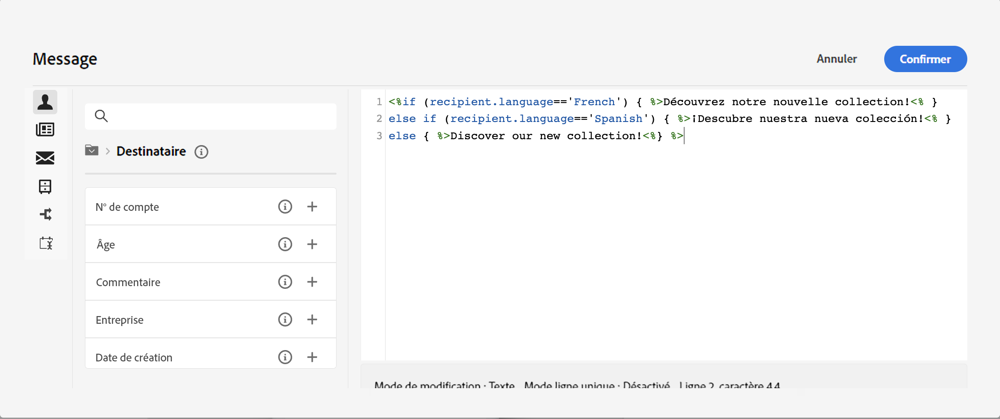

# Créer du contenu conditionnel{#add-conditions}

>[!CONTEXTUALHELP]
>id="acw_conditional_content"
>title="Ajouter du contenu conditionnel"
>abstract="Configure campos de contenido condicional para crear una personalización dinámica avanzada basada en el perfil del destinatario. Los bloques de texto, los vínculos, la línea de asunto o las imágenes se sustituyen en el contenido del mensaje cuando se cumple una condición en concreto. "

## Commencer avec le contenu conditionnel {#gs}

Le contenu conditionnel est une puissante fonctionnalité qui permet de créer une personnalisation dynamique basée sur le profil de la personne destinataire, en remplaçant automatiquement les blocs de texte et les images lorsque certaines conditions sont remplies. Cette fonctionnalité permet de créer des campagnes plus sophistiquées, et de proposer des expériences hautement ciblées et personnalisées à votre audience.

En configurant du contenu conditionnel, vous pouvez notamment créer une personnalisation dynamique avancée basée sur le profil de la personne destinataire. Los bloques de texto, los vínculos, la línea de asunto o las imágenes se sustituyen en el contenido del mensaje cuando se cumple una condición en concreto. Par exemple, vous pouvez afficher « M. » ou « Mme » en fonction de la valeur du champ Genre dans la base de données Adobe Campaign, ou inclure un lien différent en fonction de la langue préférée de la personne destinataire.

Pour créer du contenu conditionnel, vous devez créer des conditions dans l’**éditeur d’expression** à l’aide de fonctions d’assistance spécifiques. Cette méthode est disponible pour tous les canaux de diffusion, dans tous les champs où vous pouvez accéder à l’éditeur d’expression, comme l’objet, ou encore les liens d’e-mail et les composants de contenu texte/bouton. [Découvrez comment accéder à l’éditeur d’expression.](gs-personalization.md/#access)

<!--In addition to the expression editor, you can leverage a dedicated **conditional content builder** when designing an email that allows you to build conditions using profile attributes only. [Learn how to create conditional content in emails](#condition-condition-builder)-->

## Créer des conditions dans l’éditeur d’expression {#condition-perso-editor}

Pour définir du contenu conditionnel pour une diffusion à l’aide de l’éditeur d’expression, procédez comme suit. Dans cet exemple, nous allons créer un contenu conditionnel basé sur la langue de la personne destinataire (français ou anglais).

1. Ouvrez une diffusion et accédez à la section d’édition du contenu.

1. Situez le champ dans lequel ajouter du contenu conditionnel. Par exemple, vous pouvez ajouter du contenu conditionnel à un SMS.

1. Cliquez sur l’icône **[!UICONTROL Ouvrir la boîte de dialogue de personnalisation]** en regard du champ pour ouvrir l’éditeur d’expression.

   

1. Dans l’éditeur de personnalisation, accédez au menu **[!UICONTROL Fonctions d’assistance]** sur la gauche.

1. Pour commencer à créer votre condition, cliquez sur l’icône « + » en regard de la fonction **If**. La ligne suivante est ajoutée à l’écran central :`<% if (<FIELD>==<VALUE>) { %>Insert content here<% } %>`

   * Remplacez `<FIELD>` par un champ de personnalisation, tel que la langue de la personne destinataire : `recipient.language`.
   * Remplacez `<VALUE>` par la valeur à satisfaire. Par exemple, `'French'`.
   * Remplacez `Ìnsert content here` par le contenu à afficher pour les profils qui respectent la condition spécifiée.

     {width="800" align="center"}

1. Indiquez le contenu à afficher si les personnes destinataires ne remplissent pas la condition. Pour ce faire, utilisez une fonction d’assistance **Else** :

   1. Placez le curseur avant la balise de fermeture de l’expression `%>` et cliquez sur le bouton `+` en regard de la fonction **Else**.

   1. Remplacez `Ìnsert content here` par le contenu à afficher pour les profils qui ne respectent pas la condition de la fonction If.

   {width="800" align="center"}

   Vous pouvez également utiliser la fonction d’assistance **Else if** pour créer des conditions avec plusieurs variantes de contenu. Par exemple, l’expression ci-dessous affiche trois variantes d’un message selon la langue de la personne destinataire :

   {width="800" align="center"}

   >[!NOTE]
   >
   >Chaque fois qu’une fonction d’assistance est ajoutée, les balises d’ouverture (`<%`) et de fermeture (`%>`) sont automatiquement ajoutées avant et après la fonction.
   >
   >Exemple après l’ajout d’une fonction d’assistance Else dans une expression : >
   >
   >`<% if (<FIELD>==<VALUE>) { %>Insert content here<% } <% else { %> Insert content here<% } %>%>`
   >
   >Veillez à supprimer ces balises pour éviter toute erreur de syntaxe. Dans cet exemple, l’expression corrigée après la suppression de la fonction **Else** est la suivante :
   >
   >`<% if (<FIELD>==<VALUE>) { %>Insert content here<% } else { %> Insert content here<% } %>`

1. Une fois votre condition prête, vous pouvez enregistrer votre contenu et vérifier son rendu en simulant votre contenu.

<!--SECTION REMOVED FOR LA > CONDITIONAL CONTENT NOT AVAILABLE ANYMORE FROM THE DEDICATED MENU IN THE EMAIL DESIGNER. ONLY THE EXPRESSION EDITOR IS AVAILABLE FOR NOW

## Create conditional content in emails {#condition-condition-builder}

Conditional content in emails can be created in two ways:
* In the expression editor by building a condition with helper functions,
* In a dedicated conditional content builder that is accessible when designing an email.

Detailed information on how to create conditions using the expression editor is available [here](#condition-perso-editor). The following section provides step-by-step instructions on how to create conditions using the email designer's conditional content capability. In this example, we want to create an email message with multiple variants based on the recipients' language. Follow these steps:

1. Create or open an email delivery, edit its content, and click the **[!UICONTROL Edit email body]** button to open the email designing workspace.

1. Select a content component and click the **[!UICONTROL Enable conditional content]** icon.

    {width="800" align="center"}

1. The **[!UICONTROL Conditional Content]** pane opens on the left-hand side of the screen. In this pane, you can create multiple variants of the selected content component using conditions.

1. Configure your first variant. Hover over **[!UICONTROL Variant - 1]** in the **[!UICONTROL Conditional Content]** pane and click the **[!UICONTROL Add condition]** icon.

1. A query modeler appears. Use profile attributes to create the condition for the first variant of the message and click **[!UICONTROL Confirm]**. In this example, we are creating a rule targeting recipients whose language is 'French'.

    {width="800" align="center"}

1. The rule is now associated to the variant. For better readability, we recommend renaming the variant by clicking the ellipsis menu.

1. Configure how the component should display if the rule is met when sending the message. In this example, we want to display the text in French if it is the recipient's preferred language.

    {width="800" align="center"}

1. Add as many variants as needed for the content component. You can switch between the variants at any time to check how the content component will display based on their conditional rules.

    >[!NOTE]
    >If none of the rules defined in the variants are met when sending the message, the content component will display the content defined in the **[!UICONTROL Default variant]** from the **[!UICONTROL Conditional Content]** pane.
-->