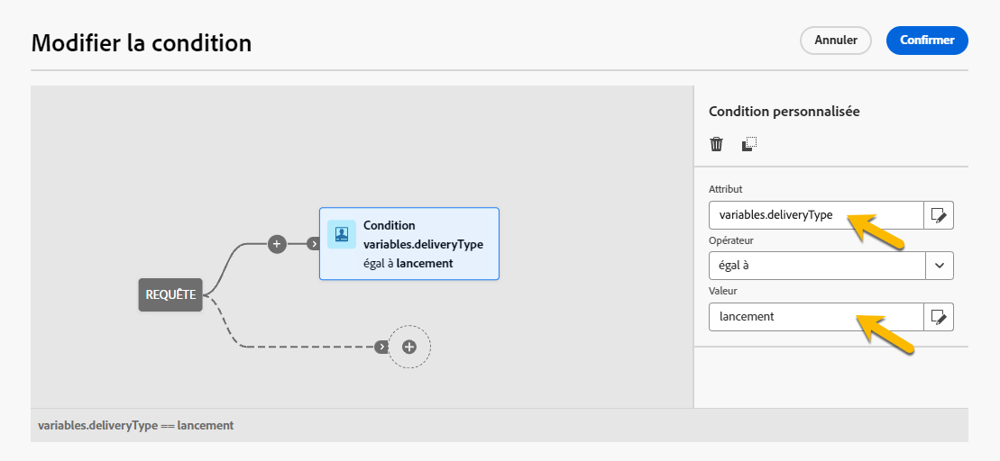

# Créer du contenu conditionnel {#add-conditions}

>[!CONTEXTUALHELP]
>id="acw_conditional_content"
>title="Ajouter du contenu conditionnel"
>abstract="Configurez des champs de contenu conditionnel pour créer une personnalisation dynamique avancée sur la base du profil du destinataire. Les blocs de texte, les liens, la ligne d’objet et/ou les images sont remplacés dans le contenu du message lorsqu’une condition en particulier est remplie. "

## Commencer avec le contenu conditionnel {#gs}

Le contenu conditionnel est une puissante fonctionnalité qui permet une personnalisation dynamique basée sur les données de profil de la personne destinataire. Il remplace automatiquement les blocs de texte et les images lorsque des conditions spécifiques sont remplies. Cette fonctionnalité améliore les campagnes et fournit des expériences hautement ciblées et personnalisées à votre audience.

En configurant du contenu conditionnel, vous pouvez notamment créer une personnalisation dynamique avancée basée sur le profil de la personne destinataire. Par exemple, les blocs de texte, les liens, les lignes d’objets et les images sont remplacés dans le contenu du message lorsqu’une condition en particulier est remplie. Par exemple, vous pouvez afficher « M. » ou « Mme » en fonction de la valeur du champ Genre dans la base de données Adobe Campaign, ou inclure un lien différent en fonction de la langue préférée de la personne destinataire.

Pour créer du contenu conditionnel, configurez des conditions dans l’**éditeur d’expression** à l’aide de fonctions d’assistance spécifiques. Cette méthode est disponible pour tous les canaux de diffusion, dans tous les champs où vous pouvez accéder à l’éditeur d’expression, comme l’objet, les liens d’e-mail et les composants de contenu texte/bouton. [Découvrez comment accéder à l’éditeur d’expression](gs-personalization.md#access).

En outre, utilisez le **créateur de contenu conditionnel** dédié lors de la conception d’un e-mail pour créer plusieurs variantes pour un élément du corps de votre e-mail. [Découvrez comment créer du contenu conditionnel dans les e-mails](#condition-condition-builder).

## Créer des conditions dans l’éditeur d’expression {#condition-perso-editor}

>[!CONTEXTUALHELP]
>id="acw_personalization_editor_conditions"
>title="Conditions"
>abstract="Ce menu vous permet d’utiliser des fonctions d’assistance pour définir du contenu conditionnel."

Pour définir du contenu conditionnel pour une diffusion à l’aide de l’éditeur d’expression, procédez comme suit. Dans cet exemple, le contenu conditionnel est créé en fonction de la langue de la personne destinataire (français ou anglais).

1. Ouvrez une diffusion et accédez à la section d’édition du contenu.

1. Situez le champ dans lequel ajouter du contenu conditionnel. Par exemple, ajoutez du contenu conditionnel à un SMS.

1. Cliquez sur l’icône **[!UICONTROL Ouvrir la boîte de dialogue de personnalisation]** en regard du champ pour ouvrir l’éditeur d’expression.

   {zoomable="yes"}

1. Dans l’éditeur de personnalisation, accédez au menu **[!UICONTROL Conditions]** situé à gauche.

1. Pour commencer à créer votre condition, cliquez sur l’icône « + » en regard de la fonction **If**. La ligne suivante est ajoutée à l’écran central : `<% if (<FIELD>==<VALUE>) { %>Insert content here<% } %>`

   * Remplacez `<FIELD>` par un champ de personnalisation, tel que la langue de la personne destinataire : `recipient.language`.
   * Remplacez `<VALUE>` par la valeur à satisfaire, telle que `'French'`.
   * Remplacez `Insert content here` par le contenu à afficher pour les profils qui respectent la condition spécifiée.

     {zoomable="yes"}{width="800" align="center"}

1. Indiquez le contenu à afficher si les personnes destinataires ne remplissent pas la condition. Utilisez une fonction d’assistance **Else** :

   1. Placez le curseur avant la balise de fermeture de l’expression `%>` et cliquez sur le bouton `+` en regard de la fonction **Else**.

   1. Remplacez `Insert content here` par le contenu à afficher pour les profils qui ne respectent pas la condition de la fonction If.

   {zoomable="yes"}{width="800" align="center"}

   Utilisez la fonction d’assistance **Else if** pour créer des conditions avec plusieurs variantes de contenu. Par exemple, l’expression ci-dessous affiche trois variantes d’un message selon la langue de la personne destinataire :

   {zoomable="yes"}{width="800" align="center"}

   >[!NOTE]
   >
   >Chaque fois qu’une fonction d’assistance est ajoutée, les balises d’ouverture (`<%`) et de fermeture (`%>`) sont automatiquement ajoutées avant et après la fonction.
   >
   >Exemple après l’ajout d’une fonction d’assistance Else dans une expression :
   >
   >`<% if (<FIELD>==<VALUE>) { %>Insert content here<% } <% else { %> Insert content here<% } %>%>`
   >
   >Veillez à supprimer ces balises pour éviter toute erreur de syntaxe. Dans cet exemple, l’expression corrigée après la suppression de la fonction **Else** est la suivante :
   >
   >`<% if (<FIELD>==<VALUE>) { %>Insert content here<% } else { %> Insert content here<% } %>`

1. Enregistrez votre contenu et vérifiez son rendu en simulant votre contenu.

## Créer du contenu conditionnel dans les e-mails. {#condition-condition-builder}

Le contenu conditionnel des e-mails peut être créé de deux manières :
* Dans l’éditeur d’expression en créant une condition avec des fonctions d’assistance.
* Dans un créateur de contenu conditionnel dédié accessible lors de la conception d’un e-mail.

La section suivante fournit des instructions détaillées sur la création de conditions à l’aide de la fonctionnalité de contenu conditionnel du concepteur d’e-mail. Vous trouverez [ici](#condition-perso-editor) des informations détaillées sur la création de conditions à l’aide de l’éditeur d’expression.

Dans cet exemple, un e-mail avec plusieurs variantes est créé en fonction de la langue des personnes destinataires. Procédez comme suit :

1. Créez ou ouvrez une diffusion e-mail, modifiez son contenu, puis cliquez sur le bouton **[!UICONTROL Modifier le corps de l’e-mail]** pour ouvrir l’espace de travail de conception d’e-mail.

1. Sélectionnez un composant de contenu et cliquez sur l’icône **[!UICONTROL Activer le contenu conditionnel]**.

   {zoomable="yes"}{width="800" align="center"}

1. Le volet **[!UICONTROL Contenu conditionnel]** s’affiche sur la partie gauche de l’écran. Dans ce volet, créez plusieurs variantes du composant de contenu sélectionné en indiquant des conditions.

1. Configurez votre première variante. Pointez sur **[!UICONTROL Variante – 1]** dans le volet **[!UICONTROL Contenu conditionnel]** et cliquez sur le bouton **[!UICONTROL Ajouter une condition]**.

   {zoomable="yes"}{width="800" align="center"}

1. Le concepteur de requête s’ouvre pour vous permettre de créer une condition en filtrant les données de profil de la personne destinataire. [Découvrez comment utiliser le concepteur de requête](../query/query-modeler-overview.md).

   Une fois la condition de la première variante du message prête, cliquez sur **[!UICONTROL Confirmer]**. Dans cet exemple, une règle ciblant les personnes destinataires dont la langue est le « français » est créée.

   {zoomable="yes"}{width="800" align="center"}

1. La règle est désormais associée à la variante. Pour une meilleure lisibilité, renommez la variante en cliquant sur le menu représentant des points de suspension.

1. Configurez l’affichage du composant si la règle est respectée lors de l’envoi du message. Dans cet exemple, affichez le texte en français s’il s’agit de la langue préférée de la personne destinataire.

   {zoomable="yes"}{width="800" align="center"}

1. Ajoutez autant de variantes que nécessaire pour le composant de contenu. Basculez entre les variantes à tout moment pour examiner l’affichage du composant de contenu en fonction des différentes règles conditionnelles.

   >[!NOTE]
   >Si aucune des règles définies dans les variantes n’est respectée lors de l’envoi du message, le composant de contenu affiche le contenu défini dans la **[!UICONTROL Variante par défaut]** du volet **[!UICONTROL Contenu conditionnel]**.

## Utiliser des variables pour le contenu conditionnel {#variables-conditional}

Les variables peuvent être utilisées pour le contenu conditionnel dans votre diffusion.

En savoir plus sur l’[ajout de variables à une diffusion](../advanced-settings/delivery-settings.md#variables-delivery).

Sélectionnez l’élément dans lequel vous souhaitez placer le contenu conditionnel.

{zoomable="yes"}

Pour utiliser votre variable, configurez la condition à l’aide du bouton **[!UICONTROL Modifier l’expression]**, comme illustré ci-dessous. Dans cet exemple, cette image s’affiche lorsque la valeur de la variable est `launch`.

{zoomable="yes"}

Créez une autre variante avec la valeur `reminder`, par exemple, où une autre image s’affiche.