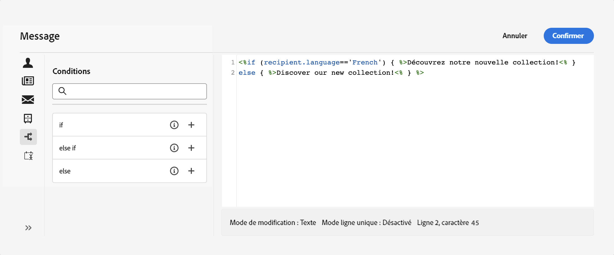

# Création de contenu conditionnel{#add-conditions}

>[!CONTEXTUALHELP]
>id="acw_homepage_card3"
>title="Créer du contenu conditionnel"
>abstract="Créez un contenu conditionnel pour définir une personnalisation dynamique basée sur le profil du destinataire, en remplaçant automatiquement les blocs de texte et les images lorsque certaines conditions sont remplies. Cette fonctionnalité permet d’augmenter le nombre de campagnes et de proposer des expériences hautement ciblées et personnalisées à votre audience."

Le contenu conditionnel est une puissante fonctionnalité qui permet de créer une personnalisation dynamique basée sur le profil du destinataire, en remplaçant automatiquement les blocs de texte et les images lorsque certaines conditions sont remplies. Cette fonctionnalité permet d’augmenter le nombre de campagnes et de proposer des expériences hautement ciblées et personnalisées à votre audience.

En configurant des champs de contenu conditionnel, vous pouvez créer une personnalisation dynamique avancée basée sur le profil du destinataire, par exemple. Les blocs de texte, liens, objet et/ou images sont remplacés dans le contenu du message lorsqu’une condition particulière est remplie. Par exemple, vous pouvez afficher &quot;M.&quot; ou &quot;Mme&quot; en fonction de la valeur du champ Genre dans la base de données Adobe Campaign, ou inclure un lien différent en fonction de la langue préférée du destinataire.

## Création de contenu conditionnel

Pour créer du contenu conditionnel, vous devez créer des conditions dans l’éditeur d’expression à l’aide d’une fonction d’assistance spécifique. Cette méthode est disponible pour tous les canaux de diffusion, dans tous les champs où vous pouvez accéder à l’éditeur d’expression, comme le champ de ligne d’objet, ou les liens d’email et les composants de contenu de texte/bouton. [Découvrez où ajouter du contenu dynamique](gs-personalization.md/#access)

Outre l’éditeur d’expression, vous pouvez tirer parti d’un créateur de contenu conditionnel dédié lors de la conception d’un email qui vous permet de créer des conditions à l’aide d’attributs de profil.

## Création de conditions dans l’éditeur d’expression {#condition-perso-editor}

Pour définir un contenu conditionnel pour une diffusion, procédez comme suit. Dans cet exemple, nous allons créer un contenu conditionnel basé sur la langue du destinataire (français ou anglais).

1. Ouvrez une diffusion et éditez son contenu.

1. Localisez le champ dans lequel vous souhaitez ajouter du contenu conditionnel et cliquez sur le bouton **[!UICONTROL Ouvrir la boîte de dialogue de personnalisation]** pour ouvrir l’éditeur d’expression. Dans cet exemple, nous allons ajouter du contenu conditionnel dans un SMS :

   

1. Dans l’éditeur de personnalisation, accédez au **[!UICONTROL Fonctions d’assistance]** menu de gauche.

1. Cliquez sur l’icône &quot;+&quot; en regard de l’option **If** pour démarrer votre condition. La ligne suivante est ajoutée à l&#39;écran central :
   `<% if (<FIELD>==<VALUE>) { %>Insert content here<% } %>`

   * Remplacer `<FIELD>` par un champ de personnalisation. Par exemple, la langue du destinataire : `recipient.language`.
   * Remplacer `<VALUE>` par la valeur à satisfaire. Par exemple, `'French'`.
   * Remplacer `Ìnsert content here` par le contenu que vous souhaitez afficher aux profils répondant à la condition spécifiée ci-dessus.

     

1. Indiquez le contenu à afficher si les destinataires ne remplissent pas la condition. Pour cela :

   1. Ajoutez un **else** fonction d’assistance : Placez le curseur avant la balise de fermeture de l’expression `%>` et cliquez sur le bouton `+` en regard de **Else** fonction .

      >[!NOTE]
      >
      >Chaque fois qu’une fonction d’assistance est ajoutée, ouvrez (`<%`) et de fermeture (`%>`) sont automatiquement ajoutées avant et après la fonction . Exemple après l’ajout d’une fonction d’assistance &quot;Else&quot; dans une expression :
      >
      >`<% if (<FIELD>==<VALUE>) { %>Insert content here<% } <% else { %> Insert content here<% } %>%>`
      >
      >Veillez à supprimer ces balises pour éviter toute erreur de syntaxe. Dans cet exemple, l’expression corrigée après la suppression de la propriété **Else** Les balises de fonction sont les suivantes :
      >
      >`<% if (<FIELD>==<VALUE>) { %>Insert content here<% } else { %> Insert content here<% } %>`

   1. Remplacer `Ìnsert content here` par le contenu que vous souhaitez afficher aux profils qui ne respectent pas la condition.

      

   Vous pouvez également utiliser la variable **else** fonction d’aide pour créer des conditions avec plusieurs variantes de contenu. Par exemple, l&#39;expression ci-dessous affiche trois variantes d&#39;un message selon la langue du destinataire :

   

1. Une fois votre condition prête, vous pouvez enregistrer votre contenu et vérifier son rendu en simulant votre contenu.

## Création de contenu conditionnel dans les emails  {#condition-condition-builder}

Le contenu conditionnel des emails peut être créé de deux manières :
* Dans l’éditeur d’expression en créant une condition à l’aide de fonctions d’assistance,
* Dans un créateur de contenu conditionnel dédié accessible lors de la conception d’un email.

Des informations détaillées sur la création de conditions à l’aide de l’éditeur d’expression sont disponibles. [here](#condition-perso-editor).

La section ci-dessous vous guide tout au long des étapes pour créer des conditions à l’aide du Concepteur d’email du créateur de contenu conditionnel. Dans cet exemple, nous allons créer un email qui va proposer plusieurs variantes en fonction de la langue du destinataire. Pour ce faire, procédez comme suit :

1. Créez ou ouvrez une diffusion email, éditez son contenu, puis cliquez sur le bouton **[!UICONTROL Modifier le corps de l’email]** pour ouvrir l’espace de travail de conception d’email.

1. Sélectionnez un composant de contenu, puis cliquez sur **[!UICONTROL Activation du contenu conditionnel]**.

   

1. Le **[!UICONTROL Contenu conditionnel]** s’ouvre dans la partie gauche de l’écran. Dans ce volet, vous pouvez créer plusieurs variantes du composant de contenu sélectionné à l’aide de conditions.

1. Configurez votre première variante. Pour ce faire, pointez sur **[!UICONTROL Variante - 1]** dans le **[!UICONTROL Contenu conditionnel]** et cliquez sur le bouton **[!UICONTROL Ajouter une condition]** icône .

1. Un créateur de règles s’affiche. Utilisez les attributs de profil pour créer la condition de la première variante du message et cliquez sur **[!UICONTROL Confirmer]**. Dans cet exemple, nous allons créer une règle ciblant les destinataires dont la langue est le &quot;français&quot;.

   

1. La règle est désormais associée à la variante. Pour une meilleure lisibilité, il est recommandé de renommer la variante en cliquant sur le menu ellipse .

   Maintenant, configurez l’affichage du composant si la règle est respectée lors de l’envoi du message. Dans cet exemple, nous allons afficher le texte en français s&#39;il s&#39;agit de la langue préférée du destinataire.

   

1. Ajoutez autant de variantes que nécessaire pour le composant de contenu. Vous pouvez basculer à tout moment entre les différentes variantes pour vérifier comment le composant de contenu s’affichera en fonction des règles conditionnelles.

   >[!NOTE]
   >Si aucune des règles définies dans les variantes n’est respectée lors de l’envoi du message, le composant de contenu affiche le contenu défini dans la variable **[!UICONTROL Variante par défaut]** de la **[!UICONTROL Contenu conditionnel]** volet.
