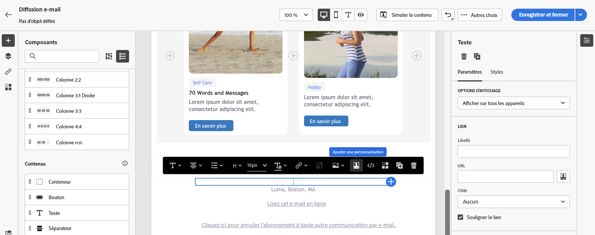

# Ajouter des blocs de contenu intégrés {#ootb-content-blocks}

Adobe Campaign propose une liste de blocs de contenus pré-paramétrés. Ces blocs de contenu sont dynamiques, personnalisés et contiennent un rendu spécifique que vous pouvez insérer dans vos diffusions. Vous pouvez par exemple ajouter un logo, un message de salutations ou un lien vers une page miroir.

Pour ajouter un bloc de contenu dans une diffusion, procédez comme suit :

1. Ouvrez une diffusion et modifiez son contenu.

1. Localisez le champ dans lequel vous souhaitez ajouter un bloc de contenu et cliquez sur l’icône **[!UICONTROL Ouvrir la boîte de dialogue de personnalisation]** pour afficher l’éditeur d’expression.

   {zoomable=&quot;yes&quot;}{width="800" align="center"}

1. Dans l’éditeur d’expression, accédez au menu de gauche **[!UICONTROL Blocs de contenu]**.

1. Pour ajouter un bloc de contenu, placez le curseur de la souris à l’emplacement souhaité au sein de votre contenu, puis cliquez sur le bouton « + » pour l’insérer.

   {zoomable=&quot;yes&quot;}{width="800" align="center"}

Les blocs de contenu intégrés sont les suivants :

* **[!UICONTROL Bannière de désinscription par défaut]**
* **[!UICONTROL Enabled by Adobe Campaign]** : insère le logo « Enabled by Adobe Campaign ».
* **[!UICONTROL Fonction de formatage des noms corrects]**: génère la variable **[!UICONTROL toSmartCase]** fonction JavaScript qui remplace la première lettre de chaque mot par la majuscule.
* **[!UICONTROL Salutations]** : permet d’insérer des salutations avec le nom complet du ou de la destinataire, suivi d’une virgule. Exemple : « Bonjour Pierre Martin, ».
* **[!UICONTROL Insertion du logo]** : insère un logo défini dans les paramètres de l’instance.
* **[!UICONTROL Lien vers la page miroir]** : insère un lien vers la [page miroir](../email/mirror-page.md). Le format par défaut est : « Si vous ne parvenez pas à voir correctement ce message, cliquez ici »
* **[!UICONTROL URL de page miroir]** : insère l’URL de page miroir qui permet aux concepteurs et conceptrices de diffusion de vérifier le lien.
* **[!UICONTROL Style de notification]**
* **[!UICONTROL URL d’acceptation d’une offre en mode unitaire]** : insère une URL permettant de définir une offre comme étant **[!UICONTROL Acceptée]**. (Ce bloc est disponible si le module Interaction est activé).
* **[!UICONTROL Confirmation de votre inscription]** : insère un lien permettant de confirmer l’abonnement.
* **[!UICONTROL Lien d’inscription]** : insère un lien d’abonnement. Ce lien est défini dans les paramètres de l’instance. Le contenu par défaut est le suivant : « Pour vous inscrire, cliquez ici. ».
* **[!UICONTROL Lien d’inscription (avec parrain)]** : insère un lien d’abonnement permettant d’identifier le visiteur ou la visiteuse et la diffusion. Ce lien est défini dans les paramètres de l’instance.
* **[!UICONTROL URL de la page d’inscription]** : insère une URL d’abonnement.
* Liens de partage vers les réseaux sociaux
* **[!UICONTROL Style des e-mails de contenu]** et **[!UICONTROL Style de notification]** : permettent de générer un code qui formate l’e-mail avec les styles HTML par défaut.
* **[!UICONTROL Lien de désinscription]** : insère un lien permettant de se désabonner de toutes les diffusions (liste bloquée). Le contenu associé par défaut est : « Vous recevez ce message car vous avez été en contact avec ***nom de votre organisation*** ou une entité associée. Pour ne plus recevoir de messages de ***nom de votre organisation***, cliquez ici. »

>[!NOTE]
>
>Vous pouvez définir de nouveaux blocs à partir de la console Adobe Campaign v8 afin d’optimiser la personnalisation de vos diffusions. En savoir plus dans la [documentation de Campaign v8 (console cliente)](https://experienceleague.adobe.com/docs/campaign/campaign-v8/campaigns/send/personalize/personalization-blocks.html?lang=fr#create-custom-personalization-blocks){target="_blank"}.
