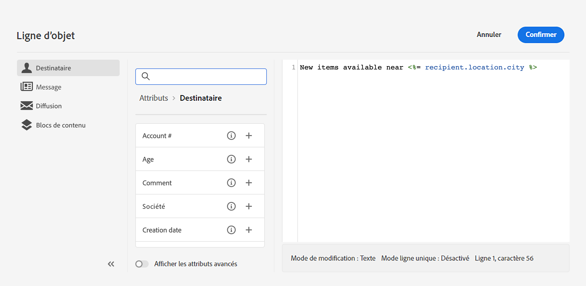
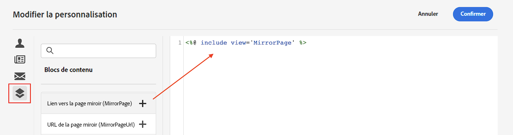
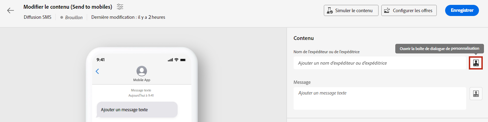
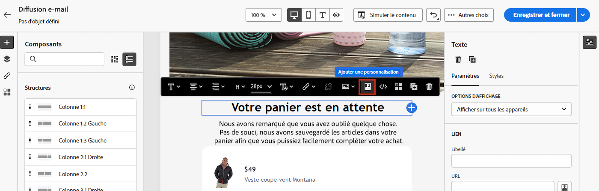
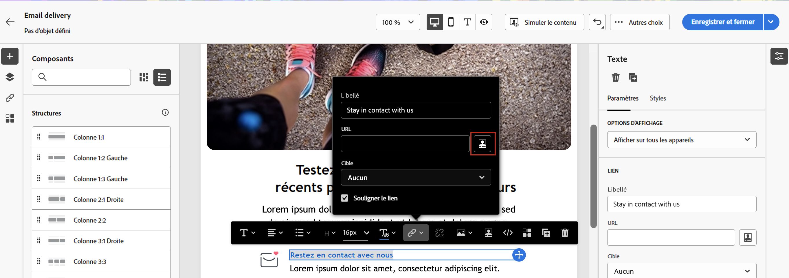

# Prise en main du contenu dynamique

Pour tirer le meilleur parti de chaque campagne marketing, Adobe Campaign vous offre un moyen de diffuser du contenu dynamique personnalisé qui s’adresse aux clients à leur niveau. En fonction des données de profil, utilisez les fonctionnalités de personnalisation pour créer une expérience personnalisée pour différents groupes et individus : vous pouvez adapter vos messages à chaque destinataire spécifique en exploitant les données et informations dont vous disposez à son sujet. Il peut s’agir de son prénom, de ses centres d’intérêts, de l’endroit où il/elle vit, de ses achats et bien plus encore.

Utilisez Campaign pour créer du contenu dynamique et envoyer des messages personnalisés. Vous pouvez cumuler les fonctionnalités de personnalisation afin d’améliorer vos messages et créer une expérience utilisateur personnalisée.

Vous pouvez rendre le contenu de votre message dynamique en insérant :

* **Champs de personnalisation**: Les champs de personnalisation sont utilisés pour la personnalisation de premier niveau de vos messages. Vous pouvez sélectionner n’importe quel champ disponible dans la base de données de l’éditeur de personnalisation. Pour une diffusion, vous pouvez sélectionner n’importe quel champ associé au ou à la destinataire, au message ou à la diffusion. Ces attributs de personnalisation peuvent être insérés dans l’objet ou dans le corps de vos messages.

   La syntaxe suivante insère la ville du ou de la destinataire dans votre contenu : &lt;%= recipient.location.city %>.

   

* **Contenu conditionnel**: Configurez du contenu conditionnel pour ajouter du contenu en fonction du profil du destinataire, par exemple. Lorsqu’une condition est rencontrée, des blocs de texte et/ou des images sont alors insérés. Vous pouvez définir la version alternative du contenu lorsque la condition n’est pas vraie.

* **Blocs de contenu intégrés**: Campaign est fourni avec un ensemble de blocs de personnalisation qui contiennent un rendu spécifique que vous pouvez insérer dans vos diffusions. Vous pouvez par exemple ajouter un logo, un message de salutations ou un lien vers la page miroir d’un message électronique. Les blocs de contenu sont disponibles à partir d’une entrée dédiée dans l’éditeur de personnalisation.

   

## Où ajouter du contenu dynamique ?

Adobe Campaign V8 Web fournit un éditeur d’expression dans lequel vous pouvez sélectionner, organiser, personnaliser et valider toutes les données afin de créer une expérience personnalisée pour votre contenu. L’éditeur d’expression est disponible pour tous les canaux, dans tous les champs de la variable **[!UICONTROL Ouvrir la boîte de dialogue de personnalisation]** par exemple, le champ de ligne d’objet ou les liens d’e-mail et les composants de contenu texte/bouton.

>[!NOTE]
>
>Outre l’éditeur d’expression, vous pouvez également utiliser un créateur de contenu conditionnel dédié lors de la conception d’un email. [Découvrez comment créer du contenu conditionnel dans les emails](conditions.md)

*Accès à l&#39;éditeur d&#39;expression à partir du champ Nom de l&#39;expéditeur*

*Accès à l’éditeur d’expression à partir d’un composant de texte d’email*

*Accès à l&#39;éditeur d&#39;expression à partir d&#39;un lien dans un email*

## Explorons plus en détail

Maintenant que vous savez comment rendre votre contenu dynamique, il est temps d’examiner plus en détail ces sections de documentation pour commencer à utiliser cette fonctionnalité.

<table style="table-layout:fixed"><tr style="border: 0;">
<td>

<a href="personalize.md"><strong>Ajouter de la personnalisation</strong></a>

</td>
<td>

<a href="conditions.md"><strong>Ajouter du contenu conditionnel</strong>

</td>
<td>

<a href="content-blocks.md"><strong>Ajout de blocs de contenu intégrés</strong></a>

</td>
</tr></table>
