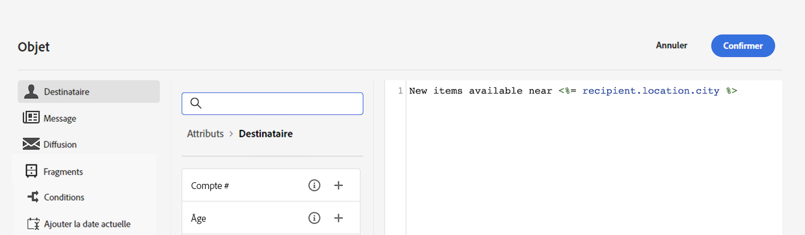

# Prise en main du contenu dynamique

>[!CONTEXTUALHELP]
>id="acw_targetdata_personalization_dashboard"
>title="Personnalisation"
>abstract="L’éditeur d’expression vous permet de sélectionner, organiser, personnaliser et valider toutes les données afin de créer une expérience personnalisée pour votre contenu. Vous pouvez personnaliser vos messages pour chaque destinataire en exploitant les données de son profil, et créer un contenu conditionnel afin d&#39;adapter votre message à chaque destinataire et uniquement afficher le contenu pertinent. De plus, des blocs de personnalisation sont disponibles pour ajouter du contenu personnalisé prédéfini à vos diffusions."

En tant que marketeur, il est essentiel de cibler les clients véritablement intéressés par vos offres et de les impliquer dans la diffusion de contenu efficace et pertinent. Étant donné la diversité des destinataires que vous rencontrez, la création de plusieurs éléments de contenu marketing pour séduire différentes personnes peut être fastidieuse et coûteuse en temps. C’est là que le contenu dynamique entre en jeu.

Les fonctionnalités de contenu dynamique web d’Adobe Campaign vous permettent de personnaliser votre contenu en fonction des informations que vous avez collectées sur vos destinataires. L’utilisation de contenu dynamique vous permet de vous assurer que vos efforts marketing sont plus pertinents, en évitant les produits ou services indésirables ou inutiles en marketing. Cette approche rend votre contenu plus attrayant et augmente la probabilité qu’il soit lu. De plus, il vous permet de personnaliser votre contenu, donnant aux destinataires l’impression de recevoir des informations d’une personne plutôt que d’une machine.

## Comment rendre votre contenu dynamique ?

Vous pouvez rendre le contenu de votre message dynamique en insérant des éléments JavaScript dans l&#39;éditeur d&#39;expression Web de Campaign. Lors de l&#39;envoi d&#39;un message, ces expressions sont interprétées par Adobe Campaign afin de diffuser le contenu correct à chacun de vos destinataires :

* **Personnaliser vos messages** à chaque destinataire spécifique en exploitant des données de profil telles que son prénom, ses centres d’intérêt, son lieu de vie, ses achats, etc. Vous pouvez sélectionner n&#39;importe quel champ disponible dans la base depuis l&#39;éditeur de personnalisation associé au destinataire, au message ou à la diffusion. Ces attributs de personnalisation peuvent être insérés dans l’objet ou dans le corps de vos messages. La syntaxe suivante insère la ville du ou de la destinataire dans votre contenu : &lt;%= recipient.location.city %>.

  {width="800" align="center"}

* **Création de contenu conditionnel** pour adapter vos diffusions à chaque destinataire et afficher uniquement le contenu pertinent pour un client donné en fonction des informations que vous avez à son sujet. Vous pouvez ainsi afficher des blocs de texte et/ou des images spécifiques en fonction de conditions. Par exemple, adaptez une bannière d&#39;email en fonction de l&#39;abonnement des destinataires à un service spécifique.

  {width="800" align="center"}

* **Utiliser des blocs de personnalisation** pour gagner du temps et exploiter facilement le contenu personnalisé réutilisable dans vos messages. Campaign est fourni avec un ensemble de blocs de personnalisation qui contiennent un rendu spécifique que vous pouvez insérer dans vos diffusions. Vous pouvez par exemple ajouter un logo, un message de salutations ou un lien vers la page miroir d’un message électronique. Les blocs de contenu sont disponibles à partir d’une entrée dédiée dans l’éditeur de personnalisation.

  {width="800" align="center"}

## Accès à l’éditeur d’expression {#access}

Adobe Campaign V8 Web fournit un éditeur d’expression dans lequel vous pouvez sélectionner, organiser, personnaliser et valider toutes les données afin de créer une expérience personnalisée pour votre contenu. L’éditeur d’expression est disponible pour tous les canaux, dans tous les champs de la variable **[!UICONTROL Ouvrir la boîte de dialogue de personnalisation]** par exemple, le champ de ligne d’objet ou les liens d’e-mail et les composants de contenu texte/bouton.

Voici quelques exemples d’accès à l’éditeur d’expression en fonction du contenu que vous souhaitez rendre dynamique :

* *Accès à l&#39;éditeur d&#39;expression à partir du champ Nom de l&#39;expéditeur*

  {width="800" align="center"}

* *Accès à l’éditeur d’expression à partir d’un composant de texte d’email*

  {width="800" align="center"}

* *Accès à l&#39;éditeur d&#39;expression à partir d&#39;un lien dans un email*

  {width="800" align="center"}

>[!NOTE]
>
>Outre l’éditeur d’expression, vous pouvez également utiliser un créateur de contenu conditionnel dédié lors de la conception d’un email. [Découvrez comment créer du contenu conditionnel dans les emails](conditions.md)

## Explorons plus en détail

Maintenant que vous savez comment rendre votre contenu dynamique, il est temps d’examiner plus en détail ces sections de documentation pour commencer à utiliser cette fonctionnalité.

<table style="table-layout:fixed"><tr style="border: 0;">
<td>

<a href="personalize.md"><strong>Ajouter de la personnalisation</strong></a>

</td>
<td>

<a href="conditions.md"><strong>Ajouter du contenu conditionnel</strong>

</td>
<td>

<a href="content-blocks.md"><strong>Ajout de blocs de contenu intégrés</strong></a>

</td>
</tr></table>
