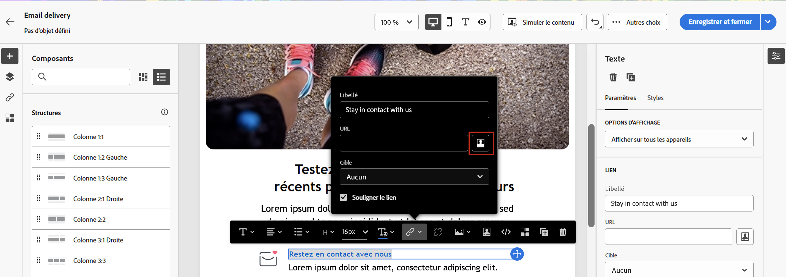

# Personnaliser votre contenu{#add-personalization}

## Personnaliser l&#39;objet d&#39;un message {#personalize-subject-line}

Pour ajouter de la personnalisation dans le champ **[!UICONTROL Objet]** du message, procédez comme suit :

1. Ouvrez une diffusion et cliquez sur **[!UICONTROL Modifier le contenu]**.
1. Cliquez sur le bouton **[!UICONTROL Ouvrir la boîte de dialogue de personnalisation]** à droite de la **[!UICONTROL Objet]** pour les emails, ou le champ **[!UICONTROL Titre]** des champs pour les diffusions push/SMS.

   {width="600"}

1. Saisissez l’objet ou le titre, puis sélectionnez les attributs de personnalisation à ajouter.

1. Cliquez sur **[!UICONTROL Confirmer]** pour valider. Les attributs de personnalisation sont ajoutés au contenu.

## Personnaliser le contenu de vos e-mails {#personalize-emails}

Pour personnaliser le contenu des e-mails, ouvrez le message dans le concepteur d’e-mail et :

1. Cliquez à l’intérieur d’un bloc de texte.
1. Dans la barre d’outils contextuelle, sélectionnez **[!UICONTROL Ajouter une personnalisation]**.

   

1. Insérez le nom du ou de la destinataire dans l’éditeur de personnalisation et confirmez.

   

   L’attribut de personnalisation est ajouté au contenu de l’e-mail.

   Vous pouvez simuler le contenu pour vérifier le rendu. [En savoir plus](../preview-test/preview-content.md)

   

1. Pour ajouter un bloc de contenu à votre e-mail, procédez de la même manière et sélectionnez un bloc de contenu à partir de la dernière icône :

   

1. Une fois inséré, le bloc de contenu est ajouté au contenu de l’e-mail. Il est automatiquement adapté au profil du ou de la destinataire lors de la génération de la personnalisation, à l’étape de préparation de la diffusion.

   

## Personnaliser les liens dans vos e-mails {#personalize-links}

Pour personnaliser un **lien** :

1. Sélectionnez un bloc de texte ou une image.
1. Dans la barre d’outils contextuelle, sélectionnez **Insérer un lien**.

   

1. Saisissez le libellé du lien et utilisez le bouton **Insérer un lien** pour personnaliser le lien.

   

1. Utilisez l’éditeur de personnalisation pour définir et personnaliser le lien, puis confirmez.

   

## Personnaliser vos offres {#personalize-offers}

Vous pouvez également accéder à l’éditeur de personnalisation lorsque vous ajoutez du contenu de type texte aux représentations de vos offres. En savoir plus dans [cette section](../content/offers.md).

