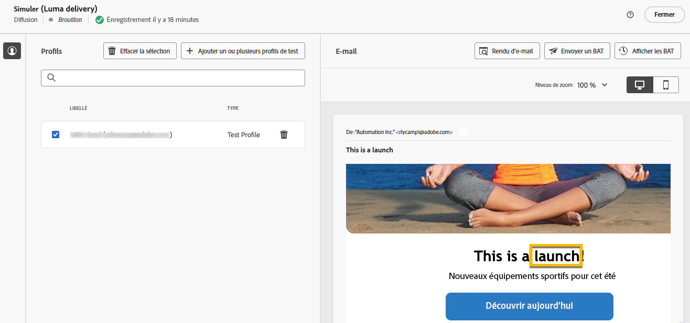

# Personnaliser votre contenu {#add-personalization}

>[!CONTEXTUALHELP]
>id="acw_personalization_editor_add_current_date"
>title="Ajouter la date actuelle"
>abstract="Ce menu fournit des fonctions liées à la mise en forme des dates que vous pouvez utiliser pour personnaliser votre contenu."

La personnalisation du contenu de la diffusion est une fonctionnalité clé qui vous permet d’adapter les messages à chaque personne destinataire, rendant ainsi la communication plus pertinente et attrayante.

Dans Adobe Campaign, en utilisant des [données de profil](#data-personalization) telles que le nom, l’emplacement ou les interactions antérieures du profil, et des [variables spécifiques de votre diffusion](#variables-personalization), vous personnalisez dynamiquement des éléments tels que du texte, des images et des offres dans votre communication.

La personnalisation de la diffusion améliore l’expérience client et les taux d’engagement, ce qui entraîne une conversion plus élevée et une plus grande satisfaction de la clientèle.

## Utiliser des données de profil pour la personnalisation {#data-personalization}

Vous personnalisez n’importe quelle diffusion avec des données de profil à l’aide de l’éditeur d’expression, accessible dans les champs de l’icône **[!UICONTROL Ouvrir la boîte de dialogue de personnalisation]**, comme l’objet, les liens d’e-mail et les composants de contenu de texte/bouton. [Découvrez comment accéder à l’éditeur d’expression](gs-personalization.md/#access).

### Syntaxe de la personnalisation {#syntax}

Les balises de personnalisation suivent une syntaxe spécifique : `<%= table.field %>`. Par exemple, pour insérer le nom de la personne destinataire dans le tableau des destinataires, utilisez la syntaxe `<%= recipient.lastName %>`.

Pendant le processus de préparation de la diffusion, Adobe Campaign interprète ces balises et les remplace par les valeurs de champ correspondantes pour chaque personne destinataire. Vous visualisez le remplacement réel en simulant votre contenu.

Lors du chargement de contacts depuis un fichier externe pour une diffusion e-mail autonome, tous les champs du fichier d’entrée peuvent être personnalisés. La syntaxe est la suivante : `<%= dataSource.field %>`.

### Ajouter des balises de personnalisation {#add}

Pour ajouter des balises de personnalisation dans une diffusion, procédez comme suit :

1. Ouvrez l’éditeur d’expression à l’aide de l’icône **[!UICONTROL Ouvrir la boîte de dialogue de personnalisation]** accessible à partir des champs de modification de type texte, tels que l’objet ou le corps du SMS. [Découvrez comment accéder à l’éditeur d’expression](gs-personalization.md/#access).

   {zoomable="yes"}{width="800" align="center"}

1. L’éditeur d’expression s’ouvre. Les champs de personnalisation disponibles dans la base de données d’Adobe Campaign sont organisés en plusieurs menus dans la partie gauche de l’écran :

   {zoomable="yes"}{width="800" align="center"}

   | Menu | Description |
   |------|-------------|
   | {zoomable="yes"} | Le menu **[!UICONTROL Application des abonnées et abonnés]** répertorie les champs liés aux abonnées et abonnés d’une application, tels que le terminal utilisé ou le système d’exploitation. *Ce menu est disponible uniquement pour les notifications push.* |
   | {zoomable="yes"} | Le menu **[!UICONTROL Destinataire]** répertorie les champs définis dans le tableau des destinataires, tels que les noms, âges ou adresses des destinataires. Lors du [chargement des contacts depuis un fichier externe](../audience/file-audience.md) pour une diffusion e-mail autonome, ce menu répertorie tous les champs disponibles dans le fichier d’entrée. |
   | {zoomable="yes"} | Le menu **[!UICONTROL Message]** répertorie les champs liés aux logs de diffusion, y compris tous les messages envoyés aux personnes destinataires ou aux appareils sur tous les canaux, comme la date du dernier événement avec une personne destinataire donnée. |
   | {zoomable="yes"} | Le menu **[!UICONTROL Diffusion]** répertorie les champs liés aux paramètres requis pour effectuer des diffusions, tels que le canal ou le libellé de la diffusion. |

   >[!NOTE]
   >
   >Par défaut, chaque menu répertorie tous les champs du tableau sélectionné (Destinataires/Message/Diffusion). Si vous souhaitez inclure des champs issus de tableaux liées au tableau sélectionné, activez l’option **[!UICONTROL Afficher les attributs avancés]** située sous la liste.

1. Pour ajouter un champ de personnalisation, positionnez-vous à l’emplacement souhaité dans votre contenu, puis cliquez sur le bouton `+` pour l’insérer.

1. Une fois votre contenu prêt, enregistrez-le et testez le rendu de la personnalisation en simulant votre contenu. L’exemple ci-dessous illustre la personnalisation d’un SMS avec les prénoms des destinataires.

   {zoomable="yes"}{width="800" align="center"}

   {zoomable="yes"}{width="800" align="center"}

## Utilisation de variables pour la personnalisation {#variables-personalization}

Vous utilisez également des variables pour personnaliser votre diffusion. En savoir plus sur l’[ajout de variables à une diffusion](../advanced-settings/delivery-settings.md#variables-delivery).

Par exemple, la variable `deliveryType` est définie comme illustré ci-dessous.

{zoomable="yes"}

Cette variable est utilisée dans le contenu de la diffusion à l’aide de l’icône **[!UICONTROL Ajouter une personnalisation]** et l’expression `<%= variables.deliveryType %>` de cet exemple.

{zoomable="yes"}

Vérifiez l’utilisation de votre variable à l’aide du bouton **[!UICONTROL Simuler le contenu]**.

{zoomable="yes"}