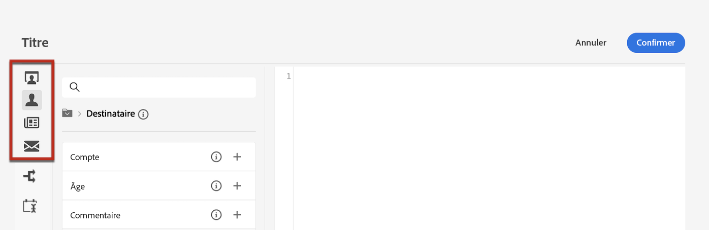

# Personnaliser votre contenu{#add-personalization}

La personnalisation peut être ajoutée à n&#39;importe quelle diffusion à l&#39;aide de l&#39;éditeur d&#39;expression.

Une balise de personnalisation utilise toujours la syntaxe suivante : `<%=table.field%>`.Par exemple, pour insérer le nom du destinataire, stocké dans la table des destinataires, la balise de personnalisation utilise la syntaxe &lt;%= recipient.lastName %> .

Lors de la préparation d&#39;une diffusion, ces balises sont automatiquement interprétées par Adobe Campaign et remplacées par la valeur du champ pour un destinataire donné. Le remplacement physique peut ensuite être visualisé lors de la simulation de votre contenu.

Pour ajouter des balises de personnalisation dans une diffusion, cliquez sur l&#39;icône Ouvrir la boîte de dialogue de personnalisation accessible à partir des champs d&#39;édition de type texte, tels que la ligne d&#39;objet ou le corps du SMS.

L’éditeur d’expression s’affiche. Les champs de personnalisation sont organisés en trois menus, situés à gauche de l&#39;écran. Ces menus donnent accès à tous les champs disponibles dans la base de données Adobe Campaign.

| Menu | Description |
|-----|------------|
|  | Le **[!UICONTROL Destinataire]** répertorie tous les champs définis dans la table des destinataires, tels que le nom, l’âge ou l’adresse du destinataire. |
|  | Le **[!UICONTROL Message]** menu répertorie tous les champs liés aux logs de diffusion, c’est-à-dire tous les messages envoyés aux destinataires ou aux appareils sur tous les canaux, comme la date du dernier événement avec un destinataire donné. |
|  | Le **[!UICONTROL Diffusion]** répertorie tous les champs relatifs aux paramètres requis pour effectuer des diffusions, tels que le canal de diffusion, le libellé, etc. |

>[!NOTE]
>
>Par défaut, la liste affiche tous les champs de la table sélectionnée (Destinataires / Message / Diffusion). Si vous souhaitez inclure des champs issus de tables liées à la table sélectionnée, activez l’option **[!UICONTROL Afficher les attributs avancés]** située sous la liste.

Pour ajouter un champ de personnalisation, placez le curseur à l’emplacement souhaité dans votre contenu, puis cliquez sur le bouton + pour l’insérer.

## Personnaliser le contenu de vos e-mails {#personalize-emails}

Pour personnaliser le contenu des e-mails, ouvrez le message dans le concepteur d’e-mail et :

1. Cliquez à l’intérieur d’un bloc de texte.
1. Dans la barre d’outils contextuelle, sélectionnez **[!UICONTROL Ajouter une personnalisation]**.

   

1. Insérez le nom du ou de la destinataire dans l’éditeur de personnalisation et confirmez.

   

   L’attribut de personnalisation est ajouté au contenu de l’e-mail.

   Vous pouvez simuler le contenu pour vérifier le rendu. [En savoir plus](../preview-test/preview-content.md)

   

1. Pour ajouter un bloc de contenu à votre e-mail, procédez de la même manière et sélectionnez un bloc de contenu à partir de la dernière icône :

   

1. Une fois inséré, le bloc de contenu est ajouté au contenu de l’e-mail. Il est automatiquement adapté au profil du ou de la destinataire lors de la génération de la personnalisation, à l’étape de préparation de la diffusion.

   

## Personnaliser vos offres {#personalize-offers}

Vous pouvez également accéder à l’éditeur de personnalisation lorsque vous ajoutez du contenu de type texte aux représentations de vos offres. En savoir plus dans [cette section](../content/offers.md).

