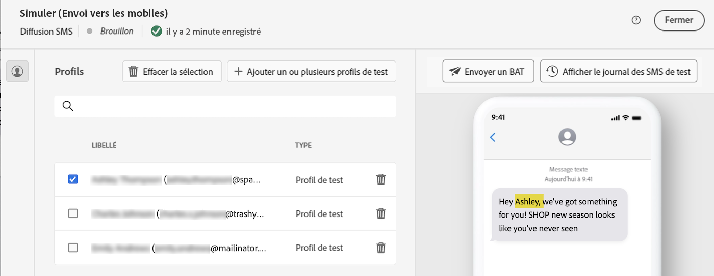

# Personnaliser votre contenu {#add-personalization}

Vous pouvez personnaliser n’importe quelle diffusion à l’aide de l’éditeur d’expression, accessible dans les champs de la variable **[!UICONTROL Ouvrir la boîte de dialogue de personnalisation]** par exemple, l’objet, les liens d’e-mail et les composants de contenu texte/bouton. [Découvrez comment accéder à l’éditeur d’expression](gs-personalization.md/#access)

## Syntaxe de la personnalisation {#syntax}

Les balises de personnalisation suivent une syntaxe spécifique : `<%=table.field%>`. Par exemple, pour insérer le nom du destinataire dans la table des destinataires, utilisez le `<%= recipient.lastName %>` syntaxe.

Pendant le processus de préparation de la diffusion, Adobe Campaign interprète automatiquement ces balises et les remplace par les valeurs de champ correspondantes pour chaque destinataire. Vous pouvez visualiser le remplacement réel en simulant votre contenu.

## Ajout de balises de personnalisation {#add}

Pour ajouter des balises de personnalisation dans une diffusion, procédez comme suit :

1. Ouvrez l’éditeur d’expression à l’aide du **[!UICONTROL Ouvrir la boîte de dialogue de personnalisation]** icône accessible à partir des champs de modification de type texte, tels que l’objet ou le corps du SMS. [Découvrez comment accéder à l’éditeur d’expression](gs-personalization.md/#access)

   {width="800" align="center"}

1. L’éditeur d’expression s’ouvre. Les champs de personnalisation disponibles dans la base de données Adobe Campaign sont organisés en plusieurs menus dans la partie gauche de l&#39;écran :

   {width="800" align="center"}

   | Menu | Description |
   |-----|------------|
   |  | Le **[!UICONTROL Application d’abonnements]** menu répertorie les champs liés aux abonnés d’une application, tels que le terminal utilisé ou le système d’exploitation. *Ce menu est disponible uniquement pour les notifications push* |
   |  | Le **[!UICONTROL Destinataire]** menu liste les champs définis dans la table des destinataires, tels que les noms, âges ou adresses des destinataires. |
   |  | Le **[!UICONTROL Message]** Le menu répertorie les champs liés aux logs de diffusion, y compris tous les messages envoyés aux destinataires ou aux appareils sur tous les canaux, comme la date du dernier événement avec un destinataire donné. |
   |  | Le **[!UICONTROL Diffusion]** Le menu répertorie les champs liés aux paramètres requis pour effectuer des diffusions, tels que le canal ou le libellé de la diffusion. |

   >[!NOTE]
   >
   >Par défaut, chaque menu répertorie tous les champs de la table sélectionnée (Destinataires / Message / Diffusion). Si vous souhaitez inclure des champs issus de tables liées à la table sélectionnée, activez l’option **[!UICONTROL Afficher les attributs avancés]** située sous la liste.

1. Pour ajouter un champ de personnalisation, positionnez-vous à l’emplacement souhaité dans votre contenu, puis cliquez sur le bouton `+` pour l’insérer.

1. Une fois votre contenu prêt, vous pouvez l’enregistrer et tester le rendu de la personnalisation en simulant votre contenu. L&#39;exemple ci-dessous illustre la personnalisation d&#39;un SMS avec les prénoms des destinataires.

   {width="800" align="center"}

   {width="800" align="center"}
