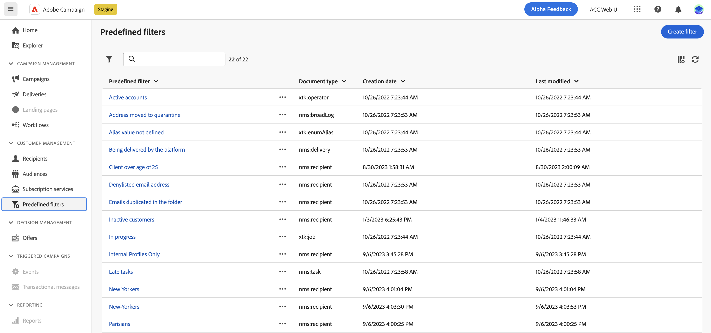

# Utilisation de filtres prédéfinis {#predefined-filters}

>[!CONTEXTUALHELP]
>id="acw_homepage_card3"
>title="Gestion des filtres prédéfinis"
>abstract="Le web de Campaign vous offre désormais une interface conviviale pour gérer et personnaliser facilement des filtres prédéfinis en fonction de vos besoins spécifiques. Créez une fois et enregistrez pour une utilisation ultérieure."

>[!CONTEXTUALHELP]
>id="acw_predefined-filters-dashboard"
>title="Filtres prédéfinis"
>abstract="Le web de Campaign vous offre désormais une interface conviviale pour gérer et personnaliser facilement des filtres prédéfinis en fonction de vos besoins spécifiques. Créez une fois et enregistrez pour une utilisation ultérieure."

Les filtres prédéfinis sont des filtres personnalisés qui peuvent être utilisés ultérieurement. Ils peuvent être utilisés comme raccourcis lors des opérations de filtrage avec le créateur de règles.

## Créer un filtre prédéfini {#create-predefined-filter}

>[!CONTEXTUALHELP]
>id="acw_predefined-filters-creation"
>title="Créer un filtre prédéfini"
>abstract="Saisissez un libellé pour le filtre prédéfini et sélectionnez le tableau auquel il s&#39;applique. Ouvrez les options supplémentaires pour ajouter une description et définir ce filtre comme favori. Utilisez ensuite le bouton &quot;Créer une règle&quot; pour définir les conditions de filtrage."

Lors de la création d’un filtre à l’aide du créateur de règles, vous pouvez l’enregistrer pour une utilisation ultérieure. Lorsqu’il est enregistré en tant que filtre personnalisé, il peut être utilisé ultérieurement. Vous pouvez également créer et modifier un filtre prédéfini à partir du menu dédié dans le volet de navigation de gauche.

Pour enregistrer un filtre personnalisé dans le créateur de règles, procédez comme suit :

1. Ouvrez le créateur de règles et définissez vos conditions de filtrage. Dans l&#39;exemple ci-dessous, vous filtrez les destinataires qui vivent à Madrid.
1. Cliquez sur le bouton **Sélectionner ou enregistrer un filtre** et sélectionnez **Enregistrer en tant que filtre**.

   

1. Sélectionner **Créer un nouveau filtre**, puis saisissez un nom et une description pour ce filtre.

   

1. (facultatif) Activez la variable **Enregistrer en tant que favori** si vous souhaitez voir ce filtre prédéfini dans vos favoris.

   

1. Cliquez sur **Confirmer** pour sauvegarder vos changements.

Votre filtre personnalisé est désormais disponible dans la **Filtres prédéfinis** Liste et accessible à tous les utilisateurs de Campaign.

## Utiliser un filtre prédéfini {#use-predefined-filter}

## Gestion des filtres prédéfinis {#manage-predefined-filter}

