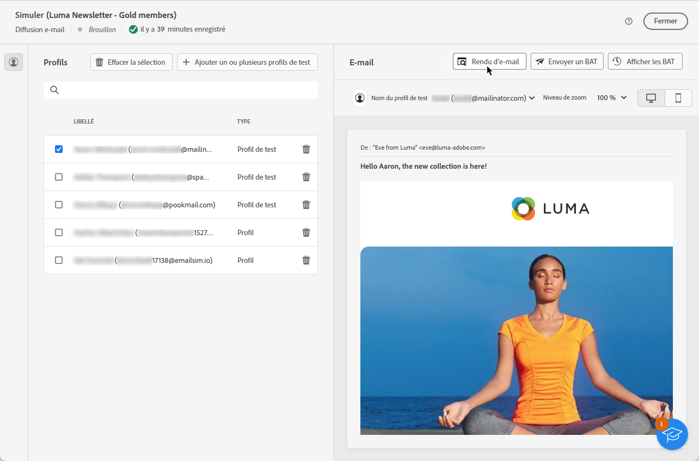

# Tester le rendu des e-mails {#email-rendering}

Avant d’envoyer votre e-mail, vérifiez que l’affichage de votre message est optimal pour les destinataires sur divers clients web et appareils.

Pour ce faire, utilisez votre compte **Litmus** dans [!DNL Adobe Campaign] pour prévisualiser instantanément le rendu de vos e-mails dans différents contextes. Vous pouvez ainsi vérifier la compatibilité avec les principaux services de messagerie web, applications de bureau, appareils mobiles, etc.

>[!CAUTION]
>
>Lors de l’utilisation du rendu des e-mails dans Campaign, un BAT est envoyé à un système tiers. En connectant votre compte Litmus à [!DNL Campaign], vous reconnaissez qu’Adobe n’est responsable d’aucune donnée que vous pouvez envoyer à ce tiers. La politique de conservation des données des e-mails de Litmus s’applique à ces e-mails, y compris pour les données de personnalisation qui peuvent être incluses dans ces BAT. Pour accéder à ces données ou les supprimer, contactez directement Litmus.

Pour accéder aux fonctionnalités de rendu des e-mails, remplissez les conditions préalables suivantes :

* Possédez un compte Litmus.
* Sélectionnez des profils et/ou des profils de test. Découvrez comment dans [cette section](preview-content.md).

Suivez ensuite les étapes ci-dessous.

1. Dans l’écran [Modifier le contenu](../email/edit-content.md) ou dans le [concepteur d’e-mail](../email/get-started-email-designer.md), cliquez sur le bouton **[!UICONTROL Simuler le contenu]**.

1. Cliquez sur le bouton **[!UICONTROL Rendu d’e-mail]**.

   {zoomable="yes"}

1. Cliquez sur **Connecter votre compte Litmus** dans la section supérieure droite.

   {zoomable="yes"}

1. Saisissez vos informations d’identification et connectez-vous.

   {zoomable="yes"}

1. Cliquez sur le bouton **Exécuter le test** pour générer les aperçus d’e-mail.

1. Examinez le contenu des e-mails tel qu’il s’affiche sur les principaux clients de bureau, mobiles et web.

   {zoomable="yes"}

<!--
TO CHECK IF user is directed to Litmus or if the email rendering is shown directly in the Campaign UI.

CONTENT ABOVE COPIED FROM AJO

If not redirecting to Litmus:

To test the email rendering, follow these steps:

1. Access the email content creation screen, then click **[!UICONTROL Simulate content]**.

1. Click the **[!UICONTROL Render email]** button.

    The left pane provides various desktop, mobile, and web-based email clients. Select the desired email client to display a preview of your email in the right pane. 

    {zoomable="yes"}

    >[!NOTE]
    >
    >The email clients list provides a sample of the major mail clients. Additional email clients are available from the filter button next to the top search bar.

 -->