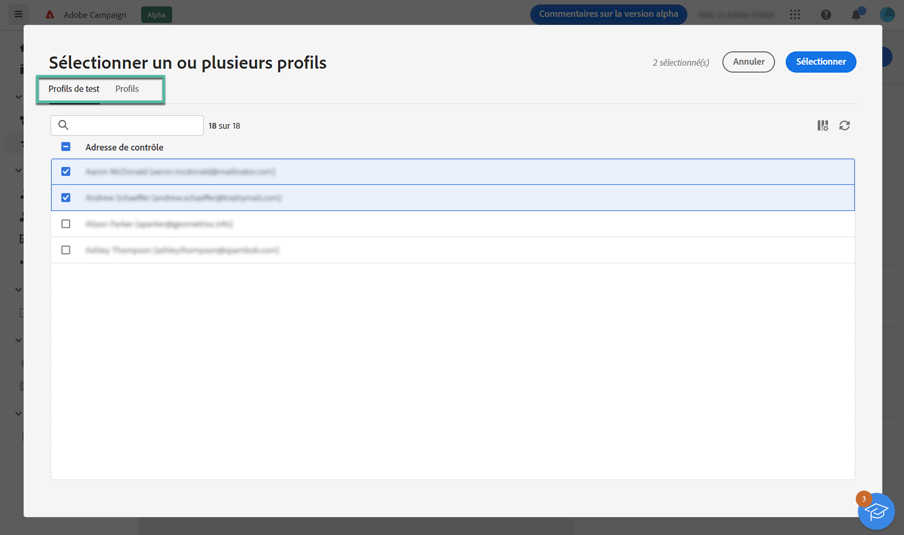
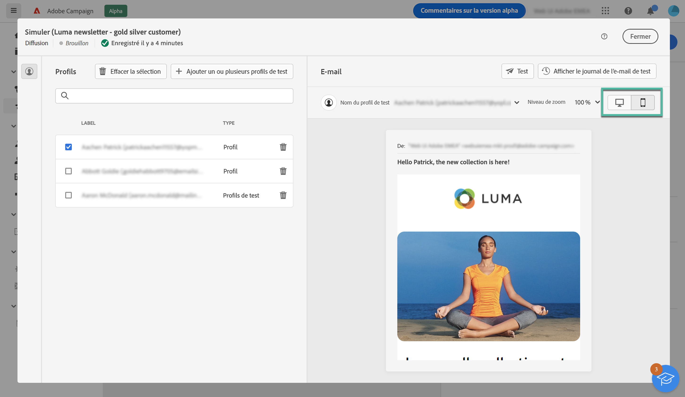

# Prévisualiser le contenu d’un e-mail {#preview}

>[!NOTE]
>
>Cette documentation est en cours d’élaboration et est fréquemment mise à jour. La version finale de ce contenu sera prête en janvier 2023.

Adobe Campaign permet d’utiliser des profils pour prévisualiser le contenu de votre e-mail avant l’envoi afin de vérifier la personnalisation et la manière dont vos destinataires les verront.

Vous pouvez prévisualiser les messages à l’aide des éléments suivants :

* **Profils de test** : prévisualisez l’e-mail à l’aide d’adresses de contrôle, qui correspondent à des destinataires supplémentaires de la base de données, et qui ne font pas partie de la cible de l’e-mail,
* **Profils** : prévisualisez l’e-mail à l’aide d’un profil existant.

Pour prévisualiser le contenu de votre e-mail, procédez comme suit :

1. Accédez à l’écran de création de contenu d’e-mail, puis cliquez sur **[!UICONTROL Simuler du contenu]**.

1. Cliquez sur le bouton **[!UICONTROL Sélectionner un ou plusieurs profils]**, puis utilisez l’onglet **[!UICONTROL Profils de test]** et **[!UICONTROL Profils]** pour sélectionner un ou plusieurs profils.

   Vous pouvez combiner les profils de test et les profils pour prévisualiser l’e-mail.

   

1. Une fois les profils sélectionnés, un aperçu de l’e-mail s’affiche dans le volet de droite. Les éléments personnalisés sont remplacés par les données du profil sélectionné dans le volet de gauche.

   Si vous avez ajouté plusieurs profils, vous pouvez passer d’un profil à l’autre dans la liste pour prévisualiser l’e-mail correspondant.

   
