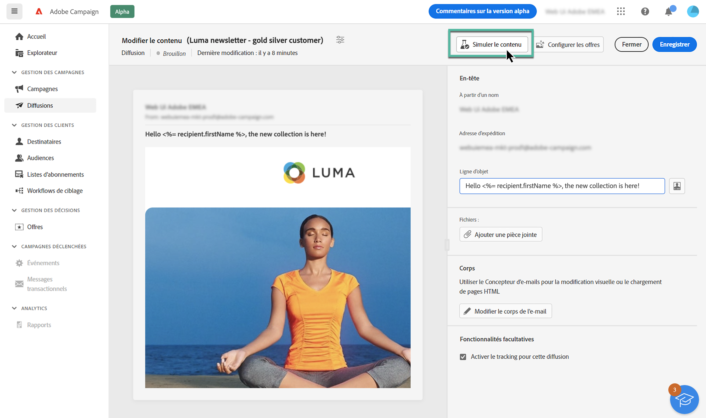

# Prévisualiser le contenu d’un e-mail {#preview}

>[!CONTEXTUALHELP]
>id="acw_homepage_card4"
>title="Prévisualisation intelligente de votre contenu"
>abstract="Adobe Campaign vous permet d’utiliser des profils pour prévisualiser le contenu de votre e-mail avant l’envoi, et de vérifier la personnalisation et la manière dont vos destinataires le verront."

Adobe Campaign vous permet de prévisualiser le contenu de votre e-mail avant l’envoi afin de vérifier la personnalisation et la manière dont vos destinataires le verront.

Pour prévisualiser le contenu de votre e-mail, procédez comme suit :

1. Accédez à l’écran de création de contenu d’e-mail, puis cliquez sur le bouton **[!UICONTROL Simuler du contenu]**.

   

1. Sélectionnez un ou plusieurs profils en cliquant sur le bouton **[!UICONTROL Sélectionner un ou plusieurs profils]**, puis cliquez sur les onglets **[!UICONTROL Profils de test]** et **[!UICONTROL Profils]** pour faire votre choix :

   * L’onglet **Profils de test** contient des adresses de contrôle, qui sont des destinataires supplémentaires et fictifs dans la base de données. Ils peuvent être créés à l’aide de la console Adobe Campaign dans le dossier **[!UICONTROL Ressources]** / **[!UICONTROL Gestion de campagne]** / **[!UICONTROL Adresses de contrôle]**.
   * L’onglet **Profils** répertorie tous les destinataires enregistrés dans le dossier **[!UICONTROL Profils et cibles]** à partir de la console Campaign.

   Vous pouvez combiner les profils de test et les profils pour prévisualiser l’e-mail.

   

1. Une fois les profils sélectionnés, un aperçu de l’e-mail s’affiche dans le volet de droite. Les éléments personnalisés sont remplacés par les données du profil sélectionné dans le volet de gauche.

   Si vous avez ajouté plusieurs profils, vous pouvez passer d’un profil à l’autre dans la liste pour prévisualiser l’e-mail correspondant.

   >[!NOTE]
   >
   >Vous pouvez prévisualiser le rendu de votre contenu sur différents appareils (poste de travail, mobile, tablette), en cliquant sur l’icône dédiée dans le coin supérieur droit.

   

