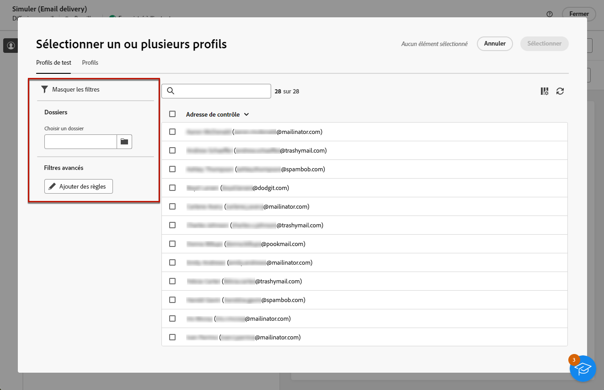

# Prévisualiser le contenu du message {#preview-content}

La fonctionnalité de simulation de contenu de [!DNL Campaign] permet de prévisualiser le contenu du message avant son envoi. Vous pouvez ainsi contrôler la personnalisation et vérifier son affichage pour vos destinataires.

Pour prévisualiser le contenu de votre diffusion, procédez comme suit.

1. Accédez à l’écran de modification du contenu de la diffusion ou au [Concepteur d’e-mail](../email/get-started-email-designer.md).

1. Cliquez sur le bouton **[!UICONTROL Simuler le contenu]**.

   {zoomable=&quot;yes&quot;}

1. Sélectionnez les profils à utiliser pour prévisualiser votre contenu. Pour ce faire, cliquez sur le bouton **[!UICONTROL Ajouter un ou plusieurs profils de test]** (pour les emails et les SMS) ou le bouton **[!UICONTROL Ajouter des abonnés]** (pour les notifications push).

1. Vous pouvez combiner des profils et des profils de test pour prévisualiser votre email ou votre SMS.

   * La variable **[!UICONTROL Profils de test]** répertorie tous les profils de test, qui sont des destinataires supplémentaires et fictifs dans la base de données. [Découvrir comment utiliser des profils test](../audience/test-profiles.md)

   * La variable **[!UICONTROL Profils]** répertorie tous les profils stockés dans votre base de données. [Découvrez comment utiliser des profils](../audience/about-recipients.md)

   {zoomable=&quot;yes&quot;}

1. Lorsque vous parcourez les listes de profils ou de profils de test, vous pouvez utiliser des filtres pour affiner votre recherche. Par exemple, vous pouvez définir une règle pour rechercher tous les profils de test dotés du statut **[!UICONTROL Prospect]**. [Découvrez comment ajouter des règles à l’aide du créateur de modèles de requête](../query/query-modeler-overview.md).

   {zoomable=&quot;yes&quot;}

1. Cliquez sur **[!UICONTROL Sélectionner]** pour confirmer votre sélection.

   Un aperçu du contenu de la diffusion s’affiche dans le volet de droite de l’écran **[!UICONTROL Simuler]**. Les éléments personnalisés sont remplacés par les données du profil sélectionné dans le volet de gauche.

   {zoomable=&quot;yes&quot;}

1. Si vous avez ajouté plusieurs profils, vous pouvez passer d’un profil à l’autre dans la liste pour prévisualiser le contenu de la diffusion correspondante. Vous pouvez également ajouter d’autres profils de test et effacer votre sélection à l’aide des boutons correspondants dans le volet de gauche.

1. Pour les diffusions par e-mail, vous pouvez ajuster l’**[!UICONTROL Échelle]** et prévisualiser votre contenu sur le poste de bureau ou un appareil mobile à l’aide de l’icône dédiée dans le coin supérieur droit.

1. L’écran **[!UICONTROL Simuler]** vous permet également d’effectuer les actions suivantes :
   * Envoyer des diffusions test à des destinataires spécifiques pour validation - [En savoir plus](test-deliveries.md)
   * Accéder aux journaux des diffusions test envoyées - [En savoir plus](test-deliveries.md#access-test-deliveries)
   * Pour les e-mails uniquement, vérifiez le rendu du contenu des messages dans les clients de messagerie les plus courants - [En savoir plus](email-rendering.md)

