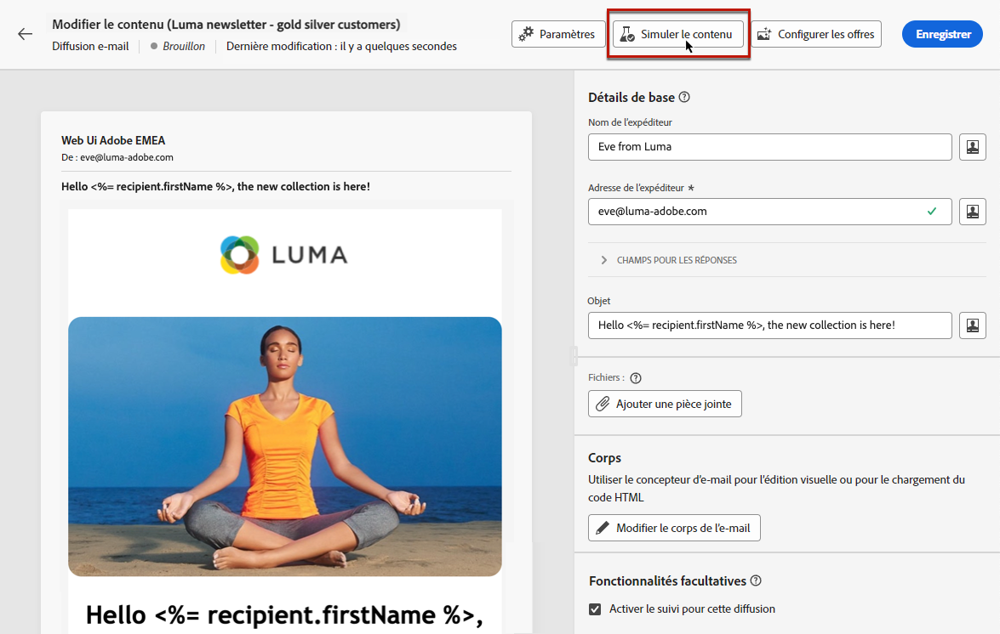

# Prévisualiser le contenu d&#39;une diffusion {#preview-content}

Utilisez la variable [!DNL Campaign] simulation de contenu permettant de prévisualiser le contenu de votre message avant son envoi. Vous pouvez ainsi contrôler la personnalisation et vérifier son affichage pour vos destinataires.

Pour prévisualiser le contenu de votre diffusion, procédez comme suit.

1. Accédez à l&#39;écran d&#39;édition du contenu de votre diffusion.

   <!--email [Edit content](../content/edit-content.md) screen or to the [Email Designer](../content/get-started-email-designer.md).-->

1. Cliquez sur le bouton **[!UICONTROL Simuler le contenu]**.

   

1. Pour sélectionner les profils qui seront utilisés pour prévisualiser votre contenu personnalisé, utilisez :

   * **[!UICONTROL Ajouter un ou plusieurs profils de test]** pour prévisualiser les diffusions email et SMS

   * **[!UICONTROL Ajouter des abonnés]** pour prévisualiser des notifications push

1. Vous pouvez combiner des profils de test et des profils pour prévisualiser votre email ou votre SMS.

   * L’onglet **[!UICONTROL Profils de test]** répertorie les adresses de contrôle, qui sont des destinataires supplémentaires et fictifs dans la base de données.

     >[!NOTE]
     >
     >Les profils de test peuvent être créés dans la console [!DNL Campaign] sous le dossier **[!UICONTROL Ressources]** > **[!UICONTROL Gestion de campagne]** > **[!UICONTROL Adresses de contrôle]**. En savoir plus dans la [documentation de Campaign v8 (console)](https://experienceleague.adobe.com/docs/campaign/campaign-v8/audience/add-profiles/test-profiles.html?lang=fr){target="_blank"}..

   * L’onglet **[!UICONTROL Profils]** répertorie tous les destinataires enregistrés dans le dossier **[!UICONTROL Profils et cibles]** à partir de la console[!DNL Campaign]. En savoir plus dans la [documentation de Campaign v8 (console)](https://experienceleague.adobe.com/docs/campaign/campaign-v8/audience/view-profiles.html?lang=fr){target="_blank"}.

   

1. Cliquez sur **[!UICONTROL Sélectionner]** pour confirmer votre sélection.

   Un aperçu du contenu de la diffusion s&#39;affiche dans le volet droit de la **[!UICONTROL Simuler]** écran. Les éléments personnalisés sont remplacés par les données du profil sélectionné dans le volet de gauche.

   

1. Si vous avez ajouté plusieurs profils, vous pouvez basculer entre eux dans la liste pour prévisualiser le contenu de la diffusion correspondante. Vous pouvez également ajouter d’autres profils de test et effacer votre sélection à l’aide des boutons correspondants dans le volet de gauche.

1. Pour les diffusions par email, vous pouvez ajuster la variable **[!UICONTROL Niveau de zoom]** et prévisualisez votre contenu sur un ordinateur ou un appareil mobile à l’aide de l’icône dédiée dans le coin supérieur droit.

1. L’écran **[!UICONTROL Simuler]** vous permet également d’effectuer les actions suivantes :
   * Envoyer des diffusions test à des destinataires spécifiques pour validation - [En savoir plus](test-deliveries.md)
   * Accéder aux logs des diffusions test envoyées - [En savoir plus](test-deliveries.md#access-proofs)
   * Pour les emails uniquement, vérifiez le rendu du contenu des messages dans les clients de messagerie les plus courants - [En savoir plus](email-rendering.md)

