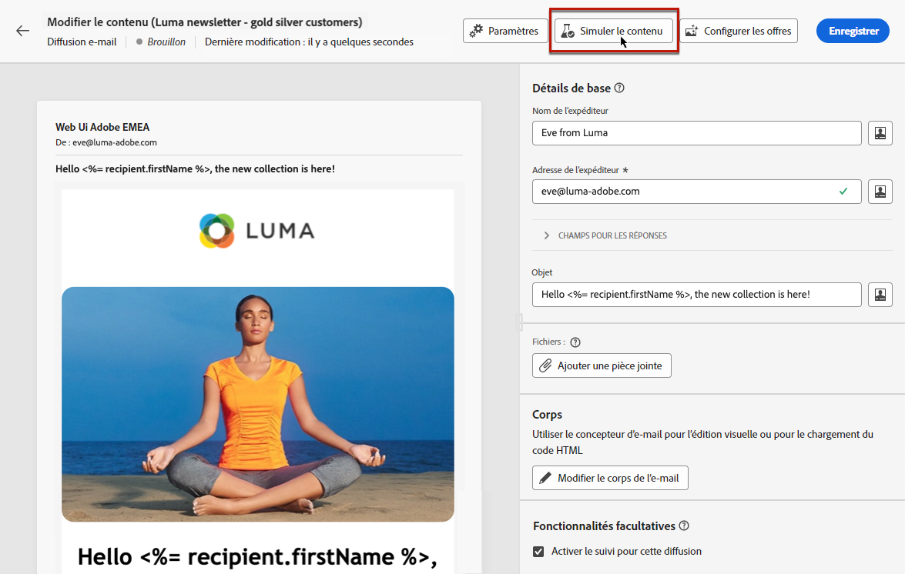

# À propos de la prévisualisation et du test {#about-preview-test}

>[!CONTEXTUALHELP]
>id="acw_deliveries_simulate"
>title="Prévisualiser et tester votre contenu"
>abstract="Une fois le contenu défini, prévisualisez-le et testez-le à l’aide de profils et de profils de test."
>additional-url="https://experienceleague.adobe.com/docs/campaign-web/v8/msg/preview-test/test-deliveries.html?lang=fr" text="Envoyer des BAT"
>additional-url="https://experienceleague.adobe.com/docs/campaign-web/v8/landing-pages/create-lp.html?lang=fr#test-landing-page" text="Tester des pages de destination"

Une fois le contenu de la diffusion rédigé, vous pouvez utiliser les profils et les profils de test pour le prévisualiser et le tester avant d’envoyer le message. Il s’agit d’une étape cruciale pour s’assurer qu’il est exact, mais également exempt d’erreurs au niveau du contenu et des paramètres de personnalisation.

[!DNL Adobe Campaign Web user interface] vous permet d’effectuer les opérations suivantes :

* [Prévisualiser le contenu et la personnalisation du message](preview-content.md)
* [Envoyer des BAT](test-deliveries.md) à des personnes destinataires ou à des personnes abonnées spécifiques à des fins de test et de validation
* [Vérifier le rendu des e-mails](email-rendering.md) pour les clients de bureau, mobiles et web les plus courants
* [Prévisualiser et tester vos pages de destination](../landing-pages/create-lp.md#test-landing-page)

Ces actions peuvent être effectuées à l’aide du bouton **[!UICONTROL Simuler le contenu]**, accessible à partir de l’écran Modifier le contenu de la diffusion ou du [Concepteur d’e-mail](../email/get-started-email-designer.md).

{zoomable="yes"}

>[!NOTE]
>
>La simulation de contenu est également disponible à partir de la [synthèse des diffusions](../monitor/prepare-send.md) après avoir cliqué sur le bouton **[!UICONTROL Vérifier et envoyer]**.
>
>Si vous ciblez une audience chargée depuis un fichier, reportez-vous à [cette section](../audience/file-audience.md#preview--test-your-email-test) pour apprendre à prévisualiser et à tester votre diffusion.
