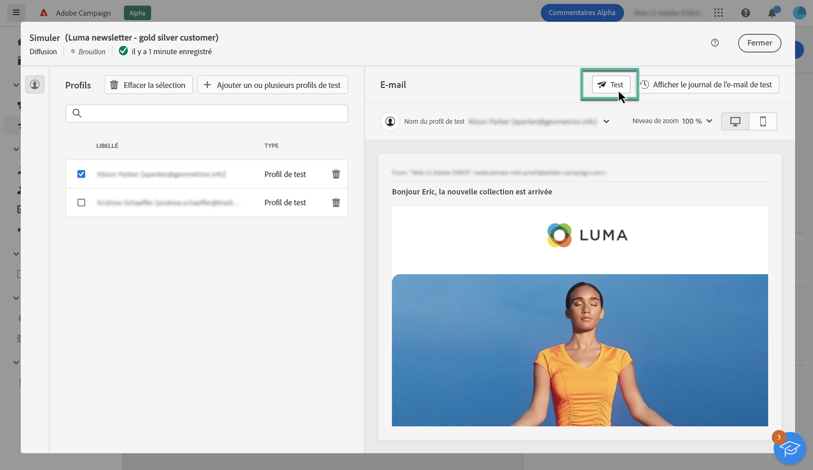
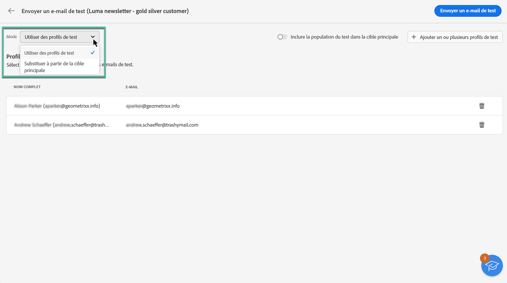
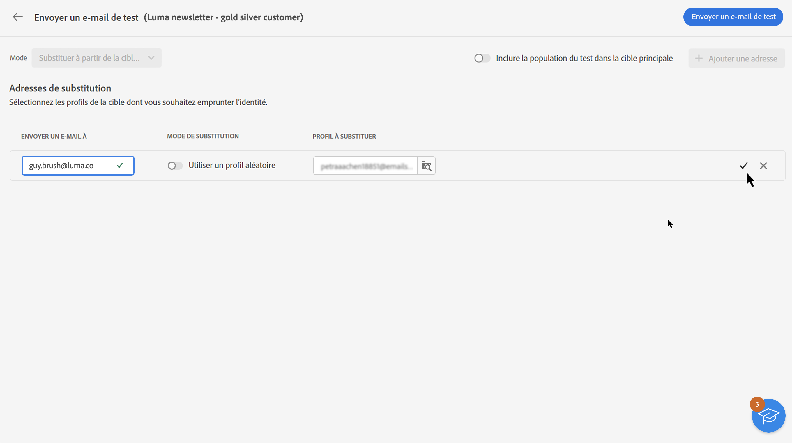
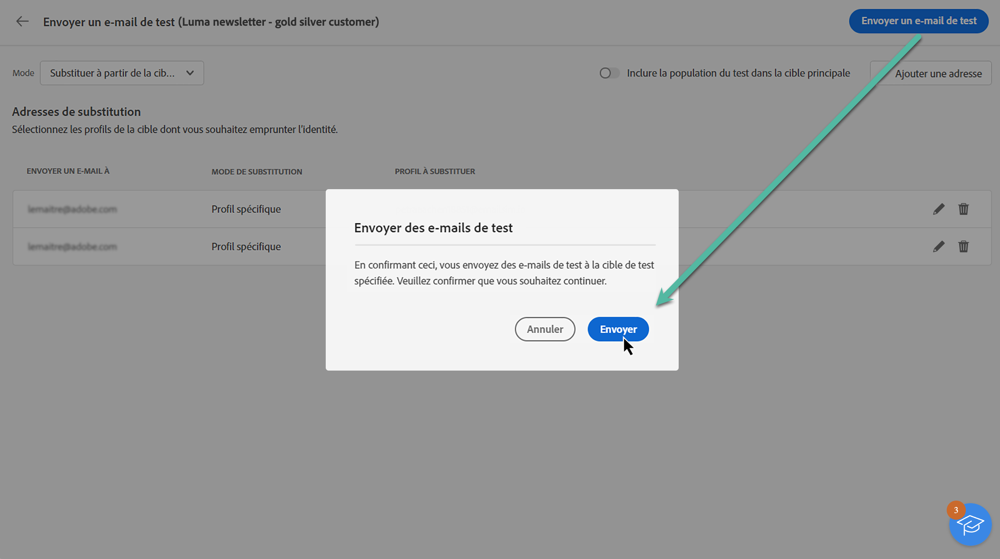
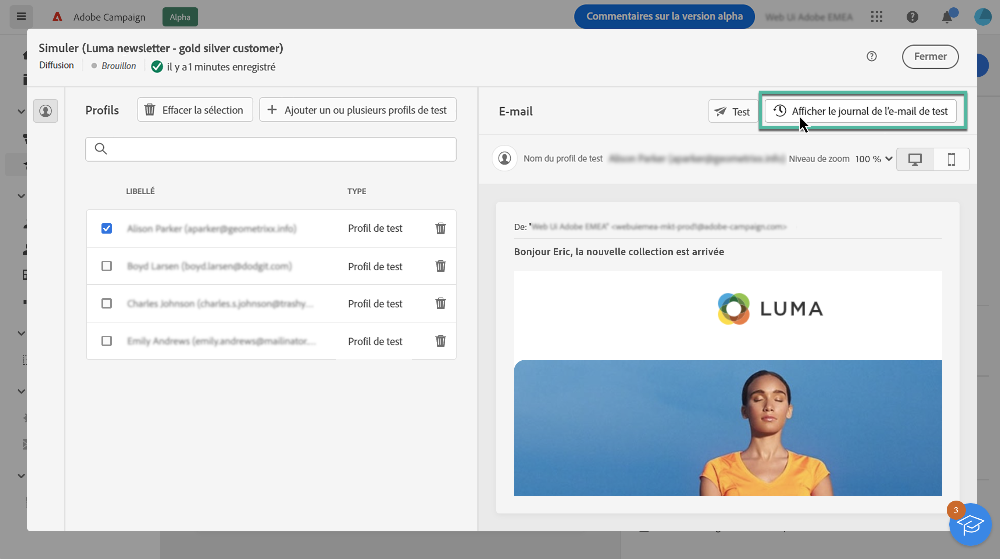
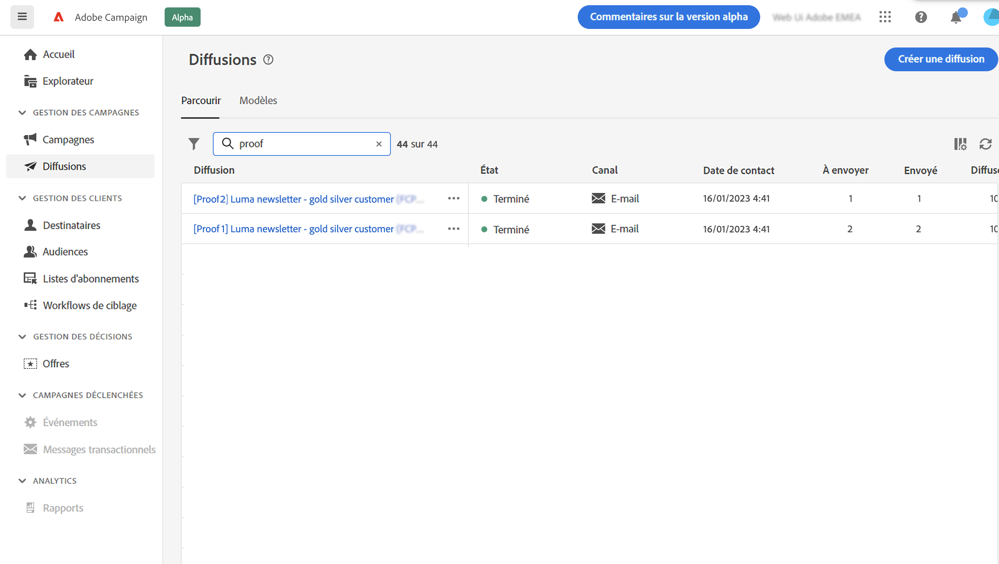

# Envoyer des e-mails de test {#send-proofs}

L’envoi d’emails de test est une étape importante pour valider votre campagne par e-mail et identifier les problèmes potentiels. En envoyant des emails de test, vous pouvez vérifier différents éléments tels que des liens, des liens d’opt-out, des images et des pages miroir, ainsi que détecter d’éventuelles erreurs.

Les emails de test peuvent être envoyés à deux types de destinataires :

* **Profils de test**: envoyer des emails de test aux adresses de contrôle, qui sont des destinataires supplémentaires et fictifs dans la base de données,

* **Substitution de la cible principale**: envoyer des emails de test à une adresse email spécifique lors de l’emprunt de l’identité d’un profil existant ; Vous pouvez ainsi tester l&#39;email comme le feraient les destinataires, ce qui vous donne une représentation exacte du message que le profil recevra.

## Sélection des destinataires du test {#recipients}

1. Accédez à l&#39;écran de simulation du contenu de l&#39;email, puis cliquez sur le bouton **[!UICONTROL Test]** bouton .

   

1. Utilisez la variable **[!UICONTROL Mode]** liste déroulante pour sélectionner le type de destinataires qui recevra l&#39;email de test :

   * **Profils de test**: envoyer l&#39;email de test aux adresses de contrôle, qui sont des destinataires supplémentaires et fictifs dans la base de données,

   * **Substitution de la cible principale**: envoyer l’email de test à une adresse email spécifique lors de l’emprunt de l’identité d’un profil existant ; Vous pouvez ainsi tester l&#39;email comme le feraient les destinataires, ce qui vous donne une représentation exacte du message que le profil recevra.

   

   >[!NOTE]
   >
   >Par défaut, la variable **[!UICONTROL Profils de test]** Le mode est sélectionné. Si vous avez déjà sélectionné des profils pour prévisualiser l&#39;email dans l&#39;écran de simulation du contenu, ces profils sont pré-sélectionnés comme destinataires test. Vous pouvez effacer votre sélection et/ou ajouter des destinataires supplémentaires.

1. Pour envoyer des emails de test aux profils de substitution, choisissez la variable **[!UICONTROL Substitution de la cible]** puis procédez comme suit :

   1. Cliquez sur le bouton **[!UICONTROL Ajouter une adresse]** et indiquez l’adresse électronique qui recevra l’e-mail de test.

      Vous pouvez saisir n’importe quelle adresse électronique. Vous pouvez ainsi envoyer des emails de test à n’importe quel utilisateur, même s’il n’est pas un utilisateur d’Adobe Campaign V8.

   1. Sélectionnez le profil de la cible à utiliser pour envoyer l’email de test. Vous pouvez également laisser Adobe Campaign sélectionner un profil aléatoire à partir de la cible.

   1. Confirmez le destinataire et renouvelez l&#39;opération pour ajouter autant d&#39;adresses que nécessaire.

      

1. Une fois les destinataires du test sélectionnés, vous pouvez envoyer l&#39;email de test. [Découvrez comment envoyer des emails de test](#send)

   >[!NOTE]
   >
   >Si vous souhaitez envoyer le message électronique final aux destinataires de l’email de test, activez l’option **[!UICONTROL Inclure la population test dans la cible principale]** sur .

## Envoyer l’email de test {#send}

Pour envoyer l&#39;email de test aux destinataires sélectionnés, cliquez sur **[!UICONTROL Envoyer un email de test]** confirmez ensuite l’envoi.

Envoyez autant d&#39;emails de test que nécessaire jusqu&#39;à ce que vous ayez finalisé le contenu de votre diffusion. Une fois cette opération effectuée, vous pouvez envoyer l’e-mail à la cible principale. [Découvrez comment préparer et envoyer des e-mails](../monitor/prepare-send.md).

## Accès aux emails de test envoyés {#access-proofs}

Une fois les emails de test envoyés, vous pouvez accéder aux logs dédiés à partir de la **[!UICONTROL Afficher le journal des emails de test]** bouton .

Ces logs permettent d&#39;accéder à tous les emails de test envoyés pour la diffusion sélectionnée et de visualiser des statistiques spécifiques relatives à leur envoi. [Découvrez comment surveiller les logs de diffusion](../monitor/delivery-logs.md).

Vous pouvez également accéder aux emails de test envoyés depuis la liste des diffusions, comme toute diffusion.

