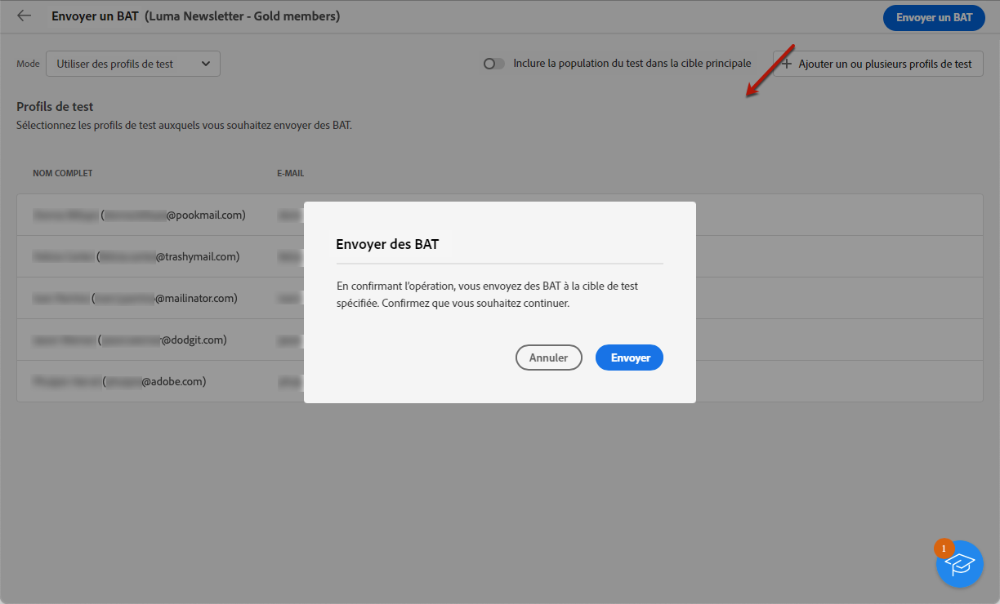

# Envoyer des diffusions test {#send-test-deliveries}

**[!UICONTROL Adobe Campaign]** permet de tester un message avant de l&#39;envoyer à l&#39;audience principale.

L’envoi de diffusions test est une étape importante pour valider votre campagne et identifier les problèmes potentiels.

Les destinataires d&#39;un test peuvent vérifier différents éléments tels que des liens, des liens d&#39;opt-out, des images ou des pages miroir, et détecter toute erreur dans le rendu, le contenu, les paramètres de personnalisation et la configuration de la diffusion.

## Sélectionner les destinataires du test {#test-recipients}

En fonction du canal que vous utilisez, les messages de test peuvent être envoyés à trois types de destinataires :

* [Profils de test](#test-profiles) - Envoyer **test des emails et des SMS** aux adresses de contrôle, qui sont des destinataires supplémentaires et fictifs dans la base de données.

  Ils peuvent être créés dans le [!DNL Campaign] dans la console **[!UICONTROL Ressources]** > **[!UICONTROL Campaign Management]** > **[!UICONTROL Adresses de contrôle]** dossier. En savoir plus dans [Documentation de Campaign v8 (console)](https://experienceleague.adobe.com/docs/campaign/campaign-v8/audience/add-profiles/test-profiles.html){target="_blank"}

* [Substituer à partir de la cible principale](#substitution-profiles) - Envoyer **test des emails et des SMS** à une adresse électronique ou un numéro de téléphone spécifique lors de l’emprunt de l’identité d’un profil existant.

  Cela vous permet de tester le message comme le feraient les destinataires, ce qui vous donne une représentation exacte du contenu que le profil recevra.

* [Abonnés](#subscribers) - Envoyer **test des notifications push** aux abonnés fictifs ajoutés à la base de données.

  Tout comme les profils de test, ils peuvent être créés dans la variable [!DNL Campaign] dans la console **[!UICONTROL Ressources]** > **[!UICONTROL Campaign Management]** > **[!UICONTROL Adresses de contrôle]** dossier. En savoir plus dans [Documentation de Campaign v8 (console)](https://experienceleague.adobe.com/docs/campaign/campaign-v8/audience/add-profiles/test-profiles.html){target="_blank"}

Pour sélectionner les destinataires d&#39;une diffusion test, procédez comme suit en fonction du type de profils que vous souhaitez utiliser.

### Profils de test {#test-profiles}

1. Accédez à l&#39;écran d&#39;édition du contenu de votre diffusion email ou SMS, puis cliquez sur le bouton **[!UICONTROL Simulation du contenu]** bouton .

1. Cliquez sur le bouton **[!UICONTROL Test]** bouton .

   >[!NOTE]
   >
   >Si vous avez déjà sélectionné des profils pour [prévisualiser votre diffusion](preview-content.md), ils sont répertoriés dans le volet de gauche.

   

1. Dans la **[!UICONTROL Mode]** liste déroulante, choisissez **Profils de test** pour cibler les destinataires fictifs qui recevront l&#39;email de test ou la diffusion SMS.

1. Si vous avez déjà sélectionné des profils pour [prévisualiser le message](preview-content.md) dans l&#39;écran de simulation du contenu, ces profils sont pré-sélectionnés comme destinataires test. Vous pouvez effacer votre sélection et/ou ajouter des destinataires supplémentaires à l’aide de la fonction **[!UICONTROL Ajouter un ou plusieurs profils de test]** bouton .

   

   >[!NOTE]
   >
   >Par défaut, la variable **[!UICONTROL Utilisation de profils de test]** Le mode est sélectionné.

1. Pour envoyer également le message final aux destinataires de la diffusion test, sélectionnez l&#39;option **[!UICONTROL Inclure la population test dans la cible principale]** .

1. Une fois les profils de test sélectionnés, vous pouvez [envoyer la diffusion test](#send-test).

### Profils de substitution {#substitution-profiles}

Pour envoyer un email ou un SMS de test à une adresse électronique ou un numéro de téléphone spécifique tout en affichant les données d’un profil existant de la variable [!DNL Campaign] base de données, utilisez des profils de substitution.

1. Avant d&#39;envoyer un test, veillez à définir une audience pour votre diffusion. [En savoir plus](../audience/about-audiences.md)

1. Accédez à l&#39;écran d&#39;édition du contenu de votre diffusion email ou SMS, puis cliquez sur le bouton **[!UICONTROL Simulation du contenu]** bouton .

1. Cliquez sur le bouton **[!UICONTROL Test]** bouton .

   >[!NOTE]
   >
   >Si vous avez déjà sélectionné des profils pour [prévisualiser votre diffusion](preview-content.md), ils sont répertoriés dans le volet de gauche.

   

1. Dans la **[!UICONTROL Mode]** liste déroulante, choisissez **Substituer à partir de la cible principale** pour envoyer un test à une adresse électronique ou un numéro de téléphone spécifique lors de l’affichage des données d’un profil existant.

1. Cliquez sur le bouton **[!UICONTROL Ajouter une adresse]** et indiquez l’adresse email ou le numéro de téléphone qui recevra la diffusion test.

   Vous pouvez saisir n’importe quelle adresse électronique ou numéro de téléphone. Vous pouvez ainsi envoyer des diffusions test à n’importe quel destinataire, même s’il n’est pas un utilisateur de [!DNL Adobe Campaign].

1. Sélectionnez le profil de la base de données à utiliser en remplacement. Vous pouvez également sélectionner [!DNL Adobe Campaign] sélectionnez un profil aléatoire. Les données de profil du profil sélectionné seront affichées dans la diffusion test.

1. Confirmez le destinataire et renouvelez l&#39;opération pour ajouter autant d&#39;adresses email ou de numéros de téléphone que nécessaire.

   

1. Pour envoyer également le message final aux destinataires de la diffusion test, sélectionnez l&#39;option **[!UICONTROL Inclure la population test dans la cible principale]** .

1. Une fois les profils de substitution sélectionnés, vous pouvez [envoyer la diffusion test](#send-test).

### Abonnés {#subscribers}

Lorsque vous utilisez des notifications push, les diffusions de test ne peuvent être envoyées qu&#39;aux abonnés. Pour les sélectionner, procédez comme suit.

1. Accédez à l&#39;écran d&#39;édition du contenu de votre diffusion, puis cliquez sur le bouton **[!UICONTROL Simulation du contenu]** bouton .

1. Cliquez sur le bouton **[!UICONTROL Test]** bouton .

   

1. Si vous avez déjà sélectionné des abonnés à [prévisualiser la diffusion](preview-content.md) dans l&#39;écran de simulation du contenu, ces profils sont pré-sélectionnés comme abonnés aux tests. Vous pouvez effacer votre sélection et/ou ajouter d&#39;autres abonnés à l&#39;aide du bouton dédié.

   

1. Pour envoyer également la notification push finale aux abonnés au test, sélectionnez la variable **[!UICONTROL Inclure la population test dans la cible principale]** .

1. Une fois les abonnés sélectionnés, vous pouvez : [envoyer la diffusion test](#send-test).

## Envoyer la diffusion test {#send-test}

Pour envoyer la diffusion test aux destinataires sélectionnés, procédez comme suit.

1. Cliquez sur le bouton **[!UICONTROL Envoyer le test]** bouton .

1. Validez l&#39;envoi.

   

1. Envoyez autant de tests que nécessaire jusqu&#39;à ce que vous ayez finalisé le contenu de votre diffusion.

Une fois cette opération terminée, vous pouvez préparer et envoyer votre diffusion à la cible principale. Découvrez comment dans les sections dédiées ci-dessous :

* [Envoyer votre email](../monitor/prepare-send.md)
* [Envoyer votre notification push](../push/send-push.md#send-push)
* [Envoyer votre diffusion SMS](../sms/send-sms.md#send-sms)

## Accès aux diffusions de test envoyées {#access-proofs}

Une fois les diffusions test envoyées, vous pouvez accéder aux logs dédiés depuis la **[!UICONTROL Afficher le journal de test]** bouton .

Ces logs permettent d&#39;accéder à tous les tests envoyés pour la diffusion sélectionnée et de visualiser des statistiques spécifiques relatives à leur envoi. [Découvrez comment surveiller les logs de diffusion](../monitor/delivery-logs.md).

Vous pouvez également accéder aux tests envoyés à partir de la [liste des diffusions](../msg/gs-messages.md), comme toute diffusion.

