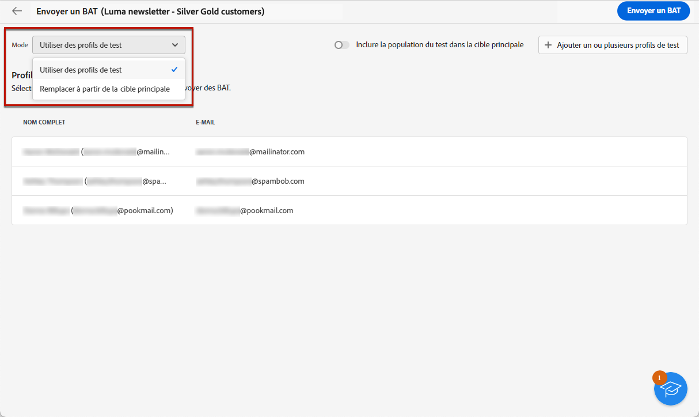
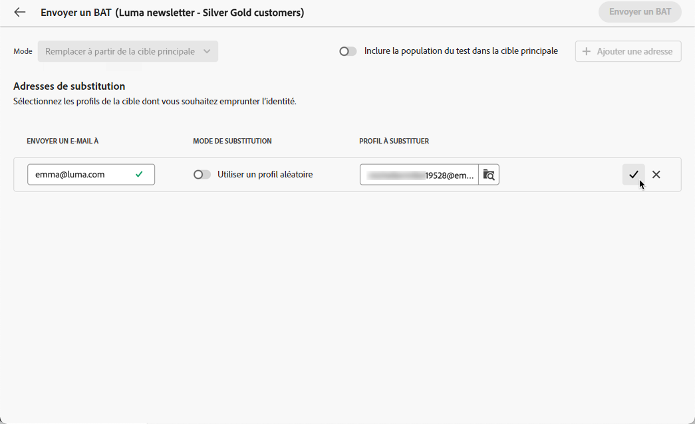

# Envoyer des e-mails de test {#send-test-emails}

**[!UICONTROL Adobe Campaign]** permet de tester un message avant de l&#39;envoyer à l&#39;audience principale.

L’envoi d’e-mails de test est une étape importante pour valider votre campagne par e-mail et identifier les problèmes potentiels.

Les destinataires d&#39;un test peuvent vérifier différents éléments tels que des liens, des liens d&#39;opt-out, des images et des pages miroir, ainsi que détecter toute erreur de rendu, de contenu, de paramètres de personnalisation et de configuration d&#39;email.

## Sélectionner les destinataires du test {#test-recipients}

Vous pouvez envoyer des e-mails de test à deux types de destinataires :

* **Profils de test** : envoyez des emails de test aux adresses de contrôle, qui sont des destinataires fictifs et supplémentaires dans la base de données. Ils peuvent être créés dans le [!DNL Campaign] dans la console **[!UICONTROL Ressources]** > **[!UICONTROL Campaign Management]** > **[!UICONTROL Adresses de contrôle]** dossier. En savoir plus dans [Documentation de Campaign v8 (console)](https://experienceleague.corp.adobe.com/docs/campaign/campaign-v8/audience/add-profiles/test-profiles.html){target="_blank"}

* **Substituer à partir de la cible principale** - envoyer des emails de test à une adresse email spécifique lors de l’emprunt de l’identité d’un profil existant ; Vous pouvez ainsi tester l’e-mail comme le feraient les destinataires, ce qui vous donne une représentation exacte du message que le profil recevra.

Pour sélectionner les destinataires du test d&#39;email, procédez comme suit.

1. Accéder à l&#39;email [Modifier le contenu](../content/edit-content.md) ou au [Concepteur d&#39;email](../content/get-started-email-designer.md), puis cliquez sur le bouton **[!UICONTROL Simulation du contenu]** bouton .

1. Cliquez sur le bouton **[!UICONTROL Test]** bouton .

   

1. Utilisez la liste déroulante **[!UICONTROL Mode]** pour sélectionner le type de destinataires de l’e-mail de test :

   * **Profils de test** pour cibler des destinataires fictifs

   * **Substituer à partir de la cible principale** pour envoyer un test à une adresse email spécifique lors de l’affichage des données d’un profil existant.

   

   >[!NOTE]
   >
   >Par défaut, la variable **[!UICONTROL Utilisation de profils de test]** Le mode est sélectionné. Si vous avez déjà sélectionné des profils pour prévisualiser l’e-mail dans l’écran de simulation du contenu, ces profils sont pré-sélectionnés comme destinataires test. Vous pouvez effacer votre sélection et/ou ajouter des destinataires supplémentaires.

1. Pour envoyer des emails de test aux profils de substitution, choisissez la variable **[!UICONTROL Substituer à partir de la cible]** , puis procédez comme suit :

   1. Cliquez sur le bouton **[!UICONTROL Ajouter une adresse]** et indiquez l’adresse e-mail qui reçoit l’e-mail de test.

      Vous pouvez indiquer n’importe quelle adresse e-mail. Cela vous permet d’envoyer des emails de test à n’importe quel utilisateur, même s’il n’est pas un utilisateur de [!DNL Adobe Campaign].

   1. Sélectionnez le profil de la cible à utiliser en remplacement. Vous pouvez également sélectionner [!DNL Adobe Campaign] sélectionnez un profil aléatoire dans la cible. Les données de profil du profil sélectionné seront affichées dans l&#39;email de test.

   1. Confirmez le destinataire et renouvelez l’opération pour ajouter autant d’adresses que nécessaire.

      

1. Une fois les destinataires du test sélectionnés, vous pouvez : [envoyer l’email de test ;](#send-test).

   >[!NOTE]
   >
   >Pour envoyer également le message électronique final aux destinataires de l’e-mail de test, sélectionnez la variable **[!UICONTROL Inclure la population test dans la cible principale]** .

## Envoyer l’e-mail de test {#send-test}

Pour envoyer l&#39;email de test aux destinataires sélectionnés, procédez comme suit.

1. Cliquez sur **[!UICONTROL Envoyer un email de test]**.

1. Validez l&#39;envoi.

   

1. Vous pouvez envoyer autant d’e-mails de test que nécessaire jusqu’à ce que le contenu de votre diffusion soit finalisé.

Une fois cette opération terminée, vous pouvez [préparer et envoyer votre email](../monitor/prepare-send.md) à la cible principale.

## Accéder aux e-mails de test envoyés {#access-proofs}

Une fois les e-mails de test envoyés, vous pouvez accéder aux journaux dédiés à partir du bouton **[!UICONTROL Afficher le journal des e-mails de test]**.

Ces journaux permettent d’accéder à tous les e-mails de test envoyés pour la diffusion sélectionnée et de visualiser des statistiques spécifiques relatives à leur envoi. [Découvrez comment surveiller les logs de diffusion](../monitor/delivery-logs.md).

Vous pouvez également accéder aux emails de test envoyés à partir de la [liste des diffusions](../msg/gs-messages.md), comme toute diffusion.

