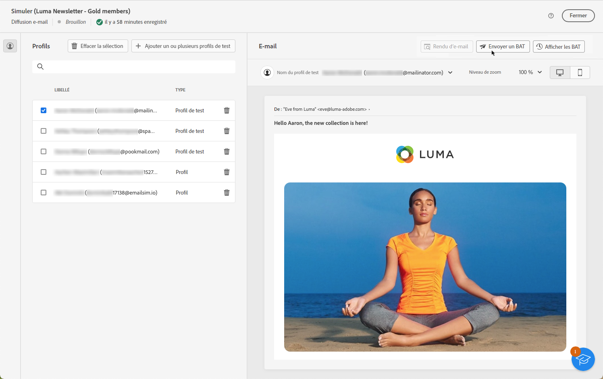
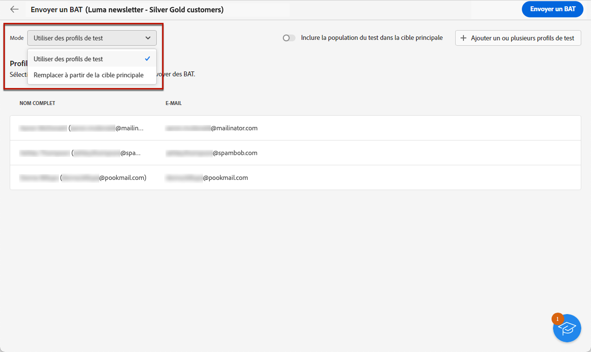
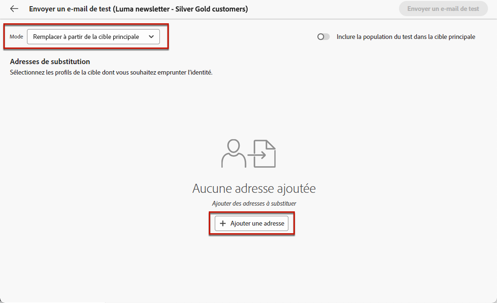
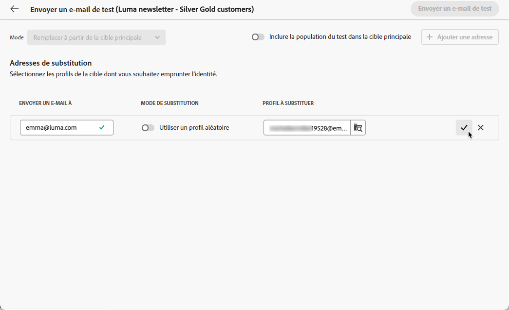
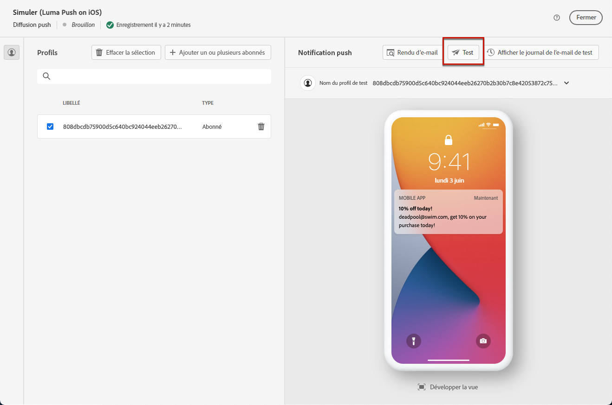
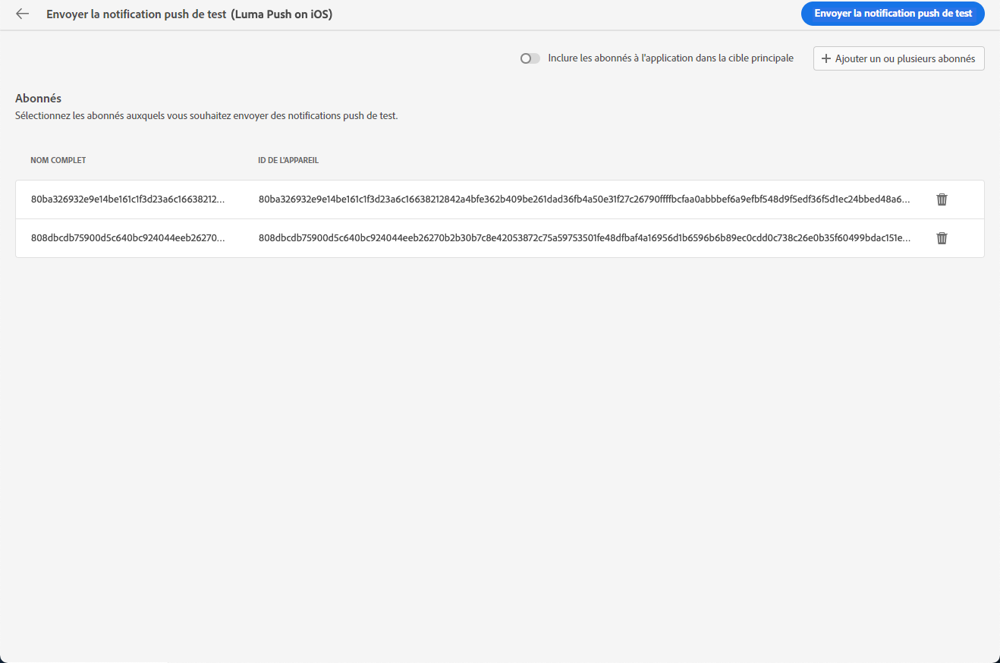
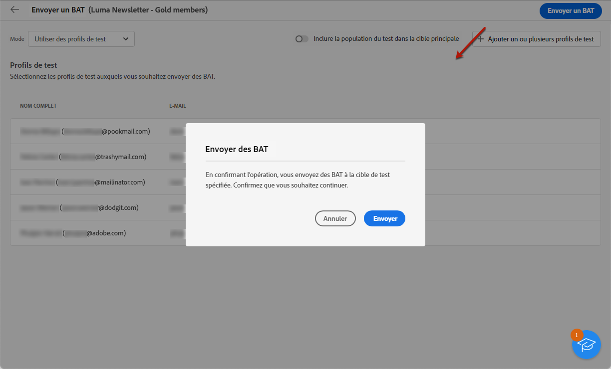
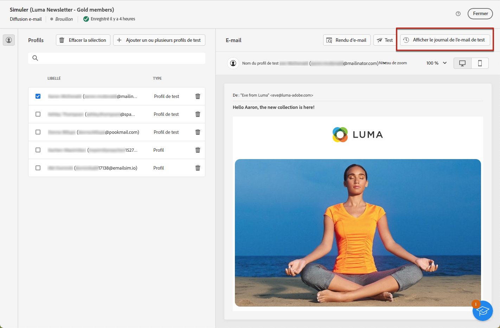
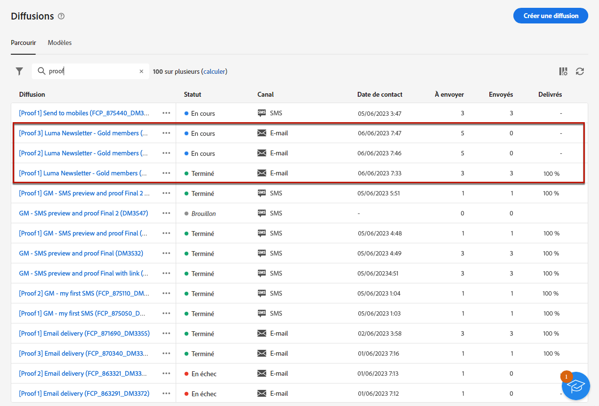

# Envoyer des diffusions test {#send-test-deliveries}

>[!CONTEXTUALHELP]
>id="acw_email_preview_mode"
>title="Mode Aperçu"
>abstract="Prévisualisez et testez le message en incluant la population test à la cible principale."

Une fois le contenu de votre message défini, vous pouvez le prévisualiser et le tester en envoyant des diffusions test (c’est-à-dire &quot;BAT&quot;) pour tester les profils. Si vous avez inséré du contenu personnalisé, vous pouvez vérifier son contenu dans le message à l’aide des données de profil de test.

Pour détecter d’éventuelles erreurs dans le contenu du message ou les paramètres de personnalisation, envoyez des messages de test aux profils de test avant de les envoyer à l’audience cible. Un message de test doit être envoyé chaque fois qu’une modification est apportée, afin de valider le contenu le plus récent. L’envoi de diffusions de test (anciennement appelées « BAT ») est une étape importante dans la validation de votre campagne et l’identification de problèmes potentiels. Les destinataires d&#39;un message de test peuvent vérifier différents éléments tels que des liens, des liens d&#39;opt-out, des images ou des pages miroir, et détecter toute erreur dans le rendu, le contenu, les paramètres de personnalisation et la configuration de la diffusion.

## Sélectionner les destinataires du test {#test-recipients}

>[!CONTEXTUALHELP]
>id="acw_email_preview_option_test_target"
>title="Population test"
>abstract="Sélectionnez un mode de population test."

En fonction du canal que vous utilisez, les messages de test peuvent être envoyés à trois types de destinataires :

* [Profils de test](#test-profiles) : envoyez des **e-mails et des SMS de test** aux adresses de contrôle, qui sont des destinataires supplémentaires dans la base de données. Ils peuvent être créés à l’aide de la console [!DNL Campaign] dans le dossier **[!UICONTROL Ressources]** > **[!UICONTROL Gestion de campagne]** > **[!UICONTROL Adresses de contrôle]**. En savoir plus dans la [documentation de Campaign v8 (console cliente)](https://experienceleague.adobe.com/docs/campaign/campaign-v8/audience/add-profiles/test-profiles.html?lang=fr){target="_blank"}.

* [Substituer à partir de la cible principale](#substitution-profiles) : envoyez des **e-mails et des SMS de test** à une adresse e-mail ou un numéro de téléphone spécifique lors de l’emprunt de l’identité d’un profil existant. Vous pouvez ainsi consulter le message comme si vous étiez le ou la destinataire, avec le contenu reproduit à l’identique pour le profil indiqué.

* [Abonnés](#subscribers) : envoyez des **notifications push de test** aux abonnés et abonnées fictifs ajoutés à la base de données. À l’instar des profils de test, elles peuvent être créées dans la console [!DNL Campaign] sous le dossier **[!UICONTROL Ressources]** > **[!UICONTROL Gestion de campagne]** > **[!UICONTROL Adresses de contrôle]**. En savoir plus dans la [documentation de Campaign v8 (console cliente)](https://experienceleague.adobe.com/docs/campaign/campaign-v8/audience/add-profiles/test-profiles.html?lang=fr){target="_blank"}.

Pour sélectionner les destinataires d’une diffusion test, procédez comme suit en fonction du type de profils que vous souhaitez utiliser.

### Profils de test {#test-profiles}

>[!CONTEXTUALHELP]
>id="acw_deliveries_simulate_test_mode"
>title="Cible du BAT"
>abstract="Vous pouvez télécharger un second fichier en tant que « cible du BAT » si vous souhaitez tester votre diffusion avant de l’envoyer à la cible principale."

>[!CONTEXTUALHELP]
>id="acw_deliveries_simulate_test_upload"
>title="Charger les profils"
>abstract="Vous pouvez charger un second fichier avec des profils supplémentaires si vous souhaitez tester votre diffusion avec un ensemble différent de celui utilisé pour la cible principale."

>[!CONTEXTUALHELP]
>id="acw_deliveries_simulate_test_sample"
>title="Fichier modèle"
>abstract="La mise en forme du fichier doit être identique à celle du fichier d’origine. Formats de fichiers pris en charge : txt, csv. Taille maximale du fichier : 15 Mo. Utilisez la première ligne comme en-tête de colonne."

Les profils de test sont des adresses de contrôle, qui sont des destinataires supplémentaires dans la base de données. Ils peuvent être créés dans le [!DNL Adobe Campaign] la console cliente dans la **[!UICONTROL Ressources]** > **[!UICONTROL Campaign Management]** > **[!UICONTROL Adresses de contrôle]** dossier. Les étapes pour envoyer des messages de test aux adresses de contrôle sont présentées ci-dessous.

1. Accédez à l’écran de modification du contenu de votre diffusion e-mail ou SMS, puis cliquez sur le bouton **[!UICONTROL Simuler le contenu]**.

1. Cliquez sur le bouton **[!UICONTROL Tester]**.

   >[!NOTE]
   >
   >Si vous avez déjà sélectionné des profils pour [prévisualiser votre diffusion](preview-content.md), ils sont indiqués dans le volet de gauche.

   

1. Dans la liste déroulante **[!UICONTROL Mode]**, choisissez les **[!UICONTROL Profils de test]** pour cibler les destinataires fictifs qui recevront la diffusion e-mail ou SMS de test.

   

1. Si vous avez déjà sélectionné des profils pour [prévisualiser le message](preview-content.md) dans l’écran de simulation du contenu, ils sont présélectionnés comme destinataires du test. Vous pouvez effacer votre sélection et/ou ajouter des destinataires supplémentaires à l’aide du bouton **[!UICONTROL Ajouter un ou plusieurs profils de test]**.

   >[!NOTE]
   >
   >Par défaut, le mode **[!UICONTROL Utiliser des profils de test]** est sélectionné.

1. Si vous souhaitez envoyer le message final aux destinataires de la diffusion test, sélectionnez l’option **[!UICONTROL Inclure la population du test dans la cible principale]**.

1. Une fois les profils de test sélectionnés, vous pouvez [envoyer la diffusion test](#send-test).

### Profils de substitution {#substitution-profiles}

Pour envoyer un email ou un SMS de test à une adresse électronique ou un numéro de téléphone spécifique tout en affichant les données d’un profil existant de la variable [!DNL Adobe Campaign] base de données, utilisez des profils de substitution, comme décrit ci-dessous :

1. Avant d’envoyer un test, assurez-vous de définir une audience cible pour votre diffusion. [En savoir plus](../audience/about-recipients.md).

1. Accédez à l’écran de modification du contenu de votre diffusion e-mail ou SMS, puis cliquez sur le bouton **[!UICONTROL Simuler le contenu]**.

1. Cliquez sur le bouton **[!UICONTROL Tester]**.

   

1. Dans la liste déroulante **[!UICONTROL Mode]**, choisissez l’option **[!UICONTROL Substituer à partir de la cible principale]** pour envoyer un test à une adresse e-mail ou un numéro de téléphone spécifique tout en affichant les données d’un profil existant.

   >[!CAUTION]
   >
   >Si vous n’avez pas sélectionné d’[audience](../audience/about-recipients.md) pour votre diffusion, l’option **[!UICONTROL Substituer à partir de la cible principale]** est grisée et vous ne pourrez pas sélectionner de profil de substitution.

1. Cliquez sur le bouton **[!UICONTROL Ajouter une adresse]** et indiquez l’adresse e-mail ou le numéro de téléphone qui recevra la diffusion test.

   

   >[!NOTE]
   >
   >Vous pouvez saisir n’importe quelle adresse e-mail ou numéro de téléphone. Vous pouvez ainsi envoyer des diffusions de test à n’importe quel destinataire, même s’il est étranger à [!DNL Adobe Campaign].

1. Sélectionnez le profil de la cible que vous avez définie pour votre diffusion à utiliser en remplacement. Vous pouvez également laisser [!DNL Adobe Campaign] sélectionner un profil aléatoire à partir de la cible. Les données du profil sélectionné seront affichées dans la diffusion test.

1. Confirmez le ou la destinataire et renouvelez l’opération pour ajouter autant d’adresses e-mail ou de numéros de téléphone que nécessaire.

   

1. Si vous souhaitez envoyer le message final aux destinataires de la diffusion test, sélectionnez l’option **[!UICONTROL Inclure la population du test dans la cible principale]**.

1. Une fois les profils de substitution sélectionnés, vous pouvez [envoyer la diffusion test](#send-test).

### Abonnés {#subscribers}

Lorsque vous utilisez des notifications push, les diffusions de test ne peuvent être envoyées qu&#39;aux abonnés de votre application. Pour les sélectionner, procédez comme suit.

1. Accédez à l’écran de modification du contenu de la diffusion, puis cliquez sur le bouton **[!UICONTROL Simuler le contenu]**.

1. Cliquez sur le bouton **[!UICONTROL Tester]**.

   

1. Si vous avez déjà sélectionné des abonnés et abonnées pour [prévisualiser la diffusion](preview-content.md) dans l’écran de simulation du contenu, ces profils sont présélectionnés comme abonnés du test.

   Vous pouvez effacer votre sélection et/ou ajouter d’autres abonnés et abonnées à l’aide du bouton dédié.

   

1. Si vous souhaitez envoyer la notification push finale aux abonnés et abonnées du test, sélectionnez l’option **[!UICONTROL Inclure la population du test dans la cible principale]**.

1. Une fois les abonnés et abonnées sélectionnés, [envoyez la diffusion test](#send-test).

## Envoyer la diffusion test {#send-test}

Pour envoyer la diffusion test aux destinataires sélectionné(e)s, procédez comme suit.

1. Cliquez sur le bouton **[!UICONTROL Envoyer un test]**.

1. Confirmez l’envoi.

   

1. Envoyez autant de tests que nécessaire jusqu’à ce que le contenu de votre diffusion soit finalisé.

Une fois cette opération effectuée, vous pouvez préparer et envoyer la diffusion à la cible principale. Pour ce faire, consultez les sections dédiées ci-dessous :

* [Envoyer votre e-mail](../monitor/prepare-send.md)
* [Envoyer votre notification push](../push/send-push.md#send-push)
* [Envoyer votre diffusion par SMS](../sms/send-sms.md#send-sms)

## Accéder aux diffusions tests envoyées {#access-proofs}

Une fois les diffusions test envoyées, vous pouvez accéder aux journaux dédiés à partir du bouton **[!UICONTROL Afficher le journal des tests]**.

Ces journaux permettent d’accéder à tous les tests envoyés pour la diffusion sélectionnée et de visualiser des statistiques spécifiques relatives à leur envoi. [Découvrez comment surveiller les logs de diffusion](../monitor/delivery-logs.md).

Vous pouvez également accéder aux tests envoyés à partir de la [liste des diffusions](../msg/gs-messages.md), comme pour n’importe quelle diffusion.

