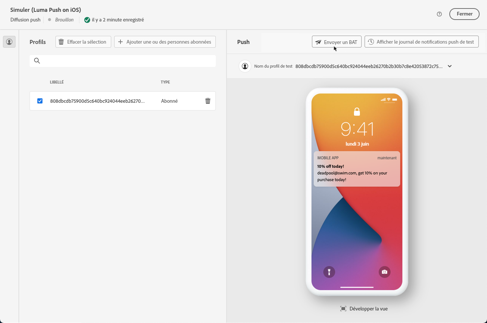

# Envoyer des diffusions test {#send-test-deliveries}

>[!CONTEXTUALHELP]
>id="acw_email_preview_mode"
>title="Mode Aperçu"
>abstract="Prévisualisez et testez le message en incluant la population test à la cible principale."

Une fois le contenu de votre message défini, vous pouvez le prévisualiser et le tester en envoyant des diffusions test aux profils de test. Si vous avez inséré du contenu personnalisé, vous pouvez vérifier son contenu dans le message à l’aide des données de profil de test.

Pour détecter d’éventuelles erreurs dans le contenu du message ou les paramètres de personnalisation, envoyez des diffusions test aux profils de test avant de les envoyer à l’audience cible. Une diffusion test doit être envoyée à chaque modification afin de valider le contenu le plus récent. L’envoi de diffusions test (également appelées « BAT ») est une étape importante dans la validation de votre campagne et l’identification de tout problème potentiel. Les destinataires d’une diffusion test peuvent vérifier différents éléments tels que des liens, des liens de désinscription, des images ou des pages miroir, ainsi que détecter toute erreur de rendu, de contenu, de paramètres de personnalisation et de configuration de la diffusion.

## Simuler du contenu avec des destinataires test {#simulate-content-test-deliveries}

>[!CONTEXTUALHELP]
>id="acw_email_preview_option_test_target"
>title="Population test"
>abstract="Sélectionnez un mode de population test."

Avant d’envoyer un test, assurez-vous de définir une audience cible pour votre diffusion. [En savoir plus](../audience/add-audience.md).

Pour commencer à tester le contenu de votre message :

1. Modifiez le contenu de votre diffusion.
1. Cliquez sur le bouton **[!UICONTROL Simuler le contenu]**.
1. Cliquez sur le bouton **[!UICONTROL Test]** pour envoyer les diffusions test.

   {zoomable=&quot;yes&quot;}

1. Sélectionnez les destinataires du test.

   Selon le canal de message, les diffusions test sont envoyées aux types de destinataires suivants :

   * Pour les SMS et les e-mails, vous pouvez utiliser des [profils de test](#test-profiles), qui sont des destinataires supplémentaires spécifiques dans la base de données. Vous pouvez également utiliser le mode de [substitution de la cible principale](#substitution-profiles), qui envoie les diffusions test à l’adresse e-mail ou au numéro de téléphone test et utilise les données de personnalisation d’un profil existant. Vous pouvez ainsi consulter le message comme si vous étiez la personne destinataire, avec le contenu reproduit à l’identique pour le profil indiqué.

   * Pour les messages push, vous pouvez utiliser des [personnes abonnées](#subscribers) fictives ajoutées à la base de données. Elles sont créés dans la console [!DNL Campaign]. En savoir plus dans la [documentation de Campaign v8 (console cliente)](https://experienceleague.adobe.com/docs/campaign/campaign-v8/audience/add-profiles/test-profiles.html?lang=fr){target="_blank"}.

   La configuration détaillée de chaque mode est disponible ci-dessous.

## Utiliser des profils de test {#test-profiles}

>[!CONTEXTUALHELP]
>id="acw_deliveries_simulate_test_mode"
>title="Cible du BAT"
>abstract="Vous pouvez télécharger un second fichier en tant que « cible du BAT » si vous souhaitez tester votre diffusion avant de l’envoyer à la cible principale."

>[!CONTEXTUALHELP]
>id="acw_deliveries_simulate_test_upload"
>title="Charger les profils"
>abstract="Vous pouvez charger un second fichier avec des profils supplémentaires si vous souhaitez tester votre diffusion avec un ensemble différent de celui utilisé pour la cible principale."

>[!CONTEXTUALHELP]
>id="acw_deliveries_simulate_test_sample"
>title="Fichier modèle"
>abstract="La mise en forme du fichier doit être identique à celle du fichier d’origine. Formats de fichiers pris en charge : txt, csv. Taille maximale du fichier : 15 Mo. Utilisez la première ligne comme en-tête de colonne."

>[!CONTEXTUALHELP]
>id="acw_sms_preview_option_app_target"
>title="Inclure les profils de test dans l’audience principale"
>abstract="Activez cette option pour envoyer également le message final aux personnes destinataires de la diffusion de test."

Les profils de test sont des personnes destinataires supplémentaires dans la base de données. Ils sont créés à partir du menu **[!UICONTROL Gestion des clientes et clients]** > **[!UICONTROL Profils]**. [En savoir plus](../audience/test-profiles.md#create-test-profiles)

Les étapes d’envoi de diffusions test aux profils de test sont détaillées ci-dessous.

1. Dans le contenu de votre diffusion, cliquez sur le bouton **[!UICONTROL Simuler le contenu]**, puis sur le bouton **[!UICONTROL Test]**.

1. Dans la liste déroulante **[!UICONTROL Mode]**, choisissez les **[!UICONTROL Profils de test]** pour cibler les destinataires fictifs qui recevront la diffusion e-mail ou SMS de test.

   {zoomable=&quot;yes&quot;}

1. Si vous avez déjà sélectionné des profils pour [prévisualiser le message](preview-content.md) dans l’écran de simulation du contenu, ils sont présélectionnés comme destinataires du test. Vous pouvez effacer votre sélection et/ou ajouter des destinataires supplémentaires à l’aide du bouton **[!UICONTROL Ajouter un ou plusieurs profils de test]**.

1. Lorsque vous parcourez le profil de test ou la liste des profils, vous pouvez ajouter des filtres pour affiner votre recherche. Par exemple, vous pouvez définir une règle pour rechercher tous les profils de test dotés du statut **[!UICONTROL Prospect]**. Découvrez comment ajouter des règles à l’aide du [concepteur de requêtes](../query/query-modeler-overview.md).

   {zoomable=&quot;yes&quot;}

1. Si vous souhaitez envoyer le message final aux personnes destinataires de la diffusion test, sélectionnez l’option **[!UICONTROL Inclure la population du test dans la cible principale]**.

   {zoomable=&quot;yes&quot;}

1. Une fois les profils de test sélectionnés, vous pouvez [envoyer la diffusion test](#send-test).

## Substituer des données de profil {#substitution-profiles}

Utilisez la substitution de profil pour envoyer des diffusions test à une adresse e-mail ou à un numéro de téléphone spécifiques, tout en affichant les données d’un profil existant de la base de données [!DNL Adobe Campaign]. Ce mode ne peut être sélectionné que si l’audience de la diffusion a été définie.

Pour remplacer les données de profil de la cible principale, procédez comme suit :

1. Dans le contenu de votre diffusion, cliquez sur le bouton **[!UICONTROL Simuler le contenu]**, puis sur le bouton **[!UICONTROL Test]**.

1. Dans la liste déroulante **[!UICONTROL Mode]**, choisissez l’option **[!UICONTROL Substituer à partir de la cible principale]** pour envoyer un test à une adresse e-mail ou un numéro de téléphone spécifique tout en affichant les données d’un profil existant.

   >[!CAUTION]
   >
   >Si vous n’avez pas sélectionné d’[audience](../audience/about-recipients.md) pour votre diffusion, l’option **[!UICONTROL Substituer à partir de la cible principale]** est grisée et vous ne pourrez pas sélectionner de profil de substitution.

1. Cliquez sur le bouton **[!UICONTROL Ajouter une adresse]** et indiquez l’adresse e-mail ou le numéro de téléphone qui recevra la diffusion test.

   {zoomable=&quot;yes&quot;}

   >[!NOTE]
   >
   >Vous pouvez saisir n’importe quelle adresse e-mail ou numéro de téléphone. Vous pouvez ainsi envoyer des diffusions de test à n’importe quel destinataire, même s’il est étranger à [!DNL Adobe Campaign].

1. Sélectionnez le profil de la cible que vous avez définie pour votre diffusion à utiliser en remplacement. Vous pouvez également laisser [!DNL Adobe Campaign] sélectionner un profil aléatoire à partir de la cible. Les données du profil sélectionné seront affichées dans la diffusion test.

1. Confirmez le ou la destinataire et renouvelez l’opération pour ajouter autant d’adresses e-mail ou de numéros de téléphone que nécessaire.

   {zoomable=&quot;yes&quot;}

1. Si vous souhaitez envoyer le message final aux destinataires de la diffusion test, sélectionnez l’option **[!UICONTROL Inclure la population du test dans la cible principale]**.

1. Une fois les profils de substitution sélectionnés, vous pouvez [envoyer la diffusion test](#send-test).

## Envoyer des tests aux personnes abonnées de l’application {#subscribers}

Lorsque vous travaillez avec les notifications push, les diffusions test ne peuvent être envoyées qu’aux personnes abonnées de votre application. Pour les sélectionner, procédez comme suit.

1. Dans le contenu de votre diffusion push, cliquez sur le bouton **[!UICONTROL Simuler le contenu]**, puis sur le bouton **[!UICONTROL Test]**.

   {zoomable=&quot;yes&quot;}

1. Si vous avez déjà sélectionné des abonnés et abonnées pour [prévisualiser la diffusion](preview-content.md) dans l’écran de simulation du contenu, ces profils sont présélectionnés comme abonnés du test.

   Vous pouvez effacer votre sélection et/ou ajouter d’autres abonnés et abonnées à l’aide du bouton dédié.

   {zoomable=&quot;yes&quot;}

1. Si vous souhaitez envoyer la notification push finale aux abonnés et abonnées du test, sélectionnez l’option **[!UICONTROL Inclure la population du test dans la cible principale]**.

1. Une fois les abonnés et abonnées sélectionnés, [envoyez la diffusion test](#send-test).

## Envoyer la diffusion test {#send-test}

Pour envoyer la diffusion test aux destinataires sélectionné(e)s, procédez comme suit.

1. Cliquez sur le bouton **[!UICONTROL Envoyer un test]**.

1. Confirmez l’envoi.

   {zoomable=&quot;yes&quot;}

1. Envoyez autant de tests que nécessaire jusqu’à ce que le contenu de votre diffusion soit finalisé.

Une fois cette opération effectuée, vous pouvez préparer et envoyer la diffusion à la cible principale. Pour ce faire, consultez les sections dédiées ci-dessous :

* [Envoyer votre e-mail](../monitor/prepare-send.md)
* [Envoyer votre notification push](../push/send-push.md#send-push)
* [Envoyer votre diffusion par SMS](../sms/send-sms.md#send-sms)

## Accéder aux diffusions tests envoyées {#access-test-deliveries}

Une fois les diffusions test envoyées, vous pouvez accéder aux journaux dédiés à partir du bouton **[!UICONTROL Afficher le journal des tests]**.

Ces journaux permettent d’accéder à tous les tests envoyés pour la diffusion sélectionnée et de visualiser des statistiques spécifiques relatives à leur envoi. [Découvrez comment surveiller les logs de diffusion](../monitor/delivery-logs.md).

{zoomable=&quot;yes&quot;}

Vous pouvez également accéder aux tests envoyés à partir de la [liste de diffusion](../msg/gs-messages.md), comme pour n’importe quelle diffusion.

{zoomable=&quot;yes&quot;}
