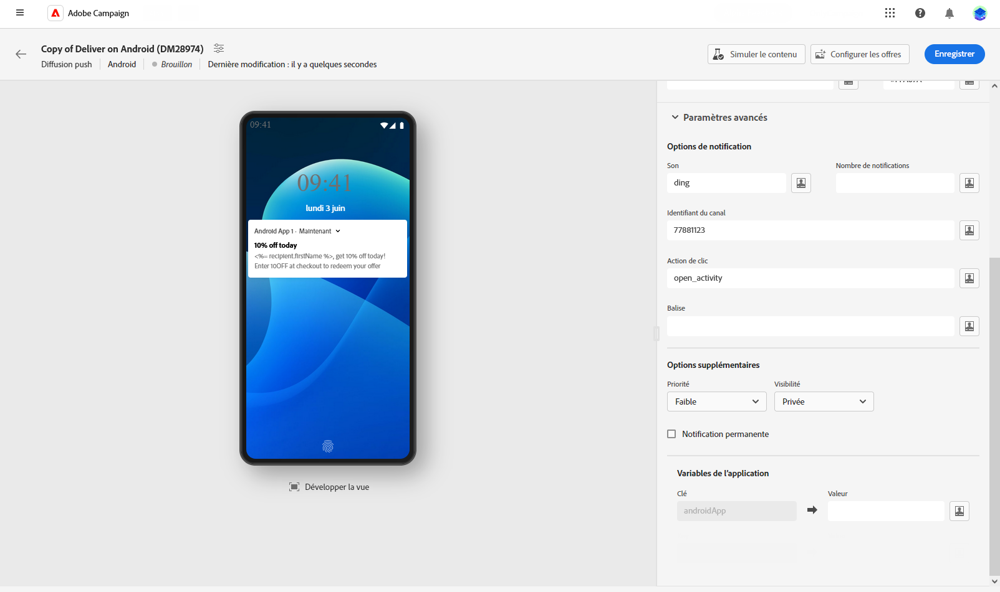

# Concevoir une diffusion de notification push {#content-push}

>[!CONTEXTUALHELP]
>id="acw_deliveries_push_android_content"
>title="Contenu de notification push pour Android"
>abstract="Définissez le contenu de votre notification push pour les appareils Android. Pour commencer à composer votre message, cliquez sur le bouton **Modifier le contenu**."

>[!CONTEXTUALHELP]
>id="acw_deliveries_push_ios_content"
>title="Contenu de notification push pour iOS"
>abstract="Définissez le contenu de votre notification push pour les appareils iOS. Pour commencer à composer votre message, cliquez sur le bouton **Modifier le contenu**."

## Définir le contenu de la notification {#push-message}

>[!CONTEXTUALHELP]
>id="acw_deliveries_push_ios_msg"
>title="Message push iOS"
>abstract="Définissez le contenu de votre notification push pour les appareils iOS. Pour composer votre message, cliquez sur les champs **Titre** et **Message**. Utilisez l’éditeur d’expression pour personnaliser des données et ajouter du contenu dynamique. Pour une configuration davantage personnalisée, accédez à la section **Paramètres avancés**."

>[!CONTEXTUALHELP]
>id="acw_deliveries_push_android_msg"
>title="Message push Android"
>abstract="Définissez le contenu de votre notification push pour les appareils Android. Pour composer votre message, cliquez sur les champs **Titre** et **Message**. Utilisez l’éditeur d’expression pour personnaliser des données et ajouter du contenu dynamique. Pour personnaliser davantage votre notification push, vous pouvez choisir une image à lui ajouter, l’icône de la notification qui s’affichera sur les appareils de vos profils et sa couleur. Pour une configuration davantage personnalisée, accédez à la section **Paramètres avancés**."

>[!CONTEXTUALHELP]
>id="acw_deliveries_push_ios_silent"
>title="Notification silencieuse pour iOS"
>abstract="Le mode Notification silencieuse permet d’envoyer une notification « silencieuse » à une application mobile. L&#39;utilisateur n&#39;est pas averti de l&#39;arrivée de la notification. Elle est directement transférée à l&#39;application."

Une fois votre diffusion de notification push créée, définissez son contenu. Les paramètres et la configuration dépendent du système d’exploitation mobile : Android ou iOS. Accédez aux onglets ci-dessous pour savoir comment composer votre message pour chaque système d’exploitation.

>[!BEGINTABS]

>[!TAB Android]

Firebase Cloud Messaging vous permet de choisir entre deux types de messages :

* Le **[!UICONTROL Message de données]** est géré par l’application cliente. Ces messages sont envoyés directement à l’application mobile, qui génère et affiche une notification Android sur l’appareil. Les messages de données contiennent uniquement vos variables d’application personnalisées.

  Pour définir le contenu, personnaliser les données et ajouter du contenu dynamique, cliquez sur le champ **[!UICONTROL Message]** et utilisez l’éditeur d’expression. Accédez à cet éditeur pour personnaliser vos messages.
Dans le menu **[!UICONTROL Variables de l’application]**, vos variables d’application sont automatiquement ajoutées. Ces variables vous permettent de définir le comportement des notifications. Par exemple, configurez un écran d’application spécifique qui s’affichera lorsque l’utilisateur ou l’utilisatrice activera la notification.

  {zoomable="yes"}

* Le **[!UICONTROL Message de notification]**, géré automatiquement par le SDK FCM. FCM affiche automatiquement le message sur les appareils de vos utilisateurs et utilisatrices pour le compte de l&#39;application cliente. Les messages de notification contiennent un ensemble de paramètres et d’options prédéfini, mais peuvent encore être personnalisés avec des variables d’application personnalisées.

  Pour composer votre message, cliquez sur les champs **[!UICONTROL Titre]** et **[!UICONTROL Message]**. Utilisez l’éditeur d’expression pour définir le contenu, personnaliser les données et ajouter du contenu dynamique.

  Pour personnaliser davantage votre notification push, choisissez une image à lui ajouter, l’icône de la notification qui s’affichera sur les appareils de vos profils et sa couleur.

  {zoomable="yes"}

>[!TAB iOS]

Pour composer votre message, cliquez sur les champs **[!UICONTROL Titre]** et **[!UICONTROL Message]**. Utilisez l’éditeur d’expression pour définir le contenu, personnaliser les données et ajouter du contenu dynamique.

Vous pouvez ajouter un **[!UICONTROL sous-titre]**, qui est la valeur du paramètre de sous-titre du payload de notification iOS. Voir cette section.

Le mode Notification silencieuse permet d&#39;envoyer une notification « silencieuse » à une application mobile. L&#39;utilisateur n&#39;est pas averti de l&#39;arrivée de la notification. Elle est directement transférée à l&#39;application.

{zoomable="yes"}

>[!ENDTABS]

## Paramètres avancés des notifications Push {#push-advanced}

>[!CONTEXTUALHELP]
>id="acw_deliveries_push_advanced_settings"
>title="Paramètres avancés des notifications push"
>abstract="Définissez des paramètres avancés pour votre notification push, tels que sa priorité, le nombre de notifications associées, les variables d’application, etc."

>[!CONTEXTUALHELP]
>id="acw_deliveries_push_advanced_settings_critical"
>title="Mode d’alerte critique"
>abstract="Activez cette option pour ajouter du son à votre notification, même si le téléphone de la personne est en mode Concentration ou si l’appareil est en mode silencieux. Ainsi, les utilisateurs et utilisatrices reçoivent les alertes importantes dans tous les cas."

>[!CONTEXTUALHELP]
>id="acw_deliveries_push_advanced_settings_count"
>title="Nombre de notifications"
>abstract="Utilisez cette option pour définir le nombre de notifications non lues à afficher directement sur l’icône de l’application. Cela permet à l’utilisateur ou à l’utilisatrice de voir rapidement le nombre de notifications en attente."

>[!CONTEXTUALHELP]
>id="acw_deliveries_push_advanced_settings_mutable"
>title="Contenu mutable"
>abstract="Utilisez cette option pour permettre à l’application mobile de télécharger le contenu multimédia associé à la notification."

>[!CONTEXTUALHELP]
>id="acw_deliveries_push_advanced_settings_score"
>title="Score de pertinence"
>abstract="Définissez un score de pertinence compris entre 0 et 100 pour classer par priorité l’ordre des notifications dans le résumé des notifications. Des scores plus élevés indiquent des notifications plus importantes."

>[!CONTEXTUALHELP]
>id="acw_deliveries_push_advanced_settings_app_variables"
>title="Variables de l’application"
>abstract="Utilisez des variables d’application pour définir le comportement des notifications. Ces variables sont entièrement personnalisables et font partie de la payload du message envoyée à l’appareil mobile."

>[!CONTEXTUALHELP]
>id="acw_deliveries_push_advanced_settings_category"
>title="Identifiant de la catégorie"
>abstract="Indiquez le nom de l’ID de catégorie associé à la notification. Cela permet d’afficher des boutons d’action, permettant à l’utilisateur ou utilisatrice d’effectuer différentes tâches directement depuis la notification sans ouvrir l’application."

Les options avancées dépendent du système d’exploitation mobile : Android ou iOS. Accédez aux onglets ci-dessous pour savoir comment définir les options de votre message pour chaque système d’exploitation.

>[!BEGINTABS]

>[!TAB Android]

{zoomable="yes"}

| Paramètre | Description |
|---------|---------|
| **[!UICONTROL Son]** | Définissez le son à émettre lorsque l’appareil reçoit votre notification. |
| **[!UICONTROL Nombre de notifications]** | Définissez le nombre de nouvelles informations non lues à afficher directement sur l’icône de l’application. Cela permet à l’utilisateur ou à l’utilisatrice de voir rapidement le nombre de notifications en attente. |
| **[!UICONTROL Identifiant du canal]** | Définissez l’identifiant de canal de votre notification. L’application doit créer un canal avec cet identifiant de canal avant la réception d’une notification avec cet identifiant de canal. |
| **[!UICONTROL Action de clic]** | Définissez l’action associée à un clic de l’utilisateur sur votre notification. Cela détermine le comportement lorsque l’utilisateur ou l’utilisatrice interagit avec la notification, par exemple en ouvrant une fenêtre spécifique ou en effectuant une action spécifique dans votre application. |
| **[!UICONTROL Balise]** | Définissez l’identifiant utilisé pour remplacer les notifications existantes dans le tiroir de notifications. Vous éviterez ainsi l’accumulation de plusieurs notifications et vous assurerez que seule la dernière notification pertinente est affichée. |
| **[!UICONTROL Priorité]** | Définissez le niveau de priorité de votre notification, qui peut être par défaut, minimale, faible ou élevée. Le niveau de priorité détermine l’importance et l’urgence de la notification. Il influence son affichage et la possibilité ou non qu’elle puisse contourner certains paramètres système. Pour plus d’informations à ce propos, consultez la [documentation FCM](https://firebase.google.com/docs/reference/fcm/rest/v1/projects.messages#notificationpriority). |
| **[!UICONTROL Visibilité]** | Définissez le niveau de visibilité de votre notification, qui peut être publique, privée ou secrète. Le niveau de visibilité détermine dans quelle mesure le contenu de la notification s’affiche sur l’écran de verrouillage et dans d’autres zones sensibles. Pour plus d’informations, consultez la [documentation FCM](https://firebase.google.com/docs/reference/fcm/rest/v1/projects.messages#visibility). |
| **[!UICONTROL Épinglé]** | Lorsqu’elle est activée, la notification reste visible si l’utilisateur ou l’utilisatrice clique dessus.  Si cette option est désactivée, la notification est automatiquement ignorée lorsque la personne interagit avec celle-ci. Le comportement en « pense-bête » permet à des notifications importantes de persister pendant de plus longues périodes à l’écran. |
| **[!UICONTROL Variables de l’application]** | Permet de définir le comportement des notifications. Ces variables sont entièrement personnalisables et font partie de la payload du message envoyée à l’appareil mobile. |

>[!TAB iOS]

{zoomable="yes"}

| Paramètre | Description |
|---------|---------|
| **[!UICONTROL Mode d’alerte critique]** | Activez cette option pour ajouter du son à votre notification, même si le téléphone de la personne est en mode Concentration ou si l’appareil est en mode silencieux. Vous vous assurerez ainsi que les alertes importantes sont remarquées par la personne. Lorsque cette option est sélectionnée, vous pouvez régler le volume de la notification à partir de la barre de niveau Volume. Un nombre compris entre 0 et 100 au-dessus de la barre reflète vos paramètres. |
| **[!UICONTROL Nettoyer la pastille]** | Activez cette option pour actualiser la valeur du badge affichée sur l’icône de l’application. Vous vous assurerez ainsi que le badge reflète exactement le nombre de nouvelles informations non lues. |
| **[!UICONTROL Nombre de notifications]** | Définissez un nombre qui s’affichera directement sur l’icône de l’application, indiquant le nombre de nouvelles informations non lues. Vous obtiendrez ainsi une référence visuelle rapide pour l’utilisateur ou l’utilisatrice. |
| **[!UICONTROL Volume]** | Volume de votre son de 0 à 100. |
| **[!UICONTROL Contenu mutable]** | Activez cette option pour permettre à l’application mobile de télécharger le contenu multimédia associé à la notification. Consultez à ce sujet la [Documentation développeur Apple](https://developer.apple.com/library/content/documentation/NetworkingInternet/Conceptual/RemoteNotificationsPG/ModifyingNotifications.html). |
| **[!UICONTROL Contenu disponible]** | Activez cette option pour permettre à votre notification de déclencher des mises à jour en arrière-plan sur les appareils iOS, même lorsque l’application n’est pas activement ouverte. Cela permet de s’assurer que le contenu, comme les messages ou les mises à jour de données, peut être traité et stocké dans la boîte de réception de l’application sans nécessiter d’interaction de l’utilisateur ou de l’utilisatrice. Lorsqu’il est sélectionné, l’indicateur `content-available: 1` est ajouté au payload `aps` conformément aux normes du service de notifications push d’Apple (APNS). |
| **[!UICONTROL Score de pertinence]** | Définissez un score de pertinence compris entre 0 et 100 pour classer par priorité l’ordre des notifications dans le résumé des notifications. Des scores plus élevés indiquent des notifications plus importantes. |
| **[!UICONTROL Niveau d&#39;interruption]** | <ul> <li>**[!UICONTROL Actif]** : défini par défaut, le système présente immédiatement la notification, illumine l’écran et peut émettre un son. Les notifications ne passent pas en mode Thème.</li><li>**[!UICONTROL Passif]** : le système ajoute la notification à la liste de notifications sans allumer l’écran ni émettre de son. Les notifications ne passent pas en mode Thème.</li><li>**[!UICONTROL Sensible à l’heure]** : le système présente immédiatement la notification, allume l’écran, peut émettre un son et passer en mode Concentration. Ce niveau ne nécessite pas d’autorisation spéciale de la part d’Apple.</li> <li>**[!UICONTROL Critique]** : le système présente immédiatement la notification, allume l’écran et contourne le bouton de désactivation ou le mode Concentration. Notez que ce niveau nécessite une autorisation spéciale de la part d’Apple.</ul> |
| **[!UICONTROL Thread-id]** | Identifiant utilisé pour regrouper les notifications associées. Les notifications ayant le même id de thread sont organisées en tant que conversation ou thread unique dans la liste de notifications. |
| **[!UICONTROL Catégorie]** | Indiquez le nom de l’ID de catégorie associé à la notification. Cela permet d’afficher des boutons d’action, permettant à l’utilisateur ou utilisatrice d’effectuer différentes tâches directement depuis la notification sans ouvrir l’application. |
| **[!UICONTROL Identifiant du contenu Target]** | Identifiant utilisé pour cibler la fenêtre d’application à afficher au premier plan à l’ouverture de la notification. |
| **[!UICONTROL Image de Launch]** | Indiquez le nom du fichier image de lancement à afficher lorsque l’utilisateur ou utilisatrice choisit de lancer votre application à partir de la notification. L’image sélectionnée s’affiche au lieu de l’écran de lancement standard de votre application. |
| **[!UICONTROL Variables de l’application]** | Permet de définir le comportement des notifications. Ces variables sont entièrement personnalisables et font partie de la payload du message envoyée à l’appareil mobile. |

>[!ENDTABS]

<!--Sounds must be included in the application and defined when the service is created. Refer to this section.-->
