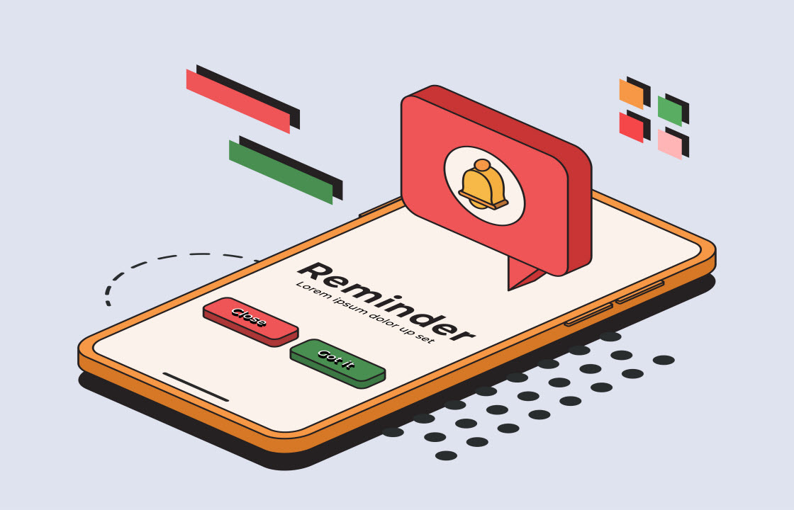

# Prise en main des notifications push {#push}

Les notifications push sont essentielles pour communiquer avec les utilisateurs et utilisatrices de votre application mobile, même lorsqu’ils ne l’utilisent pas activement. Elles ont plusieurs objectifs : fournir des mises à jour, inciter à des actions spécifiques et informer les utilisateurs et utilisatrices des offres. Notez que les utilisateurs doivent s’inscrire pour recevoir ces notifications.

Pour créer des notifications push, vous disposez de trois options :

* **Workflows** : après avoir ajouté une activité de canal push à votre workflow et configuré les paramètres de base, concevez le contenu de vos notifications push à partir du menu du volet de droite. Pour obtenir des instructions détaillées sur la configuration des workflows, consultez [cette page](../workflows/gs-workflows.md).

* **Campagnes** : après avoir créé une campagne, configurez une diffusion Notification push. Pour plus d&#39;informations sur la configuration des campagnes, consultez [cette page](../campaigns/gs-campaigns.md).

* **Diffusions autonomes** : interagissez directement et instantanément avec les clients avec des diffusions de notifications push individuelles, sans nécessiter de workflows ni de campagnes.

 Découvrez comment configurer le canal de notification push dans la documentation [Campaign v8 (console cliente)](https://experienceleague.adobe.com/docs/campaign/campaign-v8/campaigns/send/push.html?lang=fr){target="_blank"}.

<table style="table-layout:fixed"><tr style="border: 0;">
<td>

<a href="create-push.md"><strong>Créer une diffusion de notification push</strong>

</td>
<td>

<a href="content-push.md"><strong>Concevoir une diffusion de notification push<strong></strong></a>

</td>
<td>

<a href="send-push.md"><strong>Envoyer une diffusion de notification push</strong></a>

</td>
<td>

<a href="send-push.md"><strong>Rapport de diffusion des notifications push</strong></a>

</td>
</tr></table>