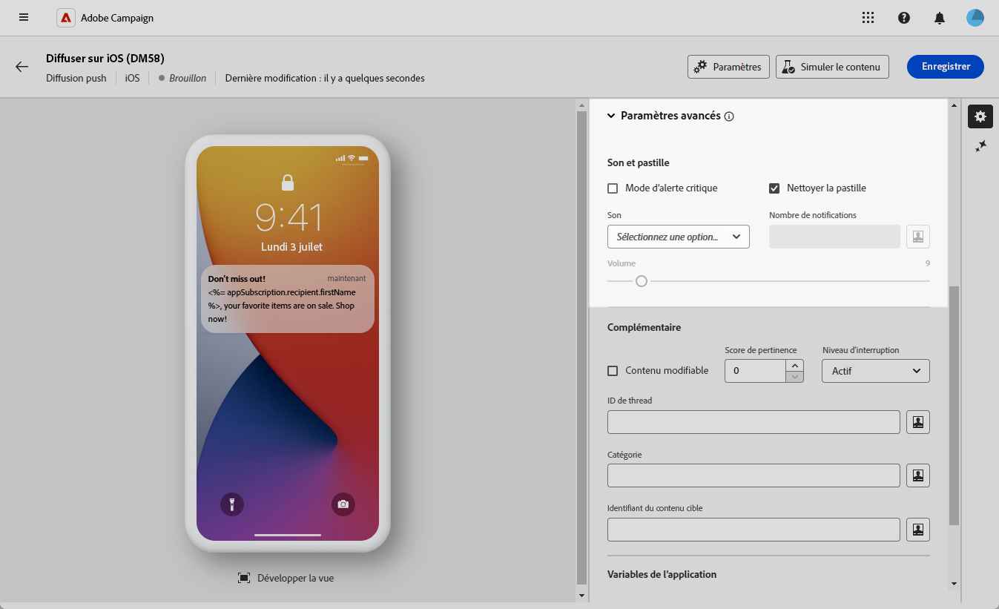
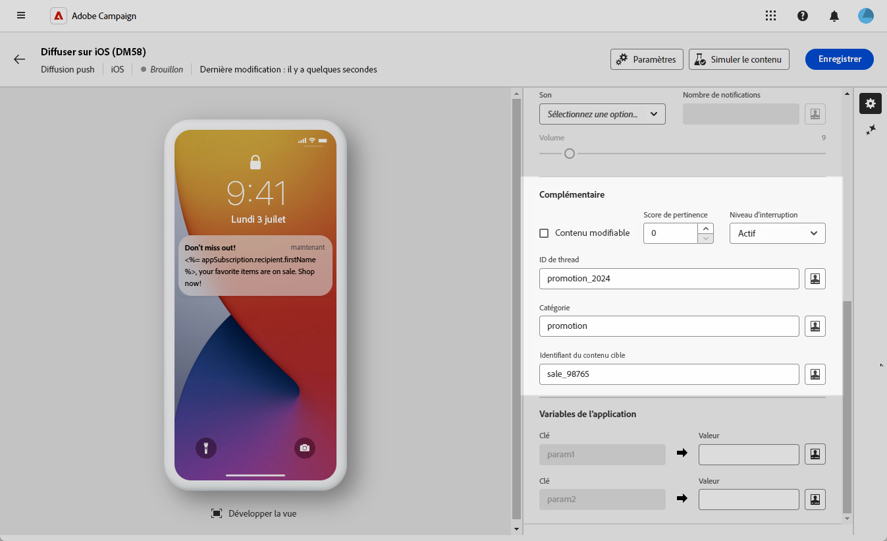
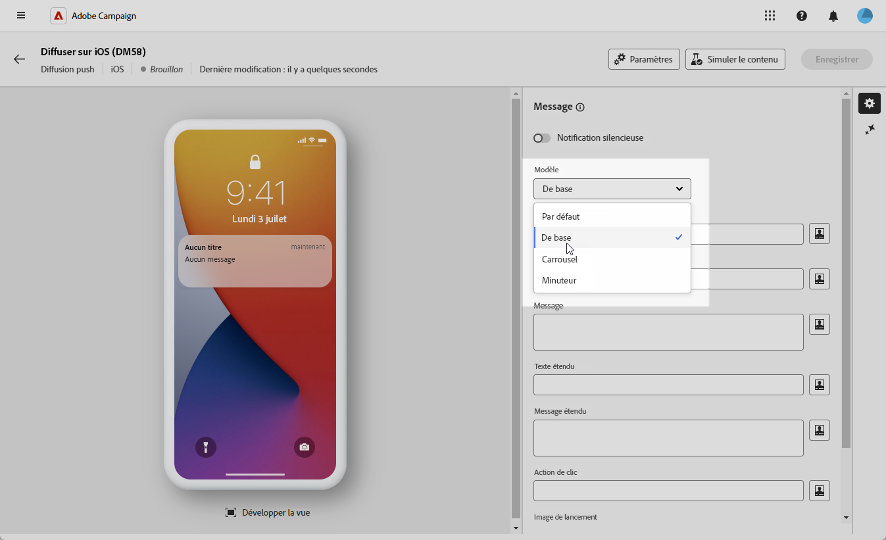
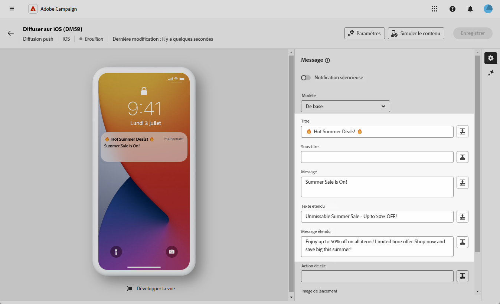
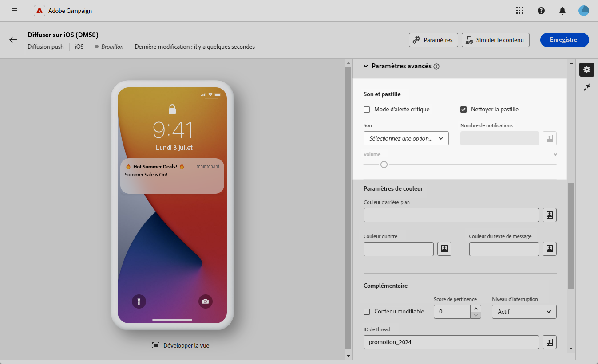
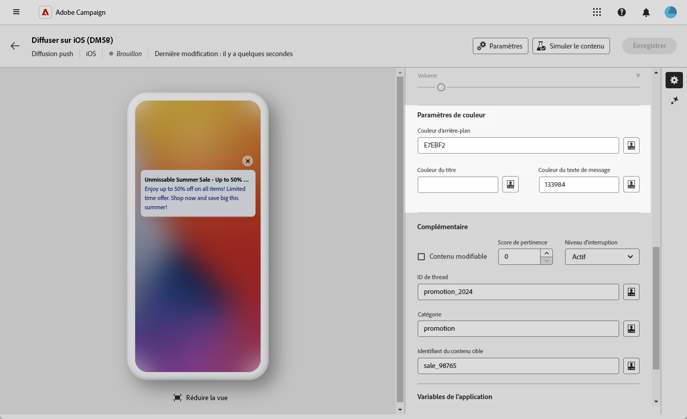
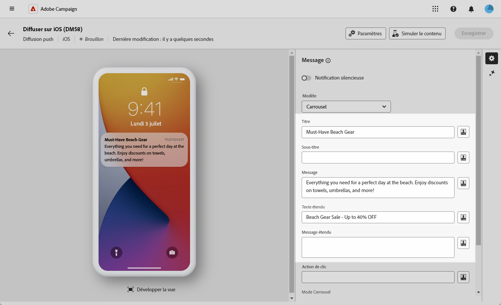
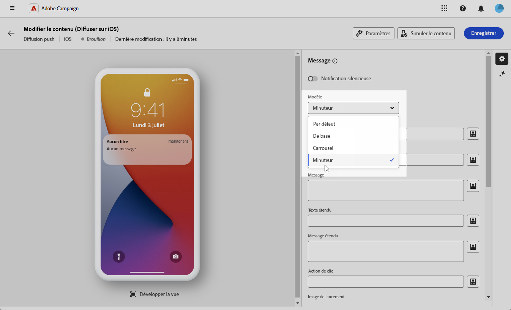
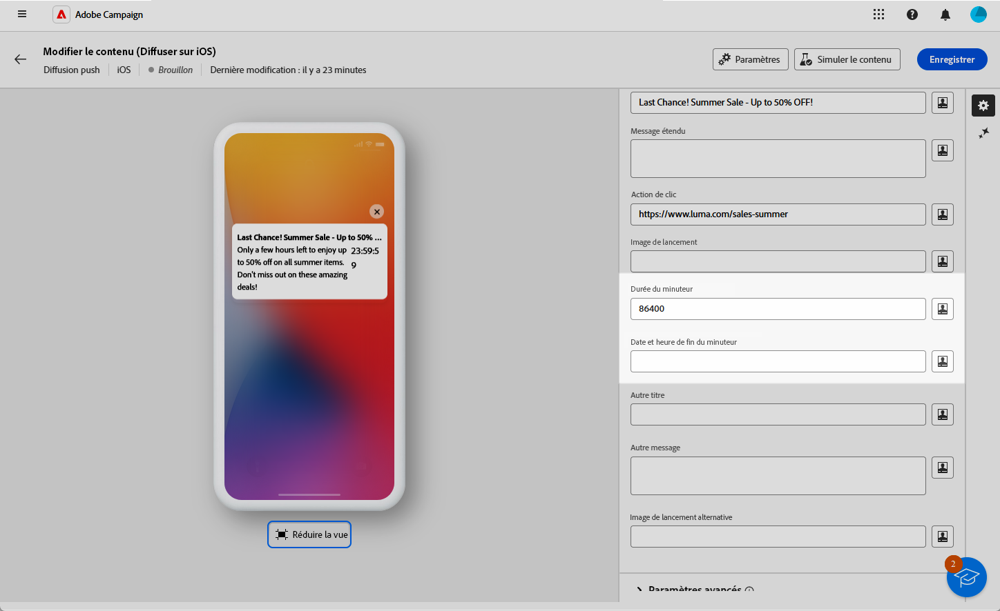
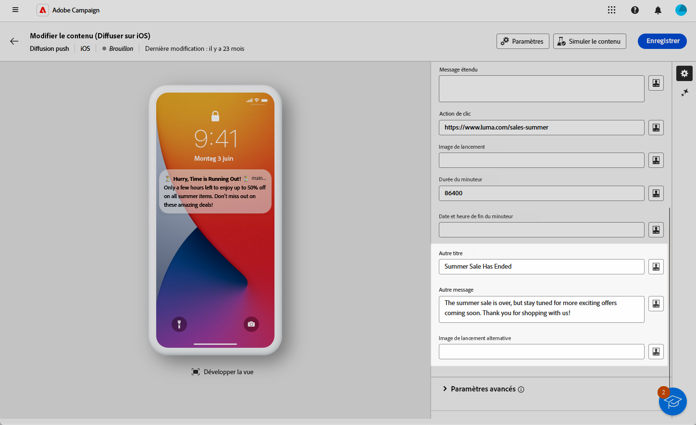

# Concevoir une diffusion de notification push iOS enrichie {#rich-push}

>[!IMPORTANT]
>
>Avant de concevoir une notification Push enrichie, vous devez configurer votre connecteur V2. Consultez [cette page](https://experienceleague.adobe.com/fr/docs/campaign-classic/using/sending-messages/sending-push-notifications/configure-the-mobile-app/configuring-the-mobile-application) pour accéder à la procédure détaillée.

## Définir le contenu de la notification {#push-message}

Une fois votre diffusion Push créée, vous pouvez définir son contenu à l’aide d’un des modèles suivants :

* Le **modèle par défaut** vous permet d’envoyer des notifications avec une simple icône et une image associée.
* Le **modèle de base** peut inclure du texte, des images et des boutons dans vos notifications.
* Le **carousel** vous permet d’envoyer des notifications avec du texte et plusieurs images que les utilisateurs et utilisatrices peuvent faire défiler.
* Le **retardateur** inclut un minuteur avec compte à rebours dynamique dans vos notifications.

Accédez aux onglets ci-dessous pour en savoir plus sur la personnalisation de ces modèles.

>[!BEGINTABS]

>[!TAB Par défaut]

1. Dans le menu déroulant **[!UICONTROL Modèle]**, sélectionnez **[!UICONTROL Par défaut]**.

   

1. Dans le champ **[!UICONTROL Titre]**, saisissez le libellé du titre qui doit apparaître dans la liste des notifications disponibles depuis le centre de notifications.

   Ce champ vous permet de définir la valeur du paramètre **Titre** de la payload de notification iOS.

1. Vous pouvez éventuellement ajouter un **[!UICONTROL Sous-titre]**, qui correspond à la valeur du paramètre **sous-titre** du payload de notification iOS.

1. Saisissez le contenu du message dans le champ **[!UICONTROL Message]**.

1. Utilisez l’éditeur d’expression pour définir le contenu, personnaliser les données et ajouter du contenu dynamique. [En savoir plus](../personalization/personalize.md)

   

1. Pour personnaliser davantage votre notification Push, vous pouvez choisir une URL d’**[!UICONTROL image de lancement]** à ajouter à votre notification Push.

1. Dans la liste déroulante **[!UICONTROL Paramètres avancés]**, accédez à l’onglet **[!UICONTROL Son et pastille]** pour personnaliser des paramètres supplémentaires tels que les options de son et de pastille pour vos notifications. [En savoir plus](#sound-badge)

   

1. Pour une personnalisation plus poussée, explorez les options **[!UICONTROL supplémentaires]** disponibles pour vos notifications push. [En savoir plus](#push-advanced)

   

1. Dans le menu **[!UICONTROL Variables de l’application]**, vos **[!UICONTROL variables d’application]** sont automatiquement ajoutées. Elles vous permettent de définir le comportement des notifications. Par exemple, vous pouvez configurer l’affichage d’un écran spécifique d’une application lorsqu’une personne active la notification.

Une fois que vous avez défini le contenu de votre message, vous pouvez utiliser des personnes abonnées de test pour prévisualiser et tester le message.

>[!TAB De base]

1. Dans le menu déroulant **[!UICONTROL Modèle]**, sélectionnez **[!UICONTROL De base]**.

   

1. Pour composer votre message, saisissez votre texte dans les champs **[!UICONTROL Titre]**, **[!UICONTROL Titre étendu]**, **[!UICONTROL Message]** et **[!UICONTROL Message étendu]**.

   Le texte du **[!UICONTROL Message]** apparaît dans la vue réduite tandis que le **[!UICONTROL Message étendu]** s’affiche lorsque la notification est développée.

   

1. Utilisez l’éditeur d’expression pour définir le contenu, personnaliser les données et ajouter du contenu dynamique. [En savoir plus](../personalization/personalize.md)

1. Vous pouvez éventuellement ajouter un **[!UICONTROL Sous-titre]**, qui correspond à la valeur du paramètre **sous-titre** du payload de notification iOS.

1. Ajoutez l’URL qui définit l’**[!UICONTROL Action lors du clic]** associée au clic d’un utilisateur ou d’une utilisatrice sur votre notification. Cela détermine le comportement lorsque l’utilisateur ou l’utilisatrice interagit avec la notification, par exemple en ouvrant une fenêtre spécifique ou en effectuant une action spécifique dans votre application.

1. Pour personnaliser davantage votre notification Push, vous pouvez choisir une URL d’**[!UICONTROL image de lancement]** à ajouter à votre notification Push.

1. Dans la liste déroulante **[!UICONTROL Paramètres avancés]**, accédez à l’onglet **[!UICONTROL Son et pastille]** pour personnaliser des paramètres supplémentaires tels que les options de son et de pastille pour vos notifications. [En savoir plus](#sound-badge)

   

1. Dans le menu **[!UICONTROL Options des couleurs]**, saisissez des codes de couleur hexadécimaux pour la **[!UICONTROL couleur d’arrière-plan de la notification]**, la **[!UICONTROL couleur d’arrière-plan de la notification]** et la **[!UICONTROL couleur du texte du message]**.

   

1. Pour une personnalisation plus poussée, explorez les options **[!UICONTROL supplémentaires]** disponibles pour vos notifications push. [En savoir plus](#push-advanced)

1. Dans le menu **[!UICONTROL Variables de l’application]**, vos **[!UICONTROL variables d’application]** sont automatiquement ajoutées. Elles vous permettent de définir le comportement des notifications. Par exemple, vous pouvez configurer l’affichage d’un écran spécifique d’une application lorsqu’une personne active la notification.

Une fois que vous avez défini le contenu de votre message, vous pouvez utiliser des personnes abonnées de test pour prévisualiser et tester le message.

>[!TAB Carousel]

1. Dans le menu déroulant **[!UICONTROL Modèle]**, sélectionnez **[!UICONTROL Carousel]**.

   

1. Pour composer votre message, saisissez votre texte dans les champs **[!UICONTROL Titre]**, **[!UICONTROL Titre étendu]**, **[!UICONTROL Message]** et **[!UICONTROL Message étendu]**.

   Le texte du **[!UICONTROL Message]** apparaît dans la vue réduite tandis que le **[!UICONTROL Message étendu]** s’affiche lorsque la notification est développée.

   

1. Utilisez l’éditeur d’expression pour définir le contenu, personnaliser les données et ajouter du contenu dynamique. [En savoir plus](../personalization/personalize.md)

1. Vous pouvez éventuellement ajouter un **[!UICONTROL Sous-titre]**, qui correspond à la valeur du paramètre **sous-titre** du payload de notification iOS.

1. Ajoutez l’URL qui définit l’**[!UICONTROL Action lors du clic]** associée au clic d’un utilisateur ou d’une utilisatrice sur votre notification. Cela détermine le comportement lorsque l’utilisateur ou l’utilisatrice interagit avec la notification, par exemple en ouvrant une fenêtre spécifique ou en effectuant une action spécifique dans votre application.

1. Choisissez le mode de fonctionnement du **[!UICONTROL carrousel]** :

   * **[!UICONTROL Auto]** : fait automatiquement défiler les images sous forme de diapositives, selon des transitions à intervalles prédéfinis.
   * **[!UICONTROL Manuel]** : permet de passer manuellement d’une diapositive à l’autre pour naviguer dans les images.

1. Cliquez sur **[!UICONTROL Ajouter une image]** et saisissez l’URL de votre **[!UICONTROL image]**, le **[!UICONTROL texte]** et l’**[!UICONTROL URL d’action]**.

   Veillez à inclure trois images minimum et cinq images maximum.

   

1. Ajustez l’ordre de vos images à l’aide des flèches haut et bas.

1. Dans la liste déroulante **[!UICONTROL Paramètres avancés]**, accédez à l’onglet **[!UICONTROL Son et pastille]** pour personnaliser des paramètres supplémentaires tels que les options de son et de pastille pour vos notifications. [En savoir plus](#sound-badge)

1. Dans le menu **[!UICONTROL Options de couleurs]**, saisissez des codes de couleur hexadécimaux pour la **[!UICONTROL couleur d’arrière-plan de la notification]**, la **[!UICONTROL couleur d’arrière-plan de la notification]** et la **[!UICONTROL couleur du texte du message]**.

   

1. Pour une personnalisation plus poussée, explorez les options **[!UICONTROL supplémentaires]** disponibles pour vos notifications push. [En savoir plus](#push-advanced)

1. Dans le menu **[!UICONTROL Variables de l’application]**, vos **[!UICONTROL variables d’application]** sont automatiquement ajoutées. Elles vous permettent de définir le comportement des notifications. Par exemple, vous pouvez configurer l’affichage d’un écran spécifique d’une application lorsqu’une personne active la notification.

Une fois que vous avez défini le contenu de votre message, vous pouvez utiliser des personnes abonnées de test pour prévisualiser et tester le message.

>[!TAB Retardateur]

1. Dans le menu déroulant **[!UICONTROL Type de notification]**, sélectionnez **[!UICONTROL Retardateur]**.

   

1. Pour composer votre message, saisissez votre texte dans les champs **[!UICONTROL Titre]**, **[!UICONTROL Titre étendu]**, **[!UICONTROL Message]** et **[!UICONTROL Message étendu]**.

   Le texte du **[!UICONTROL Message]** apparaît dans la vue réduite tandis que le **[!UICONTROL Message étendu]** s’affiche lorsque la notification est développée.

   

1. Utilisez l’éditeur d’expression pour définir le contenu, personnaliser les données et ajouter du contenu dynamique. [En savoir plus](../personalization/personalize.md)

1. Vous pouvez éventuellement ajouter un **[!UICONTROL Sous-titre]**, qui correspond à la valeur du paramètre **sous-titre** du payload de notification iOS.

1. Ajoutez l’URL qui définit l’**[!UICONTROL Action lors du clic]** associée au clic d’un utilisateur ou d’une utilisatrice sur votre notification. Cela détermine le comportement lorsque l’utilisateur ou l’utilisatrice interagit avec la notification, par exemple en ouvrant une fenêtre spécifique ou en effectuant une action spécifique dans votre application.

1. Pour personnaliser davantage votre notification Push, vous pouvez choisir une URL d’**[!UICONTROL image de lancement]** à ajouter à votre notification Push.

1. Définissez la **[!UICONTROL durée du retardateur]** en secondes ou l’**[!UICONTROL horodatage de fin du retardateur]** sur un horodatage d’époque spécifique.

   

1. Saisissez le texte et l’image qui s’afficheront une fois le retardateur ayant expiré dans les champs **[!UICONTROL Autre titre]**, **[!UICONTROL Autre message]** et **[!UICONTROL Autre image de lancement]**.

   

1. Dans la liste déroulante **[!UICONTROL Paramètres avancés]**, accédez à l’onglet **[!UICONTROL Son et pastille]** pour personnaliser des paramètres supplémentaires tels que les options de son et de pastille pour vos notifications. [En savoir plus](#sound-badge)

1. Dans le menu **[!UICONTROL Options de couleurs]**, saisissez des codes de couleur hexadécimaux pour la **[!UICONTROL couleur d’arrière-plan de la notification]**, la **[!UICONTROL couleur d’arrière-plan de la notification]** et la **[!UICONTROL couleur du texte du message]**.

1. Pour une personnalisation plus poussée, explorez les options **[!UICONTROL supplémentaires]** disponibles pour vos notifications push. [En savoir plus](#push-advanced)

1. Dans le menu **[!UICONTROL Variables de l’application]**, vos **[!UICONTROL variables d’application]** sont automatiquement ajoutées. Elles vous permettent de définir le comportement des notifications. Par exemple, vous pouvez configurer l’affichage d’un écran spécifique d’une application lorsqu’une personne active la notification.

Une fois que vous avez défini le contenu de votre message, vous pouvez utiliser des personnes abonnées de test pour prévisualiser et tester le message.

>[!ENDTABS]

## Paramètres avancés des notifications Push {#push-advanced}

### Options de son et pastille {#sound-badge}

| Paramètre | Description |
|-----------|-------------|
| **[!UICONTROL Mode d’alerte critique]** | Activez cette option pour ajouter du son à votre notification, même si le téléphone de la personne est en mode Concentration ou en mode silencieux. |
| **[!UICONTROL Actualiser la pastille]** | Activez cette option pour actualiser la valeur de la pastille. |
| **[!UICONTROL Son]** | Définissez le son à émettre lorsque l’appareil reçoit votre notification. |
| **[!UICONTROL Nombre de notifications]** | Définissez un nombre à afficher directement sur l’icône de l’application pour indiquer le nombre de notifications non lues. |
| **[!UICONTROL Volume]** | Définissez le volume de votre son de 0 à 100. Les sons doivent être inclus dans l’application et définis lors de la création du service. |

### Options de couleur {#color}

| Paramètre | Description |
|-----------|-------------|
| **[!UICONTROL Couleur d’arrière-plan de la notification]** | Définissez la couleur de votre arrière-plan de notification à l’aide de codes couleur hexadécimaux. |
| **[!UICONTROL Couleur du titre]** | Définissez la couleur de votre titre à l’aide de codes couleur hexadécimaux. |
| **[!UICONTROL Couleur du texte de message]** | Définissez la couleur de votre texte à l’aide de codes couleur hexadécimaux. |

### Options avancées {#notification-options}

| Paramètre | Description |
|-----------|-------------|
| **[!UICONTROL Contenu modifiable]** | Activez cette option pour permettre à l’application mobile de télécharger le contenu multimédia. |
| **[!UICONTROL Score de pertinence]** | Définissez un score de pertinence compris entre 0 et 100. Le système l’utilise pour trier les notifications dans le récapitulatif des notifications. |
| **[!UICONTROL Niveau d&#39;interruption]** | <ul><li>**Actif** : défini par défaut, le système présente immédiatement la notification, illumine l’écran et peut émettre un son. Les notifications n’outrepassent pas le mode Concentration.</li><li>**Passif** : le système ajoute la notification à la liste de notifications sans allumer l’écran ni émettre de son. Les notifications n’outrepassent pas le mode Concentration.</li><li>**Sensible à l’heure** : le système présente immédiatement la notification, allume l’écran, peut émettre un son et outrepasser le mode Concentration. Ce niveau ne nécessite pas d’autorisation spéciale de la part d’Apple.</li><li>**Critique** : le système présente immédiatement la notification, allume l’écran et contourne le bouton de désactivation ou le mode Concentration. Notez que ce niveau nécessite une autorisation spéciale de la part d’Apple.</li></ul> |
| **[!UICONTROL Thread-id]** | Définissez l’identifiant utilisé pour regrouper les notifications associées. |
| **[!UICONTROL Catégorie]** | Définissez le nom de votre identifiant de catégorie qui affichera les boutons d’action. Ces notifications permettent à la personne d’effectuer plus rapidement différentes tâches en réponse à une notification, sans ouvrir l’application ou la parcourir. |
| **[!UICONTROL Identifiant du contenu Target]** | Définissez un identifiant utilisé pour cibler la fenêtre d’application à afficher au premier plan à l’ouverture de la notification. |