# Concevoir une diffusion de notification push Android enrichie {#rich-push}

>[!CONTEXTUALHELP]
>id="acw_deliveries_push_remind_later"
>title="Bouton Rappeler plus tard"
>abstract="Le bouton **Rappeler plus tard** permet de planifier un rappel. Le champ Date et heure exige une valeur représentant une époque en secondes."

>[!IMPORTANT]
>
>* Cette fonctionnalité nécessite une mise à jour vers Campaign v8.6.3 <!--or v8.7.2-->. En savoir plus dans les [notes de mise à jour](https://experienceleague.adobe.com/fr/docs/campaign/campaign-v8/releases/release-notes){target="_blank"} de la console cliente Campaign v8.
>
>* Avant de concevoir une notification push enrichie, vous devez d’abord configurer votre connecteur V2. Consultez [cette page](https://experienceleague.adobe.com/fr/docs/campaign-classic/using/sending-messages/sending-push-notifications/configure-the-mobile-app/configuring-the-mobile-application-android#configuring-external-account-android){target="_blank"} pour accéder à la procédure détaillée.

Firebase Cloud Messaging vous permet de choisir entre deux types de messages :

* Le **[!UICONTROL Message de données]** est géré par l’application cliente. Ces messages sont envoyés directement à l’application mobile, qui génère et affiche une notification Android sur l’appareil. Les messages de données contiennent uniquement vos variables d’application personnalisées.

* Le **[!UICONTROL Message de notification]**, géré automatiquement par le SDK FCM. FCM affiche automatiquement le message sur les appareils de vos utilisateurs et utilisatrices pour le compte de l&#39;application cliente. Les messages de notification contiennent un ensemble de paramètres et d’options prédéfini, mais peuvent encore être personnalisés avec des variables d’application personnalisées.

{zoomable="yes"}

## Définir le contenu de la notification {#push-message}

Une fois votre diffusion push créée, vous pouvez définir son contenu à l’aide d’un des modèles suivants :

* Le **modèle par défaut** vous permet d’envoyer des notifications avec une simple icône et une image associée.

* Le **modèle de base** peut inclure du texte, des images et des boutons dans vos notifications.

* Le **carousel** vous permet d’envoyer des notifications avec du texte et plusieurs images que les utilisateurs et utilisatrices peuvent faire défiler.

* Les **boutons d’icône** vous permettent d’envoyer des notifications avec une icône et une image correspondante.

* La **zone d’entrée** rassemble les entrées et les commentaires des utilisateurs et utilisatrices directement via la notification.

* Le **catalogue de produits** affiche de nombreuses images de produits.

* La **notation de produit** permet aux utilisateurs et utilisatrices de donner leur avis et d’évaluer les produits.

* Le **retardateur** inclut un minuteur avec compte à rebours dynamique dans vos notifications.

* Le **Zéro Bezel** utilise toute la surface d’arrière-plan d’une image, avec du texte superposé de manière transparente.

Accédez aux onglets ci-dessous pour en savoir plus sur la personnalisation de ces modèles.

>[!BEGINTABS]

>[!TAB Par défaut]

1. Dans le menu déroulant **[!UICONTROL Modèle]**, sélectionnez **[!UICONTROL Par défaut]**.

   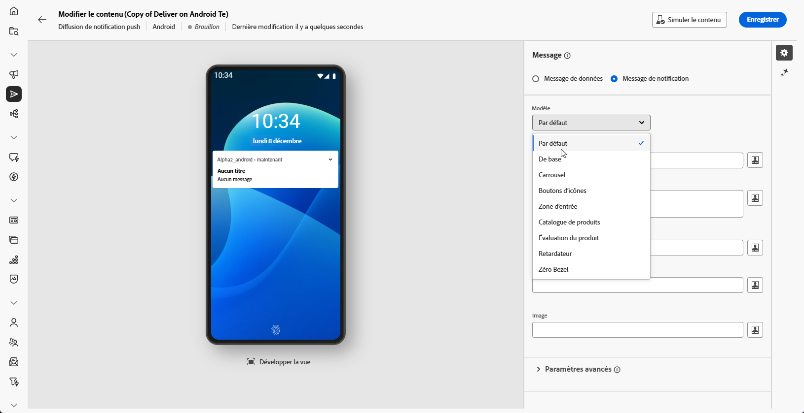

1. Pour composer votre message, saisissez votre texte dans les champs **[!UICONTROL Titre]** et **[!UICONTROL Message]**.

   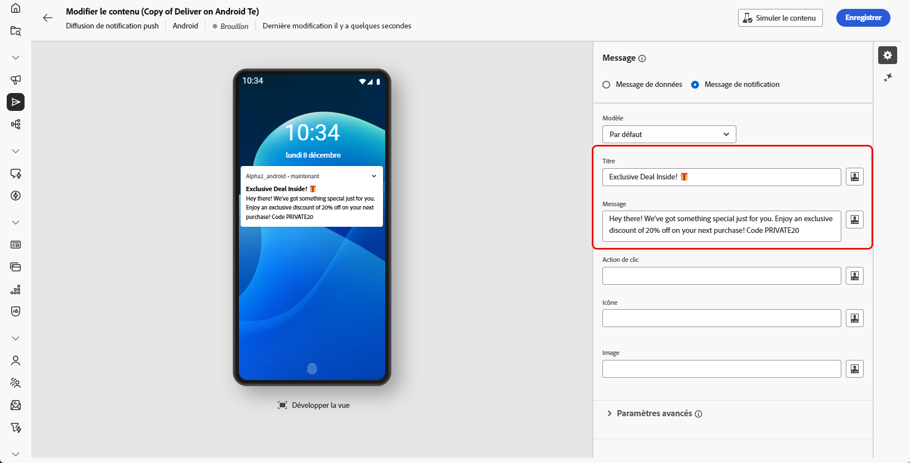

1. Utilisez l’éditeur d’expression pour définir le contenu, personnaliser les données et ajouter du contenu dynamique. [En savoir plus](../personalization/personalize.md)

1. Définissez l’**[!UICONTROL action du clic]** associée à un clic de l’utilisateur ou de l’utilisatrice sur votre notification. Cela détermine le comportement lorsque l’utilisateur ou l’utilisatrice interagit avec la notification, par exemple en ouvrant une fenêtre spécifique ou en effectuant une action spécifique dans votre application.

1. Pour personnaliser davantage votre notification push, vous pouvez choisir une URL d’**[!UICONTROL image]** à ajouter à votre notification et l’**[!UICONTROL icône]** de la notification qui s’affichera sur les appareils de vos profils.

   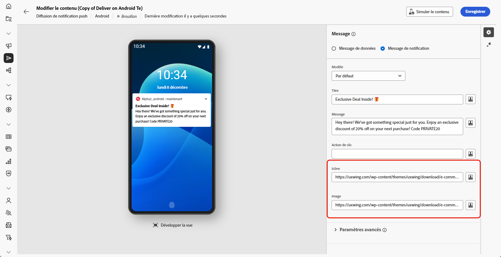

1. Configurez les **[!UICONTROL Paramètres avancés]** de votre notification push. [En savoir plus](#push-advanced)

Une fois que vous avez défini le contenu de votre message, vous pouvez utiliser des personnes abonnées test pour prévisualiser et tester le message.

>[!TAB De base]

1. Dans le menu déroulant **[!UICONTROL Modèle]**, sélectionnez **[!UICONTROL De base]**.

   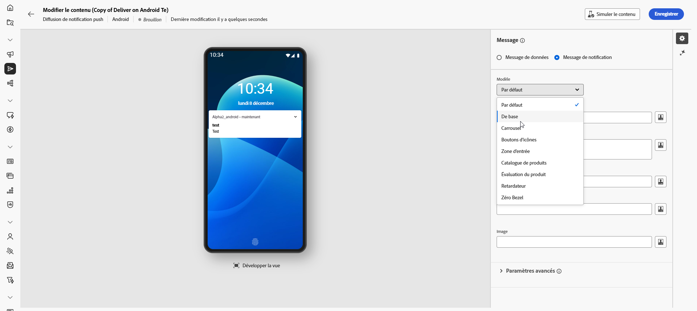

1. Pour composer votre message, saisissez votre texte dans les champs **[!UICONTROL Titre]**, **[!UICONTROL Message]** et **[!UICONTROL Message étendu]**.

   Le texte **[!UICONTROL Message]** s’affiche dans la vue réduite, alors que le **[!UICONTROL Message étendu]** s’affiche lorsque la notification est développée.

   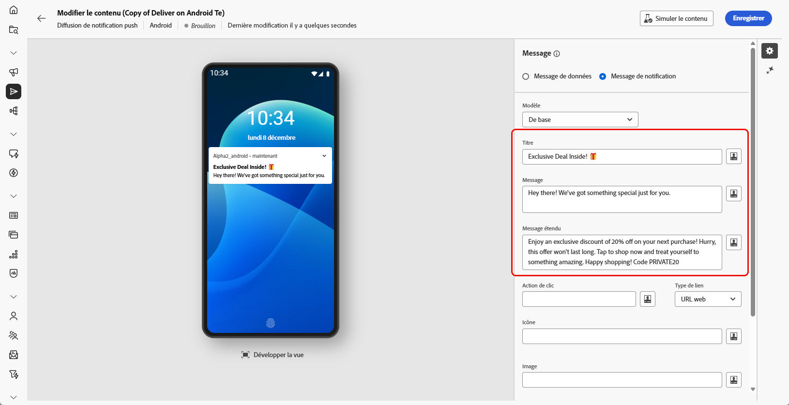

1. Utilisez l’éditeur d’expression pour définir le contenu, personnaliser les données et ajouter du contenu dynamique. [En savoir plus](../personalization/personalize.md)

1. Ajoutez l’URL qui définit l’**[!UICONTROL Action de clic]** associée à un clic sur votre notification. Cela détermine le comportement lorsque l’utilisateur ou l’utilisatrice interagit avec la notification, par exemple en ouvrant une fenêtre spécifique ou en effectuant une action spécifique dans votre application.

1. Sélectionnez le **[!UICONTROL Type de lien]** de l’URL que vous avez ajoutée au champ **[!UICONTROL Action du clic]** :

   * **[!UICONTROL URL web]** : les URL web orientent les utilisateurs et les utilisatrices vers du contenu en ligne. Après un clic, celles-ci entrainent l’ouverture du navigateur web par défaut de l’appareil qui accède ensuite à l’URL désignée.

   * **[!UICONTROL Lien profond]** : les liens profonds sont des URL qui orientent les personnes vers des sections spécifiques d’une application, même si celle-ci est fermée. Après un clic, une boîte de dialogue s’affiche, permettant aux utilisateurs et aux utilisatrices de choisir parmi différentes applications capables de gérer le lien.

   * **[!UICONTROL Ouvrir l’application]** : les URL d’ouverture de l’application vous permettent de vous connecter directement au contenu d’une application. Cela permet à votre application de se définir elle-même comme gestionnaire par défaut d’un type spécifique de lien, sans boîte de dialogue de choix.

   Pour plus d’informations sur la gestion de liens d’applications Android, consultez la [documentation de développement Android](https://developer.android.com/training/app-links).

   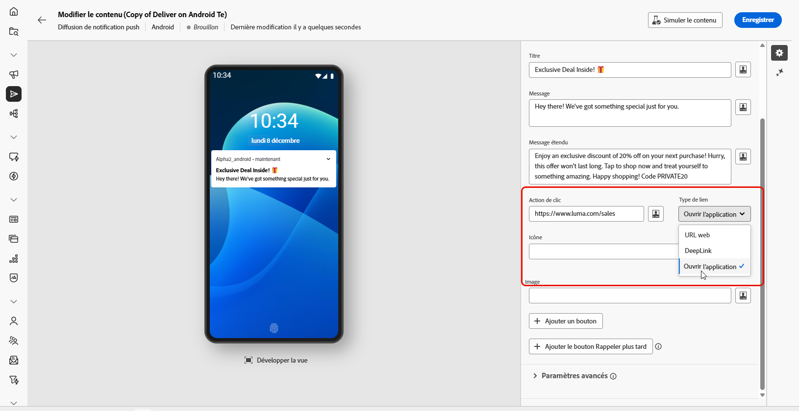

1. Pour personnaliser davantage votre notification push, vous pouvez choisir une URL d’**[!UICONTROL image]** à lui ajouter et l’**[!UICONTROL icône]** de la notification qui s’affichera sur les appareils de vos profils.

1. Cliquez sur le **[!UICONTROL bouton Ajouter]** et renseignez les champs suivants :

   * **[!UICONTROL Libellé]** : texte affiché sur le bouton.
   * **[!UICONTROL URI de lien]** : spécifiez l’URI à exécuter lorsque vous cliquez sur le bouton.
   * **[!UICONTROL Type de lien]** : **[!UICONTROL URL web]**, **[!UICONTROL Lien profond]** ou **[!UICONTROL Ouvrir l’application]**.

   Vous avez la possibilité d’inclure jusqu’à trois boutons dans votre notification push. Si vous optez pour le **[!UICONTROL bouton Rappeler plus tard]**, vous ne pouvez inclure que deux boutons au maximum.

   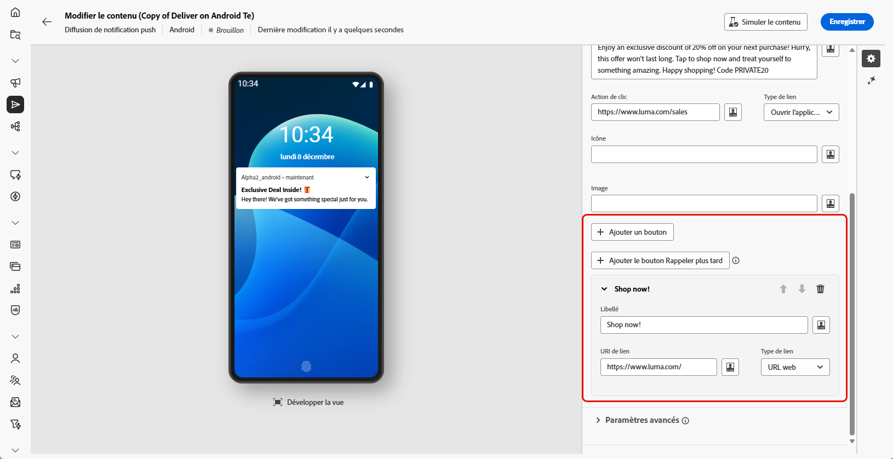

1. Cliquez sur **[!UICONTROL Ajouter un bouton Rappeler plus tard]** pour ajouter une option Me rappeler plus tard à votre notification push. Saisissez un **[!UICONTROL Libellé]**, ainsi que **[!UICONTROL la date et l’heure]**.

   Le champ Date et heure exige une valeur représentant une époque en secondes.

   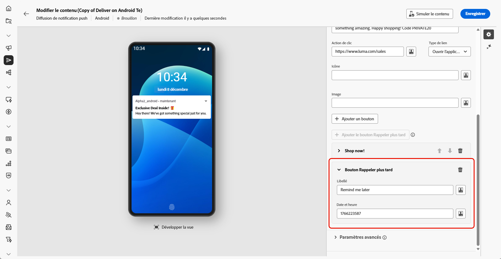

1. Configurez les **[!UICONTROL Paramètres avancés]** de votre notification push. [En savoir plus](#push-advanced)

Une fois que vous avez défini le contenu de votre message, vous pouvez utiliser des personnes abonnées test pour prévisualiser et tester le message.

>[!TAB Carousel]

1. Dans le menu déroulant **[!UICONTROL Modèle]**, sélectionnez **[!UICONTROL Carousel]**.

   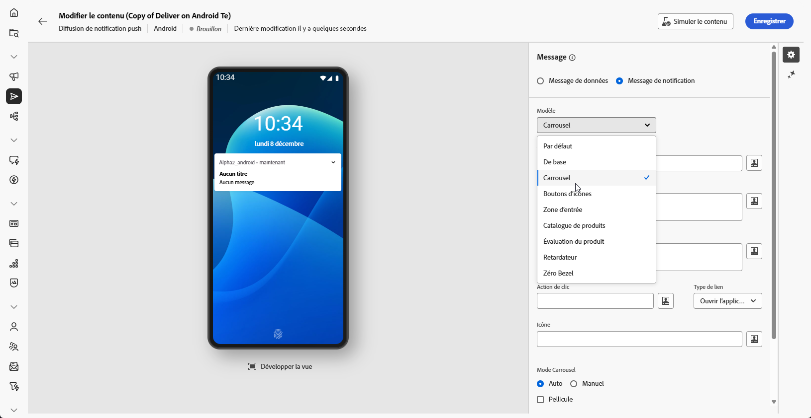

1. Pour composer votre message, saisissez votre texte dans les champs **[!UICONTROL Titre]**, **[!UICONTROL Message]** et **[!UICONTROL Message étendu]**.

   Le texte **[!UICONTROL Message]** s’affiche dans la vue réduite, alors que le **[!UICONTROL Message étendu]** s’affiche lorsque la notification est développée.

   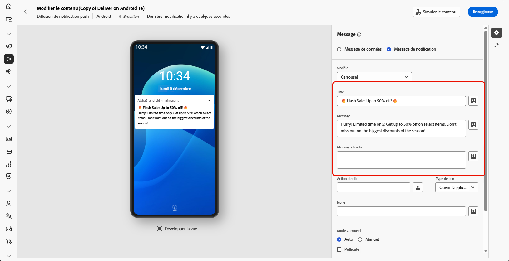

1. Utilisez l’éditeur d’expression pour définir le contenu, personnaliser les données et ajouter du contenu dynamique. [En savoir plus](../personalization/personalize.md)

1. Ajoutez l’URL qui définit l’**[!UICONTROL Action de clic]** associée à un clic sur votre notification. Cela détermine le comportement lorsque l’utilisateur ou l’utilisatrice interagit avec la notification, par exemple en ouvrant une fenêtre spécifique ou en effectuant une action spécifique dans votre application.

1. Sélectionnez le **[!UICONTROL Type de lien]** de l’URL que vous avez ajoutée au champ **[!UICONTROL Action de clic]** :

   * **[!UICONTROL URL web]** : les URL web orientent les personnes vers du contenu en ligne. Après un clic, celles-ci entrainent l’ouverture du navigateur web par défaut de l’appareil qui accède ensuite à l’URL désignée.

   * **[!UICONTROL Lien profond]** : les liens profonds sont des URL qui orientent les personnes vers des sections spécifiques d’une application, même si celle-ci est fermée. Après un clic, une boîte de dialogue s’affiche, permettant aux utilisateurs et aux utilisatrices de choisir parmi différentes applications capables de gérer le lien.

   * **[!UICONTROL Ouvrir l’application]** : les URL d’ouverture de l’application vous permettent de vous connecter directement au contenu d’une application. Cela permet à votre application de se définir elle-même comme gestionnaire par défaut d’un type spécifique de lien, sans boîte de dialogue de choix.

   Pour plus d’informations sur la gestion des liens des applications Android, consultez la [documentation destinée au développement Android](https://developer.android.com/training/app-links).

   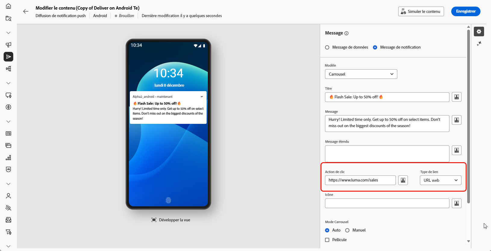

1. Pour personnaliser davantage votre notification push, vous pouvez choisir l’**[!UICONTROL icône]** de notification à afficher sur les appareils de vos profils.

1. Choisissez le mode de fonctionnement du **[!UICONTROL carrousel]** :

   * **[!UICONTROL Auto]** : fait automatiquement défiler les images sous forme de diapositives, selon des transitions à intervalles prédéfinis.
   * **[!UICONTROL Manuel]** : permet de passer manuellement d’une diapositive à l’autre pour naviguer dans les images.

     Activez l’option **[!UICONTROL Pellicule]** pour inclure la prévisualisation des images précédente et suivante en regard de la diapositive principale.

1. Cliquez sur **[!UICONTROL Ajouter une image]** et saisissez l’URL et le texte de votre image.

   Veillez à inclure trois images minimum et cinq images maximum.

   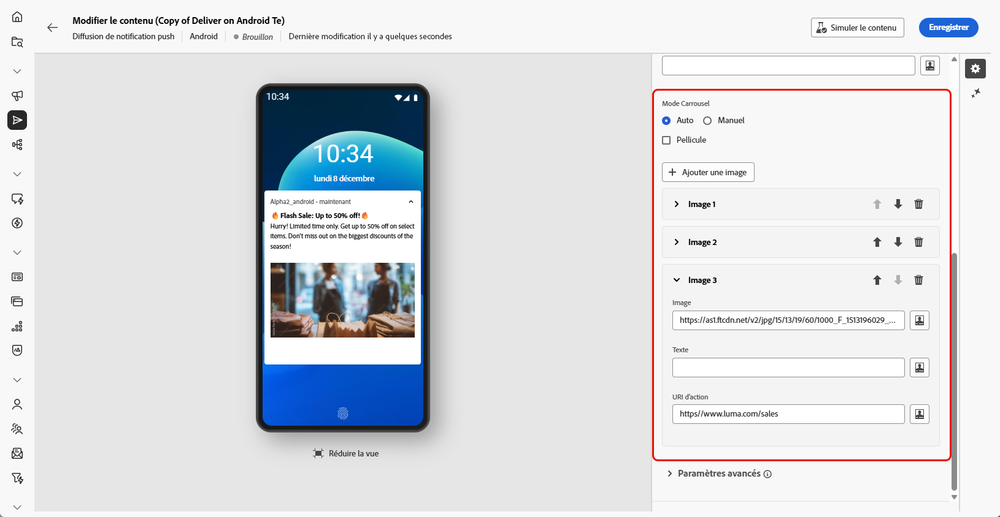

1. Gérez l’ordre de vos images à l’aide des flèches haut et bas.

1. Configurez les **[!UICONTROL Paramètres avancés]** de votre notification push. [En savoir plus](#push-advanced)

Une fois que vous avez défini le contenu de votre message, vous pouvez utiliser des personnes abonnées test pour prévisualiser et tester le message.

>[!TAB Boutons d’icônes]

1. Dans le menu déroulant **[!UICONTROL Modèle]**, sélectionnez **[!UICONTROL Boutons d’icônes]**.

   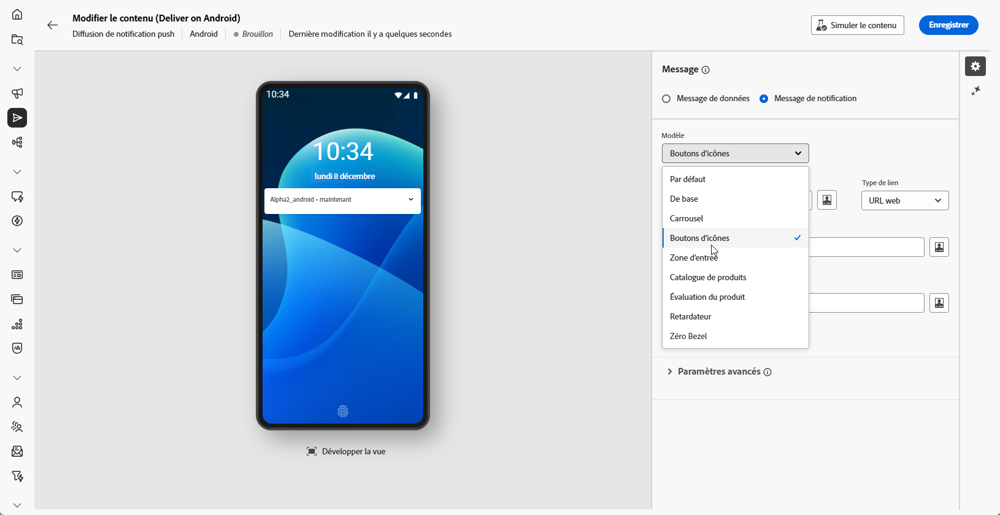

1. Ajoutez l’URL qui définit l’**[!UICONTROL Action de clic]** associée à un clic sur votre notification. Cela détermine le comportement lorsque l’utilisateur ou l’utilisatrice interagit avec la notification, par exemple en ouvrant une fenêtre spécifique ou en effectuant une action spécifique dans votre application.

1. Sélectionnez le **[!UICONTROL Type de lien]** de l’URL que vous avez ajoutée au champ **[!UICONTROL Action du clic]** :

   * **[!UICONTROL URL web]** : les URL web orientent les utilisateurs et les utilisatrices vers du contenu en ligne. Après un clic, celles-ci entrainent l’ouverture du navigateur web par défaut de l’appareil qui accède ensuite à l’URL désignée.

   * **[!UICONTROL Lien profond]** : les liens profonds sont des URL qui orientent les personnes vers des sections spécifiques d’une application, même si celle-ci est fermée. Après un clic, une boîte de dialogue s’affiche, permettant aux utilisateurs et aux utilisatrices de choisir parmi différentes applications capables de gérer le lien.

   * **[!UICONTROL Ouvrir l’application]** : les URL d’ouverture de l’application vous permettent de vous connecter directement au contenu d’une application. Cela permet à votre application de se définir elle-même comme gestionnaire par défaut d’un type spécifique de lien, sans boîte de dialogue de choix.

   Pour plus d’informations sur la gestion des liens des applications Android, consultez la [documentation destinée au développement Android](https://developer.android.com/training/app-links).

   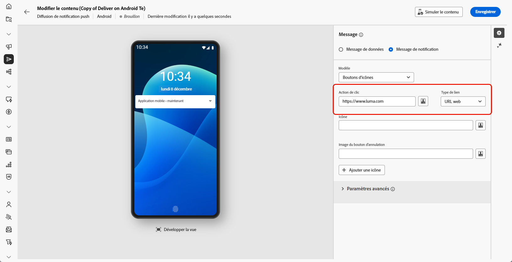

1. Pour personnaliser davantage votre notification push, vous pouvez choisir l’**[!UICONTROL icône]** de notification à afficher sur les appareils de vos profils.

1. Ajoutez l’URL de votre **[!UICONTROL image de bouton Annuler]**.

1. Cliquez sur **[!UICONTROL Ajouter une icône]**, saisissez votre **URL d’image**, **[!UICONTROL URI de lien]** et choisissez votre **[!UICONTROL type de lien]**.

   Veillez à inclure trois icônes minimum et cinq icônes maximum.

   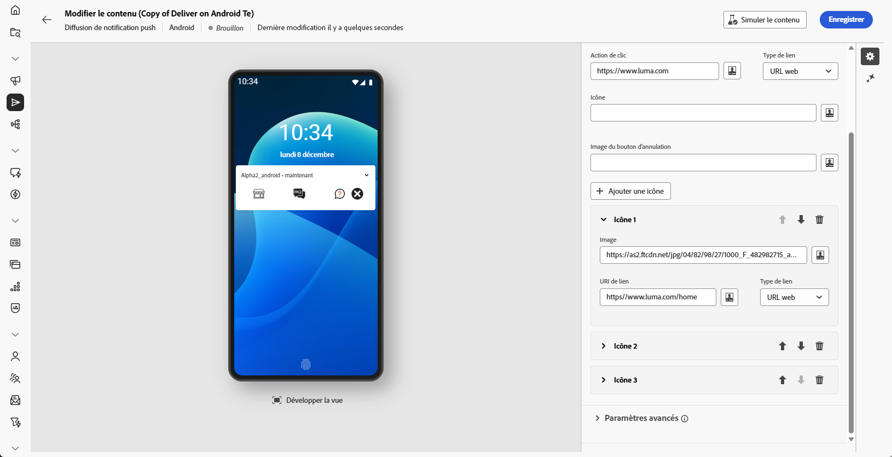

1. Gérez l’ordre de vos images à l’aide des flèches haut et bas.

1. Configurez les **[!UICONTROL Paramètres avancés]** de votre notification push. [En savoir plus](#push-advanced)

   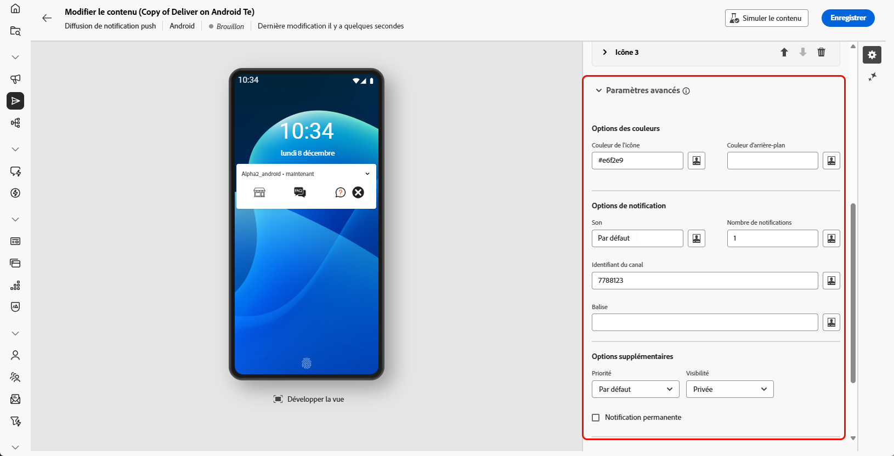

Une fois que vous avez défini le contenu de votre message, vous pouvez utiliser des personnes abonnées test pour prévisualiser et tester le message.

>[!TAB Zone d’entrée]

1. Dans le menu déroulant **[!UICONTROL Type de notification]**, sélectionnez **[!UICONTROL Zone d’entrée]**.

   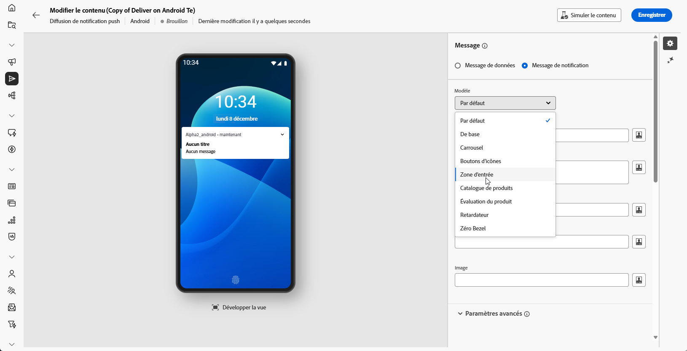

1. Pour composer votre message, saisissez votre texte dans les champs **[!UICONTROL Titre]**, **[!UICONTROL Message]** et **[!UICONTROL Message étendu]**.

   Le texte **[!UICONTROL Message]** s’affiche dans la vue réduite, alors que le **[!UICONTROL Message étendu]** s’affiche lorsque la notification est développée.

   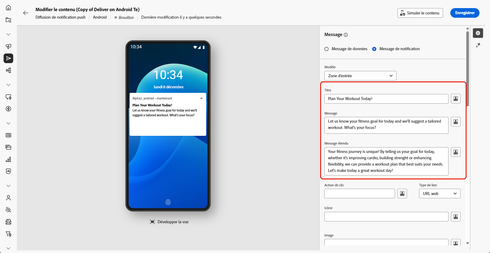

1. Utilisez les champs de personnalisation dynamiques pour définir le contenu, personnaliser les données et ajouter du contenu dynamique. [En savoir plus](../personalization/personalize.md)

1. Ajoutez l’URL qui définit l’**[!UICONTROL Action de clic]** associée à un clic sur votre notification. Cela détermine le comportement lorsque l’utilisateur ou l’utilisatrice interagit avec la notification, par exemple en ouvrant une fenêtre spécifique ou en effectuant une action spécifique dans votre application.

1. Sélectionnez le **[!UICONTROL Type de lien]** de l’URL que vous avez ajoutée au champ **[!UICONTROL Action du clic]** :

   * **[!UICONTROL URL web]** : les URL web orientent les utilisateurs et les utilisatrices vers du contenu en ligne. Après un clic, celles-ci entrainent l’ouverture du navigateur web par défaut de l’appareil qui accède ensuite à l’URL désignée.

   * **[!UICONTROL Lien profond]** : les liens profonds sont des URL qui orientent les personnes vers des sections spécifiques d’une application, même si celle-ci est fermée. Après un clic, une boîte de dialogue s’affiche, permettant aux utilisateurs et aux utilisatrices de choisir parmi différentes applications capables de gérer le lien.

   * **[!UICONTROL Ouvrir l’application]** : les URL d’ouverture de l’application vous permettent de vous connecter directement au contenu d’une application. Cela permet à votre application de se définir elle-même comme gestionnaire par défaut d’un type spécifique de lien, sans boîte de dialogue de choix.

   Pour plus d’informations sur la gestion de liens d’applications Android, consultez la [documentation de développement Android](https://developer.android.com/training/app-links).

1. Pour personnaliser davantage votre notification push, vous pouvez choisir une URL d’**[!UICONTROL image]** à lui ajouter et l’**[!UICONTROL icône]** de la notification qui s’affichera sur les appareils de vos profils.

1. Renseignez les options suivantes pour votre **zone d’entrée** :

   * **[!UICONTROL Nom du récepteur d’entrée]** : saisissez le nom ou l’identifiant du récepteur d’entrée.
   * **[!UICONTROL Texte d’entrée]** : saisissez le texte de la **zone d’entrée**.
   * **[!UICONTROL Texte de commentaire]** : saisissez le texte à afficher après une réponse.
   * **[!UICONTROL Image de commentaire]** : ajoutez l’URL de l’image affichée après une réponse.

   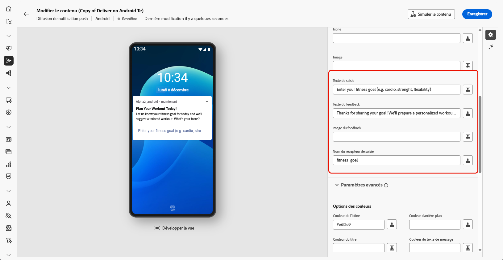

1. Configurez les **[!UICONTROL Paramètres avancés]** de votre notification push. [En savoir plus](#push-advanced)

Une fois que vous avez défini le contenu de votre message, vous pouvez utiliser des personnes abonnées test pour prévisualiser et tester le message.

>[!TAB Catalogue des produits]

1. Dans le menu déroulant **[!UICONTROL Type de notification]**, sélectionnez **[!UICONTROL Catalogue des produits]**.

   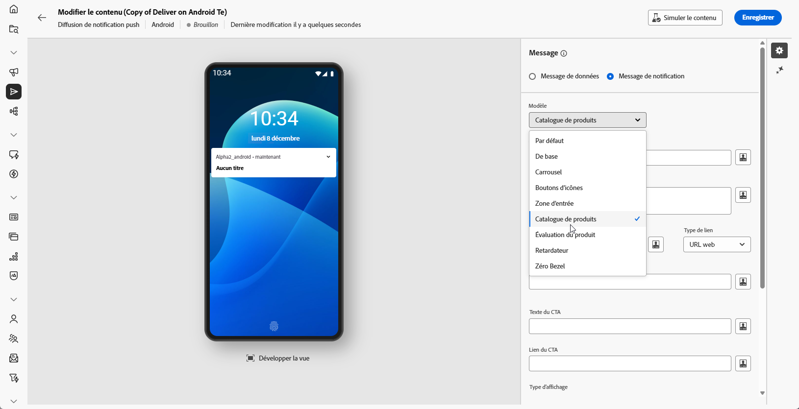

1. Pour composer votre message, saisissez votre texte dans les champs **[!UICONTROL Titre]** et **[!UICONTROL Message]**.

   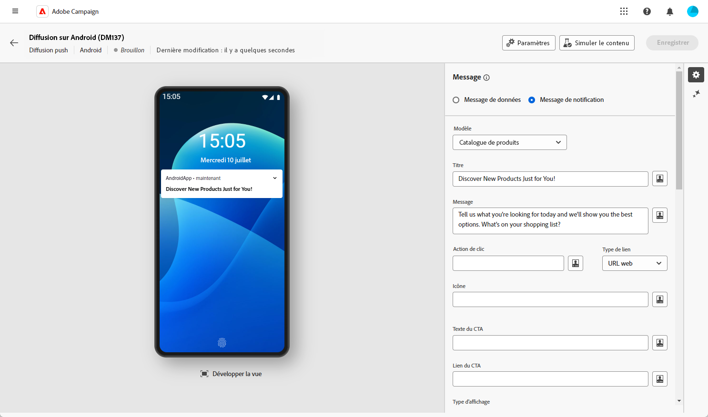

1. Utilisez les champs de personnalisation dynamiques pour définir le contenu, personnaliser les données et ajouter du contenu dynamique. [En savoir plus](../personalization/personalize.md)

1. Ajoutez l’URL qui définit l’**[!UICONTROL Action de clic]** associée à un clic sur votre notification. Cela détermine le comportement lorsque l’utilisateur ou l’utilisatrice interagit avec la notification, par exemple en ouvrant une fenêtre spécifique ou en effectuant une action spécifique dans votre application.

1. Sélectionnez le **[!UICONTROL Type de lien]** de l’URL que vous avez ajoutée au champ **[!UICONTROL Action du clic]** :

   * **[!UICONTROL URL web]** : les URL web orientent les utilisateurs et les utilisatrices vers du contenu en ligne. Après un clic, celles-ci entrainent l’ouverture du navigateur web par défaut de l’appareil qui accède ensuite à l’URL désignée.

   * **[!UICONTROL Lien profond]** : les liens profonds sont des URL qui orientent les personnes vers des sections spécifiques d’une application, même si celle-ci est fermée. Après un clic, une boîte de dialogue s’affiche, permettant aux utilisateurs et aux utilisatrices de choisir parmi différentes applications capables de gérer le lien.

   * **[!UICONTROL Ouvrir l’application]** : les URL d’ouverture de l’application vous permettent de vous connecter directement au contenu d’une application. Cela permet à votre application de se définir elle-même comme gestionnaire par défaut d’un type spécifique de lien, sans boîte de dialogue de choix.

   Pour plus d’informations sur la gestion des liens des applications Android, consultez la [documentation destinée au développement Android](https://developer.android.com/training/app-links).

1. Pour personnaliser davantage votre notification push, vous pouvez choisir l’**[!UICONTROL icône]** de notification à afficher sur les appareils de vos profils.

1. Saisissez votre **texte de clic pour action** et **image**.

1. Choisissez votre **[!UICONTROL Type d’affichage]** entre Horizontal ou Vertical.

1. Renseignez les informations sur les produits du **[!UICONTROL Catalogue]**.

   Veillez à inclure trois produits minimum et cinq produits maximum.

   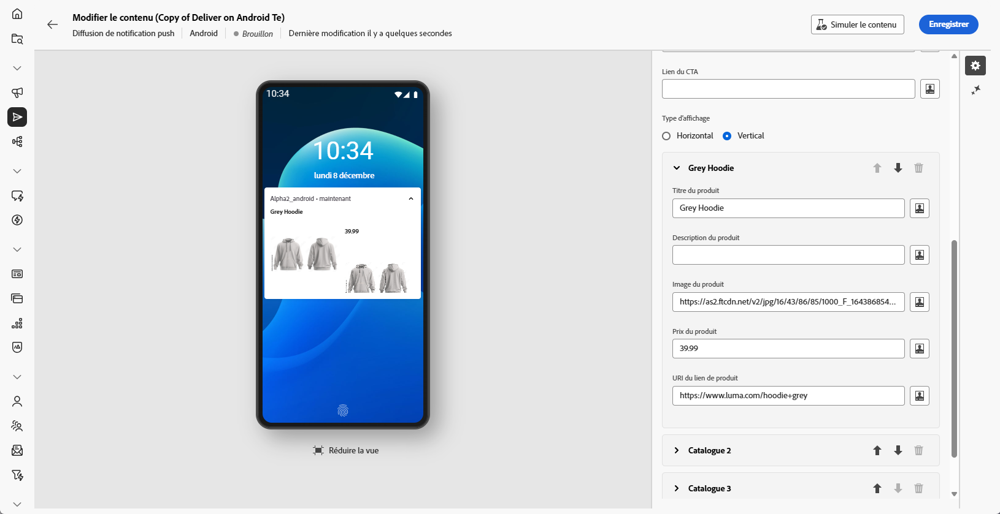

1. Gérez l’ordre de vos images à l’aide des flèches haut et bas.

1. Configurez les **[!UICONTROL Paramètres avancés]** de votre notification push. [En savoir plus](#push-advanced)

Une fois que vous avez défini le contenu de votre message, vous pouvez utiliser des personnes abonnées test pour prévisualiser et tester le message.

>[!TAB Notation des produits]

1. Dans le menu déroulant **[!UICONTROL Type de notification]**, sélectionnez **[!UICONTROL Notation des produits]**.

   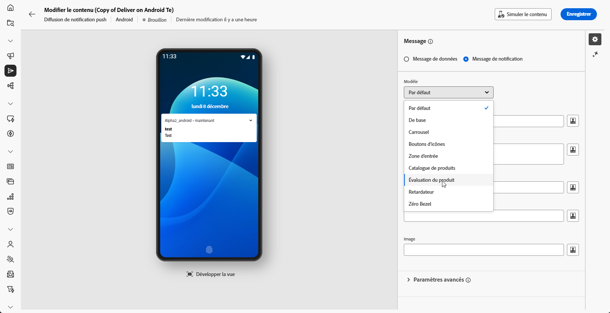

1. Pour composer votre message, saisissez votre texte dans les champs **[!UICONTROL Titre]**, **[!UICONTROL Message]** et **[!UICONTROL Message étendu]**.

   Le texte **[!UICONTROL Message]** s’affiche dans la vue réduite, alors que le **[!UICONTROL Message étendu]** s’affiche lorsque la notification est développée.

   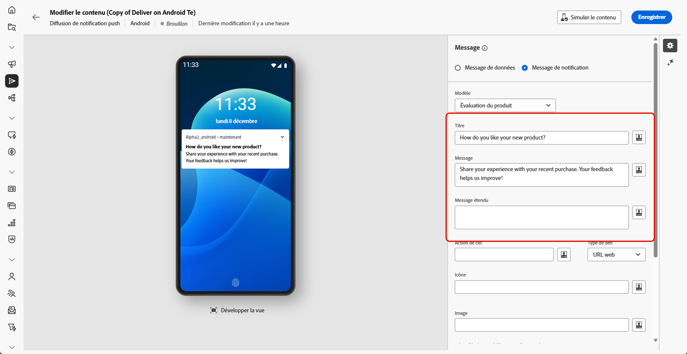

1. Ajoutez l’URL qui définit l’**[!UICONTROL Action de clic]** associée à un clic sur votre notification. Cela détermine le comportement lorsque l’utilisateur ou l’utilisatrice interagit avec la notification, par exemple en ouvrant une fenêtre spécifique ou en effectuant une action spécifique dans votre application.

1. Sélectionnez le **[!UICONTROL Type de lien]** de l’URL que vous avez ajoutée au champ **[!UICONTROL Action du clic]** :

   * **[!UICONTROL URL web]** : les URL web orientent les utilisateurs et les utilisatrices vers du contenu en ligne. Après un clic, celles-ci entrainent l’ouverture du navigateur web par défaut de l’appareil qui accède ensuite à l’URL désignée.

   * **[!UICONTROL Lien profond]** : les liens profonds sont des URL qui orientent les personnes vers des sections spécifiques d’une application, même si celle-ci est fermée. Après un clic, une boîte de dialogue s’affiche, permettant aux utilisateurs et aux utilisatrices de choisir parmi différentes applications capables de gérer le lien.

   * **[!UICONTROL Ouvrir l’application]** : les URL d’ouverture de l’application vous permettent de vous connecter directement au contenu d’une application. Cela permet à votre application de se définir elle-même comme gestionnaire par défaut d’un type spécifique de lien, sans boîte de dialogue de choix.

   Pour plus d’informations sur la gestion de liens d’applications Android, consultez la [documentation de développement Android](https://developer.android.com/training/app-links).

1. Pour personnaliser davantage votre notification push, vous pouvez choisir une URL d’**[!UICONTROL image]** à lui ajouter et l’**[!UICONTROL icône]** de la notification qui s’affichera sur les appareils de vos profils.

1. Ajoutez vos URL **[!UICONTROL icône Notation dans l’état non sélectionné]** et **[!UICONTROL icône Notation dans l’état sélectionné]**.

   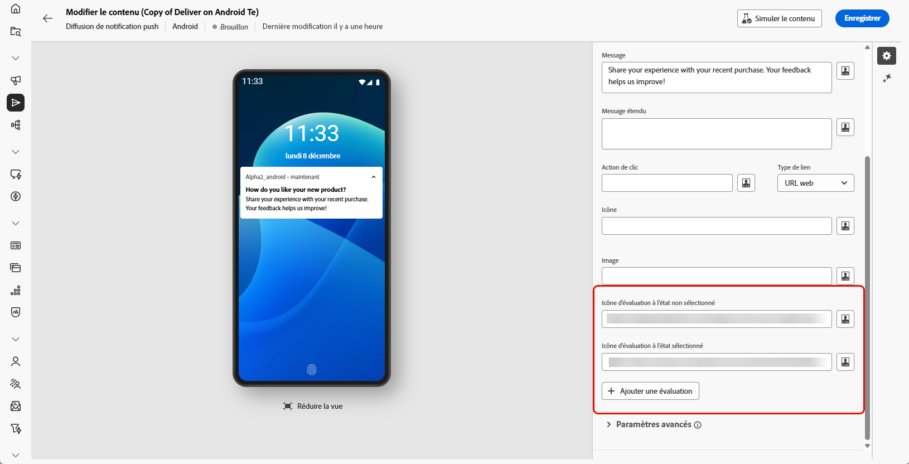

1. Cliquez sur **[!UICONTROL Ajouter une notation]** et saisissez votre **[!UICONTROL URI de lien]** et **[!UICONTROL type de lien]**.

   Veillez à inclure trois notations minimum et cinq notations maximum.

   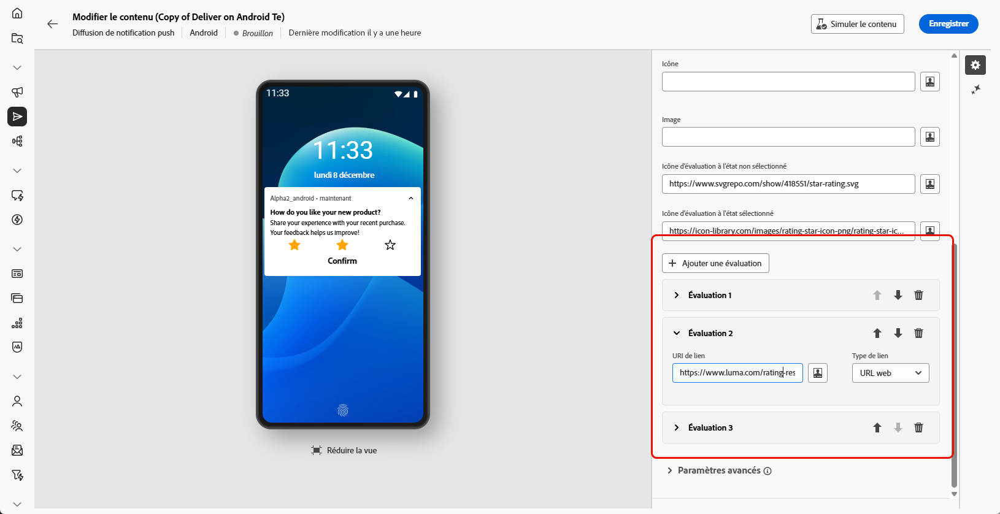

1. Gérez l’ordre de vos images à l’aide des flèches haut et bas.

1. Configurez les **[!UICONTROL Paramètres avancés]** de votre notification push. [En savoir plus](#push-advanced)

Une fois que vous avez défini le contenu de votre message, vous pouvez utiliser des personnes abonnées test pour prévisualiser et tester le message.

>[!TAB Retardateur]

1. Dans le menu déroulant **[!UICONTROL Type de notification]**, sélectionnez **[!UICONTROL Retardateur]**.

   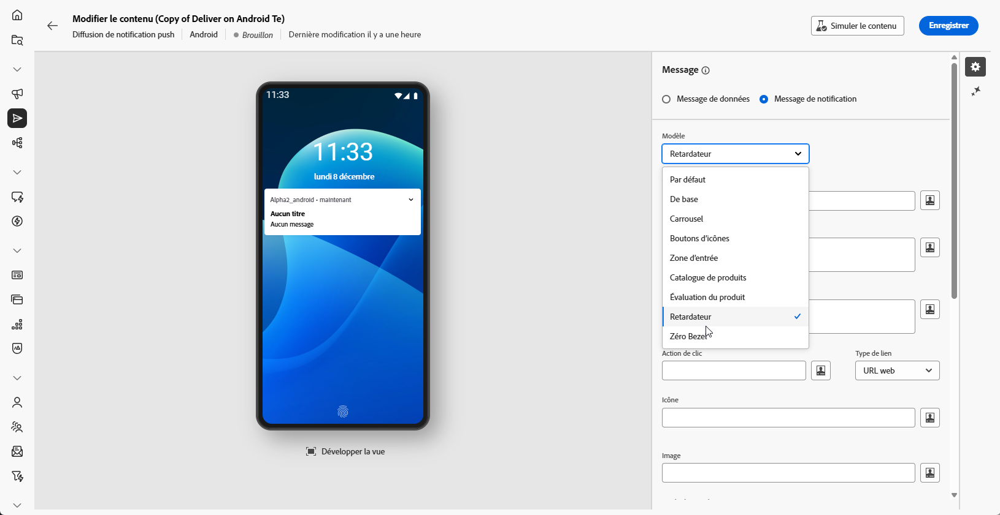

1. Pour composer votre message, saisissez votre texte dans les champs **[!UICONTROL Titre]** et **[!UICONTROL Message]**.

   Utilisez les champs de personnalisation dynamiques pour définir le contenu, personnaliser les données et ajouter du contenu dynamique. [En savoir plus](../personalization/personalize.md)

   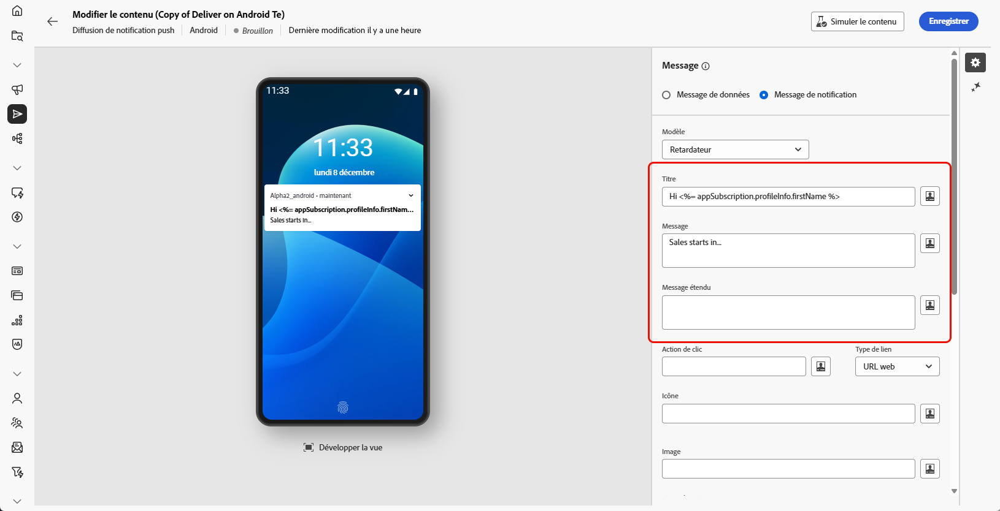

1. Ajoutez l’URL qui définit l’**[!UICONTROL Action de clic]** associée à un clic sur votre notification. Cela détermine le comportement lorsque l’utilisateur ou l’utilisatrice interagit avec la notification, par exemple en ouvrant une fenêtre spécifique ou en effectuant une action spécifique dans votre application.

1. Sélectionnez le **[!UICONTROL Type de lien]** de l’URL que vous avez ajoutée au champ **[!UICONTROL Action du clic]** :

   * **[!UICONTROL URL web]** : les URL web orientent les utilisateurs et les utilisatrices vers du contenu en ligne. Après un clic, celles-ci entrainent l’ouverture du navigateur web par défaut de l’appareil qui accède ensuite à l’URL désignée.

   * **[!UICONTROL Lien profond]** : les liens profonds sont des URL qui orientent les personnes vers des sections spécifiques d’une application, même si celle-ci est fermée. Après un clic, une boîte de dialogue s’affiche, permettant aux utilisateurs et aux utilisatrices de choisir parmi différentes applications capables de gérer le lien.

   * **[!UICONTROL Ouvrir l’application]** : les URL d’ouverture de l’application vous permettent de vous connecter directement au contenu d’une application. Cela permet à votre application de se définir elle-même comme gestionnaire par défaut d’un type spécifique de lien, sans boîte de dialogue de choix.

   Pour plus d’informations sur la gestion de liens d’applications Android, consultez la [documentation de développement Android](https://developer.android.com/training/app-links).

   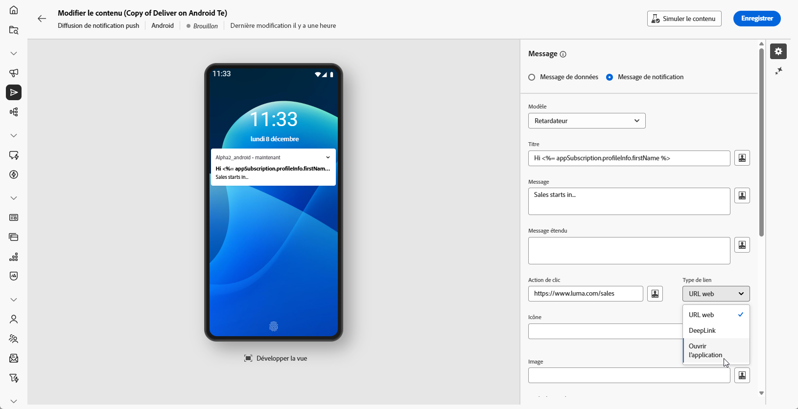

1. Pour personnaliser davantage votre notification push, vous pouvez choisir une URL d’**[!UICONTROL image]** à lui ajouter et l’**[!UICONTROL icône]** de la notification qui s’affichera sur les appareils de vos profils.

1. Définissez la **[!UICONTROL durée du retardateur]** en secondes ou l’**[!UICONTROL horodatage de fin du retardateur]** sur un horodatage d’époque spécifique.

   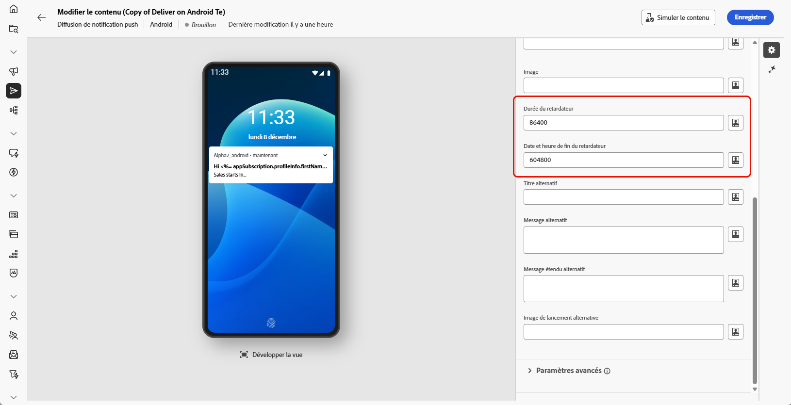

1. Saisissez le texte et l’image qui s’afficheront une fois le retardateur ayant expiré dans les champs **[!UICONTROL Autre titre]**, **[!UICONTROL Autre message]**, **[!UICONTROL Autre message étendu]** et **[!UICONTROL Autre image de lancement]**.

   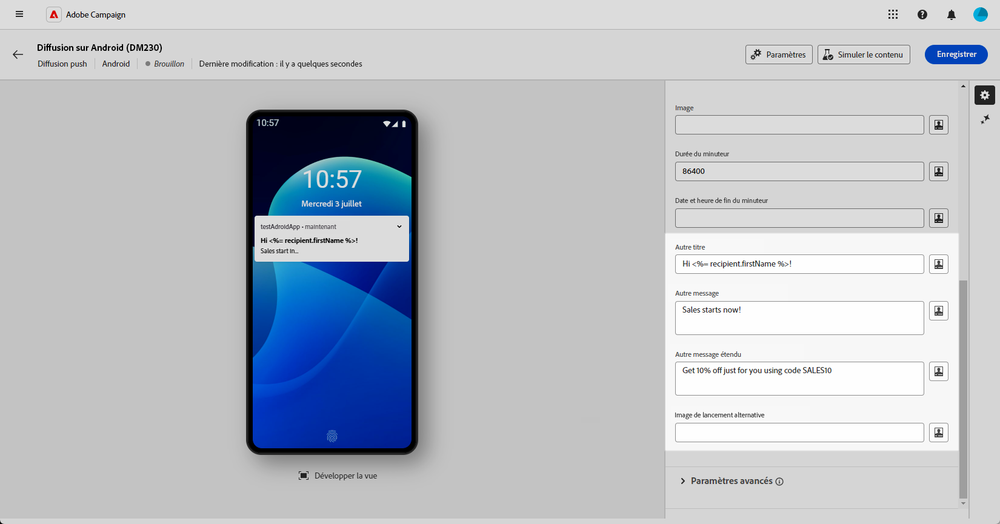

1. Configurez les **[!UICONTROL Paramètres avancés]** de votre notification push. [En savoir plus](#push-advanced)

Une fois que vous avez défini le contenu de votre message, vous pouvez utiliser des personnes abonnées test pour prévisualiser et tester le message.

>[!TAB Zéro Bezel]

1. Dans le menu déroulant **[!UICONTROL Type de notification]**, sélectionnez **[!UICONTROL Zéro Bezel]**.

   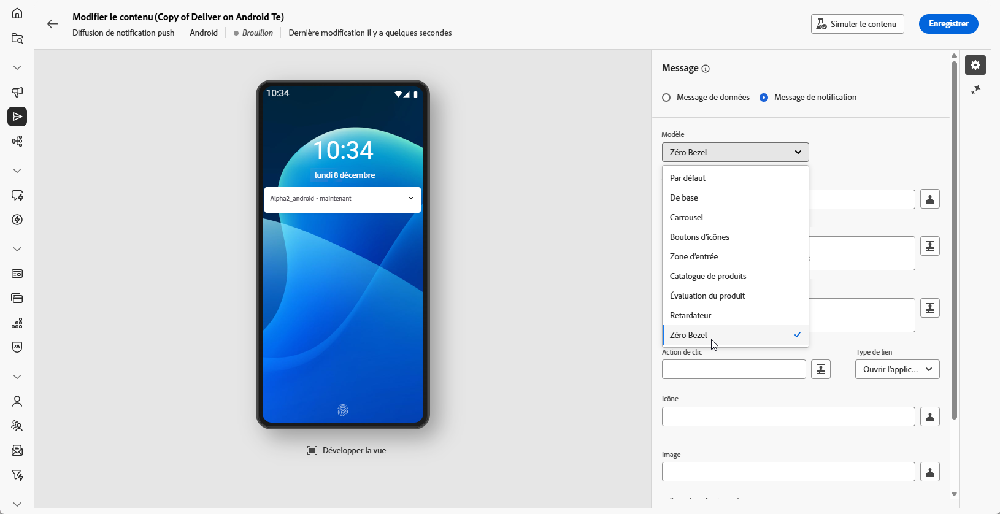

1. Pour composer votre message, saisissez votre texte dans les champs **[!UICONTROL Titre]**, **[!UICONTROL Message]** et **[!UICONTROL Message étendu]**.

   Le texte **[!UICONTROL Message]** s’affiche dans la vue réduite, alors que le **[!UICONTROL Message étendu]** s’affiche lorsque la notification est développée.

   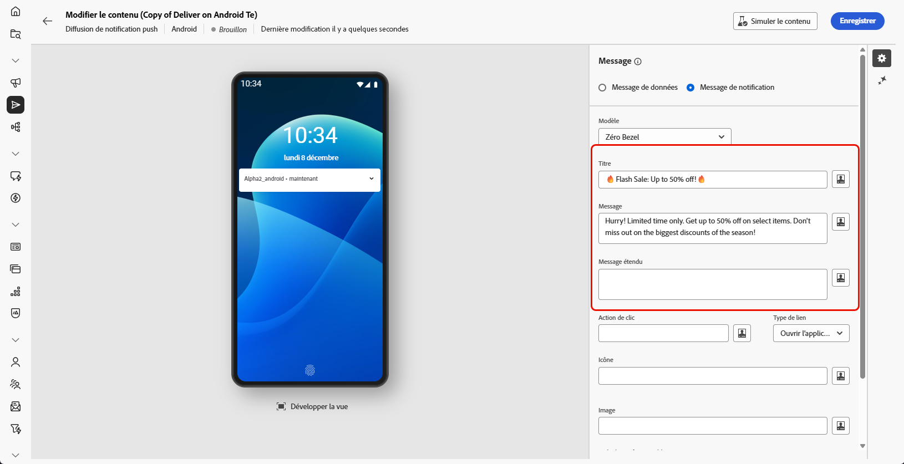

1. Utilisez les champs de personnalisation dynamiques pour définir le contenu, personnaliser les données et ajouter du contenu dynamique. [En savoir plus](../personalization/personalize.md)

1. Ajoutez l’URL qui définit l’**[!UICONTROL Action de clic]** associée à un clic sur votre notification. Cela détermine le comportement lorsque l’utilisateur ou l’utilisatrice interagit avec la notification, par exemple en ouvrant une fenêtre spécifique ou en effectuant une action spécifique dans votre application.

1. Sélectionnez le **[!UICONTROL Type de lien]** de l’URL que vous avez ajoutée au champ **[!UICONTROL Action du clic]** :

   * **[!UICONTROL URL web]** : les URL web orientent les utilisateurs et les utilisatrices vers du contenu en ligne. Après un clic, celles-ci entrainent l’ouverture du navigateur web par défaut de l’appareil qui accède ensuite à l’URL désignée.

   * **[!UICONTROL Lien profond]** : les liens profonds sont des URL qui orientent les personnes vers des sections spécifiques d’une application, même si celle-ci est fermée. Après un clic, une boîte de dialogue s’affiche, permettant aux utilisateurs et aux utilisatrices de choisir parmi différentes applications capables de gérer le lien.

   * **[!UICONTROL Ouvrir l’application]** : les URL d’ouverture de l’application vous permettent de vous connecter directement au contenu d’une application. Cela permet à votre application de se définir elle-même comme gestionnaire par défaut d’un type spécifique de lien, sans boîte de dialogue de choix.

   Pour plus d’informations sur la gestion de liens d’applications Android, consultez la [documentation de développement Android](https://developer.android.com/training/app-links).

1. Pour personnaliser davantage votre notification push, vous pouvez choisir une URL d’**[!UICONTROL image]** à lui ajouter et l’**[!UICONTROL icône]** de la notification qui s’affichera sur les appareils de vos profils.

   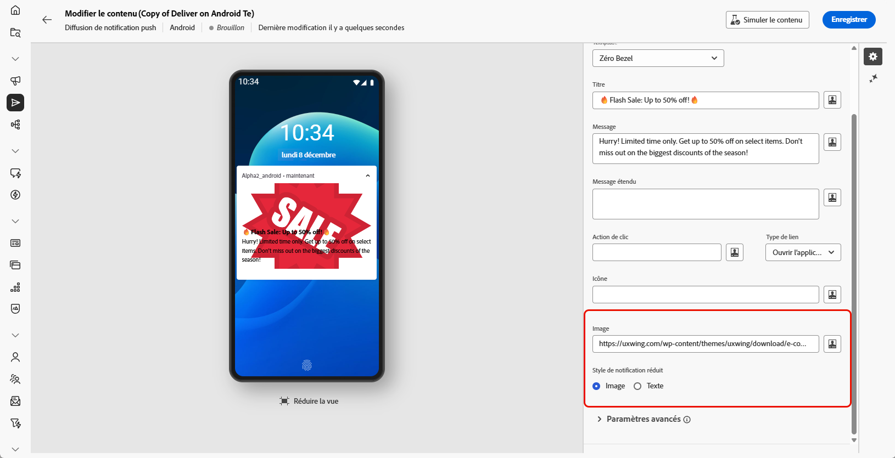

1. Choisissez le **[!UICONTROL style de notification réduite]** pour votre notification, que la notification affiche principalement une image ou du texte.

1. Configurez les **[!UICONTROL Paramètres avancés]** de votre notification push. [En savoir plus](#push-advanced)

Une fois que vous avez défini le contenu de votre message, vous pouvez utiliser des personnes abonnées test pour prévisualiser et tester le message.

>[!ENDTABS]

## Paramètres avancés des notifications push {#push-advanced}

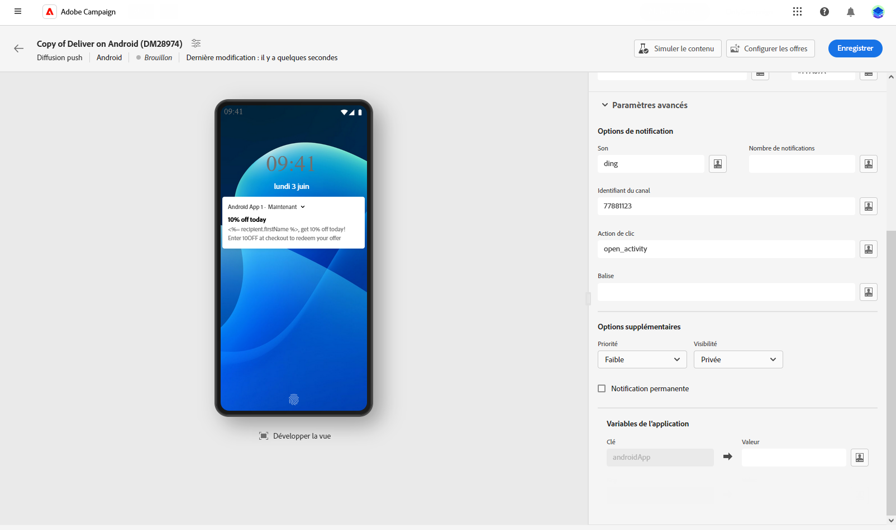{zoomable="yes"}

| Paramètre | Description |
|---------|---------|
| **[!UICONTROL Couleur de l’icône]** | Définissez la couleur de votre icône avec vos codes couleur hexadécimaux. |
| **[!UICONTROL Couleur du titre]** | Définissez la couleur de votre titre avec vos codes couleur hexadécimaux. |
| **[!UICONTROL Couleur du texte de message]** | Définissez la couleur de votre texte de message avec vos codes couleur hexadécimaux. |
| **[!UICONTROL Couleur du retardateur]** | Définissez la couleur de votre retardateur avec vos codes couleur hexadécimaux. |
| **[!UICONTROL Couleur d’arrière-plan de la notification]** | Définissez la couleur de votre arrière-plan de notification avec vos codes couleur hexadécimaux. |
| **[!UICONTROL Son]** | Définissez le son à émettre lorsque l’appareil reçoit votre notification. |
| **[!UICONTROL Nombre de notifications]** | Définissez le nombre de nouvelles informations non lues à afficher directement sur l’icône de l’application. Cela permet à l’utilisateur ou à l’utilisatrice de voir rapidement le nombre de notifications en attente. |
| **[!UICONTROL Identifiant du canal]** | Définissez l’identifiant de canal de votre notification. L’application doit créer un canal avec cet identifiant de canal avant la réception d’une notification avec cet identifiant de canal. |
| **[!UICONTROL Balise]** | Définissez l’identifiant utilisé pour remplacer les notifications existantes dans le tiroir de notifications. Vous éviterez ainsi l’accumulation de plusieurs notifications et vous assurerez que seule la dernière notification pertinente est affichée. |
| **[!UICONTROL Priorité]** | Définissez le niveau de priorité de votre notification, qui peut être par défaut, minimale, faible ou élevée. Le niveau de priorité détermine l’importance et l’urgence de la notification. Il influence son affichage et la possibilité ou non qu’elle puisse contourner certains paramètres système. Pour plus d’informations à ce propos, consultez la [documentation FCM](https://firebase.google.com/docs/reference/fcm/rest/v1/projects.messages#notificationpriority). |
| **[!UICONTROL Visibilité]** | Définissez le niveau de visibilité de votre notification, qui peut être publique, privée ou secrète. Le niveau de visibilité détermine dans quelle mesure le contenu de la notification s’affiche sur l’écran de verrouillage et dans d’autres zones sensibles. Pour plus d’informations, consultez la [documentation FCM](https://firebase.google.com/docs/reference/fcm/rest/v1/projects.messages#visibility). |
| **[!UICONTROL Notification permanente]** | Lorsqu’elle est activée, la notification reste visible si l’utilisateur ou l’utilisatrice clique dessus.  Si cette option est désactivée, la notification est automatiquement ignorée lorsque la personne interagit avec celle-ci. Le comportement en « pense-bête » permet à des notifications importantes de persister pendant de plus longues périodes à l’écran. |
| **[!UICONTROL Variables de l’application]** | Permet de définir le comportement des notifications. Ces variables sont entièrement personnalisables et font partie de la payload du message envoyée à l’appareil mobile. |