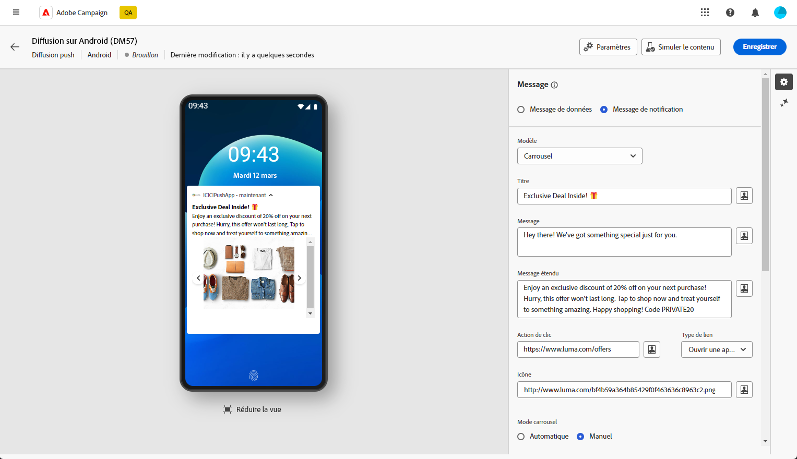
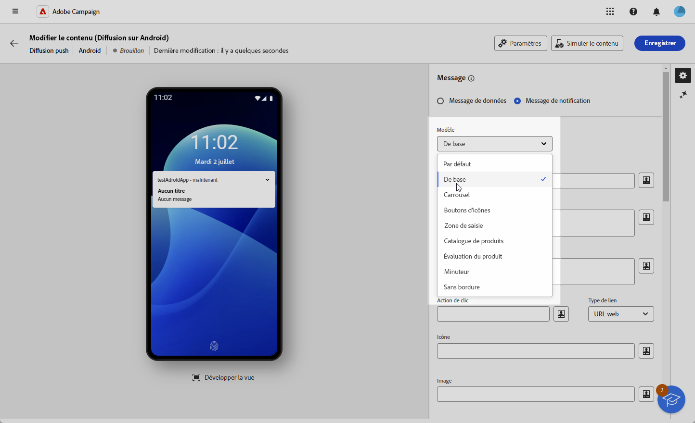
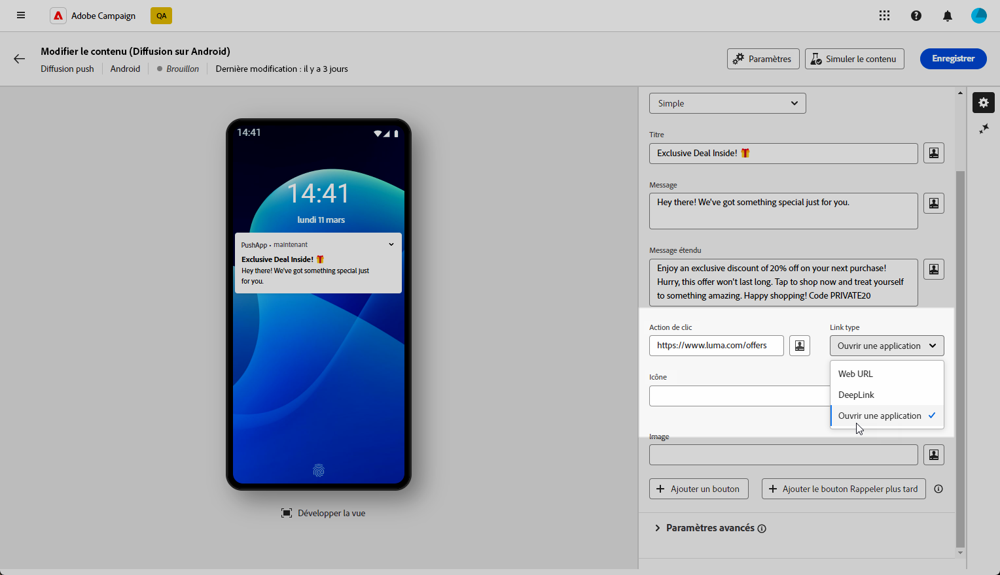
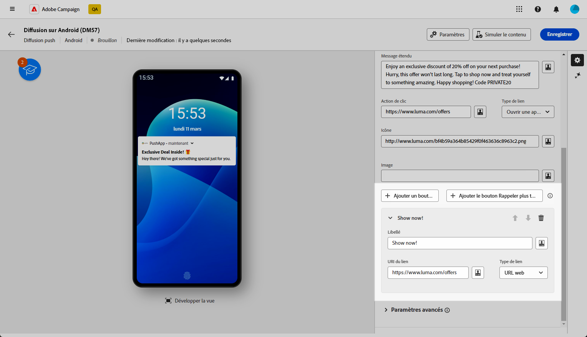
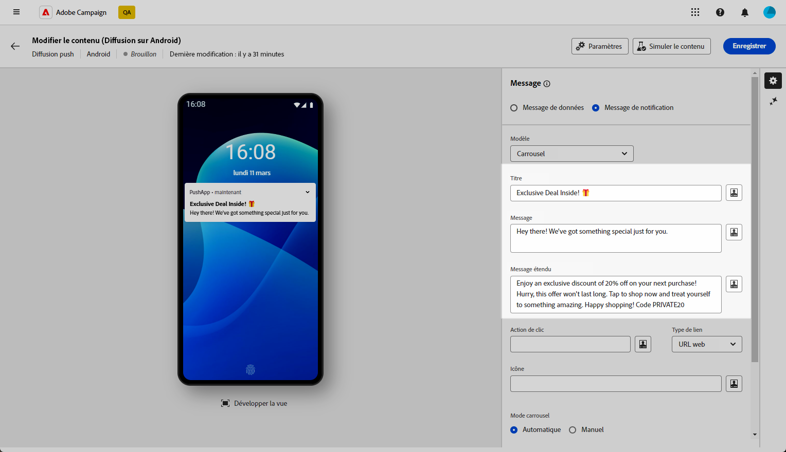
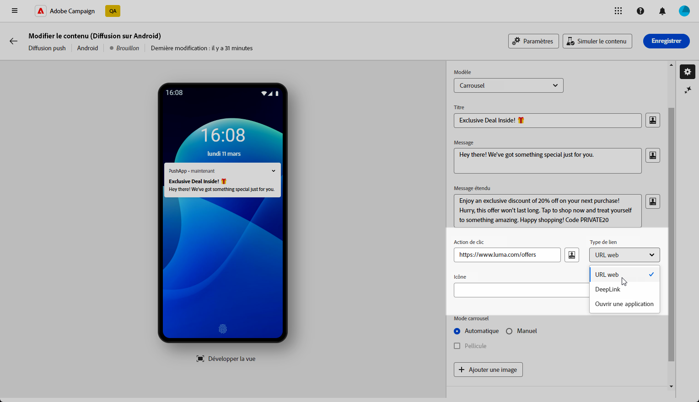
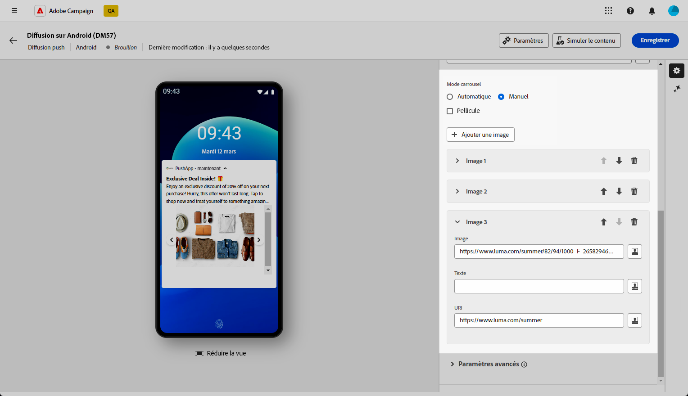

# Créer une diffusion push Android enrichie {#content-push}

Firebase Cloud Messaging vous permet de choisir entre deux types de messages :

* Le **[!UICONTROL Message de données]** est géré par l’application cliente. Ces messages sont envoyés directement à l’application mobile, qui génère et affiche une notification Android sur l’appareil. Les messages de données contiennent uniquement vos variables d’application personnalisées.

* Le **[!UICONTROL Message de notification]**, géré automatiquement par le SDK FCM. FCM affiche automatiquement le message sur les appareils de vos utilisateurs et utilisatrices pour le compte de l&#39;application cliente. Les messages de notification contiennent un ensemble de paramètres et d’options prédéfini, mais peuvent encore être personnalisés avec des variables d’application personnalisées.

{zoomable=&quot;yes&quot;}

## Définir le contenu de la notification {#push-message}

Une fois votre diffusion de notification push créée, vous pouvez en définir le contenu. Accédez aux onglets ci-dessous pour savoir comment composer votre message pour chaque modèle.

Trois modèles sont disponibles :

* **Modèle par défaut** vous permet d’envoyer des notifications avec une simple icône et une image associée.

* **Modèle de base** peuvent inclure du texte, des images et des boutons dans vos notifications.

* **Modèle de carrousel** vous permet d’envoyer des notifications avec du texte et plusieurs images que les utilisateurs peuvent parcourir.

Accédez aux onglets ci-dessous pour en savoir plus sur la personnalisation de ces modèles.

>[!BEGINTABS]

>[!TAB Modèle par défaut]

1. Dans la **[!UICONTROL Modèle]** , sélectionnez **[!UICONTROL Par défaut]**.

   

1. Pour composer votre message, saisissez votre texte dans le champ **[!UICONTROL Titre]** et **[!UICONTROL Message]** des champs.

   

1. Utilisez l&#39;éditeur d&#39;expression pour définir le contenu, personnaliser les données et ajouter du contenu dynamique. [En savoir plus](../personalization/personalize.md)

1. Définissez la variable **[!UICONTROL Action de clic]** associée à un clic de l&#39;utilisateur sur votre notification. Cela détermine le comportement lorsque l’utilisateur interagit avec la notification, par exemple en ouvrant une fenêtre spécifique ou en effectuant une action spécifique dans votre application.

1. Pour personnaliser davantage votre notification push, vous pouvez choisir un **[!UICONTROL Image]** URL à ajouter à la notification push et à la notification **[!UICONTROL Icône]** à afficher sur les appareils de vos profils.

   

1. Configurez la variable **[!UICONTROL Paramètres avancés]** de votre notification push. [En savoir plus](#push-advanced)

Une fois que vous avez défini le contenu de votre message, vous pouvez utiliser des abonnés au test pour prévisualiser et tester le message.

>[!TAB Modèle de base]

1. Dans la **[!UICONTROL Modèle]** , sélectionnez **[!UICONTROL De base]**.

   

1. Pour composer votre message, saisissez votre texte dans le champ **[!UICONTROL Titre]**, **[!UICONTROL Message]** et **[!UICONTROL Message étendu]** des champs.

   La variable **[!UICONTROL Message]** Le texte apparaît dans la vue réduite pendant que la fonction **[!UICONTROL Message étendu]** s’affiche lorsque la notification est développée.

   

1. Utilisez l&#39;éditeur d&#39;expression pour définir le contenu, personnaliser les données et ajouter du contenu dynamique. [En savoir plus](../personalization/personalize.md)

1. Ajoutez l’URL qui définit la variable **[!UICONTROL Action de clic]** associée à un clic de l&#39;utilisateur sur votre notification. Cela détermine le comportement lorsque l’utilisateur interagit avec la notification, par exemple en ouvrant une fenêtre spécifique ou en effectuant une action spécifique dans votre application.

1. Sélectionnez la variable **[!UICONTROL Type de lien]** de l’URL que vous avez ajoutée à la variable **[!UICONTROL Action de clic]** field :

   * **[!UICONTROL URL web]**: les URL web orientent les utilisateurs vers du contenu en ligne. En cliquant, ils invitent le navigateur web par défaut de l’appareil à s’ouvrir et à accéder à l’URL désignée.

   * **[!UICONTROL Deeplink]**: les liens profonds sont des URL qui orientent les utilisateurs vers des sections spécifiques d’une application, même si celle-ci est fermée. Lorsque vous cliquez dessus, une boîte de dialogue s’affiche, permettant aux utilisateurs de choisir parmi différentes applications capables de gérer le lien.

   * **[!UICONTROL Ouvrir l’application]**: les URL d’ouverture de l’application vous permettent de vous connecter directement au contenu d’une application. Elle permet à votre application de se définir comme gestionnaire par défaut pour un type spécifique de lien, en contournant la boîte de dialogue de clarification.

   Pour plus d’informations sur la gestion des liens d’application Android, reportez-vous à la section [Documentation pour les développeurs Android](https://developer.android.com/training/app-links).

   

1. Pour personnaliser davantage votre notification push, vous pouvez choisir un **[!UICONTROL Image]** URL à ajouter à la notification push et à la notification **[!UICONTROL Icône]** à afficher sur les appareils de vos profils.

1. Cliquez sur **[!UICONTROL Bouton Ajouter]** et renseignez les champs suivants :

   * **[!UICONTROL Libellé]**: texte affiché sur le bouton.
   * **[!UICONTROL Link URI]**: spécifiez l’URI à exécuter lorsque vous cliquez sur le bouton.
   * **[!UICONTROL Type de lien]**: type de lien ou **[!UICONTROL URL web]**, **[!UICONTROL Deeplink]**, ou **[!UICONTROL Ouvrir l’application]**.

   Vous avez la possibilité d&#39;inclure jusqu&#39;à trois boutons dans votre notification push. Si vous optez pour la variable **[!UICONTROL Bouton Rappel plus tard]**, vous ne pouvez inclure que deux boutons au maximum.

   

1. Cliquez sur **[!UICONTROL Ajouter un rappel ultérieurement]** pour ajouter une option Me rappeler plus tard à votre notification push. Saisissez un **[!UICONTROL Libellé]** et **[!UICONTROL Horodatage]**.

   Le champ Horodatage exige une valeur représentant une époque en secondes.

   

1. Configurez la variable **[!UICONTROL Paramètres avancés]** de votre notification push. [En savoir plus](#push-advanced)

Une fois que vous avez défini le contenu de votre message, vous pouvez utiliser des abonnés au test pour prévisualiser et tester le message.

>[!TAB Modèle de carrousel]

1. Dans la **[!UICONTROL Modèle]** , sélectionnez **[!UICONTROL Carrousel]**.

   

1. Pour composer votre message, saisissez votre texte dans le champ **[!UICONTROL Titre]**, **[!UICONTROL Message]** et **[!UICONTROL Message étendu]** des champs.

   La variable **[!UICONTROL Message]** Le texte apparaît dans la vue réduite pendant que la fonction **[!UICONTROL Message étendu]** s’affiche lorsque la notification est développée.

   

1. Utilisez l&#39;éditeur d&#39;expression pour définir le contenu, personnaliser les données et ajouter du contenu dynamique. [En savoir plus](../personalization/personalize.md)

1. Ajoutez l’URL qui définit la variable **[!UICONTROL Action de clic]** associée à un clic de l&#39;utilisateur sur votre notification. Cela détermine le comportement lorsque l’utilisateur interagit avec la notification, par exemple en ouvrant une fenêtre spécifique ou en effectuant une action spécifique dans votre application.

1. Sélectionnez la variable **[!UICONTROL Type de lien]** de l’URL que vous avez ajoutée à la variable **[!UICONTROL Action de clic]** field :

   * **[!UICONTROL URL web]**L : les URL Web orientent les utilisateurs vers du contenu en ligne. En cliquant, ils invitent le navigateur web par défaut de l’appareil à s’ouvrir et à accéder à l’URL désignée.

   * **[!UICONTROL Deeplink]**: les liens profonds sont des URL qui orientent les utilisateurs vers des sections spécifiques d’une application, même si celle-ci est fermée. Lorsque vous cliquez dessus, une boîte de dialogue s’affiche, permettant aux utilisateurs de choisir parmi différentes applications capables de gérer le lien.

   * **[!UICONTROL Ouvrir l’application]**: les URL d’ouverture de l’application vous permettent de vous connecter directement au contenu d’une application. Elle permet à votre application de se définir comme gestionnaire par défaut pour un type spécifique de lien, en contournant la boîte de dialogue de clarification.

   Pour plus d’informations sur la gestion des liens d’application Android, reportez-vous à la section [Documentation pour les développeurs Android](https://developer.android.com/training/app-links).

   

1. Pour personnaliser davantage votre notification push, vous pouvez choisir le **[!UICONTROL Icône]** à afficher sur les appareils de vos profils.

1. Choisissez la méthode **[!UICONTROL carrousel]** est utilisé :

   * **[!UICONTROL Auto]**: effectue automatiquement un cycle à travers les images sous forme de diapositives, en transition à des intervalles prédéfinis.
   * **[!UICONTROL Manuel]**: permet aux utilisateurs de passer manuellement d’une diapositive à l’autre pour naviguer dans les images.

     Activez la variable **[!UICONTROL Filmstrip]** pour inclure des aperçus des images précédente et suivante à côté de la diapositive principale.

1. Cliquez sur **[!UICONTROL Ajouter une image]** et saisissez l’URL et le texte de votre image.

   Veillez à inclure trois images au minimum et cinq images au maximum.

   

1. Gérez l’ordre de vos images à l’aide des flèches Haut et Bas.

1. Configurez la variable **[!UICONTROL Paramètres avancés]** de votre notification push. [En savoir plus](#push-advanced)

Une fois que vous avez défini le contenu de votre message, vous pouvez utiliser des abonnés au test pour prévisualiser et tester le message.

>[!ENDTABS]

## Paramètres avancés des notifications push {#push-advanced}

{zoomable=&quot;yes&quot;}

| Paramètre | Description |
|---------|---------|
| **[!UICONTROL Couleur de l’icône]** | Définissez la couleur de votre icône avec vos codes couleur hexadécimaux. |
| **[!UICONTROL Couleur du titre]** | Définissez la couleur de votre titre avec vos codes couleur hexadécimaux. |
| **[!UICONTROL Couleur du texte du message]** | Définissez la couleur de votre texte Message avec vos codes couleur hexadécimaux. |
| **[!UICONTROL Couleur d’arrière-plan des notifications]** | Définissez la couleur de votre arrière-plan de notification avec vos codes couleur hexadécimaux. |
| **[!UICONTROL Son]** | Définissez le son à émettre lorsque l’appareil reçoit votre notification. |
| **[!UICONTROL Nombre de notifications]** | Définissez le nombre de nouvelles informations non lues à afficher directement sur l’icône de l’application. Cela permet à l’utilisateur ou à l’utilisatrice de voir rapidement le nombre de notifications en attente. |
| **[!UICONTROL Identifiant du canal]** | Définissez l’identifiant de canal de votre notification. L’application doit créer un canal avec cet identifiant de canal avant la réception d’une notification avec cet identifiant de canal. |
| **[!UICONTROL Balise]** | Définissez l’identifiant utilisé pour remplacer les notifications existantes dans le tiroir de notifications. Vous éviterez ainsi l’accumulation de plusieurs notifications et vous assurerez que seule la dernière notification pertinente est affichée. |
| **[!UICONTROL Priorité]** | Définissez le niveau de priorité de votre notification, qui peut être par défaut, minimale, faible ou élevée. Le niveau de priorité détermine l’importance et l’urgence de la notification. Il influence son affichage et la possibilité ou non qu’elle puisse contourner certains paramètres système. Pour plus d’informations à ce propos, consultez la [documentation FCM](https://firebase.google.com/docs/reference/fcm/rest/v1/projects.messages#notificationpriority). |
| **[!UICONTROL Visibilité]** | Définissez le niveau de visibilité de votre notification, qui peut être publique, privée ou secrète. Le niveau de visibilité détermine dans quelle mesure le contenu de la notification s’affiche sur l’écran de verrouillage et dans d’autres zones sensibles. Pour plus d’informations, consultez la [documentation FCM](https://firebase.google.com/docs/reference/fcm/rest/v1/projects.messages#visibility). |
| **[!UICONTROL Notification persistante]** | Lorsqu’elle est activée, la notification reste visible si l’utilisateur ou l’utilisatrice clique dessus.  Si cette option est désactivée, la notification est automatiquement ignorée lorsque la personne interagit avec celle-ci. Le comportement en « pense-bête » permet à des notifications importantes de persister pendant de plus longues périodes à l’écran. |
| **[!UICONTROL Variables de l’application]** | Permet de définir le comportement des notifications. Ces variables sont entièrement personnalisables et font partie de la payload du message envoyée à l’appareil mobile. |
