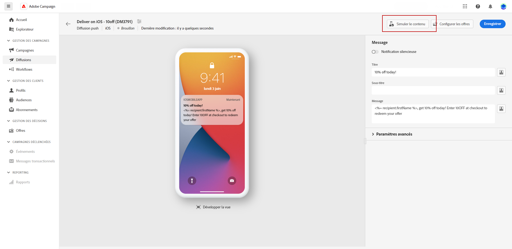
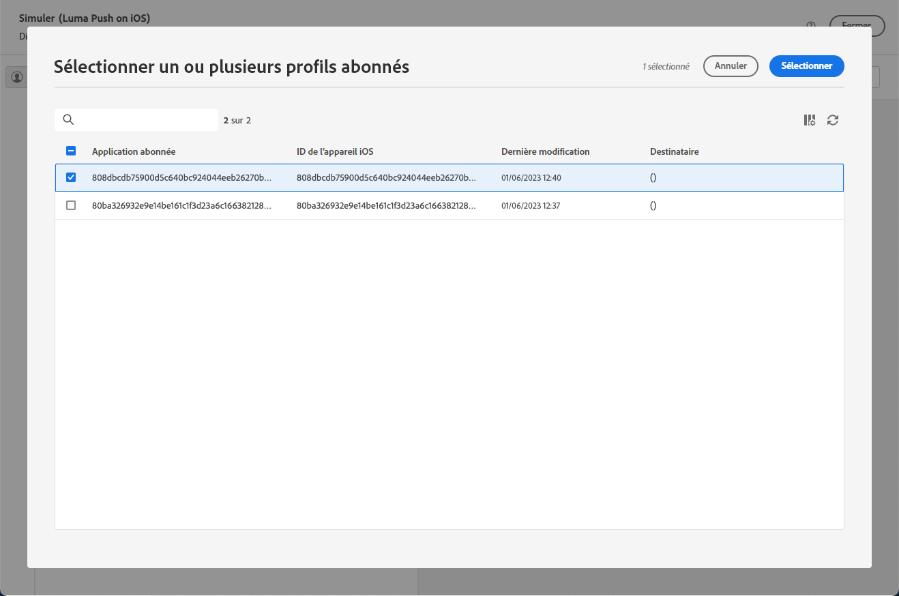
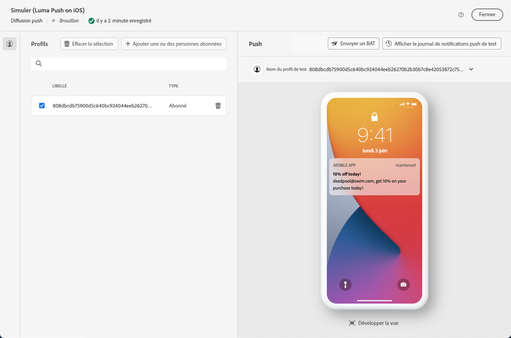
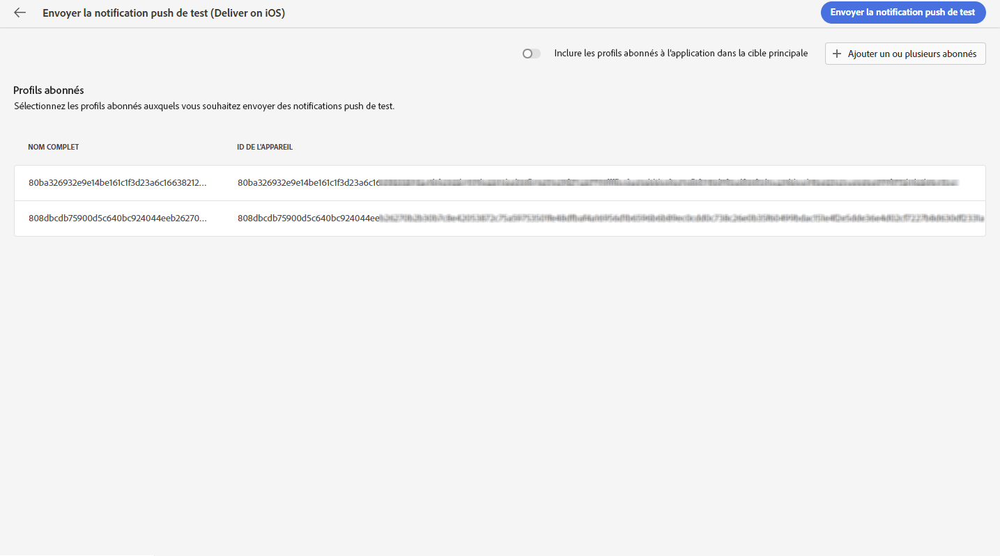
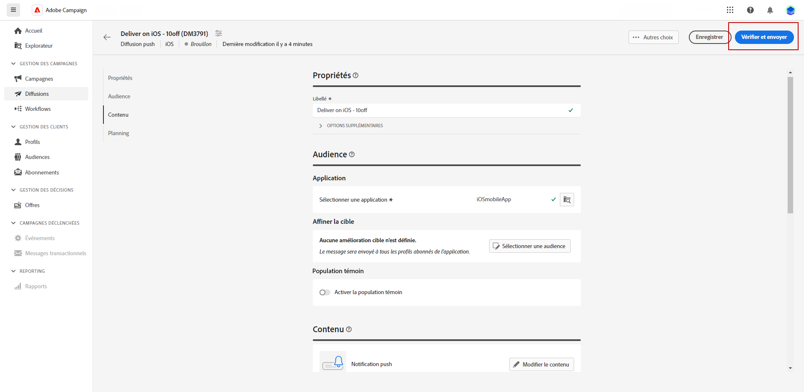
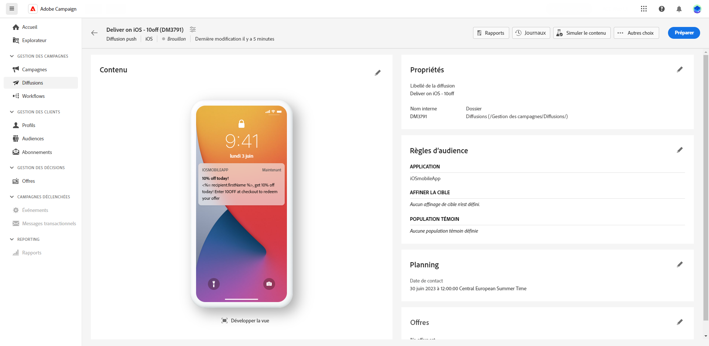
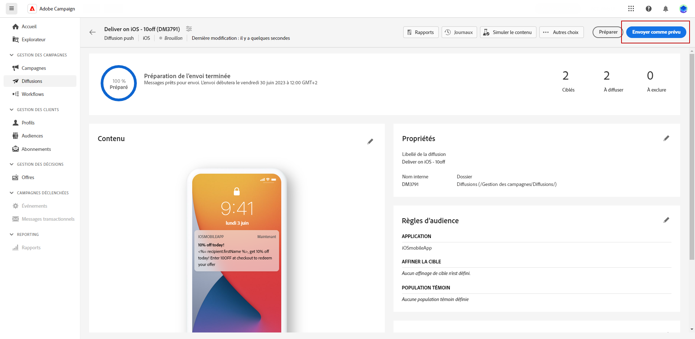

# Prévisualiser et envoyer une diffusion notification push {#send-push-delivery}

## Prévisualiser la diffusion par notification push {#preview-push}

Une fois que vous avez défini le contenu de votre message, vous pouvez utiliser des abonnés au test pour prévisualiser et tester le message. Si vous avez inclus du contenu personnalisé, vous pouvez examiner l&#39;affichage de ce contenu dans le message à l&#39;aide des données de profil de test. Vous pouvez ainsi vous assurer que le message est correctement rendu et que les éléments personnalisés sont bien intégrés.

Les principales étapes pour prévisualiser votre diffusion SMS sont les suivantes. Pour plus d’informations sur la prévisualisation des diffusions, reportez-vous à la section [cette section](../preview-test/preview-content.md).

1. Dans la page de contenu de votre diffusion, utilisez **[!UICONTROL Simulation du contenu]** pour prévisualiser votre contenu personnalisé.

   

1. Cliquez sur **[!UICONTROL Ajouter des abonnés]** pour sélectionner un ou plusieurs profils afin de prévisualiser leurs données dans le contenu de la notification push.

   <!--Once your test subscribers are selected, click **[!UICONTROL Select]**.
    -->

1. Dans le volet de droite, vous trouverez un aperçu de la notification push, où les éléments personnalisés sont remplacés dynamiquement par les données du profil sélectionné.

   

Vous pouvez maintenant vérifier et envoyer votre notification push à votre audience.

## Tester votre diffusion par notification push {#test-push}

**Adobe Campaign** vous offre la possibilité de tester les notifications push avant de les envoyer à votre audience principale. Cette étape est importante pour valider votre diffusion et identifier les problèmes éventuels.
Les destinataires du test vérifient alors divers éléments, tels que les liens, les images et les paramètres de personnalisation, détectent les erreurs éventuelles et garantissent des performances optimales. Ce processus vous permet d’affiner et d’optimiser vos notifications push avant d’atteindre votre audience principale.

 Découvrez comment envoyer des notifications push de test dans [cette section](../preview-test/test-deliveries.md#subscribers).

## Envoyer votre diffusion par notification push {#send-push}

1. Une fois le contenu de votre notification push personnalisé, cliquez sur **[!UICONTROL Réviser et envoyer]** sur la page de votre **[!UICONTROL Diffusion]**.

   

1. Cliquez sur **[!UICONTROL Préparer]** et suivre les progrès et les statistiques fournis.

   En cas d’erreur, reportez-vous au menu Journaux pour obtenir des informations détaillées sur l’échec.

   

1. Envoyez les messages en cliquant sur **[!UICONTROL Envoyer]** pour poursuivre le processus d’envoi final.

1. Confirmez l’action d’envoi en cliquant sur le bouton **[!UICONTROL Envoyer]** ou **[!UICONTROL Envoyer comme prévu]**.

   

Une fois votre diffusion envoyée, vous pouvez effectuer le suivi de vos données IPC (Indicateur de performance clé) provenant de votre page de diffusion et des données issues de la variable **[!UICONTROL Journaux]** .

Vous pouvez maintenant commencer à mesurer l’impact de votre message à l’aide de rapports intégrés. [En savoir plus](../reporting/push-report.md)
