# Créer votre première requête {#build-query}

Pour commencer à créer une requête, accédez au concepteur de requête à partir de l’emplacement de votre choix, en fonction de l’action que vous souhaitez effectuer. Le concepteur de requête s’ouvre et affiche une zone de travail vierge. Cliquez sur le bouton **+** pour configurer le premier nœud de votre requête.

Vous pouvez ajouter deux types d’éléments :

* Les **composants de filtrage** (condition personnalisée, audience sélectionnée, filtre prédéfini) vous permettent de créer vos propres règles, de sélectionner une audience ou un filtre prédéfini pour affiner votre requête. [Découvrez comment utiliser les composants de filtrage](#filtering).

  *Personnes destinataires qui se sont abonnées à la newsletter « Sports »*. *Personnes destinataires résidant à New York*, *Personnes destinataires résidant à San Francisco*.

* Les **opérateurs de groupe** (ET, OU, SAUF) vous permettent de regrouper les composants de filtrage dans le diagramme en fonction de vos besoins. [Découvrez comment utiliser les opérateurs](#filtering).

  *Personnes destinataires qui se sont abonnées à la newsletter « Sports »**ET**qui vivent à New York **OU**à San Francisco*.

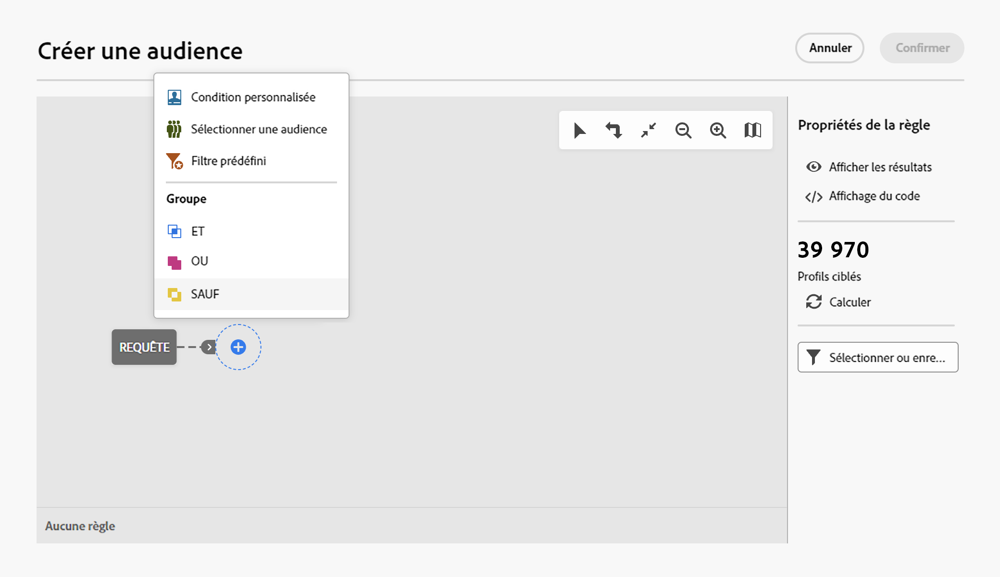

## Ajouter des composants de filtrage {#filtering}

Les composants de filtrage vous permettent d’affiner votre requête à l’aide des éléments suivants :

* **[Conditions personnalisées](#custom-condition)** : filtrez votre requête en créant votre propre condition avec des attributs de la base de données et des expressions avancées.
* **[Audiences](#audiences)** : filtrez votre requête à l’aide d’une audience existante.
* **[Filtre prédéfini](#predefined-filters)** : filtrez votre requête à l’aide de filtres prédéfinis existants.

### Configurer une condition personnalisée {#custom-condition}

>[!CONTEXTUALHELP]
>id="acw_orchestration_querymodeler_customcondition"
>title="Condition personnalisée"
>abstract="Condition personnalisée"

Pour filtrer votre requête à l’aide d’une condition personnalisée, procédez comme suit :

1. Cliquez sur le bouton **+** sur le nœud souhaité, puis sélectionnez **[!UICONTROL Condition personnalisée]**. Le volet des propriétés de condition personnalisée s’affiche sur le côté droit.

1. Dans le champ **Attribut**, sélectionnez l’attribut de la base de données que vous souhaitez utiliser pour créer votre condition. La liste des attributs comprend tous les attributs de votre base de données Campaign, y compris les attributs des tables liées.

   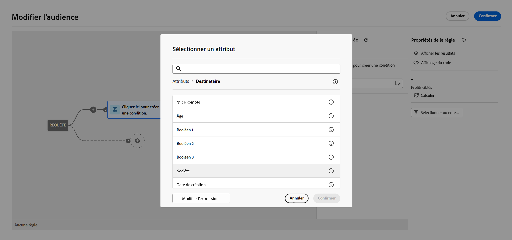

   >[!NOTE]
   >
   >Le bouton Editer l&#39;expression permet d&#39;utiliser l&#39;éditeur d&#39;expression Web de Campaign pour définir manuellement une expression à l&#39;aide de champs de la base de données et de fonctions d&#39;assistance. [Découvrez comment modifier des expressions](expression-editor.md)

1. Sélectionnez l’opérateur à appliquer dans la liste déroulante. Différents opérateurs sont disponibles. Notez que les opérateurs disponibles dans la liste déroulante dépendent du type de données de l’attribut.

   +++Liste des opérateurs disponibles

   | Opérateur | Intérêt | Exemple |
   |  ---  |  ---  |  ---  |
   | Égal à | Obtenir un résultat rigoureusement identique à ce qui est entré dans la seconde colonne Valeur. | Nom (@lastName) égal à « Jones ». Ici ne seront renvoyées que les personnes destinataires dont le nom est « Jones ». |
   | Différent de | Obtenir un résultat différent de la valeur renseignée. | Langue (@language) différent de « Anglais ». |
   | Supérieur à | Obtenir un résultat supérieur à la valeur indiquée. | Âge (@age) supérieur à « 50 »</strong> pour renvoyer toutes les valeurs supérieures à « 50 », donc « 51 », « 52 », etc. |
   | Inférieur à | Obtenir un résultat inférieur à la valeur indiquée. | Date de création (@created) strictement plus tôt que « DaysAgo(100) »</strong> afin de retrouver toutes les personnes destinataires créées dans la base il y a moins de 100 jours. |
   | Supérieur ou égal à | Obtenir un résultat rigoureusement égal ou supérieur à la valeur renseignée. | Âge (@age) supérieur ou égal à « 30 »</strong>, afin de retrouver les personnes destinataires dont l’âge est de 30 ans et plus. |
   | Inférieur ou égal à | Obtenir un résultat rigoureusement égal ou inférieur à la valeur renseignée. | Âge (@age) inférieur ou égal à « 60 »</strong>, afin de retrouver les personnes destinataires dont l’âge est de 60 ans et moins. |
   | Compris dans | Obtenir les résultats compris dans les valeurs indiquées. Ces valeurs doivent toujours être séparées par une virgule. | Date de naissance (@birthDate) est compris dans « 12/10/1979,12/10/1984 ». Les personnes destinataires nées entre ces dates sont alors renvoyées. |
   | Pas dans | Le principe est le même qu’avec l’opérateur Compris dans. Ici, il s’agit d’exclure les personnes destinataires en fonction des valeurs indiquées. | La date de naissance (@birthDate) n’est pas incluse dans 12/10/1979,12/10/1984. Contrairement à l’exemple précédent, les personnes destinataires nées entre ces dates ne seront pas renvoyées. |
   | Est vide | Dans ce cas, le résultat recherché correspond à une valeur vide dans la seconde colonne Valeur. | Mobile (@mobilePhone) est vide afin de retrouver toutes les personnes destinataires ne disposant pas d’un numéro de téléphone mobile. |
   | N’est pas vide | Le principe est contraire à l’opérateur Est vide. Il n’est pas nécessaire de saisir de données dans la seconde colonne Valeur. | E-mail (@email) n’est pas vide. |
   | Commence par | Obtenir des résultats commençant par la valeur indiquée. | N° de compte (@account) commence par « 32010 ». |
   | Ne commence pas par | Obtenir des résultats qui ne commencent pas par la valeur renseignée. | N° de compte (@account) ne commence pas par « 20 ». |
   | Contient | Obtenir un résultat comportant au moins la valeur qui est renseignée. | Domaine d’e-mail (@domain) contient « mail »</strong>. Ici, tous les noms de domaine comportant la valeur « mail » seront renvoyés en résultat. Par conséquent, le nom de domaine « gmail.com » fera partie des résultats renvoyés. |
   | Ne contient pas | Ne pas obtenir de résultats contenant au moins la valeur renseignée. | Domaine d’e-mail (@domain) ne contient pas « vo »</strong>. Dans ce cas, les noms de domaine contenant la valeur « vo » ne seront pas renvoyés. Ainsi, le nom de domaine « voila.fr » ne sera pas renvoyé. |
   | Comme | « Comme » est quasiment identique à l’opérateur « Contient ». Il permet d’insérer un caractère de substitution « % » dans la valeur recherchée. | Nom (@lastName) comme « Jon%s ». Ici, le caractère de substitution sert de joker afin de retrouver le nom Jones dans le cas très hypothétique où l’opérateur aurait oublié quelle est la lettre située entre les lettre « n » et « s ». |
   | Pas comme | « Comme » est quasiment identique à l’opérateur « Contient ». Il permet d’insérer un caractère de substitution « % » dans la valeur recherchée. | Nom (@lastName) pas comme « Smi%h ». Ici, les personnes destinataires dont le nom est « Smi%h » ne seront pas renvoyées. |

+++

1. Dans le champ **Valeur**, définissez la valeur attendue. Vous pouvez également utiliser l’éditeur d’expression de Campaign Web pour définir manuellement une expression à l’aide de champs de la base de données et de fonctions d’assistance. Pour ce faire, cliquez sur le bouton **Expression d’édition** bouton . [Découvrez comment modifier des expressions](expression-editor.md)

   *Exemple de requête renvoyant tous les profils âgés de 21 ans ou plus :*

   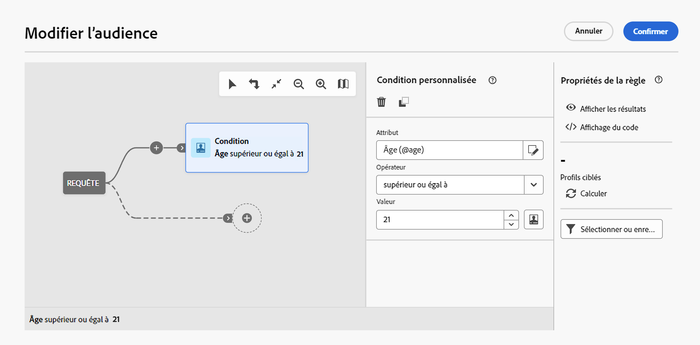

#### Conditions personnalisées sur les tables liées (liens 1-1 et 1-N){#links}

Les conditions personnalisées vous permettent d&#39;interroger des tables liées à la table actuellement utilisée par votre règle. Cela inclut les tables avec un lien de cardinalité 1-1 ou les tables de collection (lien 1-N).

Pour un **Lien 1-1**, accédez à la table liée, sélectionnez l’attribut de votre choix et définissez la valeur attendue.

+++Exemple de requête

Ici, la requête cible les marques dont le libellé est &quot;en cours&quot;.

1. Naviguez dans le **Marque** et sélectionnez le **Libellé** attribut.

   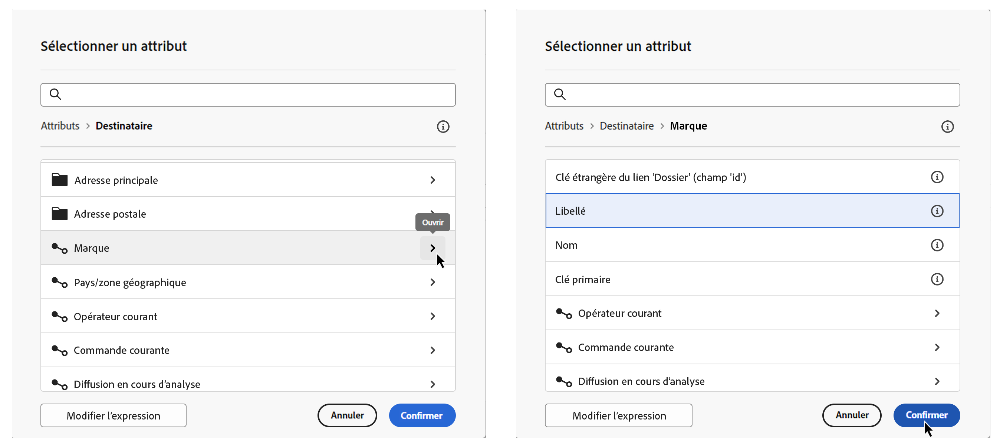{width="85%" align="center"}

1. Définissez la valeur attendue de l’attribut.

   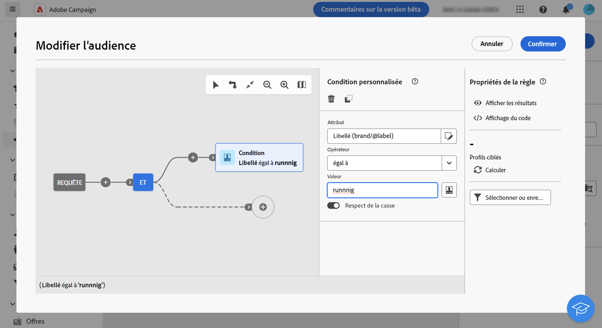{width="85%" align="center"}

+++

Pour un **Lien 1-N**, vous pouvez définir des sous-conditions pour affiner votre requête, comme illustré dans l’exemple ci-dessous.

+++Exemple de requête

Ici, la requête cible les personnes destinataires ayant effectué des achats liés au produit BrewMaster, pour un montant total d’au moins 100 $.

1. Sélectionnez la variable **Achats** et confirmez.

   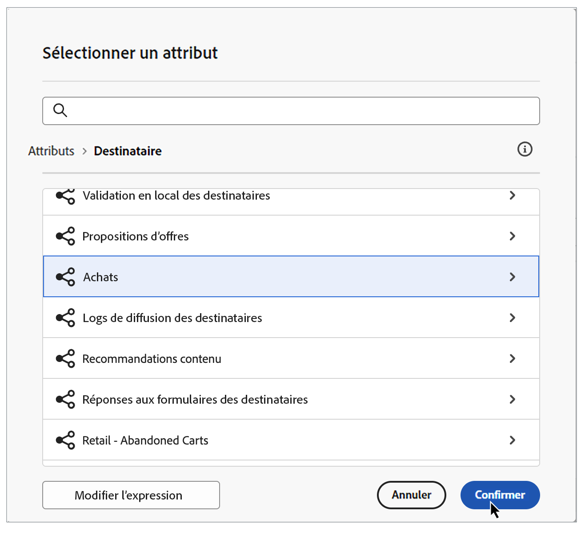{width="50%" align="center"}

1. Une transition sortante est ajoutée, ce qui permet de créer des sous-conditions.

   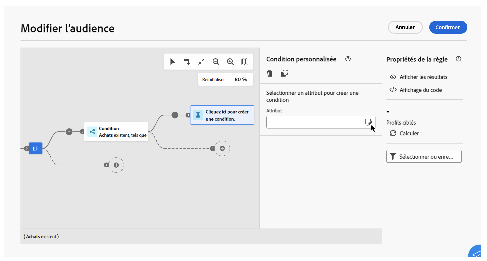{width="85%" align="center"}

1. Sélectionnez la variable **Prix** achats d’attributs et de cibles d’au moins 1 000 $

   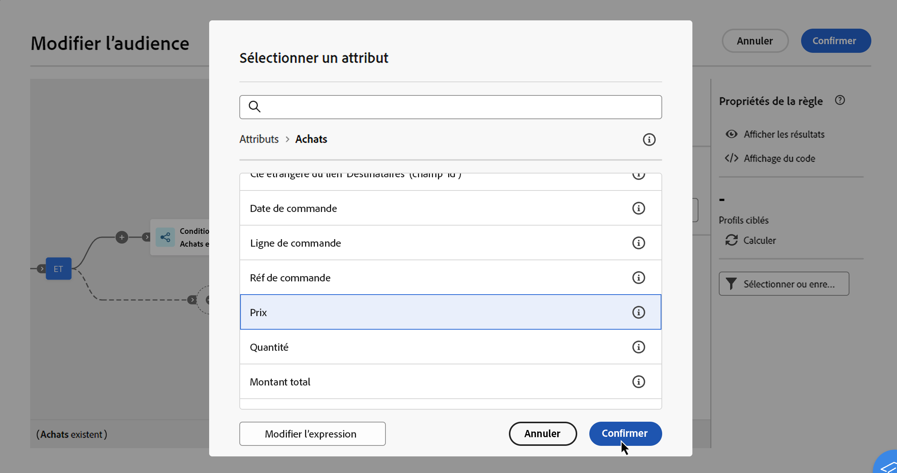{width="85%" align="center"}

1. Ajoutez des sous-conditions adaptées à vos besoins. Ici, nous avons ajouté une condition pour cibler les profils ayant acheté un produit BrewMaster.

   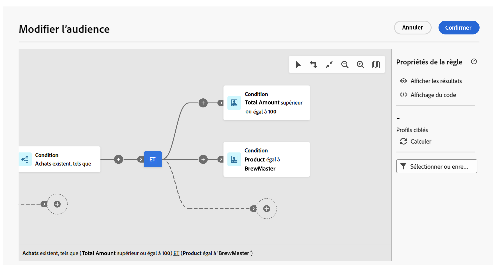{width="85%" align="center"}

+++

#### Utilisation des données agrégées {#aggregate}

Les conditions personnalisées vous permettent d’effectuer des opérations d’agrégat. Pour cela, vous devez sélectionner directement un attribut dans une table de collection :

1. Naviguez dans la table de collection souhaitée et sélectionnez l’attribut sur lequel vous souhaitez effectuer une opération d’agrégat.

   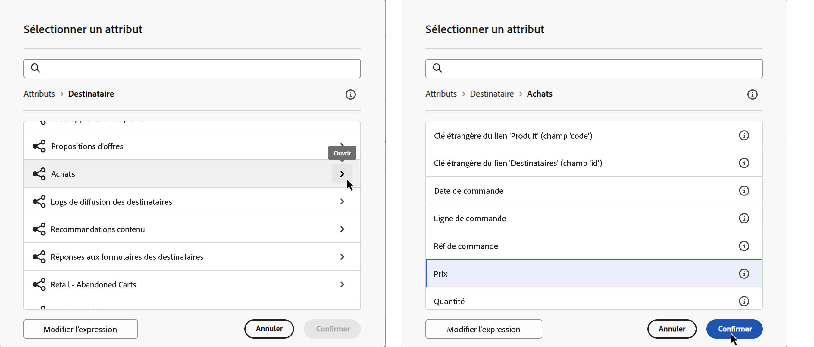{width="85%" align="center"}

1. Dans le volet des propriétés, activez l’option **Agrégat de données** et sélectionnez la fonction d’agrégat souhaitée.

   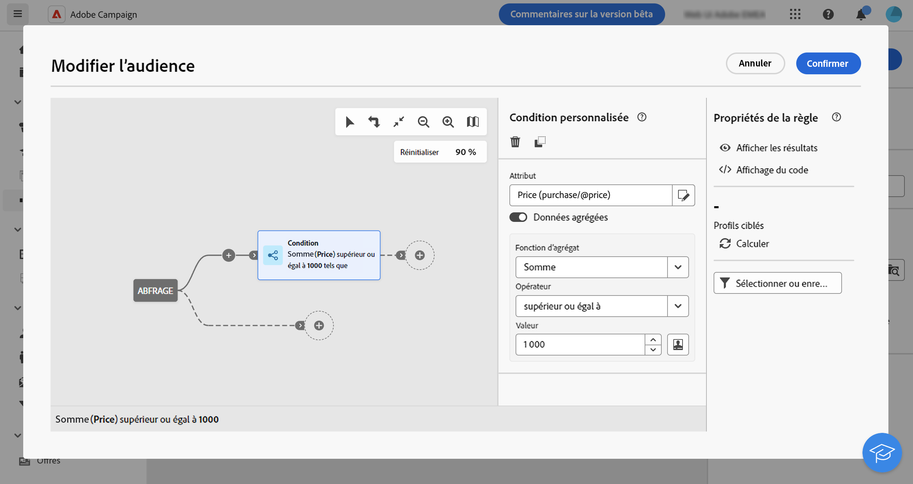{width="85%" align="center"}

### Sélectionner une audience {#audiences}

>[!CONTEXTUALHELP]
>id="acw_orchestration_querymodeler_selectaudience"
>title="Sélectionner une audience"
>abstract="Sélectionner une audience"

Pour filtrer votre requête à l’aide d’une audience existante, procédez comme suit :

1. Cliquez sur le bouton **+** sur le nœud souhaité, puis choisissez **[!UICONTROL Sélectionner une audience]**.

1. Le volet de propriétés **Sélectionner une audience** s’ouvre sur le côté droit. Sélectionnez l’audience à utiliser pour filtrer votre requête.

   *Exemple de requête renvoyant tous les profils appartenant à l’audience « Festivaliers » :*

   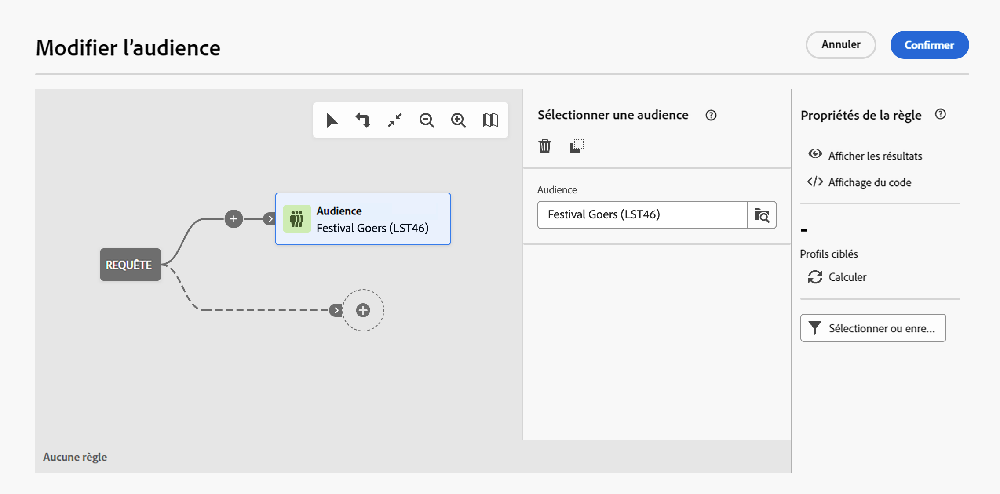

### Utiliser un filtre prédéfini {#predefined-filters}

>[!CONTEXTUALHELP]
>id="acw_orchestration_querymodeler_predefinedfilter"
>title="Filtre prédéfini"
>abstract="Filtre prédéfini"

Pour filtrer votre requête à l’aide d’un filtre prédéfini, procédez comme suit :

1. Cliquez sur le bouton **+** sur le nœud souhaité, puis sélectionnez **[!UICONTROL Filtre prédéfini]**.

1. Le volet Propriétés **Filtre prédéfini** s’ouvre sur le côté droit. Sélectionnez un filtre prédéfini dans la liste des filtres personnalisés ou dans les favoris.

   *Exemple de requête renvoyant tous les profils correspondant au filtre prédéfini « Clients inactifs » :*

   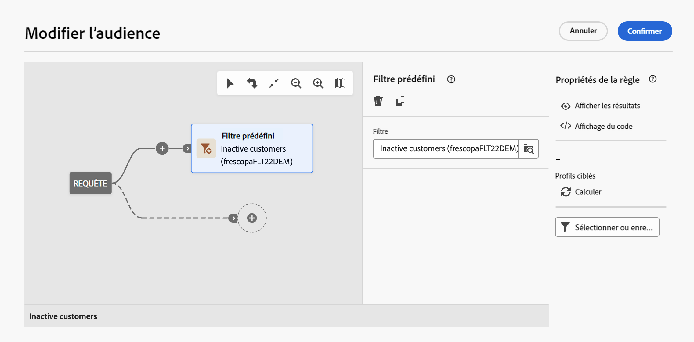

### Copier-coller des composants {#copy}

Le créateur de requêtes permet de copier un ou plusieurs composants de filtrage et de les coller à la fin d’une transition. Cette opération peut être exécutée dans la zone de travail de la requête actuelle ou dans n’importe quel canevas de votre instance.

>[!NOTE]
>
>La sélection copiée est conservée tant que vous travaillez dans votre instance. Si vous vous déconnectez et vous reconnectez, votre sélection ne sera plus disponible pour le collage.

Pour copier-coller des composants de filtrage, procédez comme suit :

1. Sélectionnez le composant de filtrage à copier en cliquant dessus dans la zone de travail de la requête. Pour sélectionner plusieurs composants, utilisez l’outil de sélection multiple disponible dans la barre d’outils située dans le coin supérieur droit de la zone de travail.

1. Cliquez sur le bouton **[!UICONTROL Copier]** dans le volet des propriétés du composant ou dans le ruban bleu situé en bas de l’écran si vous avez sélectionné plusieurs composants.

   | Copier un seul composant | Copie de plusieurs composants |
   |  ---  |  ---  |
   | 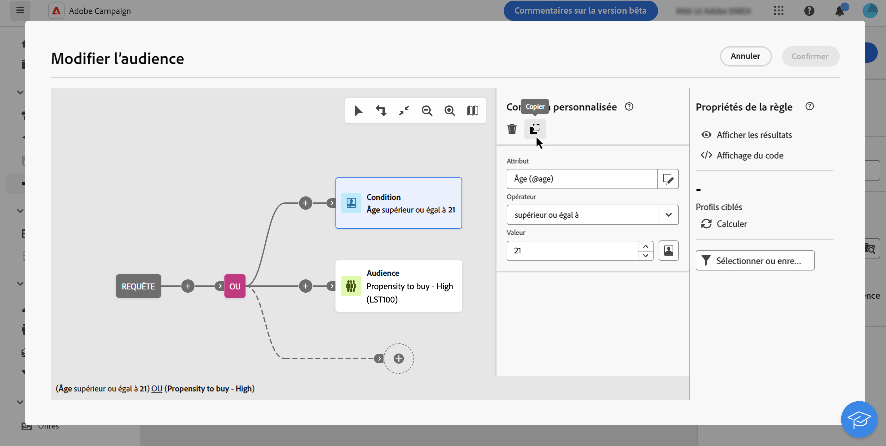{width="200" align="center" zoomable="yes"} | 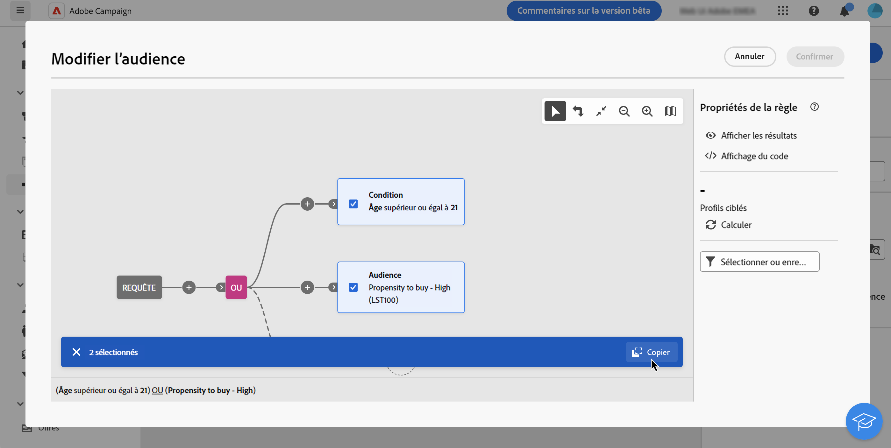{width="200" align="center" zoomable="yes"} |

1. Pour coller le ou les composants, cliquez sur le bouton + à la fin de la transition souhaitée et sélectionnez **Coller dans les éléments**.

   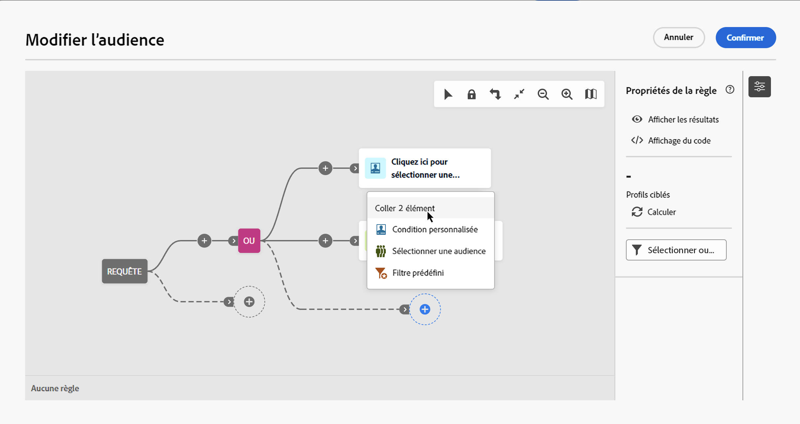

## Combiner des composants de filtrage avec des opérateurs {#operators}

>[!CONTEXTUALHELP]
>id="acw_orchestration_querymodeler_group"
>title="Groupe"
>abstract="Groupe"

Chaque fois que vous ajoutez un nouveau composant de filtrage à votre requête, il est automatiquement lié à l’autre composant par un **ET** de l’opérateur. Cela signifie que les résultats des deux composants de filtrage sont combinés.

Dans cet exemple, nous avons ajouté de nouveaux composants de filtrage de type audience sur la seconde transition. Le composant est lié à la condition de type de filtre prédéfinie avec une **ET** , ce qui signifie que les résultats de la requête incluent les destinataires ciblés par le filtre prédéfini &quot;Madridians&quot; ET appartenant à l&#39;audience &quot;chasseurs de remises&quot;.

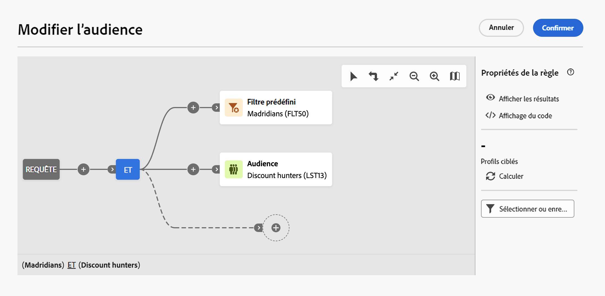

Pour changer l&#39;opérateur utilisé pour relier les conditions de filtrage, cliquez dessus et sélectionnez l&#39;opérateur de votre choix dans le **Groupe** qui s’ouvre sur le côté droit.

Les opérateurs disponibles sont les suivants :

* **ET (Intersection)** : combine les résultats correspondant à tous les composants de filtrage dans les transitions sortantes.
* **OU (Union)** : inclut des résultats correspondant à au moins un des composants de filtrage dans les transitions sortantes.
* **SAUF (Exclusion)** : exclut les résultats correspondant à tous les composants de filtrage dans la transition sortante.

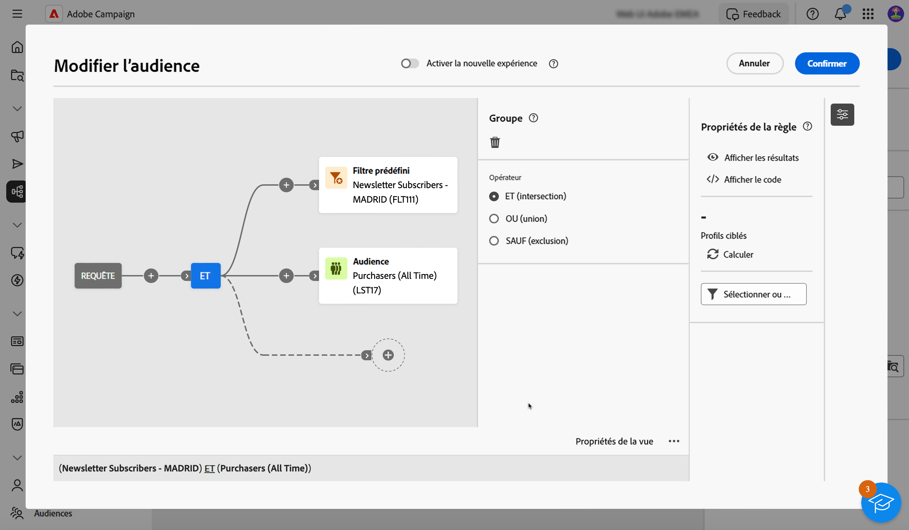

En outre, vous pouvez créer des groupes intermédiaires de composants en cliquant sur le **+** sur une transition. Vous pouvez ainsi ajouter un opérateur à cet emplacement spécifique pour regrouper plusieurs composants et affiner votre requête.

Dans l’exemple ci-dessous, nous avons créé un groupe intermédiaire pour inclure les résultats des audiences &quot;VIP à récompenser&quot; ou &quot;Super VIP&quot;.

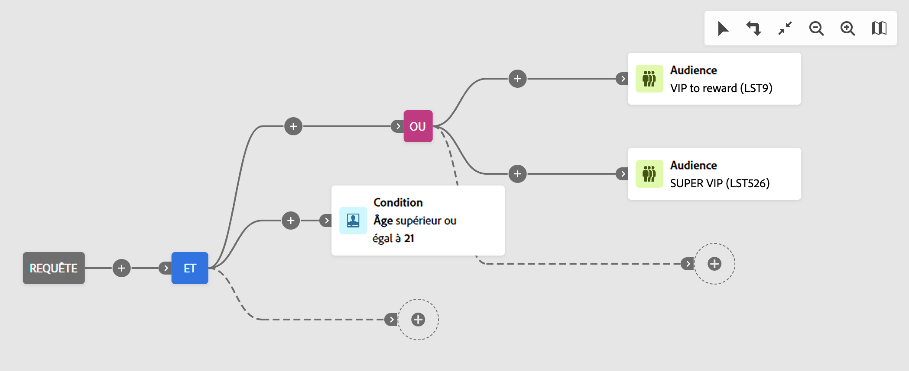

## Vérifier et valider votre requête

>[!CONTEXTUALHELP]
>id="acw_orchestration_querymodeler_ruleproperties"
>title="Propriétés de la règle"
>abstract="Propriétés de la règle"

Une fois que vous avez créé votre requête dans la zone de travail, vous pouvez la vérifier à l’aide du volet **Propriétés des règles** situé sur le côté droit. Les opérations disponibles sont les suivantes :

* **Afficher les résultats** : affiche les données issues de votre requête.
* **Affichage du code** : affiche une version basée sur le code de la requête en SQL.
* **Calculer** : met à jour et affiche le nombre d’enregistrements ciblés par votre requête.
* **Sélectionner ou enregistrer un filtre** : choisissez un filtre prédéfini existant à utiliser dans la zone de travail ou enregistrez votre requête en tant que filtre prédéfini pour une réutilisation ultérieure. [Découvrez comment utiliser des filtres prédéfinis](../get-started/predefined-filters.md).

  >[!IMPORTANT]
  >
  >Sélectionnez un filtre prédéfini dans le volet Propriétés de la règle pour remplacer la requête qui a été créée dans la zone de travail par le filtre sélectionné.

Lorsque votre requête est prête, cliquez sur le bouton **[!UICONTROL Confirmer]** dans le coin supérieur droit pour l’enregistrer.

Vous pouvez modifier votre requête à tout moment en l&#39;ouvrant. Gardez à l’esprit que lors de l’ouverture d’une requête existante, elle s’affiche dans une vue simplifiée sans la visibilité de  **+** des boutons. Pour ajouter de nouveaux éléments à la requête, sélectionnez un composant ou un opérateur dans la zone de travail afin d’afficher le **+** des boutons.

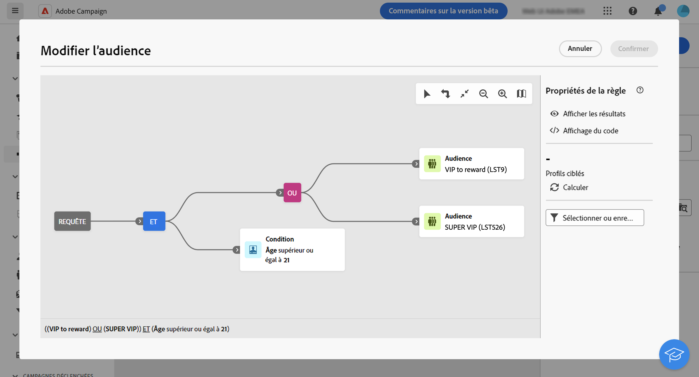
